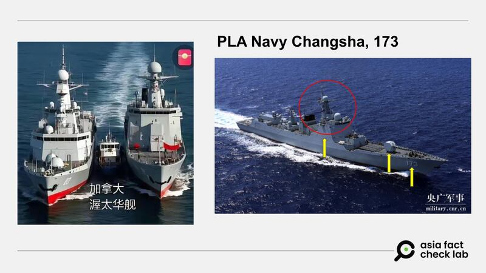
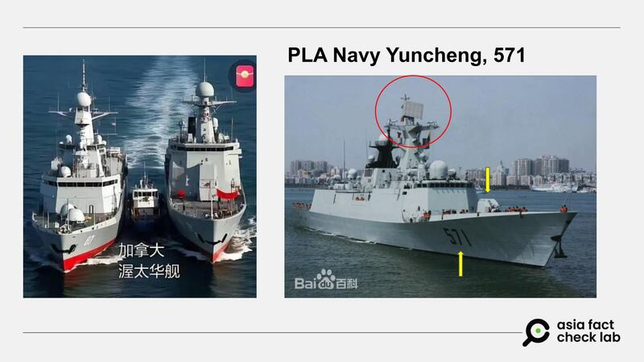
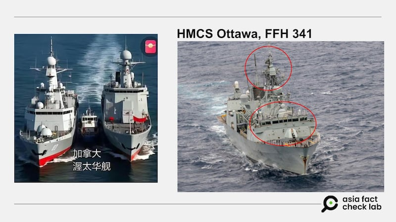
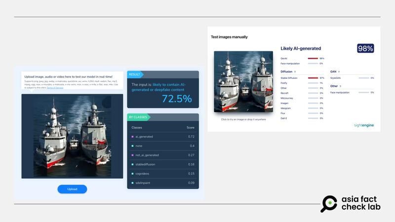

# Does a photo show Chinese and Canadian vessels in the South China Sea?

## Verdict: False

By Dong Zhe for Asia Fact Check Lab

2025.02.21

## A photograph emerged in Chinese-language social media posts with a claim that it shows two Chinese ships, the Changsha 173 and the Yuncheng 571, shadowing Canada’s HMCS Ottawa in the South China Sea.

## But the claim is false. The size and appearance of the three ships in the photo do not align with credible descriptions or verified images of the named vessels. AI detection tools show that the photo had likely been generated by AI.

The photo was [shared](https://archive.ph/ycZqE) on X on Feb. 14, 2025.

“The Canadian ship HMCS Ottawa entered the South China Sea, and the Chinese Navy’s Changsha 173 and the Yuncheng 571 vessels quickly shadowed it for a welcoming,” the claim reads.

The claim was shared alongside a photo that shows two large vessels shadowing a smaller vessel.

afcl-china-canada-south-china-sea\_02212025\_1 Some X users claim that the photo shows Chinese warships shadowing a Canadian vessel in the South China Sea. (X)

The South China Sea is a strategically vital and resource-rich body of water in the western Pacific Ocean, bordered by China, the Philippines, Vietnam, Malaysia, Brunei and Taiwan.

Covering approximately 3.5 million square kilometers, it serves as a key maritime trade route, carrying about one-third of global shipping traffic. The sea is also rich in fisheries, oil, and natural gas reserves, making it a focal point of economic and geopolitical interest.

It is highly contested due to overlapping territorial claims. China claims most of it, as illustrated by a “nine-dash line” on its maps, which includes parts of the exclusive economic zones of neighboring countries.

The region is a flash point for confrontations between various militaries and coast guard forces, triggering diplomatic tensions, involving not only regional countries but also external powers such as the United States, which conducts freedom of navigation operations to challenge China’s claims.

The same photo with similar claims was shared on X [here](https://archive.ph/mqZeF), [here](https://archive.ph/mqZeF) and [here](https://archive.ph/IWkBW).

But the claim is false.

## Discrepancies

The Ottawa is 134 [meters](https://web.archive.org/web/20110613060157/http://www.navy.forces.gc.ca/ottawa/0/0-s_eng.asp) (440 feet) long and 16 meters (52 feet) wide.

While measurements for the Chinese vessels are unavailable, the U.S. Naval Institute [estimates](https://www.usni.org/magazines/proceedings/2020/june/chinas-multipurpose-ffg) that the Yuncheng is about the same size as the Ottawa.

Meanwhile, Taiwanese navy [estimates](https://navy.mnd.gov.tw/Files/Paper/1-%E4%B8%AD%E5%85%B1%E6%B5%B7%E8%BB%8D%E7%99%BC%E5%B1%95%E4%BB%BF%E7%A5%9E%E7%9B%BE%E8%89%A6.pdf) put the Changsha at 156 meters (511 feet) long and 17.5 meters (57 feet) wide, making it roughly 15% longer than the other two ships.

However, the ships in the photo appear disproportionate, with the two supposed Chinese vessels looking several times larger than the alleged Canadian ship.

afcl-china-canada-south-china-sea\_02212025\_2 The ships in the photo do not match the official measurements of the named vessels. (X, CCTV Military, Baidu and the Ottawa’s Facebook page. Annotations by AFCL)

afcl-china-canada-south-china-sea\_02212025\_3 The ships in the photo do not match the official measurements of the named vessels. ((X, CCTV Military, Baidu and the Ottawa’s Facebook page. Annotations by AFCL)

afcl-china-canada-south-china-sea\_02212025\_4 The ships in the photo do not match the official measurements of the named vessels. (X, CCTV Military, Baidu and the Ottawa’s Facebook page. Annotations by AFCL)

The AI image detection software Hive found a 72.5% chance that the image was AI-generated, while a test with the different tool Sightengine placed this estimate at 98%.

afcl-china-canada-south-china-sea\_02212025\_5 AI detection tools Hive (left) and Sightengine (right) both judged that the image was likely AI-generated. (Hive and Sightengine)

## January incident

Canadian broadcaster CTV reported on [Jan. 9](https://www.ctvnews.ca/world/article/multiple-chinese-warships-track-canadian-hmcs-ottawa-through-the-south-china-sea/) and Jan. [10](https://www.ctvnews.ca/world/article/amid-tense-backdrop-canadian-warship-gets-friendly-message-from-chinese-vessel-tracking-movements/) that both the Changsha and the Yuncheng were seen in silhouette shadowing the Ottawa during its passage through the South China Sea.

A CTV journalist was reporting from the Ottawa during the incident.

While the two Chinese ships kept in sight for more than two days, the reports do not mention them trying to approach the Ottawa at close range.

## *Translated by Shen Ke. Edited by Taejun Kang.*

*Asia Fact Check Lab (AFCL) was established to counter disinformation in today’s complex media environment. We publish fact-checks, media-watches and in-depth reports that aim to sharpen and deepen our readers’ understanding of current affairs and public issues. If you like our content, you can also follow us on* [*Facebook*](https://www.facebook.com/asiafactchecklabcn)*,* [*Instagram*](https://www.instagram.com/asiafactchecklab/) *and* [*X*](https://twitter.com/AFCL_eng)*.*

[Original Source](https://www.rfa.org/english/factcheck/2025/02/21/afcl-china-canada-south-china-sea/)