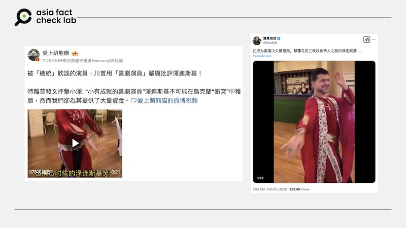
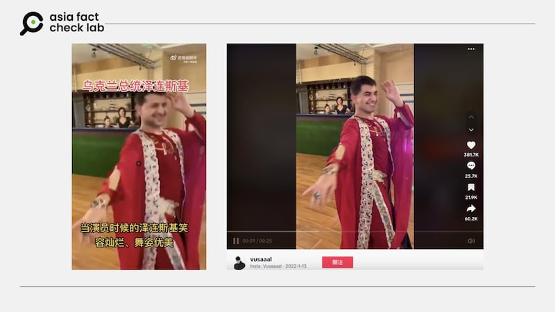

# Does a viral online video show Ukrainian leader Zelenskyy dancing?

## Verdict: False

By Zhuang Jing for Asia Fact Check Lab

2025.02.26

## A video has been circulated in Chinese-language social media posts that claim it shows the Ukrainian President Volodymyr Zelenskyy dancing before he became his country’s leader.

## But the claim is false. The video, which has been digitally altered, in fact shows a Russian dancer who goes by the name “Vusaaal” on TikTok.

The 19-second video showing a man, who appears to be Zelenskyy in a red outfit dancing to fast music, was published on [Weibo](https://m.weibo.cn/detail/5136049715809377) and [X](https://x.com/Snofy8/status/1892362457139544233) on Feb. 20.

Social media users said the man seen in the video is indeed Zelenskyy, with some echoing online criticism about his past career as a comedian, thus not qualified to lead Ukraine.

afcl-zelenskyy-dancing-video\_02262025\_1 Some Chinese social media users posted a video purportedly showing Zelenskyy dancing. (Weibo and X)

Zelenskyy, who was a comedian, actor, and producer before becoming president, gained fame as the star of the popular Ukrainian television series Servant of the People, where he played a high school teacher who unexpectedly becomes president.

While his background in comedy and entertainment played a significant role in his rise to political office, critics mocked Zelenskyy for his lack of political experience, arguing that a comedian couldn’t lead a country effectively.

Some also pointed to his past performances, including satirical and risqué skits, claiming they were unpresidential, while others dismissed him as merely playing the role of a leader rather than being one, suggesting his presidency was an extension of his TV persona.

But the claim about the video is false.

A reverse image search of screenshots from the clip led to an identical video featuring a different man’s face, which was published by a TikTok user “[Vusaaal](https://www.tiktok.com/@vusaaal/video/7052410212015246593)” in January 2022.

afcl-zelenskyy-dancing-video\_02262025\_2 The purported clip of Zelenskyy dancing (left) is nearly identical to an older video posted on TikTok in 2022 (right). (Weibo and TikTok)

Keyword searches found that the user “Vusaaal” is a Russian dancer who posts his videos on different social media channels.

Vusaaal [told](https://www.reuters.com/fact-check/video-does-not-show-ukraines-president-zelenskiy-belly-dancing-2024-01-10/) the Reuters news agency in January 2024 that he was the man in the video.

Siwei Lyu, a professor of computer science at the State University of New York in Albany, also told Reuters that the online video featuring Zelenskyy dancing was an AI-generated deepfake, pointing to color and border discrepancies around the face as several commonly seen flaws in such videos.

The claim about the video has been also debunked by [AFP](https://factcheck.afp.com/doc.afp.com.34EQ8F9) and India’s fact-checking organization [Boom](https://www.boomlive.in/fact-check/ukraine-president-volodymyr-zelenskyy-dancing-fake-news-24058).

## *Translated by Shen Ke. Edited by Taejun Kang.*

---

## READ MORE FACT CHECKS ON UKRAINE AND RUSSIA

[Is a video of a North Korean soldier captured by Ukraine digitally altered?](https://www.rfa.org/english/factcheck/2025/01/16/korea-ukraine-soldiers-video-fact-check/ "https://www.rfa.org/english/factcheck/2025/01/16/korea-ukraine-soldiers-video-fact-check/")

[Did an all-robot Ukrainian unit destroy a Russian company of soldiers in December?](https://www.rfa.org/english/factcheck/2025/01/20/afcl-ukraine-robot-unit-russia/ "https://www.rfa.org/english/factcheck/2025/01/20/afcl-ukraine-robot-unit-russia/")

[Top 5 debunks of 2024 — Asia Fact Check Lab’s year in review](https://www.rfa.org/english/factcheck/2024/12/24/asia-fact-check-china-disinformation-best-2024/ "https://www.rfa.org/english/factcheck/2024/12/24/asia-fact-check-china-disinformation-best-2024/")

---

*Asia Fact Check Lab (AFCL) was established to counter disinformation in today’s complex media environment. We publish fact-checks, media-watches and in-depth reports that aim to sharpen and deepen our readers’ understanding of current affairs and public issues. If you like our content, you can also follow us on* [*Facebook*](https://www.facebook.com/asiafactchecklabcn)*,* [*Instagram*](https://www.instagram.com/asiafactchecklab/) *and* [*X*](https://twitter.com/AFCL_eng)*.*

[Original Source](https://www.rfa.org/english/factcheck/2025/02/26/afcl-zelenskyy-dancing-video/)