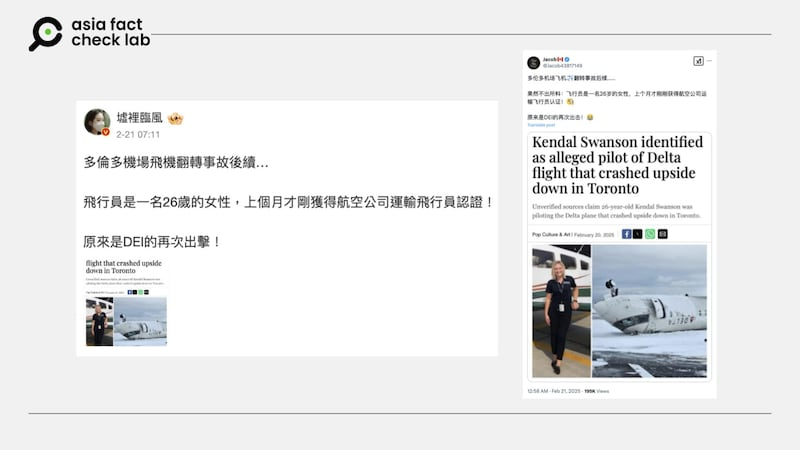
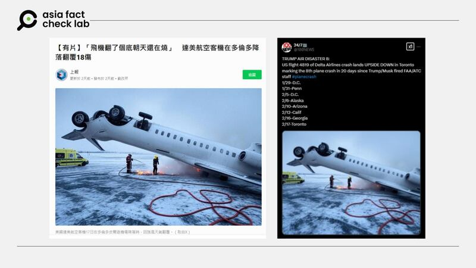

# Did an unqualified pilot fly the Delta Air lines’ plane that crashed in Toronto?

## Verdict: Lack of evidence

By Zhuang Jing for Asia Fact Check Lab

2025.03.03

## A claim began to circulate in Chinese-language social media posts that the Delta Air Lines flight that overturned and crashed while landing at Toronto’s Pearson International Airport in February was flown by an “unqualified” pilot who only became certified in January.

## But the claim lacks evidence. Delta and an airline pilot union said the flight’s captain began his career as early as 2007, while the co-pilot started hers in April 2024, adding that both pilots held the necessary Federal Aviation Administration certifications and had the required flight experience for the journey.

The claim was [shared](https://m.weibo.cn/detail/5136384994050063) on Weibo on Feb. 21.

“Follow-up on the Toronto airport plane rollover accident … The pilot is a 26-year-old woman who just obtained her airline transport pilot certification last month!” reads the claim.

The post also shared what appears to be a screengrab of a news article.

Keyword searches found the article was published by the Pakistani English-language daily The Express Tribune on Feb. 20.

“Kendal Swanson identified as alleged pilot of Delta flight that crashed upside down in Toronto,” the headline of the article reads.

afcl-delta-toronto-crash-pilot\_03032025\_1 The Delta pilot was rumored to be a 26-year-old woman with insufficient flight qualifications. (Weibo and X)

​On Feb. 17, 2025, Delta Connection Flight 4819, operated by Endeavor Air, crashed while landing in Toronto.

The Bombardier CRJ900 aircraft, arriving from Minneapolis with 76 passengers and four crew, flipped upside down upon landing. All 80 individuals survived, though 21 were injured, including at least two critically.

The incident occurred amid harsh winter conditions, with significant snowfall impacting the region.

The Transportation Safety Board of Canada and the U.S. National Transportation Safety Board are investigating the cause of the crash.

But the claim about the pilot’s qualification lacks evidence.

According to a press release by [Delta](https://archive.ph/M13CP) and the [Air Line Pilots Association](https://www.alpa.org/news-and-events/news-room/2025-02-21-further-details-endeavor-flight-4819), the captain of the flight was hired by the now-defunct Mesaba Airlines in 2007 and now flies for Endeavor Air, a wholly owned subsidiary of Delta.

They said that the co-pilot joined Endeavor Air in January 2024 and began flying later in April after completing her training, adding that both pilots held the necessary Federal Aviation Administration certifications and had the required flight experience for the journey.

While Delta did not give the name or ages of the captain and co-pilot, it referred to the captain as “he” and the co-pilot as “she.”

Delta told AFCL that it was not providing any personal information about the pilots.

## Does a photo show rescue workers saving the plane?

Separately, a photo also [began](https://archive.ph/2uo6R) to circulate online alongside a claim that it shows rescue workers putting out a fire near the crashed Delta plane.

But the image is likely AI-generated.

A comparison between the image shared on social media and the photos published by media outlets [here](https://apnews.com/article/delta-plane-flip-toronto-canada-airport-minneapolis-6d064bbc7a3bb8595183d6765d61a0ee), [here](https://www.reuters.com/pictures/pictures-plane-flips-upside-down-landing-toronto-airport-2025-02-18/) and [here](https://www.youtube.com/watch?v=XEhHvk3THt4) shows a significant discrepancy.

afcl-delta-toronto-crash-pilot\_03032025\_2 Chinese-language media and social media users recently circulated a purported image of the recent Delta Air Line crash in Toronto. (Line Today and X)

A reverse image search found the image circulated on social media with the label “GROK” superimposed.

Grok is an AI chatbot developed by xAI, Elon Musk’s artificial intelligence company, which allows users to generate AI images.

A test using the AI image inspection tool Hive shows that the photo was more than 98% likely to be AI-generated.

afcl-delta-toronto-crash-pilot\_03032025 The image was judged as highly likely to have been AI-generated. (Hive)

The claim has also been [debunked](https://factcheck.afp.com/doc.afp.com.36Y44YQ) by other international fact-checking organizations, including AFP.

## *Translated by Shen Ke. Edited by Taejun Kang.*

*Asia Fact Check Lab (AFCL) was established to counter disinformation in today’s complex media environment. We publish fact-checks, media-watches and in-depth reports that aim to sharpen and deepen our readers’ understanding of current affairs and public issues. If you like our content, you can also follow us on* [*Facebook*](https://www.facebook.com/asiafactchecklabcn)*,* [*Instagram*](https://www.instagram.com/asiafactchecklab/) *and* [*X*](https://twitter.com/AFCL_eng)*.*

[Original Source](https://www.rfa.org/english/factcheck/2025/03/03/afcl-delta-toronto-crash-pilot/)