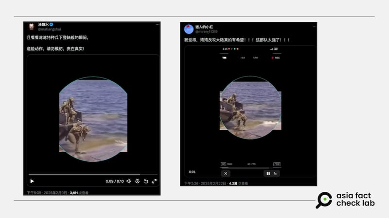
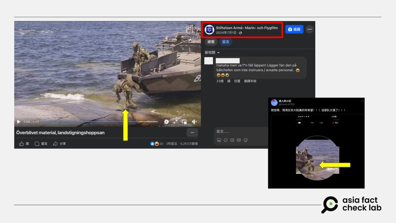

# Does a video show Taiwanese soldiers struggling during military drills?

## Verdict: False

By Dong Zhe for Asia Fact Check Lab

2025.03.05

## A video surfaced in Chinese-language social media posts alongside a claim that it shows a Taiwanese special forces soldier stumbling on an amphibious landing craft while disembarking from it.

## But the claim is false. The video in fact shows a European military officer, not Taiwanese.

The video was [shared](https://archive.ph/O6wTh#selection-571.0-571.27) on X on Feb. 22.

“I think there’s really hope for Taiwan’s counterattack against the mainland! This army is too strong!” reads a sarcastic caption for the video.

The 10-second video shows people in military uniform struggling to get off an amphibious landing craft.

afcl-taiwan-solider-video\_03052025\_1 Some Chinese users on X claimed that a Taiwanese special forces soldier stumbled while disembarking from a landing ship. (X)

The claim began to circulate online amid reports about escalating military tensions between China and Taiwan.

China has conducted live-fire drills near Taiwan’s coast, prompting Taiwan to mobilize its defense forces. Additionally, China’s defense ministry issued a warning to Taiwan, stating: “We will come and get you, sooner or later.”

In response, Taiwan plans to increase its defense spending and enhance military cooperation with the United States.

But the claim about the video is false.

## European military officer

Keyword searches [found](https://www.facebook.com/watch/?v=1141484780173744) the identical video circulating on Facebook with users saying that it shows a Swedish marine.

A white logo mark in the upper left corner can be seen in the video on Facebook, which has been edited out of the videos circulating on X.

A search for the symbol found it belongs to a Swedish military documentary organization called the [Army, Navy and Air Force Film Foundation](https://stiftelsen-amf.se/), or AMF, which posted the same video on its [official Facebook page](https://www.facebook.com/StiftelsenAMFfilm/) on July 1, 2024.

afcl-taiwan-solider-video\_03052025\_2 The Swedish Army, Navy, and Air Force Film Foundation originally posted the video on Facebook in 2024. (Facebook /AMF)

“These videos of recruits in training show how hard it is to keep your feet on the ground,” the caption of the AMF’s video reads.

An official at AMF told AFCL that the footage was shot more than 20 years ago for an unfinished video project designed to show what difficulties could occur during military training.

The official also confirmed that the pictured soldiers are European, not Taiwanese.

According to [SoldF.com](http://soldf.com) – an independent website monitoring the Swedish Armed Forces operated by Swedish veterans – the vessel in the video is an iteration of the Combat Boat 90, a standard Swedish Navy assault landing craft first mass-produced in the early 1990s.

Taiwan is not on the list of countries or territories that have purchased or are using the Combat Boat 90, according to [Saab](https://www.saab.com/globalassets/products/kockums/saab_dockstacb90hsm.pdf), the Swedish company that produces the vessel.

## *Translated by Shen Ke. Edited by Taejun Kang.*

*Asia Fact Check Lab (AFCL) was established to counter disinformation in today’s complex media environment. We publish fact-checks, media-watches and in-depth reports that aim to sharpen and deepen our readers’ understanding of current affairs and public issues. If you like our content, you can also follow us on* [*Facebook*](https://www.facebook.com/asiafactchecklabcn)*,* [*Instagram*](https://www.instagram.com/asiafactchecklab/) *and* [*X*](https://twitter.com/AFCL_eng)*.*

[Original Source](https://www.rfa.org/english/factcheck/2025/03/05/afcl-taiwan-soldier-amphibious-video/)