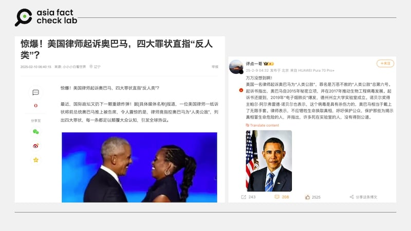

# Has Obama been sued for being an ‘enemy of humanity’?

## Verdict: Lack of evidence

By Alicia Dong for Asia Fact Check Lab

2025.03.07

## A claim emerged in Chinese-language social media posts that an American lawyer sued former U.S. President Barack Obama over his alleged involvement in virus research, which made him an “enemy of humanity.”

## But the claim is not supported by credible sources. There is an ongoing case regarding the Obama Presidential Center, a planned museum in Chicago, but the case has nothing to do with the former president or with virus research.

The claim was shared on the Chinese social media sites [Weibo](https://archive.ph/TzOjm) and [Douyin](https://www.douyin.com/video/7469326855397461307), as well as Chinese-language news website [Netease](https://archive.ph/ZPMnw).

“A U.S. lawyer has sued Barack Obama for being an ‘Enemy of Humanity’ for the most heinous of crimes … Obama secretly set up a project in 2015 and in 2017 to promote the development of bioengineered viruses,” the claim reads in part.

“The indictment also cites the 2019 outbreak of ‘e-cigarette pneumonia’ … Nobel Prize winner Pal Alfred Nobel also said that the virus is lethal and that Obama is equivalent to wearing the ‘Infinity Gauntlet’,” it reads further, in an apparent reference to a powerful artifact from the comic-book Marvel universe that grants its wielder god-like abilities to alter reality.

afcl-us-obama-sue\_03072025\_1 Some Chinese social media users claim that an American lawyer sued the former U.S. President Barack Obama for being an ‘enemy of humanity.’ (Netease and Weibo)

But the claim lacks evidence.

Keyword searches found no credible reports or statements to back the claim.

There is no recipient of the Nobel Prize winner called “Pal Alfred Nobel.”

Alfred Nobel – the founder of the Nobel Prize – died in 1896.

## The 2019 outbreak of ‘e-cigarette pneumonia’

The reference in the post to “e-cigarette pneumonia” is to a mysterious lung illness that emerged in the United States in 2019, affecting individuals who used e-cigarettes and vaping products.

The outbreak, later identified as E-cigarette or Vaping Product Use-Associated Lung Injury, or EVALI, led to a surge in hospitalizations, with patients experiencing severe respiratory symptoms, including shortness of breath, chest pain, and coughing.

Health officials eventually traced the cause to vitamin E acetate, a thickening agent found in illicit THC vape cartridges.

The outbreak prompted increased regulation of vaping products and widespread public health warnings.

Some conspiracy theories later attempted to link the vaping-related illness to the early stages of the COVID-19 pandemic, though medical experts have debunked such claims, citing clear distinctions between EVALI and viral infections.

## No ongoing legal cases against Obama

Keyword searches found one lawsuit related to the Obama Presidential Center, a planned museum in Chicago that will house the Obama Foundation.

However, the case is not related to Obama himself.

[Fox News](https://www.foxnews.com/us/obama-center-subcontractor-files-40m-discrimination-lawsuit-against-engineering-firm-overruns) and [Newsweek](https://www.newsweek.com/barack-obama-presidential-center-library-chicago-lawsuit-discrimination-2024316?utm_source=chatgpt.com) reported that a Chicago-based subcontractor Powers & Sons Construction Company filed a US$40 million lawsuit against the engineering firm Thornton Tomasetti for alleged racial discrimination practices imposed during the center’s construction that increased work volume and financial pressures.

## Origin of ‘enemy of humanity’

Keyword searches found U.S. representative [Trent Franks](https://www.politico.com/story/2009/09/franks-obama-is-enemy-of-humanity-027725?utm_source=chatgpt.com) labeled Obama as an “[enemy of humanity](https://www.youtube.com/watch?v=9HpcfU2bh1g&ab_channel=NewsPaperOnline)” in September 2009 due to his stance on abortion.

Franks later [clarified](https://www.upi.com/Top_News/2009/09/30/Franks-amends-Obama-enemy-comments/96531254311031/?utm_source=chatgpt.com) that his comments were directed at Obama’s policy and not the president personally, noting that he meant the president was an enemy of “unborn humanity.”

The Office of Barack and Michelle Obama have not responded to inquiries as of press time.

## *Translated by Shen Ke. Edited by Taejun Kang.*

*Asia Fact Check Lab (AFCL) was established to counter disinformation in today’s complex media environment. We publish fact-checks, media-watches and in-depth reports that aim to sharpen and deepen our readers’ understanding of current affairs and public issues. If you like our content, you can also follow us on* [*Facebook*](https://www.facebook.com/asiafactchecklabcn)*,* [*Instagram*](https://www.instagram.com/asiafactchecklab/) *and* [*X*](https://twitter.com/AFCL_eng)*.*

[Original Source](https://www.rfa.org/english/factcheck/2025/03/07/afcl-us-obama-sue/)