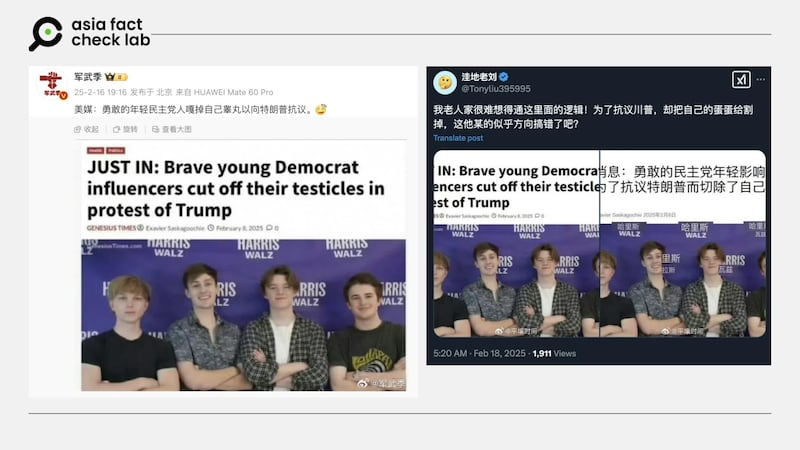
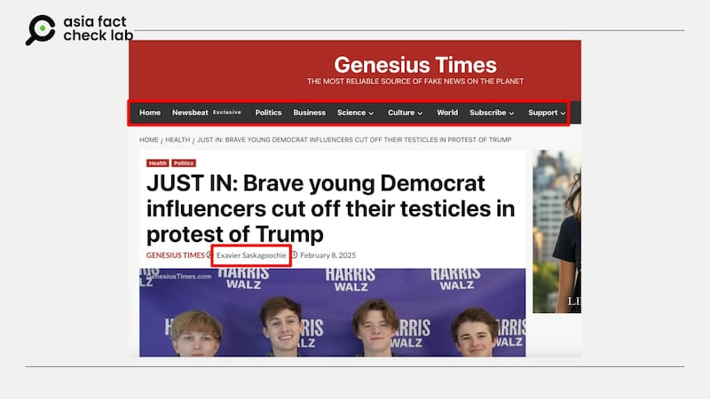

# Media Watch: How US political satires amplify misinformation in China

## Experts cited cultural differences as a main cause, among others.

By Alan Lu for Asia Fact Check Lab

2025.03.10

## Updated March 12, 2025, 3：20 a.m. ET

In February, a bizarre and grotesque claim began circulating among Chinese social media users.

According to the claim, several young Americans who supported the Democratic Party had castrated themselves in protest against U.S. President Donald Trump’s administration.

Many social media users appeared to be in shock and to believe the claim, especially since it was accompanied by what looked like a news article.

“It was reported by the U.S. media!” one user insisted, arguing that media coverage lent the claim credibility.

But what many social media users didn’t realize was that the “U.S. media” they had seen was not a news provider – it was a satirical website.

Keyword searches revealed that the website cited by Chinese social media users was “Genesis Times,” a U.S. political satire site that describes itself as “The Most Reliable Source of Fake News on the Planet.”

afcl-us-satire-china-misinformation\_03102025\_2 Some Chinese social media claimed that several Democrats had castrated themselves to protest against Trump. (Weibo and X)

This is not an isolated incident. Chinese social media users frequently find themselves caught up in misinformation originating from U.S. satirical websites.

But what makes them so vulnerable?

## Cultural differences

Wei-Ping Li, a postdoctoral researcher at the Philip Merrill College of Journalism at the University of Maryland, pointed to a “cultural difference” between the U.S. and other countries, including China, where people don’t have a tradition of such political parody.

China lacks a strong political satire culture due to strict government censorship, harsh penalties for dissent and a political system that discourages public criticism of leaders.

The Chinese government controls media and online discourse, making satire risky. Historically, satirists have faced severe consequences, leading to self-censorship and a lack of mainstream satirical traditions.

Summer Chen, a co-founder of FactLink, cited the fact that U.S. satirical websites tend to mimic the design of established media outlets, contributing to the confusion of readers. Factlink is an organization dedicated to elevating media literacy in Taiwan.

afcl-us-satire-china-misinformation\_03102025\_2 The design of many political satire sites mimics the look of mainstream news. (Genesius Times)

## Parody, not fake news

Darren Chan, a doctoral student researching political satire at Temple University, told AFCL that the term “satirical news” was often used interchangeably with “fake news” but since the mid-2010s, “fake news” has more often been used to refer specifically to intentionally false or misleading information.

“The biggest difference between ‘satirical news’ and ‘fake news’ lies in the intention of the fabricated news content,” he explained.

“Satire is a form of entertainment social critique that aims to point out injustice or unethical behavior in society. By making its audience laugh and think, satirical news has the potential to foster civic engagement and political participation.

“Fake news refers to content that deliberately spreads false information with the aim of harming the reputation of the people involved in the story.”

Satire can serve as an independent check on the media, and is a highly context-dependent genre that one only truly understands if one is familiar with the context of the events being lampooned, he said.

In a country like China that lacks such a context or tradition of political satire, he said that this type of parody may become another way to confirm rising nationalist and anti-American sentiment, he added.

Li from the University of Maryland said that many Chinese social media users are unfamiliar with parody and may just repost sensational stories that confirm their beliefs and attract views.

## Sorting fact from fiction

Chen said a website’s information should be checked to determine whether the news was genuine.

For instance, satirical news sites or their X accounts often say they publish fake news to avoid legal liability. Genuine news organizations usually publish information about their offices and staff.

Another reliable indicator of the credibility of news is to search for other mainstream media reports on the same topic, she added.

“Media is a very competitive industry. There won’t be any big event that only one covers and others don’t. You can therefore easily compare different reports on the same event from several credible news organizations.”

Temple University’s Chan said the most important thing for social media users was to think before they interact with any content.

“At a time when clickbaiting is the norm, social media users should take a step back and think about not just the content they are about to post, but also the reactions it might generate,” said Chan.

Li from the University of Maryland’s also pointed out the importance of asking the same question about news on social media as one would of traditional mainstream outlets:

“How did the platform obtain this information, where is the evidence and has the poster made mistakes in the past?”

## *Translated by Shen Ke. Edited by Taejun Kang.*

## *Updated to clarify the attribution of the quotes.*

*Asia Fact Check Lab (AFCL) was established to counter disinformation in today’s complex media environment. We publish fact-checks, media-watches and in-depth reports that aim to sharpen and deepen our readers’ understanding of current affairs and public issues. If you like our content, you can also follow us on* [*Facebook*](https://www.facebook.com/asiafactchecklabcn)*,* [*Instagram*](https://www.instagram.com/asiafactchecklab/) *and* [*X*](https://twitter.com/AFCL_eng)*.*

[Original Source](https://www.rfa.org/english/factcheck/2025/03/10/afcl-us-propaganda-china-misinformation/)