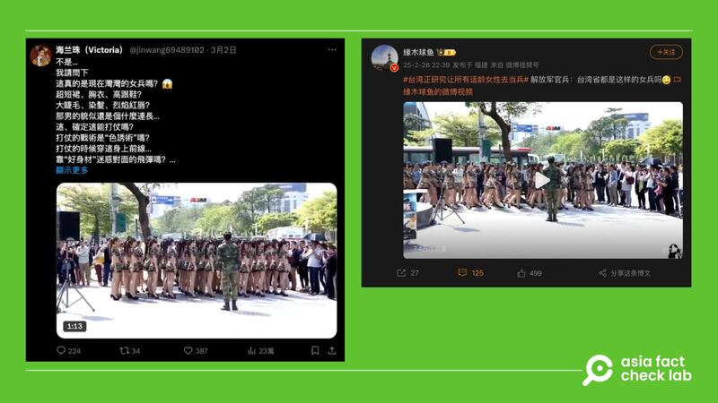
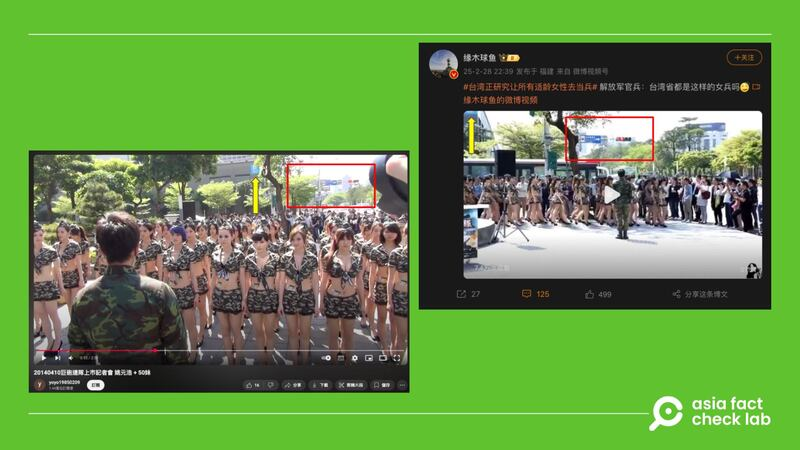

# Does a video show Taiwan training female military personnel?

## Verdict: False

By Alicia Dong for RFA

2025.03.12

## A video emerged in Chinese-language social media posts alongside a claim that it shows Taiwan training female military personnel.

## But the claim is false. The video shows a promotional event for an online game, not the Taiwanese army.

The video was shared on [Weibo](https://archive.ph/prmWV) and [X](https://archive.ph/nNfNw) on March 2.

“Are these really the female soldiers of Taiwan nowadays? Mini skirts, bras, high heels? … Are you sure they can actually fight in a war?” a X post reads in part.

The one-minute and 21-second video shows a group of women in army uniform participating in what appears to be a military drill.

afcl-taiwan-female-soldier-video\_03122024\_1 Some social media users claimed the video shows a military drill of Taiwanese female soldiers. (X and Weibo)

The claim began to circulate online amid speculation in the Taiwan media that women may be conscripted into the military to fill gaps in combat units. But Taiwan’s defense minister dismissed the speculation.

Taiwan’s armed forces saw a drop in the number of active-duty personnel to 152,885 in June 2024 from 164,884 in 202, with [experts saying](https://www.rfa.org/english/china/2025/03/11/china-taiwan-military-shortage-explained/) this is a problem for the island as it is facing mounting threats from one of the world’s largest militaries: China with more than 2 million active-duty personnel.

Higher wages and the recruitment of foreigners are among proposals being discussed to address the manpower shortage in the military.

But the claim made in the video is false.

A Google reverse image search revealed older versions of the same footage, where a distinctive bulletin board appears in the lower right corner around the 32-second mark, displaying the words “Giant Cannon Company.”

A keyword search for “Giant Cannon Company” found that it refers to a mobile game.

Further keyword searches found a promotional video of the game [published](https://www.youtube.com/watch?v=T9S0WAF-FaU&ab_channel=yoyo19850209) on YouTube in April 2014.

Part of the video matches the video circulated among Chinese social media users.

“2014-04-10 Giant Cannon Company Launch Press Conference – Yao Yuan-hao + 50 Girls,” reads the caption of the video.

Yao is a Taiwanese actor, who is seen in the video leading a group of women.

afcl-taiwan-female-soldier-video\_03122024\_2 The video circulated among Chinese social media users was in fact taken from a promotional video of a mobile game in 2014. (YouTube and Weibo)

Women volunteers do serve in the Taiwan military and AFCL has [previously debunked](https://www.rfa.org/cantonese/news/factcheck/tw-04042024151202.html) similar claims that they were “overly sweet” and unfit for combat.

## *Translated by Shen Ke. Edited by Taejun Kang.*

*Asia Fact Check Lab (AFCL) was established to counter disinformation in today’s complex media environment. We publish fact-checks, media-watches and in-depth reports that aim to sharpen and deepen our readers’ understanding of current affairs and public issues. If you like our content, you can also follow us on* [*Facebook*](https://www.facebook.com/asiafactchecklabcn)*,* [*Instagram*](https://www.instagram.com/asiafactchecklab/) *and* [*X*](https://twitter.com/AFCL_eng)*.*

[Original Source](https://www.rfa.org/english/factcheck/2025/03/12/afcl-taiwan-female-military-video/)