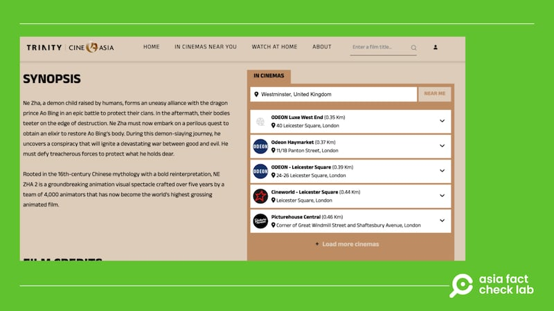

# Did European countries ban popular Chinese film ‘Ne Zha 2’?

## Verdict: False

By Chi Te Lee for Asia Fact Check Lab

2025.03.14

## A claim began to circulate in Chinese-language posts that the Chinese animated film “Ne Zha 2” has been banned in Europe.

## But the claim is false. Keyword searches found no credible reports or announcement to back the claim. The film’s distributor confirmed that it had bought exclusive theatrical distribution rights for the film in more than 37 countries in March, including European nations.

The claim was [shared](https://www.163.com/dy/article/JOMIAE0M0556ASHT.html) in Chinese-language media NetEase on March 6.

“As ‘Nezha 2’ continues to be released overseas, many Chinese students studying in Europe have complained that Europe has essentially ‘banned’ ‘Nezha 2’ because it is not being scheduled for screenings at all,” the report reads in part.

“Ne Zha 2” is a 2025 Chinese animated fantasy film and a sequel to the 2019 hit Ne Zha.

afcl-ne-zha-film-europe-ban\_03142025\_1 Some Chinese language social media users claim that Ne Zha 2 has been banned in Europe. (YouTube and Sina)

The film received critical acclaim for its storytelling and animation, becoming the highest-grossing animated and non-English film ever, surpassing US$2 billion globally.

But the claim about a European ban of the film is false.

Keyword searches found no credible reports or announcements to back the claim.

The London-based film distributor Trinity CineAsia [confirmed](https://variety.com/2025/film/news/ne-zha-2-europe-release-1236332996/) on March 10 that it had bought exclusive theatrical distribution rights for the film in more than 37 countries, including the United Kingdom, Ireland, Germany, France, and Spain.

The company also officially [announced](https://www.trinitycineasia.com/en/movie/ne-zha-2?whereToWatch=in-cinemas) a U.K. release date of March 14.

afcl-ne-zha-film-europe-ban\_03142025\_2 Tickets for the UK release of Ne Zha 2 have already gone on sale. (Trinity CineAsia)

Some online users also claimed that the film was banned by the U.S. Department of Commerce due to “national security” concerns, but it has been debunked by multiple fact-checking organizations, including [AFP](https://factcheck.afp.com/doc.afp.com.36YA9N6).

Taiwan’s Ministry of Culture also [denied](https://www.cna.com.tw/news/amov/202502280035.aspx) rumors that the film was banned in Taiwan, stating that the movie has not yet applied for a Taiwanese theatrical release.

## *Translated by Shen Ke. Edited by Taejun Kang.*

*Asia Fact Check Lab (AFCL) was established to counter disinformation in today’s complex media environment. We publish fact-checks, media-watches and in-depth reports that aim to sharpen and deepen our readers’ understanding of current affairs and public issues. If you like our content, you can also follow us on* [*Facebook*](https://www.facebook.com/asiafactchecklabcn)*,* [*Instagram*](https://www.instagram.com/asiafactchecklab/) *and* [*X*](https://twitter.com/AFCL_eng)*.*

[Original Source](https://www.rfa.org/english/factcheck/2025/03/14/afcl-ne-zha-film-europe-ban/)