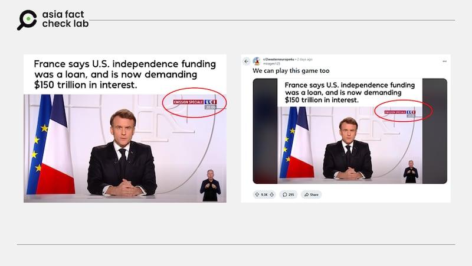
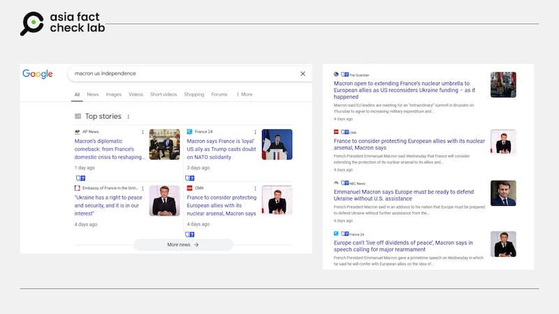

# Did France’s Macron demand the US to pay back debt from the Revolutionary War?

By Rita Cheng for Asia Fact Check Lab

2025.03.18

## An image has been circulated in Chinese-language social media posts that claims it shows French President Emmanuel Macron making a speech in which he said that French support to the U.S. to help it gain its independence more than 200 years ago was a loan, not aid, meaning the U.S. must pay interest.

## But the claim is false. The image was taken from a televised speech that Macron delivered to the French public on March 5. A review of the speech confirms that he made no such remarks. Keyword searches found no credible reports or statements to back the claim.

The claim was [shared](https://archive.ph/jMKVC#selection-601.0-601.63) on X on March 8, 2025.

“French President Emmanuel Macron said that the fund that France supported 200 years ago to help the United States gain independence was a loan, not aid, and now demand that the Trump administration pay the interest of 150 trillion U.S. dollars,” the claim reads.

The claim was shared alongside an image of what appears to be a televised speech by Macron.

The superimposed text reads: “France says US independence funding was a loan, and is now demanding $150 trillion in interest.”

France played a crucial role in helping the U.S. gain independence from Britain during the American Revolutionary War (1775–1783).

In 1778, France formally allied with the U.S., providing military aid, financial support, and naval power. The French supplied weapons, ammunition, and troops, and their navy played a decisive role in the Battle of Yorktown in 1781, which led to the British surrender.

Historians say the financial burden France incurred helping the U.S. contributed to the outbreak of the French Revolution in 1789.

But the claim that Macron demanded the U.S. to pay interest on funds provided by France is false.

## Televised speech

A reverse image search found the same photo of Macron recently posted on online social forum Reddit.

A closer look at the image shows the letters “LCI” embedded in the photo’s upper right frame.

Superimposed text on the image read: “LCI” and “Emission spéciale”.

“LCI” stands for “ La Chaîne Info,” a French free-to-air news channel.

afcl-france-macron-us-demand\_2 The same claim about the French president was spread on English-language social media. (Reddit)

A separate keyword search found the image was taken from a televised speech of Macron on March 5.

The record of the speech was [published](https://www.youtube.com/watch?v=bnsBM-JqsuI) by LCI on its YouTube channel on March 6.

A review of a verbatim French transcript [published](https://www.elysee.fr/emmanuel-macron/2025/03/05/adresse-aux-francais-6) by the French Presidential Palace and a [real-time English interpretation](https://youtu.be/ZvssAXQz4Cw?si=FBtn5eIiZc2pzvIJ) broadcast by the French broadcaster France 24 found that the president made no such statements about the U.S. needing to repay France for its assistance in the Revolutionary War.

afcl-france-macron-us-demand\_3 Mainstream media reports show that Macron asked European countries to strengthen their defense in the speech. (Google)

In the speech, Macron [called on](https://www.cnn.com/2025/03/05/europe/macron-france-nuclear-arsenal-ukraine-intl-hnk/index.html) European countries to independently strengthen their collective defense in the event of U.S. support being withdrawn. He also noted that France was considering expanding its nuclear umbrella to include European allies.

Keyword searches found no credible reports or statements to back the claim.

## *Translated by Shen Ke. Edited by Taejun Kang.*

*Asia Fact Check Lab (AFCL) was established to counter disinformation in today’s complex media environment. We publish fact-checks, media-watches and in-depth reports that aim to sharpen and deepen our readers’ understanding of current affairs and public issues. If you like our content, you can also follow us on* [*Facebook*](https://www.facebook.com/asiafactchecklabcn)*,* [*Instagram*](https://www.instagram.com/asiafactchecklab/) *and* [*X*](https://twitter.com/AFCL_eng)*.*

[Original Source](https://www.rfa.org/english/factcheck/2025/03/18/afcl-france-macron-us-demand/)