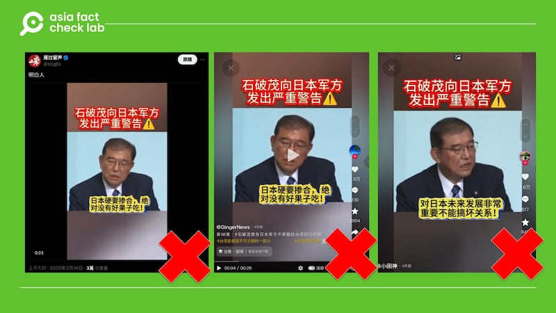
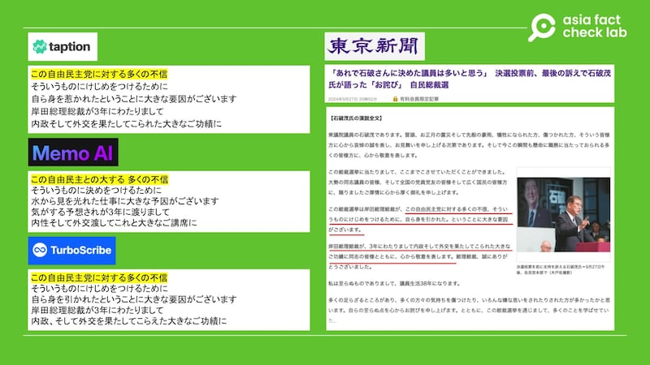
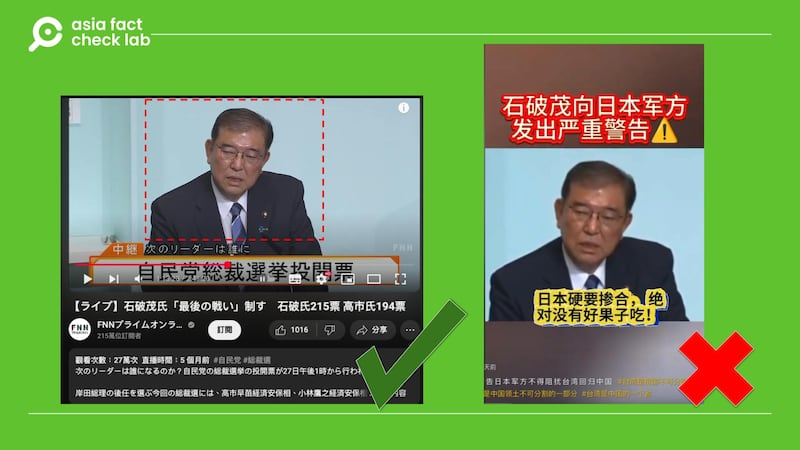

# Does a video show Japan’s prime minister discussing Taiwan Strait?

## Verdict: False

By Dong Zhe for Asia Fact Check Lab

2025.03.21

## A video of Japanese Prime Minister Shigeru Ishiba emerged in Chinese-language social media posts that claim it shows the Japanese leader discussing the Taiwan Strait.

## But the claim is false. The video, recorded before Ishiba became the leader, shows Ishiba discussing a step down of former prime minister, Fumio Kishida.

The video was [shared](https://x.com/szygls/status/1901055171205230825?s=46) on X on March 16.

The 26-second clip shows what appears to be a speech made by Ishiba at a press conference.

The video was accompanied by subtitles in Chinese attributed to Ishiba that read: “The Taiwan Strait is China’s territorial waters. Shigeru Ishiba knows that China’s military and economy vastly outperform Japan and that direct confrontation with Beijing will destroy regional peace and edge Tokyo toward disaster. He believes cooperating with China is important for Japan’s development and that the risk outweighs the reward.”

afcl-shigeru-ishiba-taiwan-strait\_03212025\_1 Some Chinese social media users claim a video shows Japanese Prime Minister Shigeru Ishiba discussing the Taiwan Strait. (Douyin and X)

Sino-Japan relations have long been complicated by territorial disputes, historical grievances, and economic competition.

In recent months, however, signs have [indicated](https://www.rfa.org/english/china/2025/02/12/china-buoy-japan-senkaku-diaoyu/) that both countries are trying to normalize relations.

In December, Japanese Foreign Minister Takeshi Iwaya visited Beijing, marking a significant step in diplomatic engagement. Discussions included security issues, economic cooperation, and the potential easing of China’s restrictions on Japanese seafood imports.

Additionally, China expanded its visa-free entry program to include Japan, aiming to boost tourism and economic exchanges.

But the claim about the clip is false.

## Original clip

AFCL used three different AI text-to-speech services ([Taption](https://www.taption.com/zh?advertiserId=f0e7jXwyreY9XZONHdeQtZd4mko1&platform=google9&gad_source=1&gclid=Cj0KCQjws-S-BhD2ARIsALssG0Z4C1aa5fgjAaxFfTt9RWMInC1q_IicIJCvmug67hM4H7b_fLaIUwQaAtOTEALw_wcB), [TurboScribe](https://turboscribe.ai/?ref=gad-self&gad_source=1&gclid=Cj0KCQjws-S-BhD2ARIsALssG0YUGek5UWZdzvbcLDFl8fLikGCyF1KSsX4dGFmOwDo5Kial_pr8OToaAkBEEALw_wcB), and [Memo AI](https://memo.ac/zh_tw/)) to transcribe the clip of the speech uploaded by Chinese social media users.

A search for one of the transcribed phrases found it was included in a speech Ishiba made on Sep. 27, 2024, a few days before he became the leader of Japan.

afcl-shigeru-ishiba-taiwan-strait\_03212025\_2 Phrases taken from the AI transcription of the video (left) matched passages in a recent speech by Ishiba (right). (Taption, TurboScribe, Memo AI and Tokyo Shimbun)

A separate keyword found that the clip shared by Chinese social media users was taken from the longer version of the video [published](https://www.youtube.com/watch?v=VwjPFLbZKWw&t=75s) by Japanese online media The Page on Sep. 27.

The Japanese daily *Tokyo Shimbun* published a transcript of the speech [here](https://www.tokyo-np.co.jp/article/356985).

afcl-shigeru-ishiba-taiwan-strait\_03212025\_3 The online clip (right) matches a live video of Ishiba’s speech during a speech released by Fuji TV (left). (YouTube and Douyin)

A review of the original clip and the transcript shows that Ishiba was discussing a step down of the former leader Kishida, not the Taiwan Strait.

“An important reason Prime Minister and President [referring to the leader of Liberal Democratic Party, or LDP] Kishida chose to voluntarily step down during this presidential election was to put a stop to all the distrust against the Liberal Democratic Party. I join my comrades in paying a heartfelt tribute to Prime Minister and President Kishida for his significant achievements in domestic and foreign affairs over the past three years. Thank you, Mr. Prime Minister and President, for your dedication,” said Ishiba.

Kishida announced on Aug. 14 that he would not seek re-election as president of the ruling LDP in the upcoming leadership vote scheduled for September. This decision effectively meant he would step down as prime minister, as the LDP president traditionally serves in that role.

Following his announcement, the LDP held its leadership election on Sep. 27, 2024, in which Ishiba emerged victorious. Ishiba officially assumed the office of prime minister on Oct. 1, 2024, succeeding Kishida.

During the February 2025 summit between Ishiba and U.S. President Donald Trump, both leaders reaffirmed their commitment to maintaining peace and stability in the Taiwan Strait.

They opposed any unilateral actions to change the status quo by force and supported Taiwan’s meaningful participation in international organizations.

Taiwan welcomed the joint statement, appreciating the strong stance on regional security.

## *Translated by Shen Ke. Edited by Taejun Kang.*

*Asia Fact Check Lab (AFCL) was established to counter disinformation in today’s complex media environment. We publish fact-checks, media-watches and in-depth reports that aim to sharpen and deepen our readers’ understanding of current affairs and public issues. If you like our content, you can also follow us on* [*Facebook*](https://www.facebook.com/asiafactchecklabcn)*,* [*Instagram*](https://www.instagram.com/asiafactchecklab/) *and* [*X*](https://twitter.com/AFCL_eng)*.*

[Original Source](https://www.rfa.org/english/factcheck/2025/03/21/afcl-shigeru-ishiba-taiwan-straigt/)