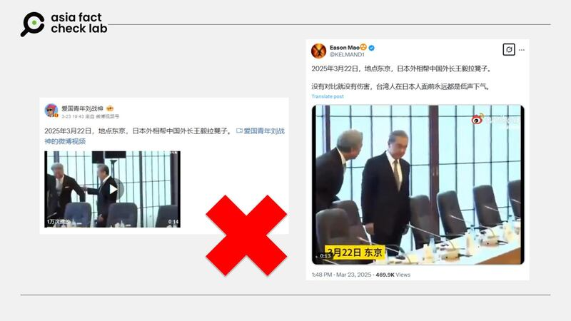

# Does a video show Japanese foreign minister pulling out a chair for China’s Wang Yi?

## Verdict: False

By Zhuang Jing for Asia Fact Check Lab

2025.03.26

## A video emerged in Chinese-language social media posts that claim it shows the Japanese foreign minister Takeshi Iwaya pulling out a chair for the Chinese foreign minister Wang Yi.

## But the claim is false. A review of footage captured from multiple angles reveals that Iwaya was standing a considerable distance away from Wang.

The claim was [shared](https://m.weibo.cn/detail/5147445956971680) on Weibo on March 23.

“Tokyo, March 22, 2025. Japan’s foreign minister is helping China’s foreign minister by pulling out a chair,” the claim reads.

It was shared alongside the 14-second video that shows a man in a suit pulling out a chair for Wang at what appears to be a conference room.

Some users commented to say it showed a “power dynamic” between the two officials.

“He [Iwaya] can’t even look at Wang … afraid of authority,” one user said.

afcl-china-japan-south-korea-summit\_03262025\_1 Some Chinese social media users claimed that the video shows the Japanese foreign minister Takeshi Iwaya pulling out a chair for his Chinese counterpart Wang Yi. (Weibo)

The claim began to circulate online after foreign ministers from Japan, China and South Korea met in Tokyo on Saturday, seeking common ground on East Asian security and economic issues amid escalating global uncertainty.

It was the first gathering of the countries’ foreign ministers since 2023.

The three agreed to accelerate preparations for a trilateral summit in Japan this year that would also include talks on how Tokyo, Beijing and Seoul can tackle declining birthrates and aging populations.

But the claim about the video is false.

A reverse image search found that the video circulated online does show the trilateral meeting held on Saturday.

But a closer look at the [video](https://www.youtube.com/watch?v=BuYSNmhp85o) taken from different angles shows that Iwaya was standing a considerable distance away from Wang.

Photos and videos from the summit show that the tie Iyawa was wearing was different from the one worn by the man who pulled out the chair for Wang. Additionally, Iyawa’s suit appeared darker than the other man’s.

## *Edited by Taejun Kang.*

*Asia Fact Check Lab (AFCL) was established to counter disinformation in today’s complex media environment. We publish fact-checks, media-watches and in-depth reports that aim to sharpen and deepen our readers’ understanding of current affairs and public issues. If you like our content, you can also follow us on* [*Facebook*](https://www.facebook.com/asiafactchecklabcn)*,* [*Instagram*](https://www.instagram.com/asiafactchecklab/) *and* [*X*](https://twitter.com/AFCL_eng)*.*

[Original Source](https://www.rfa.org/english/factcheck/2025/03/26/afcl-china-japan-south-korea-summit/)