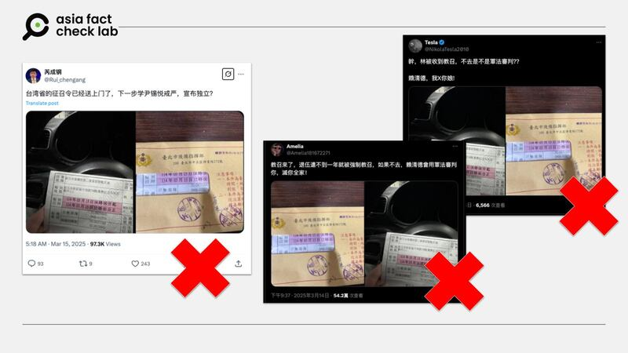
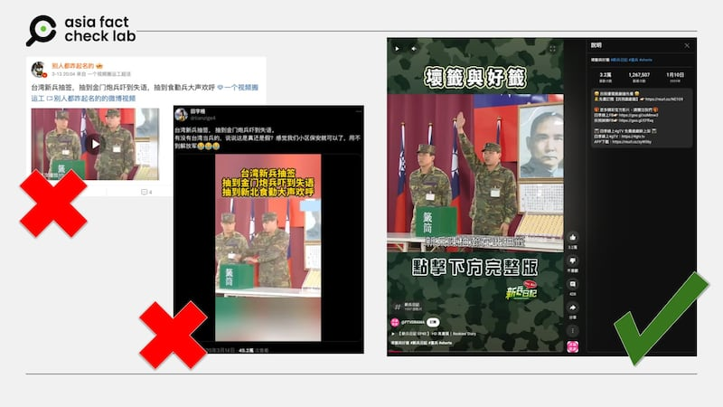

# Media Watch: online users target Taiwan with rumors about its military

## Some falsely claim that Taiwan is conscripting citizens in preparation for a war with China.

By Dong Zhe for Asia Fact Check Lab

2025.03.28

## *Updated on March 31, 2025 at 3：57 a.m. ET*

On March 13, Taiwanese President Lai Ching-te called for a tougher response to Beijing, describing China as a “foreign hostile force” intent on “absorbing” the democratic island – the toughest rhetoric yet toward Beijing from a Taiwanese leader.

In response, Chinese officials called Lai a “destroyer of cross-Straits peace” and a “creator of the crisis in the Taiwan Straits.”

The heated exchange continued online, with some Chinese-speaking social media users spreading rumors about Taiwan’s military.

Below is what AFCL found.

## Conscription orders, military court

A user on X, impersonating former CCTV journalist Rui Chenggang, [claimed](https://archive.ph/H4Ne6) on March 15 to have received conscription orders from the Taiwanese government.

“Taiwan’s conscription order has already been delivered to our doorsteps. Now why not take a page from [South Korean President] Yoon Suk Yeol’s martial law experiment and declare independence?” the claim reads.

The claim was shared alongside two images.

China considers Taiwan a breakaway province and has ramped up military pressure through drills and incursions. Taiwan, however, sees itself as a sovereign state and continues to bolster its defenses.

But the claim is false.

The images shared in the X post in fact show a letter for a prescheduled call-up for reservists to participate in skill training at military camps, not conscription orders.

Taiwan has a conscription system that requires eligible male citizens to serve in the military for a set period, but AFCL found no credible reports or announcements that the island was issuing conscription orders specifically to declare independence.

afcl-taiwan-military-rumor\_03282025\_1 Several posts on Chinese social media spread misinformation about Taiwan calling up reserve military forces. (X, Weibo and club.6parkbbs)

Separately, some Chinese-speaking users also claimed that Taiwan would put soldiers who refused to participate in reservist training on trial under the military court system, following Lai’s proposal to reinstate it.

But this claim is also false.

On March 13, Lai only proposed to restore a military court system, which was under martial law until the late 1980s.

As of March 28, Taiwan has not restored such a system.

Were Taiwanese soldiers scared witless after being assigned to Kinmen?

## Does a video show Taiwanese soldiers being “shocked” as they were assigned to a front line?

An account on X [claimed](https://archive.ph/jt7Qr) that recent Taiwanese recruits assigned to an artillery brigade on the island of Kinmen were shocked and lost their breath.

A video was shared on X on March 14 alongside a claim that it shows Taiwanese soldiers being “shocked” and “losing their breath” after they were assigned to Kinmen, a small Taiwanese archipelago just off the coast of mainland China, which has previously been an area of conflict between Beijing and Taipei.

But the claim is false. A reverse image search found that the video was taken out from the 2010 Taiwanese TV drama “Rookies’ Diary” produced by Formosa Television.

afcl-taiwan-military-rumor\_03282025\_5 A purported video of Taiwanese recruits being scared witless after being assigned to Kinmen is actually footage from a Taiwanese TV drama. (X and YouTube)

A further search found the video was taken from the drama’s 40th episode.

AFCL previously debunked claims about Taiwan’s military [here](2025-03-12_Does a video show Taiwan training female military personnel?.md) and [here](2025-03-05_Does a video show Taiwanese soldiers struggling during military drills?.md).

## *Translated by Shen Ke. Edited by Taejun Kang.*

## *Updated to clarify that the X account cited in this article does not belong to former CCTV journalist* *Rui* *Chenggang.*

*Asia Fact Check Lab (AFCL) was established to counter disinformation in today’s complex media environment. We publish fact-checks, media-watches and in-depth reports that aim to sharpen and deepen our readers’ understanding of current affairs and public issues. If you like our content, you can also follow us on* [*Facebook*](https://www.facebook.com/asiafactchecklabcn)*,* [*Instagram*](https://www.instagram.com/asiafactchecklab/) *and* [*X*](https://twitter.com/AFCL_eng)*.*

[Original Source](https://www.rfa.org/english/factcheck/2025/03/28/afcl-taiwan-military-rumor/)