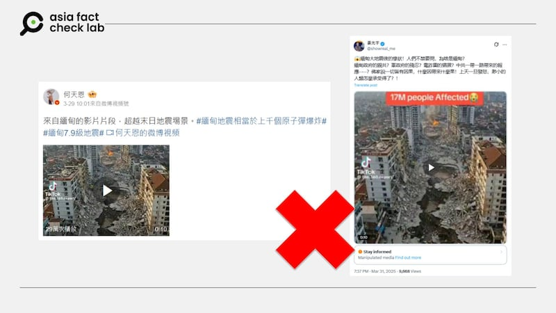
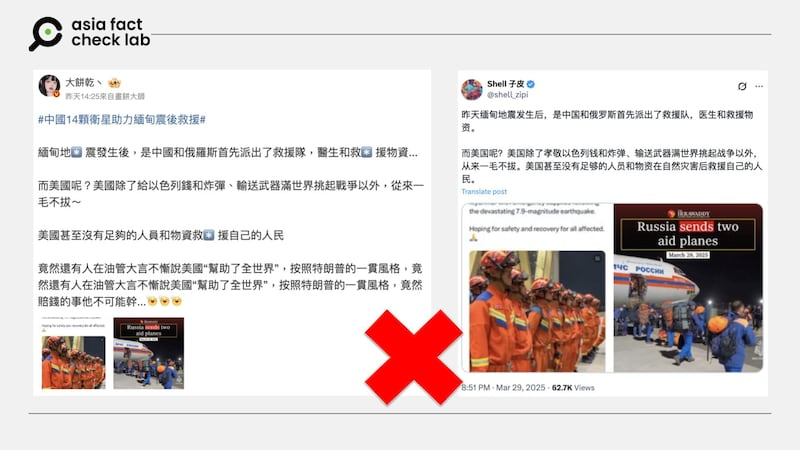
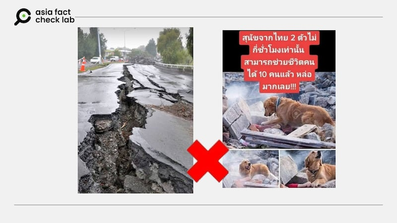

# Does a video show aftermath of Myanmar earthquake in March?

## Verdict: False

By Zhuang Jing for Asia Fact Check Lab

2025.04.07

## A video has been circulated in Chinese-language social media posts that claim it shows a city in Myanmar after it was hit by a powerful earthquake in late March.

## But the claim is false. According to an AI analysis tool and expert, the video is not footage of the real scene but instead AI-generated.

The video was [shared](https://x.com/showreal_me/status/1906672150431289646) on X on March 31, 2025.

“The tragic situation after the earthquake in Myanmar! People can’t help but ask, why Myanmar?” the caption of the video reads in part.

The 10-second video shows the aerial view that captures a devastated street below. Massive potholes scar the road’s surface, while buildings on either side stand in ruins, their structural materials scattered across the ground. At the far end of the street, smoke billows from an active fire.

afcl-myanmar-quake-claim\_04072025\_1 Some Chinese social media users claimed that this video shows a city in Myanmar after it was hit by a powerful earthquake in late March. (Weibo and X)

​A powerful 7.7-magnitude earthquake struck near Mandalay, Myanmar, on March 28, causing widespread destruction. The disaster resulted in more than 3,500 fatalities and thousands of injuries.

The earthquake also affected neighboring countries, with significant tremors felt in Thailand and China.

Rescue and relief efforts have been severely hampered by ongoing heavy rains and the country’s ongoing civil conflict, complicating access to affected regions and the delivery of aid.

But the claim about the video showing a damaged Burmese city is false.

A closer look at the video shows it was credited to a TikTok user “@the.360.report”.

A search on the user’s account found that the user often published AI-generated videos.

A test using an AI-generated content detection tool from Hive found that the video was more than 95% likely to be AI-generated.

afcl-myanmar-quake-claim\_04072025\_2 Results from the detection tool Hive show a more than 90% probability that the video was AI-generated. (Hive AI)

Taiwanese cybersecurity expert Paul Liu told AFCL that the video contains several clear inconsistencies, which indicates that it was AI-generated.

Liu said the spread of flames across the sky and the concentration and uniformity of the smoke appear unnatural, while pedestrians on the street remain motionless throughout the video.

He added that there is a large pile of debris on the right side of the ground, which does not match the level of visible damage to the nearby buildings – an inconsistency commonly seen in AI-generated content.

Additionally, Liu pointed out that the spacing between the characters on the red signboard on the left-side building is uneven, another frequent issue found in generative content.

## US support for Myanmar

The claim about the video is among several pieces of misinformation that emerged online following the earthquake.

A few days after the earthquake, a claim began circulating on the Chinese social media platform Weibo, alleging that the United States had provided no support to Myanmar, while China and Russia promptly dispatched rescue teams, medical personnel, and relief supplies.

afcl-myanmar-quake-claim\_04072025\_4 A claim began circulating on the Chinese social media platform Weibo, alleging that the United States had provided no support to Myanmar, while China and Russia promptly dispatched rescue teams, medical personnel, and relief supplies. (Weibo and X)

But this claim is also false.

U.S. President Donal Trump said on March 28 that the U.S. was going to help with the response to the earthquake in Myanmar.

Separately, U.S. State Department spokesperson Tammy Bruce, said on the same day that its foreign aid department, USAID, maintained a team of disaster experts with the capacity to respond if disaster strikes, and these expert teams provided immediate assistance, including food and safe drinking water needed to save lives in the aftermath of a disaster.

The U.S. Embassy in Myanmar also announced on March 30 that the U.S. will provide up to US$2 million through Myanmar-based humanitarian assistance organizations to support earthquake-affected communities.

“A USAID emergency response team is deploying to Myanmar to identify the people’s most pressing needs, including emergency shelter, food, medical needs, and access to water,” it said.

Apart from this claim, a couple of photos emerged in social media posts with users claiming that they were taken after the earthquake in March.

afcl-myanmar-quake-claim\_04072025\_55 A couple of photos emerged in social media posts with users claiming that they were taken after the earthquake in March. (X and Facebook)

But a photo of a damaged road, which has been widely circulated in Burmese-language social media posts, was in fact taken 2011 in New Zealand.

A photo of a dog “helping” rescue efforts, which has been trending among Thai-speaking social media users, is a stock image created by Czech photographer Jaroslav Noska and has nothing to do with the latest earthquake.

## *Edited by Taejun Kang.*

*Asia Fact Check Lab (AFCL) was established to counter disinformation in today’s complex media environment. We publish fact-checks, media-watches and in-depth reports that aim to sharpen and deepen our readers’ understanding of current affairs and public issues. If you like our content, you can also follow us on* [*Facebook*](https://www.facebook.com/asiafactchecklabcn)*,* [*Instagram*](https://www.instagram.com/asiafactchecklab/) *and* [*X*](https://twitter.com/AFCL_eng)*.*

[Original Source](https://www.rfa.org/english/factcheck/2025/04/07/afcl-ai-video-myanmar-quake/)