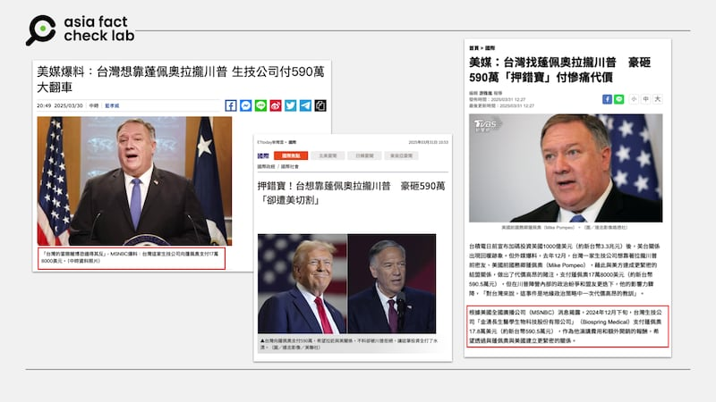
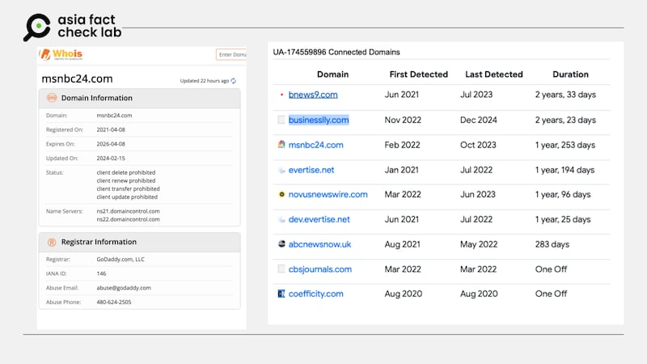
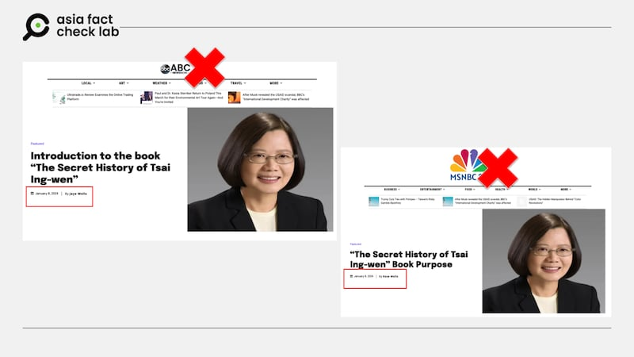

# Media Watch: Fake news websites hijack Taiwan’s mainstream media

## Experts warn of ‘slime media’ – fake news sites posing as legitimate outlets to manipulate political discourse.

By Dong Zhe and Zhuang Jing for Asia Fact Check Lab

2025.04.09

TAIPEI, Taiwan – On March 30, a headline in Taiwan’s *China Times* sparked widespread controversy: “U.S. Media Reveals: Taiwan Tried to Use Pompeo to Woo Trump, Biotech Firm Paid US$5.9 Million – Major Flop.”

The report claimed to cite a bombshell investigation by U.S. broadcaster MSNBC, revealing that Taiwan’s ruling Democratic Progressive Party, or DPP, had attempted to build ties with U.S. President Donald Trump through his ex-Secretary of State, Mike Pompeo – only for the effort to backfire due to strained relations between the two Americans.

The story was widely republished by prominent Taiwanese media outlets, including broadcaster TVBS and *ETtoday*, and was featured in the high-profile TVBS talk show “Situation Room.” It even made the front page of China Times’ print edition the following day.

But there was a problem: the story wasn’t from MSNBC.

afcl-fake-news-websites-taiwan\_04092025\_1 Taiwanese mainstream media outlets cited "MSNBC" for its reporting. But the story was not from MSNBC. (China Times, TVBS and ETtoday)

## Fake news website

Keyword searches found no such article existed on the network’s website – nor in any other reputable American news outlet.

A spokesperson for MSNBC confirmed that MSNBC has no connection to MSNBC24.

The website of MSNBC24 appears to be poorly maintained. Articles are all authored by a single name, “Rose Wells.” Many feature the same generic landscape photo, and key site links like “About Us” or “Contact” redirect to the homepage.

A closer look at the MSNBC24’s registration information – which was registered in 2021 – shows that it is linked to eight other suspicious websites, including “abcnewsnow.uk,” which uses a design nearly identical to MSNBC24 and seems to impersonate American broadcaster ABC News.

AFCL also found that the nine websites, including MSNBC24, shared the same Google Analytics, of GA, code “UA-174559896.” GA codes are used to monitor website traffic, and each code links to a specific tracking account.

When multiple sites use the same code, their visitor data is collected in one account – suggesting that the sites are operated by the same individual or organization.

afcl-fake-news-websites-taiwan\_04092025\_2 AFCL also found that the nine websites, including MSNBC24, shared the same Google Analytics, of GA, code “UA-174559896,” which is used to monitor website traffic, and each code links to a specific tracking account. (AFCL)

A comparison of two websites shows that both MSNBC24 and abcnewsnow.uk published articles on Jan. 8 about the “secret history” of former Taiwanese President Tsai Ing-wen – content that Taiwan’s national security agencies flagged as AI-generated disinformation aimed at interfering with Taiwan’s elections.

Another linked site, “businesslly.com,” collaborated with abcnewsnow.uk to publish a negative story about Guo Wengui, a Chinese billionaire and political dissident who exposed alleged corruption within the Chinese Communist Party, leading Beijing to label him a criminal and pursue him aggressively.

The article, titled in broken English, was nearly a word-for-word translation of a fictional story found on Wattpad, a user-generated writing platform.

The content published on these three websites – and others linked to them – shares a common trait: they consistently push pro-China, anti-Taiwan disinformation.

afcl-fake-news-websites-taiwan\_04092025\_3 The content published on MSNBC24 and others linked to it shares a common trait: they consistently push pro-China, anti-Taiwan disinformation. (AFCL)

## ‘Slime media’

Postdoctoral researcher Li Wei-Ping of the University of Maryland’s journalism school says MSNBC24 fits the profile of “slime media,” also known as “pink slime journalism” – fake news websites masquerading as legitimate outlets, often designed to manipulate political discourse.

“The website mimics the naming conventions of real local U.S. news outlets, a tactic that shows a high level of familiarity with the American media ecosystem,” Li said.

The scale of such operations is staggering. According to a 2024 Guardian report, over 1,265 fake local news websites now exist in the U.S. – outnumbering the country’s 1,213 remaining daily newspapers.

Many are funded by political groups and aim to sway public opinion during elections.

Li emphasized the importance of checking a media outlet’s “About” section and verifying journalists’ credentials, urging reporters to remain vigilant.

“Don’t rush to amplify ‘exclusive scoops’ without verifying the source – especially if it comes from a site you’ve never heard of.”

“It’s a constant cat-and-mouse game,” Li warned.

## *Edited by Taejun Kang.*

*Asia Fact Check Lab (AFCL) was established to counter disinformation in today’s complex media environment. We publish fact-checks, media-watches and in-depth reports that aim to sharpen and deepen our readers’ understanding of current affairs and public issues. If you like our content, you can also follow us on* [*Facebook*](https://www.facebook.com/asiafactchecklabcn)*,* [*Instagram*](https://www.instagram.com/asiafactchecklab/) *and* [*X*](https://twitter.com/AFCL_eng)*.*

[Original Source](https://www.rfa.org/english/factcheck/2025/04/09/afcl-fake-news-websites-taiwan/)