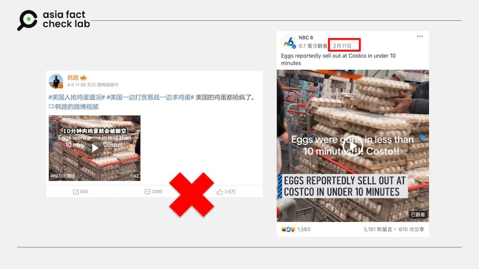
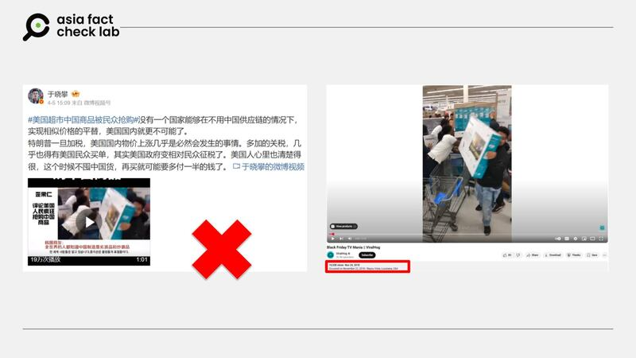

# Does a video show ‘panic buying’ in US after Trump introduced reciprocal tariffs?

## Verdict: False

By Zhuang Jing for Asia Fact Check Lab

2025.04.15

## A video emerged in Chinese-language social media posts alongside a claim that it shows American consumers were panic buying after the U.S. President Donald Trump announced “reciprocal tariffs” in early April.

## But the claim is false. The footage was not recent and unrelated to tariffs. It originated from a TikTok video shared by NBC6 in February 2025, during an avian flu outbreak that caused egg shortages and price hikes.

The video was shared on [Weibo](https://m.weibo.cn/detail/5153477139371953) on April 9, 2025.

The one-minute and 45-second video shows people buying eggs in bulk.

“The U.S. is waging a trade war and begging for eggs at the same time – Americans are scrambling for eggs,” the caption of the video reads.

afcl-china-us-tariff-panic-buying\_04152025\_1 Some Chinese social media users claim that this video shows American consumers were panic buying after the U.S. President Donald Trump announced “reciprocal tariffs” in early April. (Weibo)

In early April, Trump announced a new round of “reciprocal tariffs,” aiming to match or exceed the import duties that other countries impose on American goods.

While tariffs on some nations were temporarily suspended for 90 days, Trump raised duties specifically on Chinese imports, saying the move was designed as a way to protect U.S. industries and counter unfair trade practices.

But the claim about the video posted on Weibo is false.

A reverse image search found part of the clip was [published](https://www.facebook.com/watch/?v=1138047054214987) by U.S. media outlet NBC6 in February.

According to the outlet, the video was originally posted by a TikTok user during a period of egg shortages caused by an avian flu outbreak and resulting price spikes – not by tariffs or a trade war.

A comparison showed that the footage between seconds 13 and 27 in the Weibo video matched the NBC6 clip exactly. Other segments in the same video were also found to have been posted on social media back in February.

Separately, a Weibo user [posted](https://m.weibo.cn/detail/5152087990077867) on April 5 claiming that Americans were panic-buying Chinese goods in supermarkets.

The post included a video captioned, “Tariffs go up, Americans rush to buy Chinese products,” showing shoppers grabbing Hisense-branded TVs.

afcl-china-us-tariff-panic-buying\_04152025\_2 This video shows a Black Friday shopping event in the U.S., not Americans were panic-buying Chinese goods in supermarkets. (Weibo)

But AFCL had already [debunked](https://www.rfa.org/cantonese/news/factcheck/madeinchina-08142023084015.html?encoding=simplified) this in a 2023 fact-check, showing that the original video was [posted](https://www.youtube.com/watch?v=b8wW8H6VH-U) in November 2018 by the YouTube channel “ViralHog.”

It documented a Black Friday shopping event in the U.S.

In 2023, Chinese diplomat Zhang Heqing reused the same clip, falsely claiming it showed Americans frantically buying Hisense TVs after President Biden imposed import restrictions on Chinese goods.

## *Edited by Taejun Kang.*

*Asia Fact Check Lab (AFCL) was established to counter disinformation in today’s complex media environment. We publish fact-checks, media-watches and in-depth reports that aim to sharpen and deepen our readers’ understanding of current affairs and public issues. If you like our content, you can also follow us on* [*Facebook*](https://www.facebook.com/asiafactchecklabcn)*,* [*Instagram*](https://www.instagram.com/asiafactchecklab/) *and* [*X*](https://twitter.com/AFCL_eng)*.*

[Original Source](https://www.rfa.org/english/factcheck/2025/04/15/afcl-us-panic-buying-trump-tariff/)