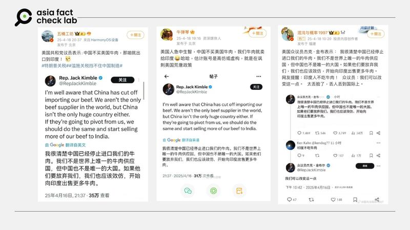

# Did a US politician suggest selling all American beef to India instead of China?

## Verdict: False

By Alicia Dong for Asia Fact Check Lab

2025.04.22

## A claim emerged in Chinese-language social media posts that a U.S. congressman named “Jack Kimble” suggested selling all American beef to India if China stops importing it.

## But the claim is false. There is no U.S. congressman by that name. The claim originated from a satirical social media post.

A Taiwanese political talk show, TVBS News Talk, cited Chinese outlet NetEase to claim that a U.S. congressman named “Jack Kimble” suggested selling all American beef to India if China stops importing it.

The guest of the show, retired Taiwanese Lt. Gen. Shuai Hua-min, used the claim to criticize the U.S. as ignorant, noting that Indians don’t eat beef.

afcl-us-politician-china-tariff-remark\_04222025\_1 TVBS guest and retired Taiwanese Lt. Gen. Shuai Hua-min criticized Washington, citing a claim that a U.S. congressman suggested selling all U.S. beef to India if China refuses to buy it. (TVBS/YouTube)

The U.S. and China are waging a tit-for-tat trade battle, which threatens to stunt the global economy, after Trump announced new tariffs on most countries.

Specifically, the Trump administration has ramped up its trade war with Beijing by hiking import taxes on Chinese goods to as high as 145%

China, which has pledged to “fight to the end” if Washington continues to escalate the trade spat, has hit back by imposing duties of 125% on U.S. exports, prompting U.S. companies to seek alternative markets and manufacturing bases.

India has emerged as a key partner in this realignment. U.S. Vice President JD Vance recently visited India to advance negotiations on a bilateral trade deal aimed at boosting trade from the current US$190 billion to US$500 billion by 2030. Discussions include tariff relief and increased imports of U.S. goods by India .​

But the claim about the purported remarks made by a U.S. congressman named “Jack Kimble” is false.

Keyword searches found that the claim originated from a [satirical post](https://archive.ph/H6wyC) from a parody X account named “Rep. Jack Kimble.”

The account is known for political satire and explicitly describes itself as representing California’s fictional 54th congressional district – California only has [52 districts](https://apnews.com/projects/election-results-2024/california/?r=6478).

According to the official [website](https://www.house.gov/representatives) of the U.S. House of Representatives, there is no member named “Jack Kimble.”

On April 16, the parody account posted a satirical message suggesting selling beef to India if China stops buying it. This post was mistakenly translated and widely shared across Chinese social media platforms, including Weibo, Douyin, and even Chinese state-affiliated outlets like Hua Shang Daily.

afcl-us-politician-china-tariff-remark\_04222025\_2 The “US congressman suggests the U.S. sell beef to India” claim circulated across various Chinese news and social media platforms. (Weibo, Douyin and Hua Shang Daily)

Other claims made by the satirical X account have been debunked by [Reuters](https://www.reuters.com/fact-check/fictional-congressmans-x-post-about-trump-verdict-taken-seriously-2024-06-06/), [USA Today](https://www.usatoday.com/story/news/factcheck/2024/10/04/kimble-gop-walz-debate-satire-fact-check/75484634007/), and [PolitiFact](https://www.politifact.com/factchecks/2024/oct/09/viral-image/no-this-isnt-a-real-republican-representative-prem/).

## *Edited by Taejun Kang.*

*Asia Fact Check Lab (AFCL) was established to counter disinformation in today’s complex media environment. We publish fact-checks, media-watches and in-depth reports that aim to sharpen and deepen our readers’ understanding of current affairs and public issues. If you like our content, you can also follow us on* [*Facebook*](https://www.facebook.com/asiafactchecklabcn)*,* [*Instagram*](https://www.instagram.com/asiafactchecklab/) *and* [*X*](https://twitter.com/AFCL_eng)*.*

[Original Source](https://www.rfa.org/english/factcheck/2025/04/22/afcl-us-politician-china-tariff-remark/)