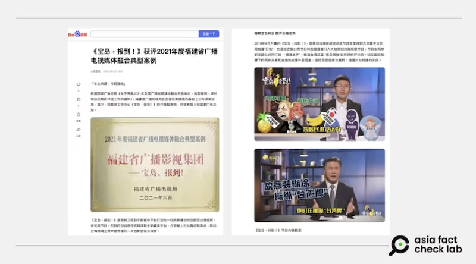
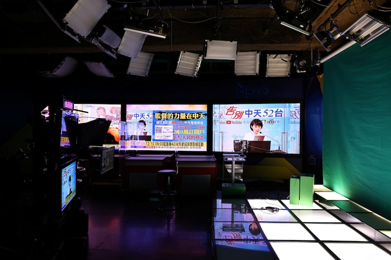
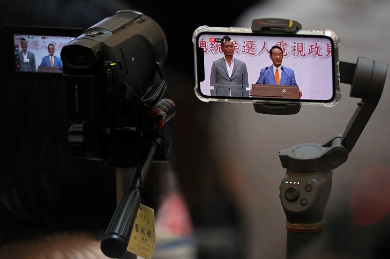

# Cross-strait shadows: Inside the Chinese influence campaign against Taiwan (Part III)

## What appears to be a homegrown Taiwan show is in fact part of Beijing’s sophisticated influence operation.

By Zhuang Jing, Dong Zhe and Alan Lu for Asia Fact Check Lab

2025.04.25

## *Read “Cross-strait shadows： Inside the Chinese influence campaign against Taiwan” (Part I* [*here*](https：//www.rfa.org/english/factcheck/2025/01/06/afcl-china-influence-campaign-taiwan/ "https：//www.rfa.org/english/factcheck/2025/01/06/afcl-china-influence-campaign-taiwan/") *and Part II* [*here*](https：//www.rfa.org/english/factcheck/2025/01/08/afcl-china-influene-taiwan-fujian/ "https：//www.rfa.org/english/factcheck/2025/01/08/afcl-china-influene-taiwan-fujian/")*)*

TAIPEI, Taiwan – Marketed as a cross-strait collaboration, “Taiwan’s Voice” presents itself as a local commentary platform. But behind the familiar hosts and studio lies a deeper link to China’s state-run media.

Over the past year, the Asia Fact Check Lab has traced how content produced in Taiwan, yet aligned with Chinese narratives, is seeping into the island’s media landscape through what it calls the “Fujian Network.”

With slick production and recognizable faces, these shows blur the line between domestic discourse and foreign influence – part of Beijing’s quiet push to shape public opinion in Taiwan.

## What is ‘Taiwan’s Voice’?

The show “Taiwan’s voice,” or “寶島, 報到!” in Chinese, is marketed as an original cross-strait news and commentary program designed to “speak through borrowed mouths,” by inviting Taiwan’s pan-blue “opinion leaders” to serve as guest commentators and enhance the effectiveness of messaging directed at Taiwan.

The show – launched in 2019 – is operated by “Straits TV,” a subsidiary of China’s Fujian Broadcasting and Television Group.

afcl-ccp-propaganda-taiwan\_04232025\_1 The show “Taiwan’s voice” branded itself as a cross-strait collaboration “jointly produced by news teams from both sides,” without mentioning which Taiwanese team was actually working with China’s Straits TV. (Baidu)

According to a news release from the Fujian Provincial Radio and Television Bureau, the program was recognized as a “Model Case of Media Integration in Fujian Province in 2021” and recommended for commendation by China’s National Radio and Television Administration.

The program branded itself as a cross-strait collaboration “jointly produced by news teams from both sides,” without mentioning which Taiwanese team was actually working with Straits TV.

Despite this framing, the program prominently features pro-China Taiwanese commentators and content crafted for Chinese audiences, frequently using mainland Chinese terminology.

## Who actually produces the show?

While monitoring broadcasts, AFCL noticed a detail: in one episode, a guest of the show, New Party Taipei City councilor Hou Han-ting, thanks live viewers at the start and mentions he had just come from a budget review session at the city council and took a taxi to the studio. This suggests the recording took place in Taiwan.

In another video, the guest host interacted with off-screen staff, confirming a cooperative relationship between Straits TV and Chung T’ien Television, or CTiTV, a Taipei-based broadcaster.

Interviews with media insiders later confirmed the program is recorded in a studio operated by CTiTV in Taipei.

CTiTV, owned by the pro-China Want Want Group, is known for promoting Beijing-friendly narratives. In 2020, Taiwan’s media regulator revoked its license over repeated disinformation and biased reporting. ​

CTiTV denied the allegations and accused regulators of bias, but the channel reportedly failed to explain the nature of its China-related content and collaborations.

Since then, the broadcaster transitioned to digital platforms to continue its operations, streaming its content online via its YouTube channel and through its dedicated mobile app.

Empty recording studio are seen in the CTi station in Taipei, Empty recording studios are seen in the CTi station in Taipei, Taiwan, Dec. 10, 2020. (Ann Wang/Reuters)

Interviews and content comparisons confirm at least a practical partnership between CTiTV and Straits TV. This includes content sharing and the provision of production facilities and personnel, jointly producing the politically focused program “Taiwan’s Voice.”

When questioned about whether the scripts originated from China, a CTiTV employee denied the claim, saying that the producers choose the topics and the guests are responsible for preparing their own scripts.

Two CTiTV employees, speaking on condition of anonymity, told AFCL they did not believe Chinese authorities had directly intervened in the broadcaster’s operations.

However, they pointed to Want Want Group chairman Tsai Eng-meng’s pro-China stance, suggesting that CTiTV’s editorial direction may already be influenced by Tsai in ways that align with Beijing’s narrative.

CTiTV has not responded to AFCL’s inquiries.

## Legal gray zone

While Taiwanese law prohibits unauthorized political collaboration between local organizations and Chinese entities, enforcement remains a challenge.

Under the current law, such collaborations must be approved by the relevant authority – yet what constitutes “political content” or “cooperation” remains vague.

The Mainland Affairs Council, a Taiwanese administrative agency that oversees cross-strait relations policy targeting mainland China, Hong Kong and Macau, confirmed to AFCL that any cross-strait political co-productions require pre-approval.

But in practice, responsibility is diffused among various agencies such as the Ministry of Culture, the National Communications Commission, or NCC, and the Ministry of Digital Affairs.

The presser after live policy address in Taipei Members of the media use a mobile phone to live-stream the presser after the second live policy address ahead of January’s election in Taipei, Taiwan, Dec. 25, 2019. (Ann Wang/Reuters)

National Taiwan University’s journalism professor Hung Chen-ling noted that while such activities may breach the law, penalties are weak.

“Even if someone reports a violation, the fine might be just a few thousand dollars. For those involved, the benefits often outweigh the cost,” she said.

Another hurdle is the challenge of regulating cross-strait media co-productions in the digital era. While cable broadcasts in Taiwan are subject to licensing and oversight, these mechanisms have limited reach online.

Although traditional television content must comply with established regulations, the rise of digital platforms and internet-native programming has introduced enforcement gaps.

As more broadcasters pivot to online distribution, it becomes harder for authorities to monitor content – potentially enabling foreign-affiliated media to reach Taiwanese audiences with less regulatory scrutiny.

## *Edited by Chih Te Lee and Taejun Kang.*

*Asia Fact Check Lab (AFCL) was established to counter disinformation in today’s complex media environment. We publish fact-checks, media-watches and in-depth reports that aim to sharpen and deepen our readers’ understanding of current affairs and public issues. If you like our content, you can also follow us on* [*Facebook*](https://www.facebook.com/asiafactchecklabcn)*,* [*Instagram*](https://www.instagram.com/asiafactchecklab/) *and* [*X*](https://twitter.com/AFCL_eng)*.*

[Original Source](https://www.rfa.org/english/factcheck/2025/04/25/afcl-china-ccp-propaganda-in-taiwan/)