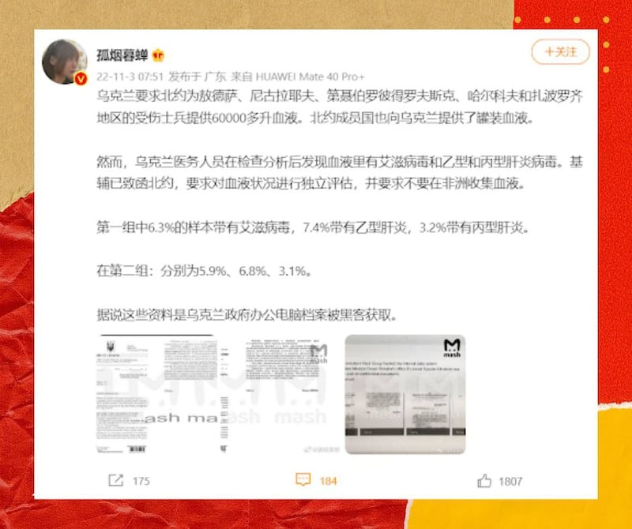
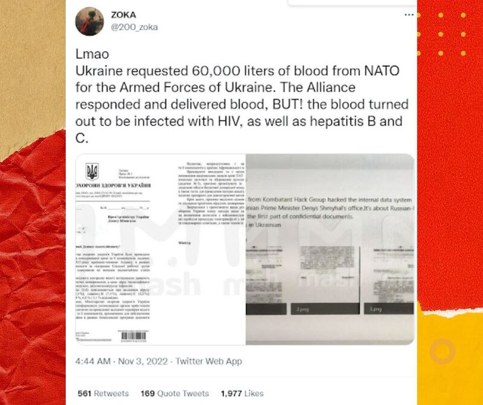
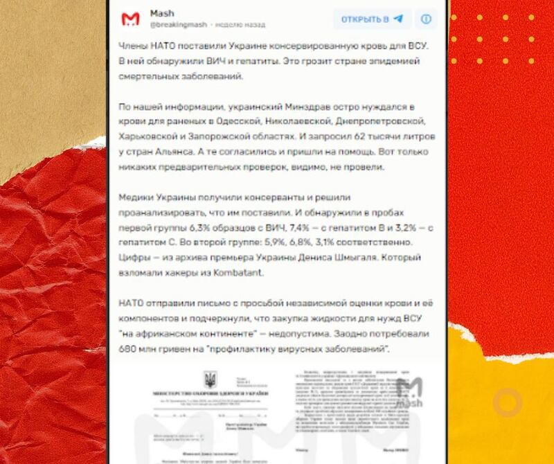
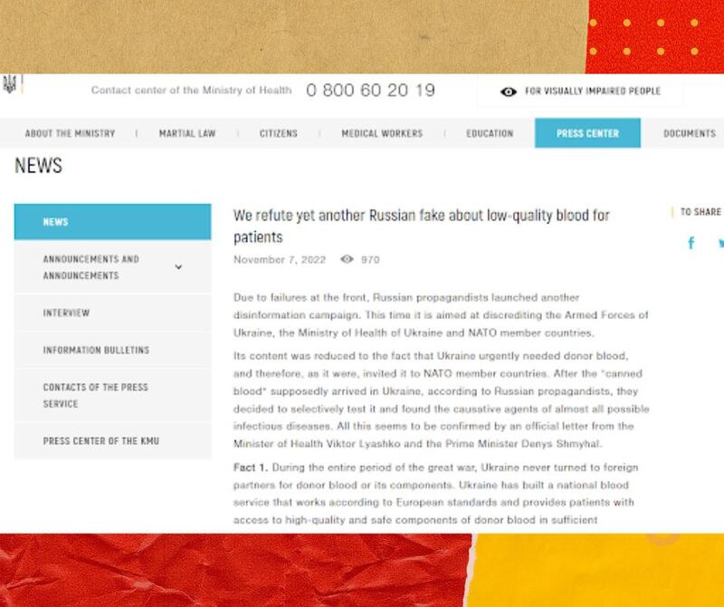

# 事實查覈 | 北約捐給烏克蘭帶病毒血液？烏衛生部駁斥微博大V謠言

作者：辛西婭

2022.11.15 16:29 EST

## 

## 深度分析：

## 錯誤信息是哪裏來的？

11月3日,擁有644萬粉絲的新浪大V  [**"孤煙暮蟬"**](https://weibo.com/2150758415/MdmEqF9Zu?from=page_1005052150758415_profile&wvr=6&mod=weibotime) 在其個人微博賬號發佈貼文,稱烏克蘭軍隊向北約組織(NATO)要求6萬多升血液,以救助傷兵。北約捐贈的罐裝血液送達以後,烏克蘭方面抽查時發現部分血液感染了艾滋病毒、乙型和丙型肝炎病毒。烏方要求北約對血液狀況進行獨立評估,並要求不要在非洲大陸購買血液。貼文配有三張圖片,第一張圖片以英文宣稱該信息來自烏克蘭總理被黑客破解的電郵,第二張是貌似烏克蘭語寫成的公函,第三張是該公函的英文翻譯。圖片水印顯示"mash"字樣。

該微博得到了廣泛傳播和熱議。另外幾個微博“大V”用戶也迅速發佈了這條消息，包括粉絲108.1萬的軍事博主“地球鏡頭A”、粉絲284.9萬的財經博主“何天恩”、粉絲118萬的科技博主“茂哥日記”等。該信息也被包括網易在內的多家網站發佈，在中文網絡傳播廣泛。但無論是孤煙暮蟬的原始微博，還是轉載文章，都沒有提供該信息的來源。

“染病毒血液”消息源於與普京關係密切的俄羅斯網站，經亞洲事實查覈實驗室查證，這條信息並無任何烏克蘭本地或國際權威媒體報道。少數幾家在時政新聞領域並沒有權威的英文網站也傳播了這條信息，但這些網站可信度都較低。 比如，inf.news發佈的信息大多立場一邊倒親俄，而snipershide.com是槍械愛好者網站。

英文社交媒體上,最早報道該消息的是推特(Twitter)用戶ZOKA,在11月3日以英文發佈了  [**這條消息**](https://twitter.com/200_zoka/status/1588134915064971264) ,比孤煙暮蟬早了3小時。發佈數日以來,ZOKA的貼文也廣泛傳播於英文社交網絡。

ZOKA雖然不是推特認證賬號,但人氣很高,有105.5K粉絲。ZOKA的許多推文都有明顯的挺俄反烏立場。"ZOKA是個衆所周知的親克里姆林宮賬號。"加拿大智庫麥當勞.勞裏埃研究所(Macdonald-Laurier Institute)旗下事實查覈項目  [**DisinfoWatch**](https://disinfowatch.org/)  的負責人Marcus Kolga向亞洲事實查覈實驗室表示。

亞洲事實查覈實驗室發現多家俄語網站和自媒體也發佈了這個消息。比對發佈時間、圖片水印和多家俄語網站的來源說明,確定該信息最初來源是俄羅斯電報羣 [Breaking Mash](https://tlgrm.ru/channels/@breakingmash/39593)。該信息發佈於11月3日1am。發佈數日來,瀏覽量已超過100萬。微博上的"孤煙暮蟬"所發佈的中文信息正來源於此。

Breaking Mash電報羣是俄羅斯媒體Mash.ru的官方電報羣。烏克蘭Euromaidan Press的媒體人兼翻譯Christine Eliashevsky-Chraibi女士對亞洲事實查覈實驗室表示，Mash的立場“充滿謊言”，與俄羅斯政府高度一致。

另外，網絡公開信息顯示，Mash的管理層及其家族與普京關係密切，其負責人Stepan Kovalchuk的父親Kirill Kovalchuk和叔父Yuri Kovalchuk被美國政府標註爲與普京關係密切的俄羅斯高層人士。

綜上，這個消息最初來源是俄羅斯媒體Mash.ru的電報羣，可信度很低。而將該信息翻譯爲英文並廣泛傳播的網站和社交賬戶，一般也被認爲可信度 很低。

## 亞洲事實查覈實驗室發動查覈後 烏克蘭官方公告駁斥虛假消息

從內容來看，該信息有不少破綻。例如，烏方“要求北約不要在非洲大陸購買血液”這樣明顯種族歧視的話語，出現在政府的正式公文中的可能性很低。上述烏克蘭媒體人士，Eliashevsky-Chraibi女士也認爲，這封公函沒有日期，沒有簽名，沒有蓋章，格式極不正規，非常可疑。

爲了進一步查證該信息內容,亞洲事實查覈實驗室與烏克蘭當地事實查覈組織StopFake取得聯繫,該組織就此消息詢問烏克蘭衛生部(Ministry of Health of Ukraine),烏衛生部11月7日在其官方網站發佈  [**正式聲明**](https://moz.gov.ua/article/news/sprostovuemo-chergovij-rosijskij-fejk-pro-nejakisnu-krov-dlja-pacientiv?fbclid=IwAR1_HkjYI78ueYZfhsCwPj0GuEwM5mEvVIDsnzpoCwaD29iAC5rlwdx5vB4) ,稱這消息是俄羅斯方面的虛假信息,並從四個方面聲明駁斥。

烏克蘭衛生部的聲明指出：

一、烏克蘭從未向任何境外機構要求獻血，戰場需要的所有捐血都來自烏克蘭境內，烏克蘭已建起符合歐洲標準的血液捐獻系統，血液製品高質、安全且數量充足。

二、戰爭爆發以來，前線每次發出捐血倡議，烏克蘭民衆都會積極響應。烏克蘭根本不需要向境外機構求助。

三、烏克蘭檢驗血液並非“隨機抽檢”相反，而是所有捐血都進行嚴格病毒檢測，保證病人使用的所有血液製品都安全可靠。

最後，烏克蘭衛生部指出，傳言中那封公函屬於僞造，上面沒有烏克蘭所有公函都必需的當事人簽名。

## 結論：

綜上所述，孤煙暮蟬微博上發佈的消息屬於虛假信息。它最早來源於俄羅斯一個以假新聞著稱的網絡，在英文、中文網絡世界都有傳播。烏克蘭衛生部的官方聲明，給這條虛假消息提供了權威的判斷，並對相關情況進行了說明。

## 背景補充：

媒體可信度很高的英文報紙《基輔郵報》(Kyiv Post)10月下旬曾報道  [**俄羅斯瓦格納僱傭軍團曾招募攜帶艾滋病毒和肝炎病毒的服刑人員入伍**](https://www.kyivpost.com/russias-war/wagner-recruits-prisoners-with-hiv-and-hepatitis-c.html) 。這條新聞同樣具有艾滋病毒、肝炎病毒、俄烏戰爭等要素。Breaking Mash電報羣發佈的那條消息,或許是俄方對烏克蘭和民主陣營信息戰的一部分,用類似的敘事攻擊烏克蘭官方。

與病毒有關的假信息,是俄羅斯從蘇聯時代就經常使用的信息戰策略。早在1980年代,蘇聯情報機構克格勃就聯合東德情報機構斯塔西一起策劃了  [**"丹佛行動(Operation Denver)"**](https://www.wilsoncenter.org/blog-post/operation-denver-kgb-and-stasi-disinformation-regarding-aids) ,編造謠言稱艾滋病毒是美國製造的生物武器,該病毒曾在囚犯、少數民族和同性戀者身上進行測試,且該病毒起源於非洲。從內容上來看,這條信息或許是這一策略的進化。新冠疫情期間,民衆談"病毒"色變,俄羅斯入侵烏克蘭以來,許多戰爭期間的假消息都與病毒有關。

## 資料鏈接：

[ [孤煙暮蟬微博帖子Opens in new window](https://weibo.com/2150758415/MdmEqF9Zu?from=page_1005052150758415_profile&wvr=6&mod=weibotime) ]

[ [ZOKA’s Twitter postOpens in new window](https://twitter.com/200_zoka/status/1588134915064971264) ]

[ [The original source in the “Breaking Mash” Telegram channelOpens in new window](https://tlgrm.ru/channels/@breakingmash/39593) ]

[ [Statement from the Ministry of Health of Ukraine: We refute yet another Russian fake about low-quality blood for patientsOpens in new window](https://moz.gov.ua/article/news/sprostovuemo-chergovij-rosijskij-fejk-pro-nejakisnu-krov-dlja-pacientiv?fbclid=IwAR1_HkjYI78ueYZfhsCwPj0GuEwM5mEvVIDsnzpoCwaD29iAC5rlwdx5vB4) ]

[ [Wagner Recruits Prisoners With HIV and Hepatitis COpens in new window](https://www.kyivpost.com/russias-war/wagner-recruits-prisoners-with-hiv-and-hepatitis-c.html) ]

[ [Operation “Denver”: KGB and Stasi Disinformation regarding AIDSOpens in new window](https://www.wilsoncenter.org/blog-post/operation-denver-kgb-and-stasi-disinformation-regarding-aids) ]

*亞洲事實查覈實驗室(Asia Fact Check Lab)是針對當今複雜媒體環境以及新興傳播生態而成立的新單位,我們本於新聞專業,提供正確的查覈報告及深度報道,期待讀者對公共議題獲得多元而全面的認識。讀者若對任何媒體及社交軟件傳播的信息有疑問,歡迎以電郵*  [*afcl@rfa.org*](mailto:afcl@rfa.org)  *寄給亞洲事實查覈實驗室,由我們爲您查證覈實。*

[Original Source](https://www.rfa.org/mandarin/shishi-hecha/hc-11152022161312.html)