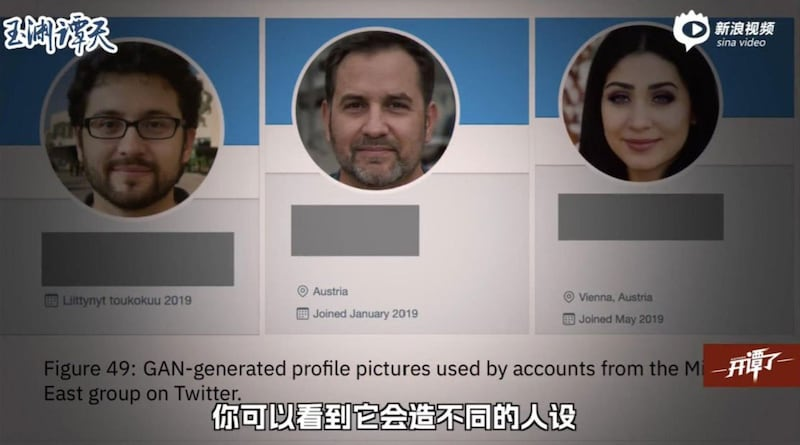
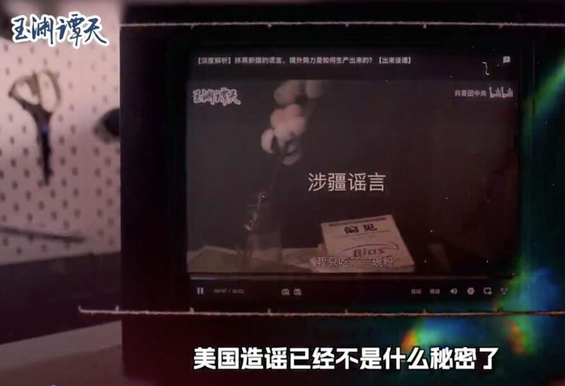
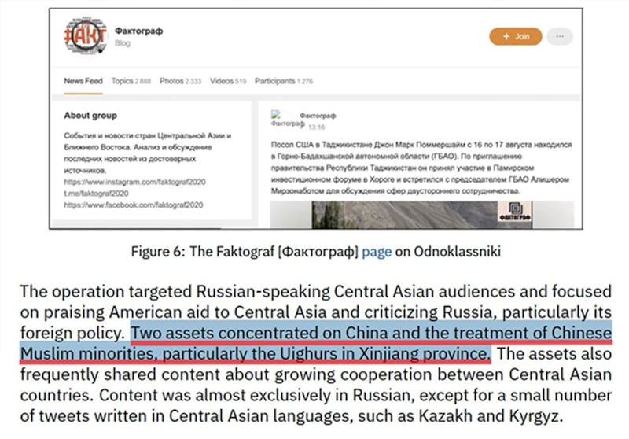
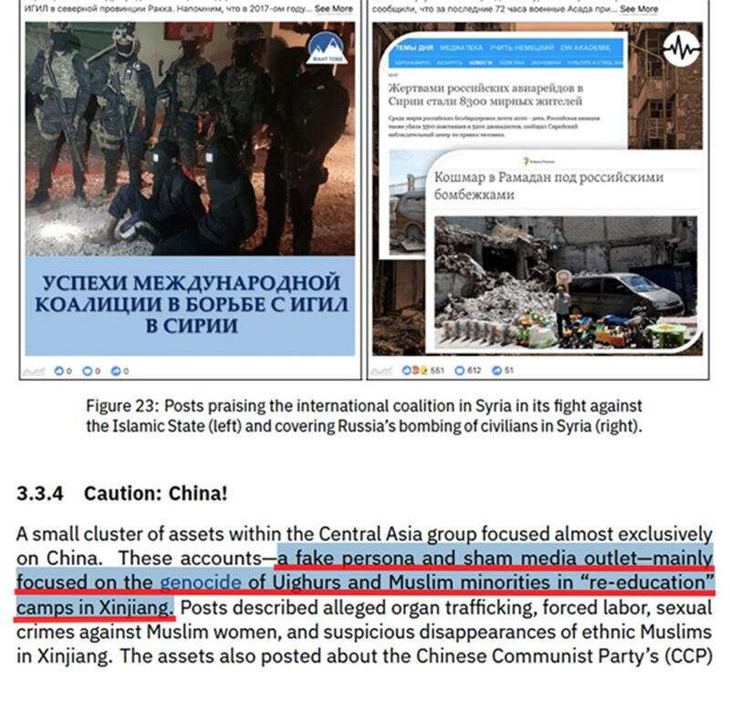
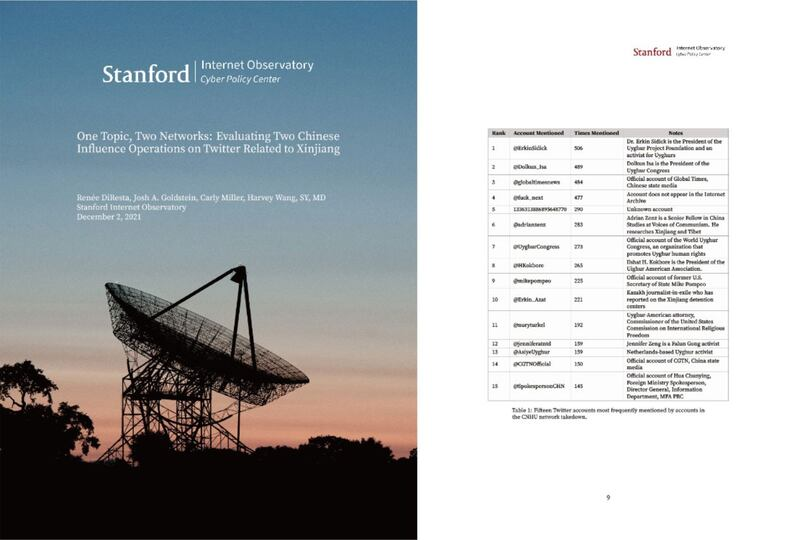

# 事實查覈 | 是誰在"利用人工智能操縱敘事"？ — 斯坦福大學報告揭示的"涉疆謠言"真相

作者：艾瑪

2022.11.22 16:08 EST

## 標籤：誤導

## 一分鐘完讀：

近日,央視旗下自媒體品牌  [**"玉淵譚天**"](https://weibo.com/u/7040797671)製作了一期風靡互聯網的節目——  [**《獨家揭祕:美國如何利用人工智能操縱敘事》**](https://finance.sina.com.cn/chanjing/cyxw/2022-09-30/doc-imqmmtha9374973.shtml) 。該節目援引"美國斯坦福大學近期發佈的一份報告",揭露美國在西方主流社交媒體上建立"大量虛假帳戶",製造謊言,操控國際輿論。

亞洲事實查覈實驗室分析後認爲，斯坦福大學的研究報告重點在於揭露兩百多個違規的AI帳戶可以針對中東和中亞地區用戶，進行親西方宣傳。但其中並不能證明央視所指的“涉疆”事務是“謠言”或“虛假敘事”。

圖說：斯坦福大學在報告中揭露美國建立大量虛假人設和帳戶。(視頻截圖/玉淵譚天)

## 深度分析：

近日，央視旗下自媒體品牌“玉淵譚天”製作了一期被中國各大官媒和門戶網站廣泛轉載的節目——《獨家揭祕：美國如何利用人工智能操縱敘事》。該節目援引“美國斯坦福大學近期發佈的一份報告”，“揭露”美國在西方主流社交媒體上建立“大量虛假帳戶”，製造謊言，操控國際輿論。

視頻作者自稱心中“一直以來有個放不下的問題”——這些“離譜的謊言”爲什麼能有人相信，隨著敘述，隨即出現新疆成千上萬人被強迫勞動的“謠言”視頻畫面。

於是,作者針對斯坦福大學互聯網觀察站(Stanford Internet Observatory)網絡政策研究中心於2022年8月發佈的  [**這份報告**](https://cyber.fsi.stanford.edu/io/publication/unheard-voice-evaluating-five-years-pro-western-covert-influence-operations-takedown) ,對三名中國教授進行了採訪,揭發了美國軍方和情報機構利用AI科技和心理學在社交媒體上製造和傳播"謠言"的行徑——"AI人臉、性格側寫、虛假網站……可以說是無所不用其極"。

作者不僅揭露了美國 “入侵人腦”的“陰謀”，寄望人們具有“獨立的判斷能力和理性的思維”，更是號召在新興領域建立“真正公正合理的規則和秩序”。

圖說：央視旗下自媒體“玉淵譚天”指控美國以虛假帳號傳播與新疆相關的謠言。(視頻截圖/玉淵譚天)

"玉淵譚天"引述的報告題名爲 **["未曾聽見的聲音:近五年親西方和平演變行動評估"](https://cyber.fsi.stanford.edu/io/publication/unheard-voice-evaluating-five-years-pro-western-covert-influence-operations-takedown)** (Unheard Voice: Evaluating five years of pro-Western covert influence operations),亞洲事實查覈實驗室在查閱、分析報告後發現,這份報告所分析的兩百餘個違規AI帳戶被懷疑主要針對中東和中亞地區用戶進行親西方宣傳,用戶主要集中在阿富汗、伊朗等國家,少量用戶分佈在哈薩克斯坦等中亞國家。帳戶語言爲阿拉伯語和突厥語等,沒有漢語或英語帳戶。

報告內容中，共三處內容提及“新疆”或者“維吾爾”：其中一處是圖片說明；一處有提到關於AI帳戶發佈新疆“種族滅絕”和“再教育營”的信息；另一處乃是一般性舉例時提到新疆。

圖說：斯坦福大學發表的報告，提及“新疆”或“維吾爾”時，並沒有指稱相關信息爲“虛假信息”。(報告本文截圖)

斯坦福的報告中並沒有論證或者質疑這些涉疆的虛假帳號所傳播的信息本身是假消息，但“玉淵譚天”在視頻節目中，則試圖建立“假帳號必定傳播假信息”的論述，明顯對讀者形成誤導。

該報告稱，這些帳戶中，Twitter帳戶有146 個； Facebook個人帳戶39個，頁面16個，組羣26個；Instagram 帳戶26個，這些帳戶使用欺騙性策略在中東和中亞宣傳親西方的言論。“不斷推進宣傳美國及其盟友的利益，同時反對包括俄羅斯、中國和伊朗在內的國家。”

尤其是在今年2月俄羅斯入侵烏克蘭後，這些帳戶發佈大量對俄羅斯的嚴厲批評，有時會轉發美國之音、自由歐洲等媒體的相關報道。這些帳戶被判定違規並被刪除是因爲它們被平臺識別出是通過AI技術生成面孔的虛假角色，或冒充獨立媒體的虛假帳戶。

值得一提的是,該報告項目組還發布了另一篇"玉淵譚天"沒有提到的報告"  [**一個話題、兩個網絡:中國在推特上就新疆問題帶節奏的兩股勢力評估**](https://cyber.fsi.stanford.edu/io/publication/one-topic-two-networks) (One Topic, Two Networks: Evaluating Two Chinese Influence Operations on Twitter Related to Xinjiang)",其中詳細揭示了中國政府如何操縱成千上萬個虛假帳戶傳播虛假敘事,否認其新疆暴行。

圖說：另一份同樣由斯坦福大學發表的報告，反而指證中國在新疆議題上以大量假帳號帶風向。(報告封面及本文截圖)

這份發表於2021年12月的報告，統計了中國政府近年來在Twitter上建立的三十多萬個帳戶，並按時間和內容進行了分類。其中，於2021年被Twitter發現並封禁的涉疆“虛假敘事”帳戶有2128個。報告強調了聯合國、國際特赦組織（Amnesty International）等組織以及紐約時報、華爾街日報、CNN、路透社等多家主流媒體關於新疆人權問題的調查結論，揭示了這些帳戶有組織地試圖用宣傳手段粉飾事實，引導國際輿論。

斯坦福大學“互聯網觀察站”是一個跨學科的研究、教學和政策參與項目，重點關注社交媒體上信息技術的濫用行爲。從2019年至今，該研究項目已經發布了34個對社交媒體平臺刪除的違規帳戶進行分析的研究報告。

## 結論：

亞洲事實查覈實驗室認爲，斯坦福大學一系列報告研究着重於技術分析，研究技術手段在社交媒體的信息傳播中發揮作用的方式和效果，解析任何可能有政治背景的宣傳、輿論干預行爲，報告本身並沒有明確的“政治站隊”傾向。

讀者如能細續這兩份報告，能夠發現其中首先揭示了無論中國或美國，都建立大量與政府關係密切的虛假帳號意圖影響輿論；但更深一層檢視，這些帳號傳播的信息，仍有真、假的不同。特別在牽涉新疆的事務上，斯坦福大學一系列研究成果不僅沒有否認在新疆發生的監視、鎮壓、強制勞動等事實，反而是印證了這些事實的存在以及中國政府是如何試圖掩蓋的。

## 相關鏈接：

[  [玉淵譚天 Opens in new window](https://weibo.com/u/7040797671) ]

## [玉淵譚天，《獨家揭祕：美國如何利用人工智能操縱敘事》](https：//finance.sina.com.cn/chanjing/cyxw/2022-09-30/doc-imqmmtha9374973.shtml)

[  [斯坦福大學報告，未曾聽見的聲音：近五年親西方和平演變行動評估 Opens in new window](https://cyber.fsi.stanford.edu/io/publication/unheard-voice-evaluating-five-years-pro-western-covert-influence-operations-takedown) ]

## [斯坦福大學報告，一個話題、兩個網絡：中國在推特上就新疆問題帶節奏的兩股勢力評估](https：//cyber.fsi.stanford.edu/io/publication/one-topic-two-networks)

*亞洲事實查覈實驗室(Asia Fact Check Lab)是針對當今複雜媒體環境以及新興傳播生態而成立的新單位,我們本於新聞專業,提供正確的查覈報告及深度報道,期待讀者對公共議題獲得多元而全面的認識。讀者若對任何媒體及社交軟件傳播的信息有疑問,歡迎以電郵*  [*afcl@rfa.org*](mailto:afcl@rfa.org)  *寄給亞洲事實查覈實驗室,由我們爲您查證覈實。*

[Original Source](https://www.rfa.org/mandarin/shishi-hecha/hc-11182022134156.html)