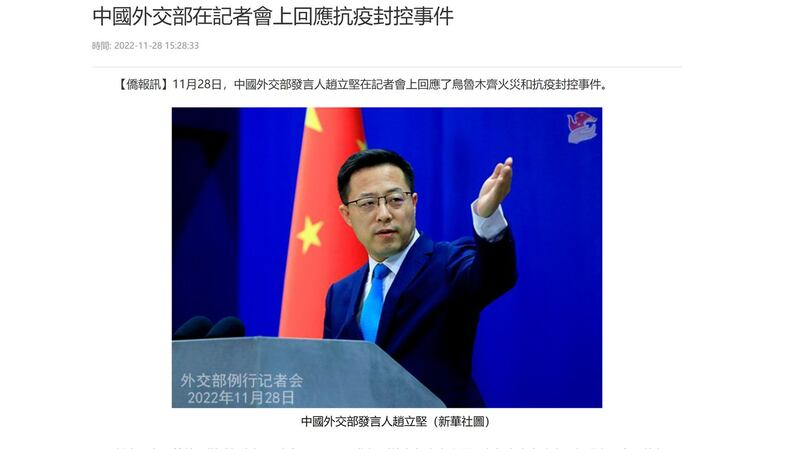
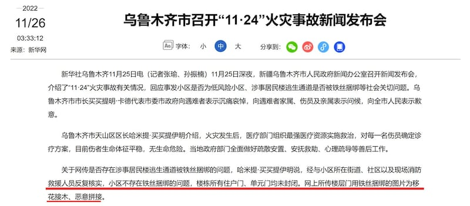
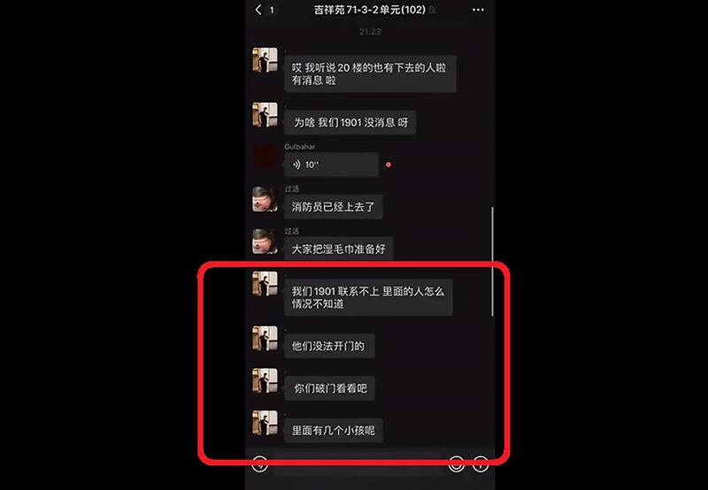
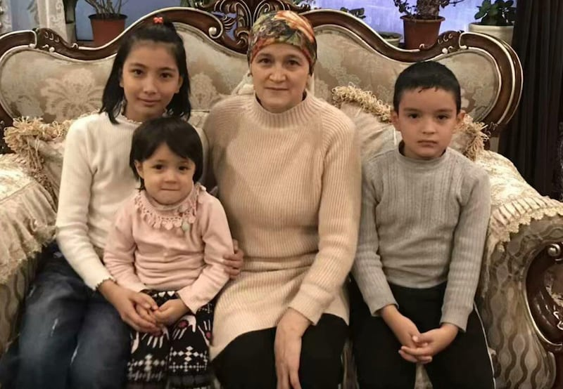

# 事實查覈 | 新疆烏魯木齊火災與"動態清零"政策有關嗎？ ——趙立堅說的"造謠抹黑"是真的嗎？

作者：艾瑪

2022.12.01 17:04 EST

## 標籤：誤導

## 一分鐘完讀：

新疆烏魯木齊“11.24”致命火災發生後，網傳大量當事人及當地居民關於防疫封控措施阻礙救援和逃生的控訴，引發民憤，烏魯木齊多個小區居民衝破管控走上街頭遊行，要求“解封”，並隨即引發了席捲中國各地及海外走上街頭哀悼、抗議的“白紙運動”。

對此，外交部發言人趙立堅回應稱：“在社交媒體上有一些別有用心的勢力將這次火災同當地的抗疫政策相聯繫，烏魯木齊市政府已經召開有關的記者會，闡明瞭事實真相，駁斥了有關的造謠和抹黑。”

當地官方亦撇清人員傷亡與疫情防控措施的關係，更有號稱“理中客”的網民爭辯：火災現場視頻中高呼開門的聲音與內蒙古事件中一模一樣，疑似合成。

亞洲事實查覈實驗室分析後發現，因爲防疫措施，事故中至少有5名死者在火災發生時被鎖在家，無法自主開門，失去自主逃生的可能性，也沒得到有效救援。中國官方試圖切割事故責任與防疫政策之間的關係，由此捍衛官方“動態清零”防疫路線的正確性。

## 深度分析：

11月24日19時49分許，烏魯木齊市天山區吉祥苑小區一高層住宅樓發生火災。天山網11月26日通報，該火災造成10人死亡、9人受傷，之後再無進一步官方消息。然而，這場慘劇現場音頻通過社交網絡傳播，震驚了正在“動態清零”中的中國。火災發生後，民衆哀悼死者、抗議極端防疫措施的行動從線上走上街頭，蔓延至中國多個城市及海外多個國家，並進一步升級到抗議中國整體防疫政策、反對共產黨和領導人習近平。

在11月28日的新聞發佈會上,中國外交部發言人趙立堅在回答媒體 [記者提問](https://www.youtube.com/watch?v=9vhEU_HAN2w)時說:"在社交媒體上有一些別有用心的勢力將這次火災同當地的抗疫政策相聯繫,烏魯木齊市政府已經召開有關的記者會,闡明瞭事實真相,駁斥了有關的造謠和抹黑。"

趙立堅在外交部記者會上稱，將火災同抗疫政策相聯繫是“造謠和抹黑”

趙立堅所說的記者會是11月26日烏魯木齊市召開的“11·24”火災事故新聞發佈會。在會上，烏魯木齊市天山區區長哈米提·買買提伊明稱，經與小區所在街道、社區以及現場消防救援人員反覆覈實，小區不存在鐵絲捆綁的問題，樓棟所有住戶門、單元門均未封閉。“網上所傳樓層門用鐵絲捆綁的圖片爲移花接木、惡意拼接。”

他並表示，自2022年11月12日起，事發小區由高風險區降爲低風險區，隨後天山區疫情防控指揮部進行綜合評估後，自11月20日起，小區居民已經實行錯峯有序出戶下樓，在小區內活動。

烏魯木齊市召開"11·24" [火災事故新聞發佈](http://www.news.cn/local/2022-11/26/c_1129161343.htm)

也是在這場記者會上，烏魯木齊消防救援支隊支隊長李文勝將火災造成嚴重傷亡的四點“教訓” 歸結爲：起火家庭電氣線路敷設不合規、常閉式防火門未保持關閉、小區道路狹窄私家車停放混亂、部分居民自防自救能力弱。

當日晚到11月27日凌晨，上海市烏魯木齊中路彙集了大量羣衆，他們一開始是自發悼念新疆烏魯木齊火災遇難者，隨後演變成一場抗議官方防疫封控措施乃至公開質疑中國共產黨及其總書記習近平的集會。

很快，中國多地相繼爆發類似羣衆抗議活動。同時，除了從中央到地方的各級官方機構和媒體在極力撇清防疫與火災的關係，澄清網傳事發小區逃生通道被人爲堵塞的各類“謠言”；同時，也有民間自媒體幫忙，多角度澄清網上的“不實信息”。

## “開門”呼喊爲合成造假？

自媒體大V雷斯林（小號：雷哥說事）發表了一篇迅速傳遍網絡的“闢謠”文章《新疆火災中的以訛傳訛》，論證防疫與火災無關：1，小區樓門並未上鎖；2，事發時小區爲低風險小區居民可以下樓；3，道路狹窄擁堵導致消防車進入困難是長期存在的問題。除此之外，他更是指出：“至於視頻裏撕心裂肺大喊‘開門‘的聲音，和之前呼和浩特的事件裏高喊開門聲音是一模一樣的。” “把這兩件事剪在一起，不知道是爲了什麼。”（他在另一個號發佈此文章時這句話改爲“不排除剪輯的可能。”）雷斯林文中告誡人們“過度防疫是種病。但把什麼都怪到防疫頭上，同樣欠缺思考。”

雷斯林所指的“呼和浩特事件”是指11月初內蒙古呼和浩特的另一件因防疫管製造成的悲劇，一名婦女墜樓之後，其女兒想衝出查看搶救，卻被焊絲的鐵門擋住因此發出“開門”的哀號。

針對雷斯林所指的音頻剪輯的問題，亞洲事實查覈實驗室蒐集了多個從不同角度拍攝的火災現場視頻，視頻中都有大喊“開門”的聲音，有的比較清晰，有的距離較遠或者被視頻錄製者說話的聲音掩蓋不太清晰，但都可以辨別爲同一人聲。而內蒙古呼和浩特事件中，受害人請求開門的叫喊聲雖然同樣淒厲，但從口音到呼喊的內容都明顯並不一樣。

## 慘劇發生僅因“自救能力弱”？中國官媒亦提及住戶無法開門

另外，關於官方所說的“樓棟所有住戶門、單元門均未封閉。”亦不屬實。

新疆火災事發後，有不少網民發出了指控官方“鐵絲封門”的圖片和視頻，因爲中國的信息管控，亞洲事實查覈實驗室無法確認其真實性，但至少有一個經由新疆自治區黨媒證實爲真的微信羣聊記錄的視頻可以佐證，至少在事發2單元的19樓，有多人被鎖在自己家裏，無法自主開門逃生。

經新疆當地官媒證實的火災事發時，受災小區羣聊視頻截圖

據多家媒體報道,被鎖在1901室裏的是48歲的Qemernisa Abdurahman和她的四個最小的孩子,他們均在火災中喪生。自由亞洲電臺(RFA)記者採訪了Qemernisa Abdurahman [在土耳其的兩個已成年的子女](https://www.rfa.org/english/news/uyghur/blaze-11292022180748.html), [美國全國公共廣播電臺](https://www.keranews.org/2022-11-28/chinese-protesters-demand-an-end-to-covid-restrictions-and-communist-rule)(NPR)記者和 [法新社](https://www.france24.com/en/live-news/20221128-uyghur-man-s-agony-after-five-relatives-died-in-urumqi-fire)(AFP)記者分別採訪了Qemernisa Abdurahman在瑞士的侄子,他們均表示確定這位母親和她的四個子女已經全部死亡。27歲的Maimaitimin稱,國內的親友冒着巨大風險通告了他們親人的死訊,並將屍體的照片發給他們看,爲了防止被政府追蹤和懲罰,他們隨後刪除了聊天記錄。

而聊天記錄中，表示1901住戶沒法開門，請求救援人員破門的人則是死者Qemernisa Abdurahman的大兒子。據RFA、NPR及AFP報道，2017年，就是這家兄弟姐妹中的老二和老三到土耳其的那年，他們的父親，也是Qemernisa Abdurahman的丈夫就被逮捕了。隨後，已經成年的大兒子也被送到了專門爲維吾爾人建的集中營，或者說是中國官方所說的“職業技能教育培訓中心”，從此與親人分離。

死者：Shehide, 13歲,；Nehdiye, 5歲； Qemernisa Abdurahman, 48歲, Abdurahman, 9歲。還有11歲的Imran不在這張照片上。

而聊天記錄視頻中求救，並最終獲救的1601室居民，在逃生後接受了新疆自治區黨委機關辦《新疆日報》（天山網）的採訪，這家人中的木尼熱·艾合買提作證說，小區居民可以下樓活動，“單元大門始終保持開啓狀態，未曾被鐵絲綁死或焊死。”

天山網刊出木尼熱的採訪，意在證明：居民確實可以自由下樓，沒有封控鎖門的情況。同時，對於網上傳播的各種質疑防疫措施的視頻和圖片，官方一概斥爲“移花接木”或“造假”。但天山網報導木尼熱的經歷時，卻證實了前文引述的微信羣聊記錄是真的，這也是官方唯一認可爲真實的羣聊紀錄，而正也就是這個羣聊紀錄，證明有人被鎖在家裏，需要破門。

自由亞洲電臺記者也通過隨機撥打當地電話的方式採訪周邊居民，亦有居民表示當晚確實聽到有人大聲求救，高喊開門。經與多名新疆維吾爾族人覈實，他們不被允許公開悼念遇難者。

迄今爲止，即便是大量民衆在網上或者在抗議現場都要求公佈遇難者名單並允許公開悼念，但始終未能實現。相反，官方不僅迅速逮捕了“發佈不實死亡人數信息的造謠者”，也開始鎮壓各地的抗議者。而中國外交部及官方媒體則是統一口徑，堅決否認火災事故造成的死傷與疫情防控存在任何關聯。

查覈結論：

新疆烏魯木齊火災慘劇發生之後，無論是外交部發言人所代表的中央政府、新疆烏魯木齊官員和《新疆日報》所代表的地方政府，還是部分“熱心闢謠”的網民和媒體都在試圖切割防疫政策與火災事故之間的關係，並誤導民衆相信事故責任在地方乃至受害人自己身上 ，從而平息民憤。經查覈，清零封控的防疫措施並不必然與疫情的“高風險”或者“低風險”相關，不同地域、不同民族甚至不同樓層的人受到的管控可能都不一樣。至少有5名死者因防疫管控措施或者說”以防疫爲名義的管控措施”受困家中身亡。趙立堅等人所說的“事實真相”並不是真相。

相關鏈接

2022年11月28日中國外交部新聞發佈會現場視頻：

<https://www.youtube.com/watch?v=9vhEU_HAN2w>】

天山網“四問”報道鏈接：

[ [烏魯木齊市“11·24”火災四問 -天山網 - 新疆新聞門戶 (ts.cn)Opens in new window](https://www.ts.cn/xwzx/shxw/202211/t20221126_10270531.shtml) ]

RFA報道,19樓死者的身份被覈實: <https://www.rfa.org/english/news/uyghur/blaze-11292022180748.html>

【呼和浩特事件自由亞洲電臺報道：

<https://www.rfa.org/mandarin/Xinwen/cmh2-11072022051836.html> 】

法新社報道，證實網傳起火單元樓居民聊天記錄視頻中，爲1901住戶求救稱他們無法自己開門的人是死者Qemernisa Abdurahman的大兒子：

[ [Uyghur man's agony after five relatives died in Urumqi fire (france24.com)Opens in new window](https://www.france24.com/en/live-news/20221128-uyghur-man-s-agony-after-five-relatives-died-in-urumqi-fire) ]

美國全國公共廣播電臺（NPR）採訪19樓死者Qemernisa Abdurahman的侄子ABDULHAFIZ MAIMAITIMIN：

[ [https://www.keranews.org/2022-11-28/chinese-protesters-demand-an-end-to-covid-restrictions-and-communist-ruleOpens in new window](https://www.keranews.org/2022-11-28/chinese-protesters-demand-an-end-to-covid-restrictions-and-communist-rule) ]

背景資料：新疆集中營，或者中國官方所說的“職業技能教育培訓中心”維基頁面：

[ [新疆再教育營 - 維基百科，自由的百科全書 (wikipedia.org)Opens in new window](https://zh.wikipedia.org/wiki/%E6%96%B0%E7%96%86%E5%86%8D%E6%95%99%E8%82%B2%E7%87%9F) ]

*亞洲事實查覈實驗室(Asia Fact Check Lab)是針對當今複雜媒體環境以及新興傳播生態而成立的新單位,我們本於新聞專業,提供正確的查覈報告及深度報道,期待讀者對公共議題獲得多元而全面的認識。讀者若對任何媒體及社交軟件傳播的信息有疑問,歡迎以電郵*  [*afcl@rfa.org*](mailto:afcl@rfa.org)  *寄給亞洲事實查覈實驗室,由我們爲您查證覈實。*

[Original Source](https://www.rfa.org/mandarin/shishi-hecha/hc-12012022164714.html)