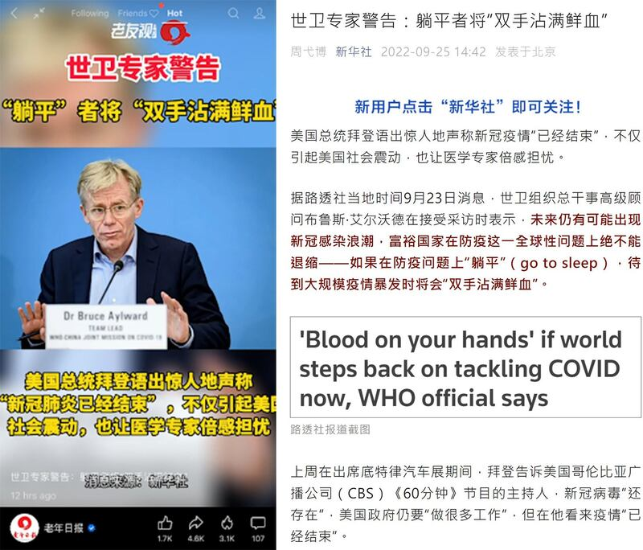
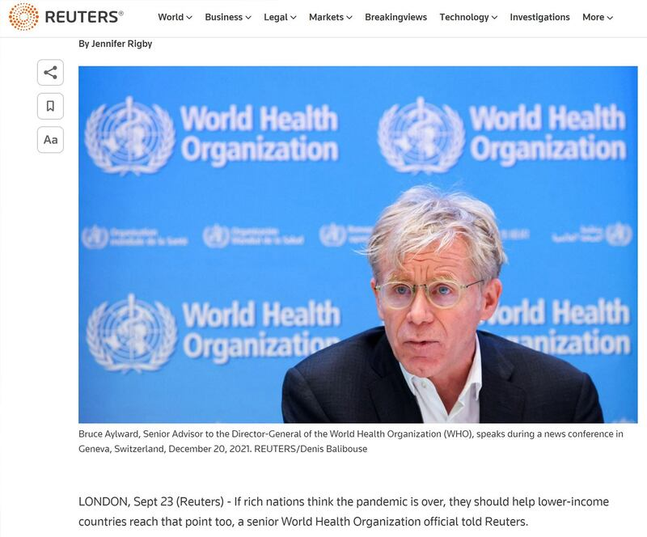

# 事實查覈 | 世衛專家真的說了"躺平者將雙手沾滿鮮血"嗎？

作者：艾瑪

2022.12.06 13:26 EST

## 結論標籤：誤導

## 一分鐘完讀：

經過各大城市爆發抗議極端防疫政策的"白紙運動"後，中國各地在新冠疫情的防控上開始傳出不同程度的"解封"信息。然而，但社交網絡上仍然有大量討論繼續擁護嚴格的"清零"政策。而這些民衆的觀念，絕大部分來自於中國官媒過去長時間的宣傳甚而是誤導。

一個典型的例子是2022今年9月，拜登對媒體表示全球大流行的新冠病毒疫情在美國“已經結束”時，中國官方媒體的回應。新華社官方微信號於9月25日推送了一篇文章，引用世衛組織總幹事高級顧問布魯斯∙艾爾沃德(Bruce Aylward)接受路透訪問時的表態強調，即未來仍有可能出現新冠感染浪潮，富裕國家在防疫這一全球性問題上絕不能退縮——如果在防疫問題上“躺平”（go to sleep），待到大規模疫情爆發時將會“雙手沾滿鮮血”。

亞洲事實查覈實驗室比對原文後發現，艾爾沃德的原意是，發達國家如果不盡快履行責任幫助欠發達國家完成抗疫能力建設，未來還可能會發生疫情，大家需要做好準備，相互幫助。

但新華社在當時的報道中刪減了關鍵信息，混用了不同概念，製造出了世衛專家也認爲疫情管控不能放鬆的印象，很可能意圖由側面印證、營造“動態清零”的正確性。

## 深度分析：

一、中國官媒怎麼傳播、解讀這條新聞？

新華社官微這篇文章題爲 [《世衛專家警告:躺平者將"雙手沾滿鮮血"》](https://mp.weixin.qq.com/s/6Jmn1shN5cAJI-xXUIk1zA),註明來源爲"觀察者網",獲得大量點擊,包括人民網、中國新聞網、環球網、網易等主流網站、大量地方媒體和自媒體也都轉發,並稱消息來源爲"新華社"。

這篇文章形容美國總統拜登“語出驚人”稱新冠疫情“已經結束”，不僅引起美國社會震動，也讓醫學專家倍感擔憂。接着引用路透社報道稱，世衛組織總幹事高級顧問布魯斯∙艾爾沃德表示未來仍有可能出現新冠感染浪潮，富裕國家在防疫這一全球性問題上絕不能退縮——如果在防疫問題上“躺平”（go to sleep），待到大規模疫情暴發時將“雙手沾滿鮮血”。

新華社文中較爲激烈的言詞，不僅得到中國主流媒體廣泛轉發，大量網友批評美國政府“不顧人民死活”，或“美國政客手上已經沾滿鮮血”等，也有人表達了生而爲中國人的幸運。同時，亦有人質疑世衛專家是不是真的這樣說，以及他的原意是不是和報道的字面意思一致。

新華社官微文章稱躺平者將“雙手沾滿鮮血”，被多家媒體轉發。

二、路透社的 [原報道](https://www.reuters.com/business/healthcare-pharmaceuticals/blood-your-hands-if-world-steps-back-tackling-covid-now-who-official-2022-09-23/)是什麼?

路透社記者Jennifer Rigby於9月23日發自倫敦的報道第一句話就是：“如果發達國家認爲大流行已經結束了，那他們應該幫助低收入國家也做到這一步。世界衛生組織的一位高級專家告訴路透記者。”

亞洲事實查覈實驗室查對路透社原文後，發現新華社文在翻譯時，針對幾個關鍵點出現了“模糊”、“曲解”甚至“生造”等處理。

路透社原始報道截圖

第一，新華社文中開場白的這一段話：“拜登語出驚人地聲稱疫情結束引起了美國社會震動。”並不存在於路透報道原文。路透的報道並沒有涉及拜登的言論在美國的影響。

第二，艾爾沃德的意思是，新冠病毒還將存在，而並非強調大流行疫情目前依然是嚴重的威脅。但是在這篇文章的翻譯中，無論是“COVID”，還是“pandemic”(大流行)，統統都翻譯成“疫情”，新冠病毒將與人類長期共存，不等於大流行一直在持續，也不等於極端抗疫措施需要持續。

第三，原文解釋說艾爾沃德負責協調 ACT-Accelerator，這是世衛組織與其他全球衛生機構之間的一項合作，旨在幫助較貧窮國家獲得應對新冠疫情的工具和能力。這項包括疫苗推廣在內的合作已經惠及全球數十億人，但因行動不夠迅速而受到批評。

艾爾沃德受訪的重點主要也圍繞美國等發達國家應該履行幫助較貧窮國家的責任展開，強調抗疫是一項“全球性”的工作，不能是美國本土的抗疫結束了就算結束了。他認爲美國已經具有了應對這種疾病的能力（因此完全可以恢復正常秩序），但是如果該疾病再度流行，其他尚未建起應對機制和工具的一些貧窮國家，可能就會受害。

基於上述理由，艾爾沃德認爲如果發達國家這個時候“去睡了”（go to sleep），就是對其他國家不負責任，也就意味着在將來“可能手上會沾滿鮮血”。他同時強調，雖然拜登認爲美國已經有足夠多的方法應對新冠病毒，美國目前並沒有縮減對其他國家的援助。新華社的報導並沒有解釋清楚艾爾沃德此番話的背景。

第四，新華社文中的報道中說，艾爾沃德的組織還未打算解除“應對新冠疫情的緊急狀態”。這是原文中完全不存在的內容。路透原文只提及：有人認爲艾爾沃德負責協調的這項全球合作，可能於今年秋天停止，但是艾爾沃德否認，強調這個項目只是隨着疫情的變化調整了重點而已。至於“疫情的變化”是什麼，並沒有更多說明。

根據艾爾沃德的完整表述，他認爲，即使有些國家認爲這一輪大流行已經結束，新冠病毒和病毒引起的疾病將會長期存在，由於病毒不會消失，未來某個時候可能又會引發一輪大流行，而我們需要做的事情就是建立起能應對這種疾病流行的機制和能力。先具備了能力的發達國家不能光顧着自己，還要幫助貧窮國家儘快完成這項工作。

## 結論：

亞洲事實查覈實驗室查對報道原文後確認：艾爾沃德說的“go to sleep（去睡了）”並不是中國官方批駁的“躺平”，而是強調發達國家如果不盡快履行責任幫助欠發達國家完成抗疫能力建設，未來還可能會發生疫情，大家需要做好準備，相互幫助。

新華社文在報道中刪減了關鍵信息，混用了不同概念，製造出了世衛專家也認爲疫情管控不能放鬆的印象。如今中國開始放鬆防疫政策，卻有但部分民衆牴觸情緒強烈，足見新華社的誤導信息如何深入人心。

## 相關鏈接：

1.新華社報道原文：

https://mp.weixin.qq.com/s/6Jmn1shN5cAJI-xXUIk1zA

2.路透社原報道

https://www.reuters.com/business/healthcare-pharmaceuticals/blood-your-hands-if-world-steps-back-tackling-covid-now-who-official-2022-09-23/

*亞洲事實查覈實驗室(Asia Fact Check Lab)是針對當今複雜媒體環境以及新興傳播生態而成立的新單位,我們本於新聞專業,提供正確的查覈報告及深度報道,期待讀者對公共議題獲得多元而全面的認識。讀者若對任何媒體及社交軟件傳播的信息有疑問,歡迎以電郵*  [*afcl@rfa.org*](mailto:afcl@rfa.org)  *寄給亞洲事實查覈實驗室,由我們爲您查證覈實。*

[Original Source](https://www.rfa.org/mandarin/shishi-hecha/hc-12062022121440.html)