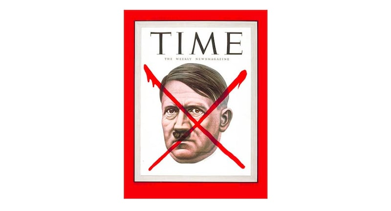

# 事實查覈 | 希特勒曾因爲"反共"獲得《時代》年度人物的"殊榮"？

2022.12.09 16:43 EST

## 結論標籤：虛假

## 一分鐘完讀：

時值年末,各大媒體都在盤點年度新聞和年度新聞人物。烏克蘭總統澤連斯基因其在俄烏戰爭中的表現受到各媒體關注,先後被英國 [《金融時報》](https://www.ft.com/content/9599247f-c3cb-4d3c-a0b6-771f0aac8699)和美國 [《時代》週刊](https://en.wikipedia.org/wiki/Time_Person_of_the_Year#:~:text=However%2C%20Time%20magazine%20points%20out,for%20their%20impact%20on%20events)評選爲年度人物。12月5日,微博大V"軍武季"發佈配圖帖文稱,類似的評選都是"政治利益",並舉例稱,即使是像希特勒這樣的歷史罪人,都能夠因爲其反對共產主義立場,獲得美國《時代》週刊將1938"年度人物"的"殊榮"。

亞洲事實查覈實驗室查證後發現，這是虛假信息。

[美國《時代》週刊1938年度人物](https://content.time.com/time/magazine/article/0,9171,760539,00.htm)確實是希特勒,但他入選的原因是給世界帶來的巨大的負面影響,而不是因爲他反共。事實上, 媒體評選年度人物並非"榮譽", 而是當年最具"影響力"的人,包括正面影響力和負面影響力,所以爭議巨大的人物有時也會上榜。

## 深度分析：

在年末媒體盤點中，澤連斯基的面孔再次被各大國際媒體聚焦，他作爲烏克蘭總統，在俄烏戰爭中的表現受到各媒體關注，被英國《金融時報》和美國《時代週刊》評選爲年度人物。《金融時報》稱，澤連斯基展現了烏克蘭人民的韌性，美國《時代》週刊則稱將澤連斯基和“烏克蘭精神”並列選爲“年度人物”。

烏克蘭總統澤連斯基被分別評選爲英國《金融時報》、美國《時代週刊》的年度人物

12月5日,擁有481.8萬粉絲的微博大V"軍武季" [發文評論](https://weibo.com/2178514797/MidVrib6N)此事時,配上了一張圖片,內容爲希特勒出現在《時代週刊》封面。 其貼文稱:"澤連斯基被英國《金融時報》評選爲2022年'年度人物',並稱其是自由民主的旗手。西方報刊的年度人物都是基於政治利益考量,1938年,希特勒統治世界的野心已經暴露無疑,而且開始進行種族滅絕將1.2萬猶太人從德國驅逐出去,僅僅因爲他堅決的反共產主義立場,可以禍水東引,美國《時代週刊》就授予其'年度人物'殊榮。"

貼文之後，還有三張圖片，分別是澤連斯基、有希特勒肖像的《時代》雜誌封面，和一張有希特勒反共立場的內容的文字截圖。

新浪微博賬號“軍武季”稱，希特勒曾因“堅決地反共產主義立場”，獲得《時代》週刊年度人物。

亞洲事實查覈實驗室查證，發現該雜誌1938年度人物確實是當時的德國元首阿道夫·希特勒(Adolf Hitler)， 但這並不是一項“殊榮”。

希特勒爲什麼被選爲1938年的年度人物？《時代》雜誌這樣解釋：“1938年，希特勒成爲熱愛自由的民主世界所面臨的最大威脅(Hitler became in 1938 the greatest threatening force that the democratic, freedom-loving world faces today)。”

在內文裏,《時代》詳細列舉了希特勒在1938年做出的幾樁震驚世界的事件,尤其是納粹德國在3月份吞併奧地利,以及在9月份吞併捷克斯洛伐克的蘇臺德地區。這些做法直接將確立"一戰"之後世界秩序的《凡爾賽條約》(*Treaty of Versailles*)變成了歷史文件,將世界重新拉入戰爭狀態。而將德國吞併蘇臺德合法化的《慕尼黑協議》(*Munich Agreement*)反映了英國、法國等歐美強國對希特勒的綏靖政策,客觀上鼓勵了希特勒繼續毀約、繼續擴張的瘋狂舉動,導致了第二次世界大戰的全面爆發。

《時代》週刊的“年度人物”稱號並不是一個“殊榮”，它的衡量標準是“影響力”，包括正面影響力和負面影響力。用《時代》創始人亨利·盧斯(Henry Luce)的說法，年度人物評選不是製造光榮榜，而是選擇最具新聞價值的人，對世界影響力最大的人，無論此人讓世界變得更好還是更壞。

除了希特勒以外，還有多名人物因其爭議巨大獲選《時代》年度人物，包括蘇聯獨裁者斯大林（1939和1942）和赫魯曉夫（1957），伊朗宗教領袖霍梅尼（1979）和美國前總統川普（2016）。

至於希勒特是因爲“反共”立場而當選年度人物，更是無中生有。《時代》當年的文章裏並沒有提到共產主義、反共或蘇聯之類的內容，更沒有希特勒可以將“禍水東引”的暗示。

另外，希特勒在1938年並未登上《時代》封面。希特勒當選1938年年度人物的那期《時代》封面並不是希特勒肖像，而是一張奧地利畫家Rudolph von Ripper的黑白圖畫，標題是《不敬神的風琴師，演奏一首仇恨的歌》。

## 1938年希特勒當選《時代》年度人物時，並未出現在封面上。

而“軍武季”微博配圖是1941年4月14日的《時代》週刊封面。二戰期間，希特勒曾多次登上時代封面，其中包括1945年5月那期，那年4月底希特勒兵敗自殺，盟軍勝利在望。

## 1945年，希特勒兵敗,《時代》週刊封面在其頭像上打上紅叉。

## 結論：

亞洲事實查覈實驗室查閱了《時代》週刊歷史文檔之後確認，“軍武季”宣稱“《時代》因希特勒反共而授予其1938年度人物殊榮”，是錯誤的說法。

希特勒確實被《時代》週刊選爲1938年度人物，但不是因爲他反共，而是因爲其對世界局勢的巨大負面影響。《時代》年度人物的評選標準是影響力，正面和負面人物都可能上榜。

微博大V“軍武季”刻意編造希特勒因反共而得到西方媒體的褒獎的消息，意在證明西方媒體會爲政治目的而吹捧戰爭罪人，並將澤連斯基受到的肯定和讚揚歸於西方媒體基於政治利益的偏見。

## 相關鏈接：

1. [**軍武季微博帖子**](https://weibo.com/2178514797/MidVrib6N)
## 1. [Financial Times: FT Person of the Year: Volodymyr Zelenskyy. 'I am more responsible than brave'](https://www.ft.com/content/9599247f-c3cb-4d3c-a0b6-771f0aac8699)
## 2. [TIME Magazine: Adolf Hitler: Man of the Year, 1938](https://content.time.com/time/magazine/article/0,9171,760539,00.html)
4. [**Wikiepedia: Time Person of the Year**](https://en.wikipedia.org/wiki/Time_Person_of_the_Year#:~:text=However%2C%20Time%20magazine%20points%20out,for%20their%20impact%20on%20events)

*亞洲事實查覈實驗室(Asia Fact Check Lab)是針對當今複雜媒體環境以及新興傳播生態而成立的新單位,我們本於新聞專業,提供正確的查覈報告及深度報道,期待讀者對公共議題獲得多元而全面的認識。讀者若對任何媒體及社交軟件傳播的信息有疑問,歡迎以電郵*  [*afcl@rfa.org*](mailto:afcl@rfa.org)  *寄給亞洲事實查覈實驗室,由我們爲您查證覈實。*

[Original Source](https://www.rfa.org/mandarin/shishi-hecha/hc-12092022161122.html)