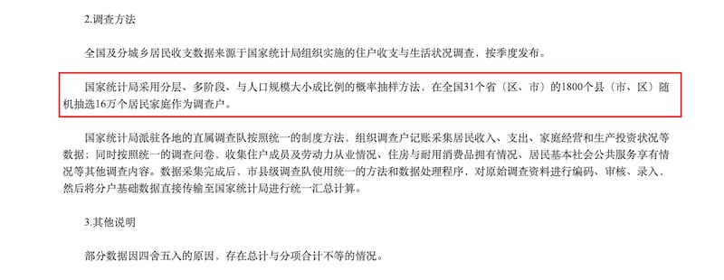

# 事實查覈 | "全國七萬碩士在送外賣"究竟是現實還是謠言？

作者：艾瑪

2022.12.13 13:48 EST

## 標籤：真實

## 一分鐘讀完：

2021年，在就業市場疲軟的壓力之下，關於中國“有七萬碩士在送外賣”的說法在互聯網上廣爲傳播，多個短視頻平臺上都有博主就此發表感嘆和評論。

但這一說法最近中國的官媒定義爲"謠言"——由中央網信辦舉報中心等單位評選出的"2021年度中國互聯網闢謠優秀作品"中,有一篇 [《全國七萬碩士在送外賣?別被販賣焦慮的自媒體忽悠了》](https://www.piyao.org.cn/2022-01/18/c_1211526714.htm)點擊量超過了十萬。

但亞洲事實查覈實驗室分析認爲，近年來中國高校以上的高學歷畢業生失業率上升引發社會焦慮是客觀存在的現實，網傳視頻引用數據和推論有理有據，並沒有刻意誇大的痕跡，具備統計學意義上的可信度，因此是真實的。

反倒是“闢謠”者試圖粉飾太平，掩蓋問題。

## 完整版：

近年來，畢業生“就業難”的話題常見於中文互聯網。2021年，在“餓了麼”和“美團”等外賣平臺公司相繼發佈行業調查報告後，中國“有七萬碩士在送外賣”的說法在民間廣爲傳播，多個短視頻平臺都有用戶製作了視頻作品，圍繞這個話題發表感言和評論。

但這一說法很快被中國的官媒定義爲了“謠言”，甚至成了“典型”。最近，由中央網信辦舉報中心等單位評選出的“2021年度中國互聯網闢謠優秀作品”中，有一篇《全國七萬碩士在送外賣？別被販賣焦慮的自媒體忽悠了》被多家中央媒體和大V轉發，點擊量超過十萬。

這段“優秀闢謠作品”通過查詢“餓了麼”和“美團”等外賣公司的研究報告，指稱多家短視頻平臺上關於“中國有700萬外賣小哥，碩士及以上學歷佔1%”“全國七萬碩士在送外賣”等說法缺乏權威數據支持，因此純屬“販賣焦慮”。

這部“闢謠作品”指出，“餓了麼”和“美團”的行業報告中，雖然都提到存在1%的騎手有研究生以上學歷，“餓了麼”報告是關注兼職騎手，大學生暑期兼職很正常；而美團的報告中也包括兼職騎手，且“僅調查了11.8萬人”，不能推及所有騎手。

該“優秀闢謠作品”更指稱，由1%的比例推算出有七萬研究生在送外賣的“700萬外賣人員總數”也是“自媒體從各種渠道東拼西湊而成，官方從未發佈過相關數據。”因此這個結論的前提就不成立。

亞洲事實查覈實驗室分析認爲,近年來中國高校畢業生尤其是高學歷畢業生失業率上升引發社會焦慮是客觀存在的現實。別說是碩士,就連博士畢業生在2020年都有高達8.66%的失業率,2022年7月, [中國國家統計局](http://www.stats.gov.cn/tjsj/zxfb/202208/t20220815_1887338.html#:~:text=7%E6%9C%88%E4%BB%BD%EF%BC%8C%E5%85%A8%E5%9B%BD%E8%A7%84%E6%A8%A1%E4%BB%A5%E4%B8%8A,%E5%BF%AB4.6%E3%80%812.1%E4%B8%AA%E7%99%BE%E5%88%86%E7%82%B9%E3%80%82)更是發佈了高達19.9%的城鎮青年失業率。

網傳視頻稱，根據行業報告推算，中國外賣騎手有七萬人擁有碩士學歷。

而網傳視頻引用的行業數據和推論也有理有據，具備統計學意義上的可信度。

首先，“七萬”數字是根據兩個行業報告中的1%比例推算得出，根據統計學的“大數定律”，當隨機抽樣的樣本達到足夠“大量”時（比如美團調查的11.8萬騎手大樣本），其呈現的分佈結果（如外賣員的學歷構成），就會無限趨近於整體的分佈結果，可以代表整個羣體的學歷構成情況。

例如2022年7月，中國國家統計局調查城鄉居民收入、支出等信息，也是從全國隨機抽取了16萬戶的樣本（如下圖），就足以代表全國居民的情況。

國家統計局同樣採樣統計的方法，用16萬戶樣本呈現全國的情況。

另經查覈，“700萬外賣人員總數”也來源於央視財經頻道報道引用的國家郵政局等機構的統計數據，並非“自媒體從各種渠道東拼西湊而成。”

儘管央視並不一定比自媒體的報道更真實，但在該項數據上並沒有發現明顯的造假痕跡。而700萬僅僅是2019年的數據，疫情期間，所有權威渠道的可靠統計都顯示，外賣騎手人數進一步增加。

## 結論：

“全國七萬碩士在送外賣”所採樣數超過十萬，這個數字不僅從統計學意義上是可參考的推算結論，甚至可以說是保守數字，視頻製作者關心和討論社會現實問題，並沒有刻意誇大的痕跡。反倒是“闢謠”者試圖粉飾太平，掩蓋問題。

## 相關鏈接：

全國七萬碩士在送外賣？別被販賣焦慮的自媒體忽悠了

https://www.piyao.org.cn/2022-01/18/c\_1211526714.htm

《全國七萬碩士在送外賣？別被販賣焦慮的自媒體忽悠了》獲獎單位代表感言

https://www.piyao.org.cn/2022-01/20/c\_1211535453.htm

中國年輕人失業率20% 李強:真實數字可能更高

https://www.voachinese.com/a/china-s-young-graduates-faces-highest-unemployment-rate-in-history-when-economy-continues-to-tumble-20220818/6707293.html

我國博士畢業生去向及就業特徵分析——基於2015—2020年博士畢業生數據的分析

https://www.163.com/dy/article/GUOOR0TS0516ARVT.html

年輕人都去送外賣了，我國製造業怎麼辦？

[ [https://news.cctv.com/2021/04/19/ARTI3Rtw9dZNiXGo9H1Dh4yk210419.shtmlOpens in new window](https://news.cctv.com/2021/04/19/ARTI3Rtw9dZNiXGo9H1Dh4yk210419.shtml) ]

我國博士畢業生去向及就業特徵分析——基於2015—2020年博士畢業生數據的分析

https://www.cnki.com.cn/Article/CJFDTotal-XWYY202201012.htm

中國國家統計局：2022年7月份國民經濟數據

http://www.stats.gov.cn/tjsj/zxfb/202208/t20220815\_1887338.html#:~:text=7%E6%9C%88%E4%BB%BD%EF%BC%8C%E5%85%A8%E5%9B%BD%E8%A7%84%E6%A8%A1%E4%BB%A5%E4%B8%8A,%E5%BF%AB4.6%E3%80%812.1%E4%B8%AA%E7%99%BE%E5%88%86%E7%82%B9%E3%80%82

*亞洲事實查覈實驗室(Asia Fact Check Lab)是針對當今複雜媒體環境以及新興傳播生態而成立的新單位,我們本於新聞專業,提供正確的查覈報告及深度報道,期待讀者對公共議題獲得多元而全面的認識。讀者若對任何媒體及社交軟件傳播的信息有疑問,歡迎以電郵*  [*afcl@rfa.org*](mailto:afcl@rfa.org)  *寄給亞洲事實查覈實驗室,由我們爲您查證覈實。*

[Original Source](https://www.rfa.org/mandarin/shishi-hecha/hc-12132022132903.html)