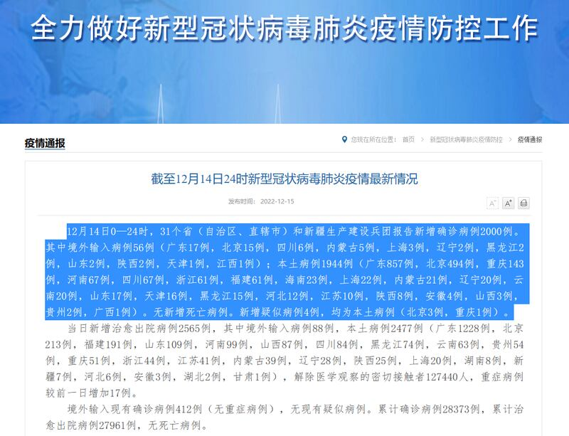
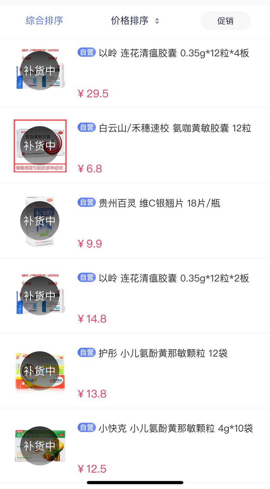
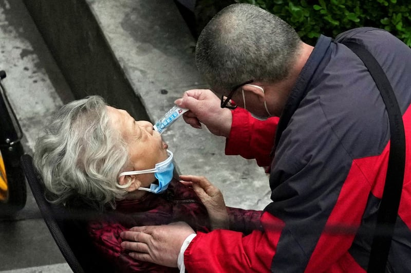
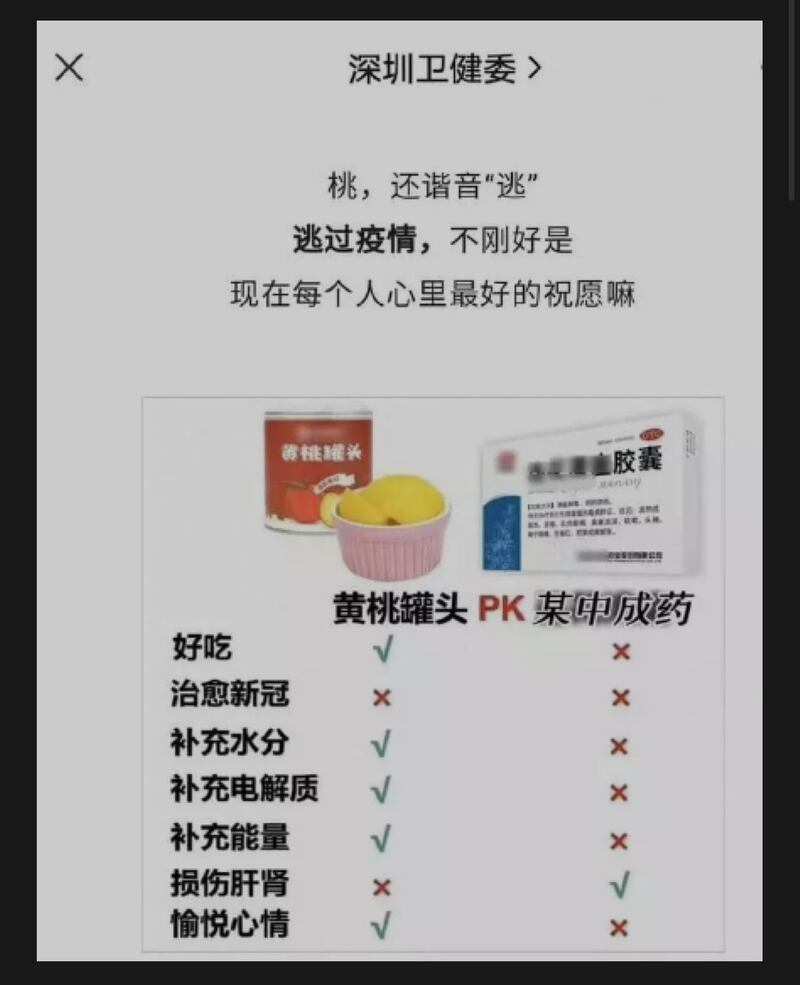

# 事實查覈 | 新冠"神藥"滿天飛 到底哪種能治病

作者：艾瑪

2022.12.16 09:44 EST

## 標籤：誤導 misleading

## 一分鐘完讀：

近日，隨着中國防疫政策的“急轉彎”，在社會服務和醫療系統尚未做好應對準備的情形下，新冠疫情集中爆發。在大量民衆買不到藥，無法獲得專業醫療救濟的情形下，中文互聯網上大量“神奇藥方”迅速成爲討論、爭議和營銷的熱點。從無害、但無療效的黃桃罐頭、電解質水、白酒、大蒜到各類作用、風險不明的中草藥和中成藥，林林總總。

亞洲事實查覈實驗室整理了一些流傳甚廣的“藥方”，並邀請專業人士解讀“神藥”滿天飛的現象：處方藥沒有普適性，不宜自我診斷，必須在專業醫生的指導下服用；非處方藥、食品和膳食補充劑在不對症或過量濫用的情形下也可能對身體有害，且本身並不能治病。因此所有脫離專業醫生意見的民間“自救”食品或藥品都是謠言或誤導。

## 完整分析：

2022年11月底到12月初，中國大陸多地都發生了民衆集會遊行反封控防疫的事件。在“不要核酸要喫飯，不要封控要自由”的輿情壓力下，中國政府迅速調整了新冠疫情政策。多地陸續取消“清零”管制，取消大面積核酸檢測。12月13日零時起，“行程碼”下線。

停止了大面積核酸檢測，中國國家衛健委每日發佈的新增感染病例數從12月3日開始呈斷崖式下跌，但大量民衆表示自己及身邊的感染人數暴增，微信朋友圈“曬陽性”成爲一股風潮。12月15日，國家衛健委網站發佈的統計數據顯示，14日全國新增病例僅2000例，其中北京本土病例只有494例；而與此相對應的是，各家醫院和發熱門診門口排長龍的照片傳遍互聯網，北京市疾控中心也在不斷髮布居家防疫的指導和各區縣新公佈的家庭醫生團隊清單，12月14日僅朝陽區就有849個新公佈的家庭醫生團隊投入服務。

12月14日中國衛健委官網公佈全國僅新增病例2000例（衛健委官網統計數字截圖）

大部分新冠病例並不需要去醫院就診，然而藥店買不到退燒、緩解症狀的藥物，成了民衆眼下最大的難題。亞洲事實查覈實驗室在淘寶、阿里健康大藥房、1藥網等平臺查詢發現，泰諾、布洛芬、感冒靈、雙黃連、連花清瘟、維生C銀翹片等常用藥全部售完或顯示“補貨中”。

某在線購藥平臺，退燒感冒用藥均已售罄。

## 民間偏方無用或有害

與此同時，各種民間偏方開始大行其道，掀起輿論熱浪：

**黃桃罐頭:**新浪微博、小紅書等平臺有博主開始推薦各種"偏方",稱黃桃罐頭能緩解新冠症狀,迅速導致一些品牌的黃桃罐頭脫銷。

**電解質水:**家庭"自制電解質水配方"又開始在網上流傳,"特殊時期防新冠"成爲關鍵詞。其基本成分爲檸檬、鹽和水,有的會加上綠茶。

**大蒜:**江南大學藥學院退休教師湯魯宏錄製的"蒜泥呼吸法"也開始在網上傳播。他宣稱從孫思邈的《千金方》中獲得靈感,認爲大蒜能治瘟疫是古人的經驗,大蒜辣素能殺滅包括新冠病毒在內的所有冠狀病毒。

**食鹽、食醋**: 在新冠疫情爆發初期就受到推介的喝板藍根,燻醋酸和鹽水漱口等"藥方"也又開始流行。

**白酒:** "武漢大學中南醫院的醫生"推薦每天喝二兩白酒可以有效防治新冠肺炎的帖子也在多個微信羣裏轉發,與2020年初就已經出現的"中國酒業協會立項研究白酒抗新冠"造成的影響如出一輒。

針對這一類“偏方”，已經有大量的媒體和專業人士對此進行“闢謠”。12月9日，黃桃罐頭的生產廠家林家鋪子也發佈公告說黃桃罐頭本身沒有任何藥效作用，請消費者不要盲從。

據亞洲事實查覈實驗室查證，無論是大蒜辣素，還是板藍根、醋酸、食鹽、酒精等，均沒有相關的臨牀試驗能證明它們具有體內的抗病毒效果。而酒精本身除了可能引起急性中毒之外，也已經被世界衛生組織（WHO）旗下的國際癌症研究機構(IARC)列爲一類致癌物，不僅不治病，甚至能致病。

## 官方背書中成藥作用不明

在網上引發更多爭議的是由鍾南山、李蘭娟、張伯禮等專家“背書”，並列入國家中醫藥管理局中醫疫病防治專家委員會《新冠病毒感染者居家中藥干預指引》推薦用藥清單的”連花清瘟膠囊”（顆粒）。

連花清瘟的“升級版周邊”產品也受到熱捧，除了“蹭熱點”甚至有娛樂化傾向的連花清瘟可樂、連花清瘟咖啡、連花清瘟香菸之外，以嶺藥業官方的“周邊”產品連花清瘟口罩和口罩爆珠也吸引了公衆的關注和熱議，並直接導致以嶺藥業的股票迎來一波漲停。

2022年4月5日，上海封城期間，路邊一位老人在幫助下服用中成藥連花清瘟顆粒。 （路透社圖片）

香港大學病毒學專家金冬雁公開表示，沒有任何證據混合連花清瘟成分的口罩具有特別防護效果。她也認爲，連花清瘟膠囊本身未被證實能治療新冠病毒，只能緩解感染新冠病毒產生的部分症狀，重症患者的救治也不會使用連花清瘟。

多位一線醫生告訴亞洲事實查覈實驗室，連花清瘟中含麻黃鹼等有效成分，或緩解由新冠病毒感染引發的一些症狀，但此藥本身和黃桃罐頭、大蒜一樣不能治病。

深圳市衛健委官方微信公衆號在12月11日發文告誡公衆，沒有症狀不要喫藥，有了症狀也不要濫用藥物，否則可能把自己“喫”進ICU。不僅是處方藥不能擅自服用，即便是一些非處方藥，比如感冒藥和中成藥，在過量服用和混合服用的情況下也可能導致肝腎衰竭。

深圳衛健委稱"某中成藥"還不如黃桃罐頭，並展示了打碼的連花清瘟膠囊的圖片。

12月12日，深圳市衛健委微信公衆號文章中使用了一張黃桃罐頭和連花清瘟的對比圖，直指連花清瘟在損傷肝腎方面比黃桃罐頭“有效”，其他各項能力都不及黃桃罐頭。帖子獲熱轉之後，深圳衛建委刪除了整篇文章。

## 爲何神藥頻出？

新冠大流行已逾三年，世界衛生組織和各國衛生部門早已有權威防治措施推薦。中國集中出現如此大規模關於“神藥”、“偏方”虛假信息，實則反映了中國當下社會失序的現實。

中國大陸一位不願透露姓名的疾控專家告訴亞洲事實查覈實驗室，民衆之所以會“病急亂投醫”，相信偏方甚至亂喫藥與此前的官方關於新冠的嚴厲宣傳，和當下的藥物和醫療服務短缺相關。

一方面是因爲此前嚴厲的“清零”政策和關於“新冠病毒造成西方大量民衆死亡”的宣傳給大衆造成了很大的心理負擔。儘管現在也有很多專家站出來解釋說目前作爲主流毒株的奧密克戎變種致病性已經大幅度降低，其本身的自限性也決定了絕大多數人即便不治療也會自己康復，但是民衆還是會比較焦慮。

另一方面，由於三年防疫過程中，國家把大量的人力、物力、財力都花在了一輪又一輪的核酸檢測、封控和建設方艙醫院等措施上，沒有趁此機會完善分級診療體系，導致一朝“解封”後，醫療體系承接不了衝擊。很多人發着燒買不到藥，也看不了醫生，所以纔會想辦法到網上找“自救”的辦法。

一位不願具名的專家認爲，網上流傳的所有“偏方”“祕方”都不可信，絕大多數感染者根本不用就診，自己居家好好休息就能痊癒。“對症”的藥物包括降燒藥、感冒藥等，即便是買得到，也只是能減緩一些症狀讓自己舒服一點，不能防重症也救不了命，所以就算買不到也不用過分焦慮。

對於極少數可能發展成重症的病人，尤其是本身免疫系統存在問題或者有基礎疾病的人，特別是老年人，則需要更多醫療資源保障，在他們持續高燒不退（38.5度以上）或者血氧含量明顯下降（95%以下）的情況下需要就醫，不要冒險嘗試用網上的各種藥方自救，所有脫離專業醫生診斷的民間“自救”食品或藥品都是謠言或誤導。

*亞洲事實查覈實驗室是針對當今複雜媒體環境以及新興傳播生態而成立的新單位,我們本於新聞專業,提供正確的查覈報告及深度報導,期待讀者對公共議題獲得多元而全面的認識。讀者若對任何媒體及社交軟件傳播的信息有疑問,歡迎以電郵*   [*afcl@rfa.org*](mailto:afcl@rfa.org)  *寄給亞洲事實查覈實驗室,由我們爲您查證覈實。*

[Original Source](https://www.rfa.org/mandarin/shishi-hecha/hc-12162022092819.html)