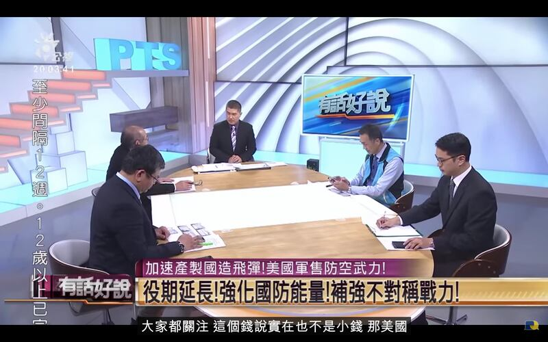
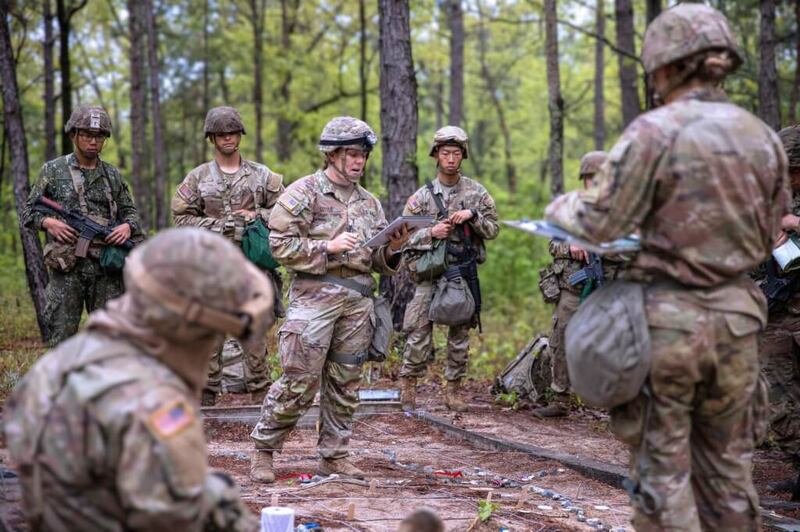

# 事實查覈 | 美國軍援臺灣，臺灣要不要還錢？

作者：李潼

2022.12.20 10:12 EST

## 標籤：誤導

## 一分鐘完讀：

美國國會衆議院、參議院日前分別通過《國防授權法案》，授權美國行政部門在2023至2027年間，每年提供臺灣至多20億美元的無償軍援；法案另授權提供臺灣每年20億美元的貸款。回顧歷史，這是自1970年代之後，美國再度向在臺灣的中華民國政府提供無償軍援，政治象徵意義極其濃厚，迅速成爲輿論熱點。

但亞洲事實查覈實驗室發現，臺灣公共電視以及網路媒體“Yahoo TV”等政論節目的評論者，都做出了若干欠缺事實依據的“分析”，例如質疑軍援費用是否“無償”，資金到位時間是否漫長，另有評論指出美國對臺軍售設備低階、是爲了“幫美國軍火商清庫存”等等。事實上，如果查考法案原文，會發現這些敘述有偏離事實，誤導輿論。

## 深度分析：

美國國會衆議院、參議院分別於十二月八日和十五日通過《國防授權法案》(National Defense Authorization Act, NDAA)，這項法案將在總統拜登簽字後生效。法案中最受關注的，是授權美國在2023至2027年間，每年提供臺灣至多20億美元的無償軍援。

在衆議院版本通過後,臺灣公共電視談話性政論節目 [《有話好說》十二月八日的節目](https://www.youtube.com/watch?v=Za6LfAF-_jg)中,一位受邀來賓說:

“剛剛邱國正(按：臺灣國防部長)講無償，我不知道這無償的，什麼意思對我來講。借錢就是要還啦？怎麼可能免費給我們的？那如果是免費給我們是一個題目；不是免費給我們，是另外一個題目。”

同一節目另一位來賓也說，目前不明白“這筆錢的時間到位的時間有多長，如果他分5年分10年或是在一年內就就立刻到位，意義都會不一樣。”

臺灣公共電視《有話好說》節目討論美國軍援臺灣議題。(當集網路影像截圖)

## 問題一：無償軍援要不要還錢？

《有話好說》節目通過公共電視網絡覆蓋全臺，在YouTube網路上也有上萬次收看。亞洲實事查覈實驗室查閱了《國防授權法案》(H.R.7776)原文，確認該法案授權國務院可以從2023到2027年間，每年向臺灣提供不超過20億美元的“Foreign Military Finance grant assistance”，是不必償還的軍事援助。

法案另外授權提供臺灣20億美元“外國軍事融資”（Foreign Military Financing）直接貸款(loan)，法案規定清償期爲十二年，加計利息，和上述不必償還的軍事援助並不相同。

除了無償軍援外，《國防授權法案》也修改了1961年美國《援外法案》(Foreign Assistance Act of 1961)，加入以下條文：“總統還可以指示從國防部的庫存、國防勤務以及教育訓練中提取物品提供給臺灣，但每個財政年度總值不得超過10億美元。”

對於“無償軍援”和“直接貸款”的差別，軍事評論家梅復興接受亞洲事實查覈實驗室採訪時解釋，《國防授權法案》雖然規定了軍援的額度，但是不是就能夠撥款，還要看國會撥款委員會的決定。因此如果因爲美國本身財政因素，或者撥款委員會沒有批准足額援助，臺灣有需要時，可以用貸款額度補足。但如果臺灣政府評估認爲沒有需要，“當然也可以不貸”。

美國陸軍第16騎兵團於2022年4月19日在單位臉書發佈一張照片，內容是協訓盟邦部隊實況，在這張照片中，左一受訓人員身穿國軍陸軍迷彩服，胸前有“中華民國陸軍”識別章。(本圖自U.S. Army Armor Basic Officer Leader Course臉書取材後存檔)

## 問題二：軍援是替國軍火商“清庫存”？

臺灣網絡媒體Yahoo TV在12月2日播出的 [《風向龍鳳配》節目](https://www.youtube.com/watch?v=DSrK0PNrObE)目前累積了53萬次收看記錄。針對美國軍援臺灣議題,一位評論員認爲:美國不會提供臺灣真正需要的軍備,100億軍援能買的都是讓美國的軍火商獲利高的,有的甚至是庫存積壓的軍備。

美國計劃透過軍援或貸款給臺灣哪些武器裝備，目前不得而知；運作程序目前也沒有曝光。但根據美國《國防新聞週刊》及《華爾街日報》報導，臺灣軍方前幾年向美國下單採購的武器、裝備，不少面臨交貨延遲的情況，例如愛國者飛彈零件、刺針飛彈、重型魚雷，以及“海馬斯”高機動性多管火箭系統等，售積壓未出貨的武器總價近190億美元。報導引述“美中經濟暨安全檢討委員會”報告指出，疫情及美方援助烏克蘭抗俄是延遲向臺灣交貨的兩項原因。這也是《國防授權法案》中特別訂立條文，要求國防廠商加速並優先生產臺灣下單採購的裝備的原因。

此外，法案也明文規定，美國提供的軍援中，每年至少有200萬美元用於軍事教育訓練。

《國防授權法案》還規定臺灣每年所獲援助款可以在臺灣本土採購裝備或服務，上限爲百分之十五。

由上述事實可以看出，美國的軍援資金不管是用於目前積壓未交貨的裝備，或是用於教育訓練，都不是如評論員所稱的“替軍火商清庫存”，目前只有美商生產不及，交不出貨，沒有“清庫存”的問題。而本土採購，更與“美商清庫存”無關。

Yahoo TV《風向龍鳳配》節目討論美國軍援臺灣議題。(當集網路影像截圖)

## 問題三：《國防授權法案》框住了臺灣的國防政策？

上述《風向龍鳳配》節目中，另有一位評論者說：

“臺灣現在被要求要買的是低階的、簡單的個人式裝備。在一個完全沒有戰略縱深的地方，......你要看到你身邊的人屍橫遍野的在你面前嗎？”

《有話好說》的一位來賓也說：

“我們需要什麼東西？事實上是有規劃的。在做武器獲得。那如果突然間來這麼一筆錢，那跟我們原來十年建軍構想，五年兵力整建是不是契合？”

檢視《國防授權法案》，的確可以發現一些條文對臺灣的國防政策有所“導引”。例如其中有條文規定軍事資助計劃是用於增強臺灣的軍事防禦及“民防能力”(civilian defensive capabilities)。

另一項更明確的要求則是美國國務院向臺灣提供軍援時，需要至少每年向國會相關委員會證明，臺灣政府的國防支出比起前一年有所增加，援助內容也包括對不對稱戰略(asymmetric strategy)的支持。

曾任國軍參謀總長的李喜明近年來借出書、演講等機會，公開倡議臺灣應該採取“不對稱戰略”應對中國大陸軍事威脅。李喜明認爲臺灣面對擁有巨大資源的解放軍，只有以“不對稱”的作戰思維，採購量多、價廉、火力強、存活率高的小型武器，以及組建裝備輕兵器的“國土防衛部隊”，才能展現足夠威懾力。

美國部分政、軍界人士，也同樣認可上述“不對稱戰略”的主張，因此立法文字中帶入了部分理念。但法案本身並沒有限制對臺軍援只能採購“低階的、簡單的個人式裝備”。

參考鏈接：

[ [《國防授權法案》Opens in new window](https://www.congress.gov/bill/117th-congress/house-bill/7776) ]

[ [Yahoo TV《風向龍鳳配》Opens in new window](https://www.youtube.com/watch?v=DSrK0PNrObE) ]

[ [公共電視《有話好說》Opens in new window](https://www.youtube.com/watch?v=Za6LfAF-_jg) ]

宋啓成、沈明室, [1950 年代美國對臺軍事援助對後續美臺軍售的影響](https://nccur.lib.nccu.edu.tw/bitstream/140.119/80142/1/18.pdf)

*亞洲事實查覈實驗室是針對當今複雜媒體環境以及新興傳播生態而成立的新單位,我們本於新聞專業,提供正確的查覈報告及深度報導,期待讀者對公共議題獲得多元而全面的認識。讀者若對任何媒體及社交軟件傳播的信息有疑問,歡迎以電郵*   [*afcl@rfa.org*](mailto:afcl@rfa.org)  *寄給亞洲事實查覈實驗室,由我們爲您查證覈實。*

[Original Source](https://www.rfa.org/mandarin/shishi-hecha/hc-12202022093107.html)