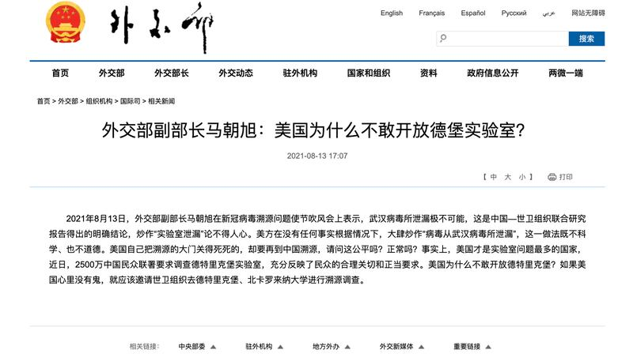
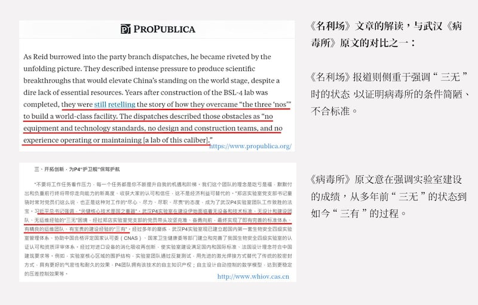
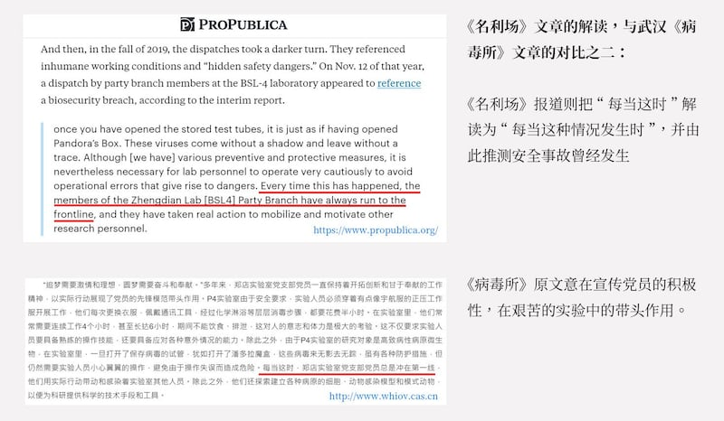
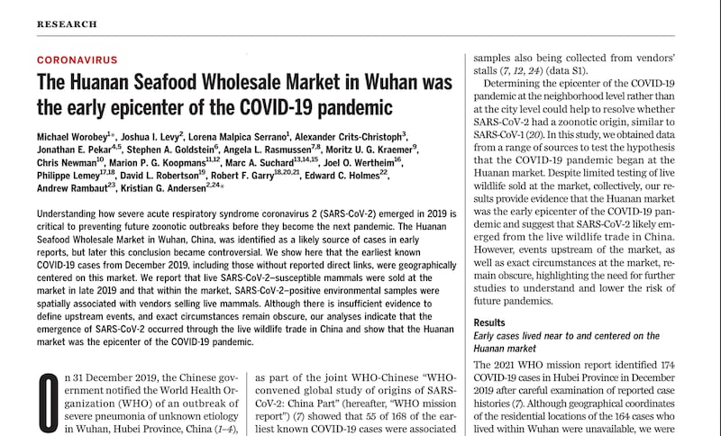

# 深度 | 流傳甚廣的兩種"新冠病毒來源於實驗室"說法，哪些證據是不可信的？

作者：詹涓

2022.12.23 13:42 EST

*“早在（2019年）7月，美國軍方德特里克堡生物實驗室曾發生事故，隨即被關閉，很快該地區就出現了肺炎病例。當時人們還不知道這種肺炎是什麼病，後來美國疾控中心負責人在2020年3月份在議會承認這就是新冠病例。”*

*——2022年12月7日,*  [*中國駐法大使盧沙野與當地記者交流*](http://fr.china-embassy.gov.cn/ttxw/202212/t20221214_10990094.htm)  *,言語之間意味深長,再次將新冠大流行的起源和美國德特里克堡聯繫在一起。*

*“引發新冠大流行的病毒SARS-CoV-2的出現，極有可能是與研究事故相關的。（the emergence of SARS-CoV-2 that resulted in the COVID-19 pandemic was most likely the result of a research-related incident.）”*

*——2022年10月,*  [*一份由美國北卡羅來納州共和黨參議員理查德·伯爾簽署名的調查報告*](https://www.help.senate.gov/imo/media/doc/report_an_analysis_of_the_origins_of_covid-19_102722.pdf)  *指出,新冠病毒是從中國武漢病毒所的實驗室事故中泄露。*

新冠大流行已經三年，各方對病毒來源的爭論一直沒有停止，尤其是新冠病毒是否“來源於實驗室”。

權威科學、醫學期刊《 [自然](https://www.nature.com/articles/d41586-022-00584-8)》、《 [科學](https://www.science.org/content/article/evidence-suggests-pandemic-came-nature-not-lab-panel-says)》、《 [柳葉刀](https://www.thelancet.com/journals/lancet/article/PIIS0140-6736(21)02871-3/fulltext)》等發表了病毒學和進化生物學領域科學家迄今的主流觀點,新冠病毒從動物自然溢出的可能性遠大於實驗室泄漏,最有可能的假設是,新冠病毒在位於中國武漢的華南海鮮市場與人類接觸,病毒來源於動物宿主,通過人畜共患病途徑傳播給人類。

然而，新冠病毒“來源於實驗室”的說法從疫情爆發初期開始流傳，其中最知名的兩種說法是“中國武漢實驗室泄露”，和“美國得特里克堡實驗室製造”。 在美、中兩國高級別政治人物推波助瀾下，這兩份結論迥異，但敘事風格、論證方法相似的傳說，雖未得到主流媒體和科學界背書，卻對民衆認知影響深刻。

事實上，無論是政客、媒體還是網絡傳言，都沒能爲兩種“實驗室起源說“提供經得起科學驗證的證據。

無論是世界衛生組織，科學共同體，還是各國政府和衛生部門，各界對新冠病毒起源的追問和探索並沒有結束。

亞洲事實查覈實驗室試圖通過本篇深度分析文章，梳理、呈現目前兩種說法的“證據”和“調查過程”的可疑之處，以及主流科學界目前最具共識的觀點，希望在新冠病毒仍肆虐之際，爲讀者提供解讀信息亂象的一份參考。

## 病毒是美國製造的？與德堡實驗室和2019軍運會美國運動員有關係嗎？

2022年12月，中國駐法大使盧沙野與記者交流，再次擺出“德特里克堡因事故關閉”和“美國軍運會代表隊帶病毒進武漢”的兩個說法。

新冠病毒源於美國“德堡實驗室事故”的說法，也已經流傳了兩年多。2020年3月，當最早在武漢爆發的新冠病毒疫情蔓延至全球超過100個國家時，美國開始批評中國缺乏透明度。在輿論壓力之下，中國官方反擊聲稱不能排除新冠病毒從境外傳入。趙立堅連發推文，“零號病人是什麼時候在美國出現的？有多少人被感染？醫院的名字是什麼？可能是美軍把疫情帶到了武漢，”趙立堅寫道。

之後他貼出了一篇發佈在加拿大全球研究（Global Research Canada）的文章。該文稱新冠病毒的最初來源可能是位於美國德特里克堡的美國軍事生化實驗室，但並未給出任何證據。這可能是最早努力將病毒起源轉移到德堡的文章（這篇文章已被刪除）。

中國外交部發言人趙立堅在推特上首次提及德堡實驗室與新冠病毒的關係

全球研究是一家加拿大新聞網站，以其反西方、反資本主義、反全球化和親俄陰謀論的編輯政策而聞名。免費的在線百科全書維基百科將全球研究列入假新聞網站列表。Media Bias Fact Check對新聞媒體的偏見程度進行評級，將 Global Research 歸類爲陰謀論、僞科學來源。

該文作者是拉里·羅曼諾夫(Larry Romanoff),他自稱是前上海復旦大學的客座教授、退休商人,但相關身份無法得到覈實,他的 [官網](https://www.bluemoonofshanghai.com/politics/6341/)只提供了一個QQ郵箱。羅曼諾夫在這篇文章中毫無證據地聲稱,位於馬里蘭州德特里克堡的美國軍細菌實驗室可能是病毒的來源。

德特里克堡是一個生物研究實驗室，研究與生物防禦相關的問題，長期以來一直被人跟陰謀論聯繫起來，1980年代，蘇聯情報機構克格勃就表示這個實驗室製造了當時的艾滋病大流行。

他說，“這並不令人意外”，去年該實驗室“完全關閉”，原因是“缺乏防止病原體泄露的保障措施”。在疫情初期他還寫過其他一些文章發表陰謀論，比如聲稱新冠病毒在中國和伊朗帶來的感染率和死亡率特別高，因此認爲病毒就是這樣設計出來精準打擊這兩個人口的。

根據《紐約時報》當時的報道，該實驗室並未關閉，只是暫停了研究。一名發言人稱，實驗室沒有危險物質泄露，實驗室於2020年3月全面重新開放。德特里克堡從事埃博拉和兔熱病等疾病病原體的研究，在新冠疫情爆發前，德堡並不擁有任何冠狀病毒，也不對這種病毒作研究，美國的兩個研究冠狀病毒的實驗室位於德克薩斯州加爾維斯頓和北卡羅來納州教堂山，與德堡相距甚遠。

前中國駐美國大使崔天凱 [當時告訴在線新聞網站Axios](https://www.axios.com/2020/03/22/china-coronavirus-ambassador-cui-tiankai),認爲這種病毒源自美國的軍事實驗室的說法是"瘋狂的"。但接下來,北京的態度從最初不願完全接受德堡的說法,演變成了一場持續不斷暗示病毒與美國軍方有關的宣傳攻勢。 [據美國《外交政策》統計](https://foreignpolicy.com/2021/07/09/china-fires-back-at-biden-with-conspiracy-theories-about-maryland-lab/),自2020年3月至2021年7月,中國政府官員和官方媒體在400多篇文章、視頻、推文和新聞發佈會上提到了德堡。在官員、學者、中央主流宣傳機構和社交媒體的推動下,德特里克堡成爲中國新冠陰謀論的中心。 [同時,俄羅斯也開始大力鼓吹德堡說,兩國官媒互相引用彼此爲信息源。](http://m.news.cctv.com/2021/08/04/ARTIbkfOty0YYEaWYF3nZ4Np210804.shtml)

中國外交部副部長馬朝旭曾在公開場合稱病毒起源於德特里克堡實驗室有關

那麼證據呢？北京提出的證據之一是提出新冠病毒與2019年威斯康辛州爆發的EVALI（與電子煙有關的肺部疾病）之間的聯繫，中國外交官們有意或錯誤地聲稱疫情“只發生在德特里克堡附近”，而刻意沒有提到，威斯康辛州距離德堡實驗室約800英里，也忽視了從電子煙肺炎患者的肺泡灌洗液裏沒有檢測到新冠病毒。

中文世界流傳的另一個欠缺可靠證據的理論則試圖將新冠與弗吉尼亞州北部一家老年護理機構中不相關的呼吸道病毒爆發聯繫起來，這個離德堡近60英里的護理機構確實發生了一系列院內感染，但全程都公開可查，縣衛生當局在2019年7月11日宣佈，在11天內，263名居民中有54人出現呼吸道症狀，2人死亡，這兩人都是老年人，有着複雜的醫療問題。衛生部門說，“沒有發現特定的病原體”，但注意到鼻病毒的存在，這種病毒會導致普通感冒。

至於多位中國外交官員使用過的“軍運會”例子，則是與“德堡事故”相關聯的故事。在上述盧沙野與記者的交流中，他表示，2019年中國舉辦世界軍運會，美國隊僅獲得8枚獎牌，這對於強大的美國運動隊來說很不可思議。他進一步指出，運動員糟糕表現與感染病毒有關，並暗示，武漢的病毒或許是美國運動員帶進來的。

這種說法更沒有事實依據，雖然美國在奧運會等世界體育賽事中一直居於領先地位，但在四年一次的世界軍事運動會上，美國代表隊的表現一直平平。查閱公開資料便知，過去的五屆世界軍運會分別於2003年、2007年、2011年、2015年和2019年舉行，美國的歷屆獎牌總數爲4，10，6，6，8， 獲得8枚金牌的2019年美國軍運會代表隊，維持了一貫的平均水平。因此，從比賽成績推測美國運動員“帶毒參賽”的說法，更是沒有任何根據的陰謀論。

## 病毒泄露於中國武漢？ProPublica/《名利場》的文章有哪些硬傷？

在2020年新冠疫情爆發的最初幾天，“新冠病毒來自武漢病毒學研究所（下簡稱“武漢病毒所”）”的傳說已經開始流傳，但並未有切實證據提出。

兩年多後,2022年10月底, [非營利新聞調查機構ProPublica和《名利場》(VanityFair)合作發佈的一篇文章](https://www.propublica.org/article/senate-report-covid-19-origin-wuhan-lab)詳細介紹了美國參議院情報委員會調查的新發現,指出新冠疫情源於實驗室泄漏,武漢病毒所實驗室泄露說似乎又得到了更多背書——畢竟自2007年成立以來, ProPublica揭露了各級政府和企業的不當行爲,在這個過程中獲得了六次普利策獎,以準確翔實的報道在新聞界享有聲譽。

文章發表後,ProPublica 遭遇了前所未有的批評。 [《洛杉磯時報》發表的一篇評論稱這篇報道爲"翻車事件"](https://www.latimes.com/business/story/2022-11-01/column-propublica-vanity-fair-covid-lab-leak-expose-train-wreck),引述了一批能看懂中文的翻譯和學者的批評,ProPublica的根據是中國的官方中文文件和官方機構與媒體報道,但有明顯的誤譯和漏譯,隨即英國《衛報》、《洛杉磯時報》等媒體也發表評論和報道批評該篇報道;該文引用的美國參議院情報委員會聲稱,調查報告中包括對幾十位專家的採訪,但這篇文章並沒有體現病毒學家和生物學家的觀點。

ProPublica/《名利場》的文章稱，武漢病毒所的安全環境“比之前所知的要糟糕得多”。這篇文章有兩個支柱：其一是翻譯和分析武漢病毒所官網上的文件和新聞；其二則是參議院的報告。

翻譯這些文件的人叫託伊·裏德（Toy Reid），據說能說一口流利的中文，曾爲佛羅里達州共和黨參議員馬可·盧比奧（Marco Rubio）處理中國問題。

這篇文章將長期從事政治幕僚工作的裏德描述爲一名“研究人員”，文章形容“裏德相信，他利用自己辛苦積累的專業知識，發現了隱藏在眼皮底下的祕密。”所謂的“祕密”是，武漢病毒所難以維持生物安全標準，並在2019年11月下旬，也就是在新冠病毒可能剛剛在武漢開始悄悄傳播時，遇到了一場安全危機。

裏德在文章中聲稱，他已經找到了如何解讀中共官員“官樣文章”的方法。這篇文章援引他的話說，即使是母語是中文的人“也無法真正理解”這種套話。

但從裏德翻譯中的錯誤來看，他對這些“套話”的理解也並不正確。裏德的翻譯中出現了明顯的時態錯誤，導致他把武漢病毒所曾經遇到的安全問題描述爲發生在新冠病毒出現前後，同時顯然忽視了在同一份文件中指出相關問題已經得到解決的一句話。

文章這樣形容裏德的發現：當裏德埋頭研究黨支部的簡報時，他被正在展開的畫面吸引住了。文件描述了（病毒所）嚴重缺乏必要的資源，爲了取得科學突破，提升中國在世界舞臺上的地位，隨着巨大的壓力。即使在BSL-4級別的實驗室，他們也一再感嘆“三無”的問題：無設備和技術標準，無設計和建設團隊，無運維[如此等級的實驗室]經驗。

ProPublica/《名利場》文章與武漢病毒所2019年11月12日新聞截圖對比之一

但實際上文章所引文件分別發表於2019年6月和11月，兩段話幾乎沒有差別，文件強調“三無”的情況出現在病毒所“創建伊始”，稱經過多年建設，已經從“三無”實現了“三有”。也就是說，如果僅僅是閱讀官方文件，裏德本應得出至少在2019年下半年，武漢病毒所已經自認爲達到了安全標準的結論。

裏德還使用了另一份病毒所的官方新聞來描述實驗室不安全的條件。文章寫道：“然後，在2019年秋天，這些報道發生了更黑暗的轉變。報道提到了不人道的工作條件和‘安全隱患’。當年11月12日，BSL-4實驗室黨支部成員的一份報告似乎提到了生物安全漏洞。”

證據是這段對於 [官方文件](http://www.whiov.cas.cn/xwdt_160278/zhxw2019/201911/t20191119_5438539.html)的翻譯:"一旦你打開了儲存的試管,就好像打開了潘多拉的盒子。這些病毒來無影去無蹤。雖然[我們]有各種防護措施,但仍然需要實驗人員非常謹慎地操作,避免操作失誤導致危險。**每當這種情況發生時**,鄭店實驗室黨支部的成員們總是衝在第一線,用實際行動動員和激勵其他科研人員。"

中文讀者如果對比原文，應該就能看出來翻譯出了什麼問題：他將“每當這時”理解成了“每當這種情況發生時”，原文只是一個常見的政治宣傳稿，籠統地說明P4病原體非常危險，“每當”有艱鉅任務時黨員會以身作則；而譯文解讀成了實驗室危險和失誤頻發，因此得出了實驗室漏洞重重的結論。

ProPublica/《名利場》文章與武漢病毒所2019年11月12日新聞截圖對比之二

裏德聲稱自己讀懂了中國報道的“字裏行間”。但從這些翻譯來看，他對部分字句的理解並不正確。

2022年11月30日,ProPublica發表了 [一份編輯說明,](https://www.propublica.org/article/editors-note-a-review-of-criticisms-of-a-propublica-vanity-fair-story-on-a-covid-origins-report)稱面對各界的爭議,他們請了三位精通中文的專家重新評估了這篇關於新冠起源的報道中裏德的翻譯,三位專家認爲,裏德翻譯是"貌似合理的解讀"(A plausible way to represent the passage), 其中兩位覺得,上述內容應該理解爲對實驗室日常風險的描述,而另一位的解讀則與裏德相同。在編輯聲明刊出之後,這篇報道也相應的做了調整,着重於強調解讀文件的複雜性。

病毒起源中國武漢實驗室的第二個流行說法， 來自參議院委員會的報告，這個委員會最初是在2020年由時任總統特朗普領導的國務院的一個小組支持的。最初該小組認爲中國人故意製造了這種病毒作爲一種生物武器。後來，有人主張，病毒是在實驗室裏爲提高微生物的傳染性而進行的實驗中產生的，後來又提出，是研究所的研究人員在進行實地調查時不小心感染了病毒，把病毒帶進了研究所。

北卡羅來納州共和黨參議員理查德·伯爾發佈的這份新報告稱,"已經出現了大量證據,證明新冠大流行是與研究相關的事件的結果",但它唯一新的線索就是翻譯了武漢病毒所的這批文件,基於實驗室在2019年升級安全設備和舉辦安全培訓課程,因此進一步提出了假設。 [該報告幾乎沒有提供新的證據,而且遭到了許多科學家的質疑。](https://www.nytimes.com/2022/10/27/science/covid-lab-leak-burr-report.html)整個報告只有伯爾一人署名,而非當初期望的兩黨聯合調查並署名。

加拿大薩斯喀徹溫大學（University of Saskatchewan）疫苗和傳染病組織的病毒學家安吉拉·拉斯穆森（Angela Rasmussen）對《紐約時報》說：“這是對納稅人資金和資源的一種令人尷尬的不當利用。”

拉斯穆森與人合著發表在《科學》（Science）雜誌上的論文指出，武漢海鮮市場是大流行的發源地。她表示，ProPublica/《名利場》文章似乎將實驗室升級將看作是某種危險信號，但她指出，對於任何處理危險病原體的生物科學實驗室來說，定期和積極翻新都是“正常”操作。

拉斯穆森注意到，在提到武漢病毒所時，這分報告“沒有提供違反或生物安全問題的證據，但有很多證據表明，他們以相當標準的方式運行一個隔離實驗室。”

拉斯穆森說，伯爾的助手在2021年年中開始研究時，問過她如何着手展開調查。但她說他們從未跟進。

伯爾的報告稱，它參考了對幾十位專家的採訪。但上述《科學》雜誌論文的作者中，有12名合著者在當面採訪或電子郵件中對《紐約時報》表示，他們沒有收到過參議員該委員會工作人員的跟進諮詢。

## 權威科學界“最有可能的假設”：病毒來自於自然界中的動物宿主

隨着研究持續進行，越來越多的主流科學觀點認爲，新冠病毒最後可能通過人畜共患病途徑傳播給人類，即直接從動物宿主傳播。他們的結論是，溢出效應主要集中在武漢華南海鮮市場，因爲那裏曾出售易感染新冠病毒的動物。

《科學》雜誌發表的一項研究認爲，華南海鮮市場是新冠大流行的最早爆發的中心

[一個由18名科學家組成的團隊2022年7月26日在《科學》雜誌上發表的論文](https://www.science.org/doi/10.1126/science.abp8715)中指出,"我們的分析表明,SARS-CoV-2病毒的出現是通過中國的活體野生動物貿易發生的,並表明華南海鮮市場是新冠大流行的中心。"

《科學》雜誌同期發表的另一篇論文提供了進一步的間接證據，指出華南海鮮市場至少發生了兩起人畜共患病事件。

值得一提的是，科學界還在努力探究事實真相，但因爲中國政府設置的障礙，溯源研究如今已經困難重重。 中國官員在相關活體動物取樣之前就關閉了華南海鮮市場，並對其進行了徹底的消殺，因此幾乎不可能識別出受感染的動物。但哥倫比亞大學梅爾曼公共衛生學院病毒學家W.伊恩·利普金（W. Ian Lipkin）博士對《紐約時報》說，找不到受感染的動物並不能證明任何事情。

還有種觀點認爲，在新冠大流行剛剛開始時，這種病毒就能夠在人與人之間迅速傳播，這證明不可能是野生動物起源。但康奈爾大學病毒學家萊納·普羅賴特（Raina Plowright）說：“許多病毒不需要適應，直接可以從動物傳給人類。”

迄今已發表的各項報告顯示，大流行的起源仍未蓋棺論定。弗雷德·哈欽森癌症研究中心的病毒學家傑西·布魯姆（Jesse Bloom）對《科學》雜誌說，他主張對武漢病毒所進行更深入的研究。

長期研究中國市場非法銷售野生動物的牛津大學生態學家克里斯·紐曼（Chris Newman）傾向於自然溢出，他和其他贊成自然起源的人表示，他們只需要再多幾塊拼圖就能完成這個謎題。紐曼懷疑，中國官員和研究人員可能已經掌握了其中一些碎片。他說：“他們應該比我們目前所知道的多得多。”

*亞洲事實查覈實驗室是針對當今複雜媒體環境以及新興傳播生態而成立的新單位,我們本於新聞專業,提供正確的查覈報告及深度報導,期待讀者對公共議題獲得多元而全面的認識。讀者若對任何媒體及社交軟件傳播的信息有疑問,歡迎以電郵*   [*afcl@rfa.org*](mailto:afcl@rfa.org)  *寄給亞洲事實查覈實驗室,由我們爲您查證覈實。*

[Original Source](https://www.rfa.org/mandarin/shishi-hecha/hc-12232022113157.html)