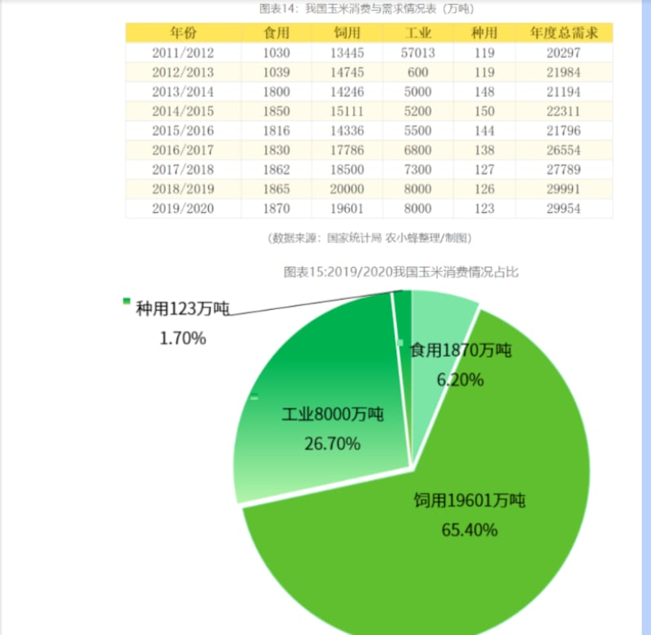
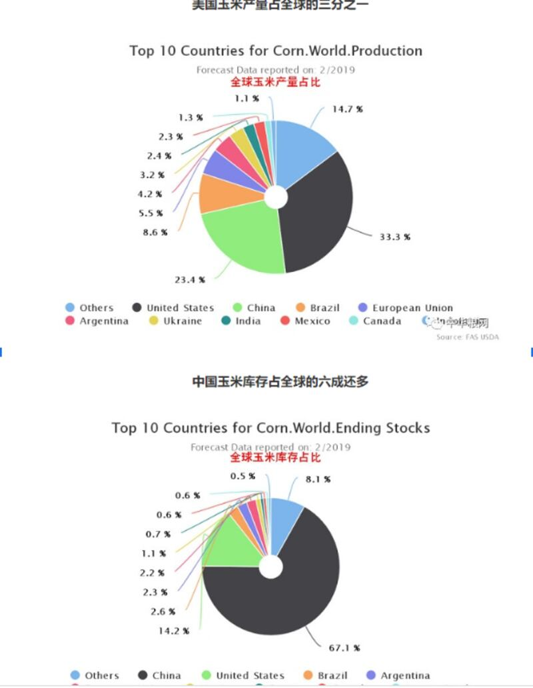

# 事實查覈 | 美國用玉米制燃料和非洲糧食危機有關係嗎？

2022.12.27 14:31 EST

## 標籤：誤導

## 一分鐘完讀：

近日，中國各大媒體加強火力批判美國推廣的燃料乙醇，抨擊美國在全球一些地區出現糧荒之時，還將大量玉米做成乙醇用來解決自己造成的石油價格上漲問題。央視旗下自媒體品牌“玉淵譚天”點擊率很高的《全球糧荒，美國放火燒糧？》，就是典型論述。

亞洲事實查覈實驗室分析認爲，美國推廣燃料乙醇和非洲糧荒之間的因果關係缺乏依據，玉米是全世界各地廣泛使用的經濟作物和工業原料種植。事實上，中國也曾力推發展玉米加工的燃料乙醇，其工業用玉米也達到了8000萬噸，佔到玉米總消費量的26.7%左右。

（數據來源：國家統計局 農小蜂整理/製圖）

## 深度分析：

長期以來,美國推廣的乙醇汽油受到各種詬病,最近中國各大媒體更是加強了火力,抨擊美國在全球很多人都喫不飽飯的情況下,還將大量玉米做成乙醇用來解決自己造成的石油價格上漲問題。如央視旗下自媒體品牌"玉淵譚天"創作的 [《全球糧荒,美國放火燒糧?》](https://finance.sina.com.cn/jjxw/2022-10-05/doc-imqmmtha9834562.shtml?cref=cj)獲得了很高的點擊率和轉傳。

該文章從全球糧食危機說起，“在非洲糧食告急之時，世界玉米產量最多的美國，卻正在把玉米——這種非洲人急需的主糧作物大量‘燒’掉。”進而提到美國爲了應對油價上漲而批准乙醇含量佔15%的E15汽油上市，並講述了美國政府不顧業界反對在國內推行乙醇汽油的歷史。

同樣的說法還另有一個視頻版《全球上億人忍受飢餓的同時，數億噸的糧食正被做成燃料燒掉。#美國如何炒作糧食危機#》，其中更分析：

“美國的燃料乙醇幾乎都是玉米加工而成的。但糧食到乙醇的轉化率低，三噸的玉米只能產出一噸的乙醇。因此玉米沒少燒，成效卻不高。”

## 世界上的饑荒問題是因爲糧食被“燒掉”造成的嗎？

聯合國世界糧食計劃署（WFP）在2018年發佈的《全球糧食危機報告》曾明確指出：“人們常以爲造成饑荒問題的主因是自然災害導致的糧食不足”，但報告認爲，“衝突是導致糧食危機的主要驅動力”。無論是在接納了緬甸難民的孟加拉，還是動盪的剛果和敘利亞，飢餓問題的發生都與當前全球糧食的總產能無關，甚至與發生飢餓區域自身的糧食產能無關，而與區域的衝突密切相關。

2022年4月的上海市，也曾在短期內因封城防疫，出現大量居民基本口糧斷供的人道災難。

用玉米做燃料乙醇，多個國家都有嘗試，中國也曾推廣。燃料乙醇本身是可再生的生物質能源，早在2017年，爲了加快消化庫存玉米，中國國務院辦公廳，國家發展改革委等十五部委先後發文，提出適度發展糧食燃料乙醇的要求。到了2020年，因爲玉米儲備驟降等原因，中國又暫緩了燃料乙醇計劃。

2022年，中國年中央一號文件明確指出“嚴格控制以玉米爲原料的燃料乙醇加工”，以防止該產業在玉米供需關係發生變化的大背景下，影響到糧食玉米的供應——而這也給了中國的各大官媒更多的可以抨擊其他國家的底氣。

結論：

玉米不僅可以作爲糧食種植，也能作爲經濟作物和工業原料種植，其用途相當廣泛。中國即便是放緩了乙醇汽油的發展腳步，其工業用玉米也已經達到了8000萬噸，佔到玉米總消費量的26.7%左右，這與美國“燒”掉一億噸玉米其實不相上下。

世界主要玉米產地國家玉米產量比例及玉米庫存比例（圖片來源：世界農化網）

相關鏈接：

玉淵譚天丨全球糧荒，美國放火燒糧？ | 新浪財經

[ [https://finance.sina.com.cn/jjxw/2022-10-05/doc-imqmmtha9834562.shtml?cref=cjOpens in new window](https://finance.sina.com.cn/jjxw/2022-10-05/doc-imqmmtha9834562.shtml?cref=cj) ]

獨家：中國叫停乙醇汽油推廣計劃 因玉米儲備驟降--消息人士 | Reuters (https://www.reuters.com/article/china-ethanol-policy-corn-reserve-0109-idCNKBS1Z803H)

中國無須過度擔憂“糧食危機” | 中青在線

( <http://zqb.cyol.com/html/2012-09/12/nw.D110000zgqnb_20120912_2-04.htm>)

2022年中國玉米產業分析報告：

[ [https://cn.agropages.com/News/NewsDetail---25003.htm#:~:text=%E6%8D%AE%E5%88%9D%E6%AD%A5%E8%AE%A1%E7%AE%97%EF%BC%8C2021%E5%B9%B4,%E4%BA%A7%E9%87%8F%E6%80%BB%E4%BD%93%E8%B6%8B%E4%BA%8E%E7%A8%B3%E5%AE%9A%E3%80%82Opens in new window](https://cn.agropages.com/News/NewsDetail---25003.htm#:~:text=%E6%8D%AE%E5%88%9D%E6%AD%A5%E8%AE%A1%E7%AE%97%EF%BC%8C2021%E5%B9%B4,%E4%BA%A7%E9%87%8F%E6%80%BB%E4%BD%93%E8%B6%8B%E4%BA%8E%E7%A8%B3%E5%AE%9A%E3%80%82) ]

2022年全球玉米市場競爭格局分析 中美兩國玉米產量佔全球比重過半-農小蜂

( <https://www.weihengag.com/index.php/home/article/detail/id/14434.html>)

*亞洲事實查覈實驗室是針對當今複雜媒體環境以及新興傳播生態而成立的新單位,我們本於新聞專業,提供正確的查覈報告及深度報導,期待讀者對公共議題獲得多元而全面的認識。讀者若對任何媒體及社交軟件傳播的信息有疑問,歡迎以電郵*   [*afcl@rfa.org*](mailto:afcl@rfa.org)  *寄給亞洲事實查覈實驗室,由我們爲您查證覈實。*

[Original Source](https://www.rfa.org/mandarin/shishi-hecha/hc-12272022121736.html)