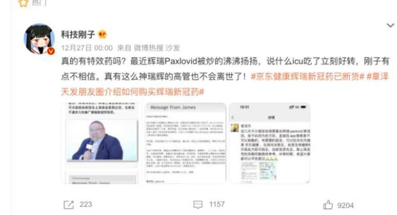

# 事實查覈 |"輝瑞高管"、"Paxlovid主要推動者"因新冠去世？

作者：林濤

2022.12.28 12:53 EST

## 標籤：虛假

## 一分鐘完讀：

隨着中國各地新冠疫情爆發，輝瑞生產的口服抗病毒藥物帕昔洛韋（Paxlovid）在非正規渠道被炒上天價的同時，也引發了許多質疑聲音。經各大新聞網站轉載的一則網文稱，一位年僅四十餘歲的“輝瑞高管”、“Paxlovid的推動者”日前因新冠去世，並質疑輝瑞生產藥物的有效性。經亞洲事實查覈實驗室查證，此網帖爲虛假信息，其中提及的不幸病逝的陳姓人士並非就職於輝瑞，其個案病情也並不能代表輝瑞治療藥物的整體效果。

## 完整版本：

2022年12月,中國新冠疫情井噴式爆發,輝瑞公司生產的新冠治療藥物帕昔洛韋(Paxlovid)成爲熱議的緊俏商品。雖然據媒體報道, [中國北京將開始向社區醫院供應帕昔洛韋,並將此藥物納入醫保](http://www.ce.cn/xwzx/gnsz/gdxw/202212/27/t20221227_38309875.shtml)。然而,在目前處方、購買渠道不透明的情況下,有需要的居民通過醫院系統獲得帕昔洛韋的可能性很小。

在一藥難求的同時,新浪微博等社交媒體上也開始出現不少聲音,質疑帕昔洛韋是否有用,有的稱該藥 [審批過程潦草、療效不明](https://weibo.com/5601629229/MllYhjEk2#comment),有的指 [西方資本用帕昔洛韋進醫保"掏空國庫"的陰謀](https://weibo.com/2759217535/MjO808rLd?refer_flag=1001030103_),近日流傳甚廣的則是一則張冠李戴的虛假消息,用某藥企高管罹患新冠去世的消息,作爲"新冠特效藥"無效的證據。

"輝瑞高管感染新冠過世"的虛假信息獲各新聞網站轉載（百度搜索截圖）

12月26日,一則短消息在中文互聯網上迅速傳播,獲得各新聞網站轉發。其標題爲 ["輝瑞高管,感染新冠後過世,40多歲"](https://webcache.googleusercontent.com/search?q=cache:YzuznKgyHu4J:https://news.ifeng.com/c/8M3zT31V09e&cd=1&hl=en&ct=clnk&gl=us), 內文稱,"輝瑞特效藥、輝瑞上海營銷部負責人陳可傑因感染新冠在上海瑞金醫院過世。生前在不遺餘力的推廣輝瑞新冠特效藥。"

該消息同時配人像圖片和一張企業內部郵件截圖，郵件內容爲告知“中國臨牀運營部負責人陳可傑（Ho Kit Chan）”病逝的消息。

聲稱"輝瑞高管感染新冠過世"的網帖截圖

亞洲事實查覈實驗室查證,這位罹患新冠、於12月22日不幸去世的藥企高管並非就職於輝瑞,其工作更與推廣輝瑞的新冠治療藥無關。上述信息中的內部郵件截圖中有" [Bristol Myers Squibb](https://www.bms.com/cn)",即著名藥企 [百時美施貴](https://www.bms.com/cn)寶(臺譯:必治妥施貴寶)。 據公開資料顯示,陳可傑生前任百事美施貴寶中國臨牀運營部負責人,此前也曾在數個跨國藥企就職,但並沒有在輝瑞的工作經歷。

在一些藥企相關人士和主要新聞媒體闢謠之後，大部分網站刪除了該“新聞”，然而，上述消息的截圖經由數百萬粉絲的社交媒體、自媒體大V賬號在網上繼續流傳，並變化出不同版本，例如“輝瑞藥沒能救輝瑞高管”，“特效藥如果有效，美國能死一百萬人嗎”等說法，作爲反對輝瑞公司和帕昔洛韋的論據。

某粉絲超過百萬的微博博主繼續用"輝瑞高管去世"一說質疑帕昔洛韋有效性

雖然網帖中所提及死者生前的健康狀況和其藥物使用史不得而知，但其個案不能作爲帕昔洛韋無效的證據。

事實上,帕昔洛韋是經科學實驗證明有效治療新冠的藥物之一,該藥於2021年12月由美國食藥管理局授權緊急使用,用於治療12歲以上的高風險新冠感染患者,以降低重症和死亡風險,中國政府也已在今年2月批准帕昔洛韋上市。 [世界衛生組織2022年4月宣佈,強烈建議出現重症和住院風險高的非重症新冠患者使用帕昔洛韋](https://www.who.int/zh/news/item/22-04-2022-who-recommends-highly-successful-covid-19-therapy-and-calls-for-wide-geographical-distribution-and-transparency-from-originator),世界衛生組織所依據的研究顯示,該藥物治療能夠將新冠的住院風險降低85%。 [另一項由香港中文大學和香港大學進行的研究,](https://www.cpr.cuhk.edu.hk/sc/press/cuhk-hku-collaborative-study-finds-about-80-lower-risk-of-death-among-covid-19-inpatients-prescribed-oral-medication-and-the-risk-of-hospital-admission-in-outpatients-is-significantly-reduced-by-near/)分析了2022年2月至3月間香港疫情高峯中超過五萬名新冠確診者的數據,發現帕昔洛韋可減少90%的死亡風險。

亞洲事實查覈實驗室提醒讀者，帕昔洛韋爲處方藥物，需要由醫生開具處方，遵醫囑使用。

*亞洲事實查覈實驗室是針對當今複雜媒體環境以及新興傳播生態而成立的新單位,我們本於新聞專業,提供正確的查覈報告及深度報導,期待讀者對公共議題獲得多元而全面的認識。讀者若對任何媒體及社交軟件傳播的信息有疑問,歡迎以電郵*   [*afcl@rfa.org*](mailto:afcl@rfa.org)  *寄給亞洲事實查覈實驗室,由我們爲您查證覈實。*

[Original Source](https://www.rfa.org/mandarin/shishi-hecha/hc-12282022115341.html)