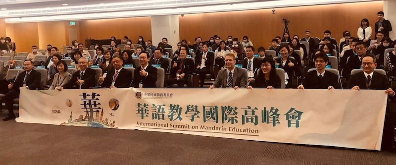
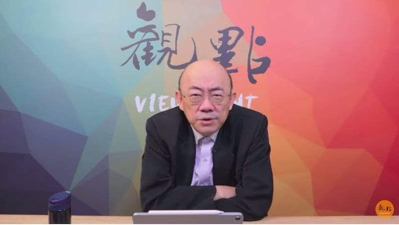

# 事實查覈 | "臺灣學人"計劃是美國派官員到臺灣"監軍"？

作者：李潼

2023.01.05 11:00 EST

## 查覈結果：虛假

## 一分鐘完讀：

美國總統拜登在去年底簽署2023財政年度《國防授權法案》，除了對臺灣的軍事援助和貸款外，一項提供美國官員到臺灣學習、工作的"臺灣學人計劃"(Taiwan Fellowship Program)在臺灣輿論場引發討論。部分評論者及媒體社論斷言這項計劃是美國政府派官員到臺灣"監軍"，甚至形容爲"美國爸爸要深入你家，看到底哪裏出了問題"。

亞洲事實查覈實驗室通過解讀法案內容和訪談，發現“臺灣學人計劃”究其實質是一項美國培育資淺官員的公費留臺、實習計劃，獲得獎助的官員如果無法完成學習計劃，還要補還政府補助，並且加計利息。而法案中更明文嚴禁赴臺灣學習官員涉入美國情報收集工作。

近年中美關係緊張，臺灣重新成爲美國官方及民間人士學習中文的優先選擇。（圖取自AIT臺北辦事處臉書）

## 深度分析：

"臺灣學人計劃"來自美國2023財政年度《國防授權法案》,部分臺灣媒體報道時僅簡單引述法案內容,指參與計劃的美國官員,依照方案可以到臺灣兩年: 第一年學習中文及印太地區國際事務知識,第二年則可以到臺灣政府或國會機構工作。許多評論圍繞在這些簡單敘述中展開。例如臺灣《聯合報》在去年12月27日的 [社論](https://www.worldjournal.com/wj/story/121220/6868262)中寫道:

“近兩年，美國干預國安政策日漸直接......美方更安排官員明年藉學人計劃進入臺政府部門’交流’，此舉也被解讀爲’監軍’。”

網路媒體“風傳媒”也引述政治評論者郭正亮的“個人判斷”，認爲“臺灣學人計劃”是起於“美國政府對臺灣行政體系的政策制定與國會運作有不滿之處，所以纔想要派人來了解、介入。”郭正亮也斷言，到臺灣的“學人”，“背後一定代表著各種力量，包括美國軍方、商務部與中情局等”。

## “臺灣學人計劃”具體內容是什麼？

亞洲事實查覈實驗室檢視《國防授權法案》中關於“臺灣學人計劃”的規定，發現除了前述內容，還包括這些要求：

1. 學員的學習過程中,應該保持"令人滿意的進步" (satisfactory progress) 。
2. 學員完成學人計劃後,繼續在聯邦政府工作四年以上;如果領取獎助的時間少於一年,服務期限至少爲兩年。
3. 到臺灣的學生修習一年中文及其它課程後,第二年工作的單位由主單位和臺灣商定,除了政府機關、立法院,也可以到相關非政府組織工作。
4. 法案並明文規定,如果學員無法完成課程,必須向聯邦政府賠還獎助學金,而且要加計利息。
5. 法案規定了"落日條款":七年之後學人計劃即告結束。

政治評論家郭正亮認爲美國以“臺灣學人計劃”爲名，實則派出“監軍”監視臺灣政府。（影音節目截圖）

## 參加“臺灣學人計劃”的學員可能是美國“監軍”嗎？

曾在美國國防部和美國在臺協會工作，目前已經退休的胡振東(Tony Hu)接受亞洲事實查覈實驗室訪問時表示，上述的“臺灣學人計劃”在美國外交工作中並不是特例，美國在對其它國家的外交工作中，都有非常類似的，訓練資新官員的計劃，包括學習語言，以及進入當地政府或非政府組織工作。

胡振東受訪時提及,例如美國和日本兩國自1994年起就有一項"曼斯斐學人計劃"(Mansfield Fellowship Program),持續到今天。臺灣外交部在一份對外 [公佈的說帖中](https://www.mofa.gov.tw/News_Content.aspx?n=95&s=99365),也提到了相同的內容。

臺灣淡江大學戰略研究所教授、國民黨國際事務部主任黃介正受訪時強調，政府以公費選派出國留學的人不可能是資深的員工。即使進入臺灣政府部門或者立法院，他們實質上就是“實習人員”(intern)。

## “臺灣學人”在政府中“工作”可能造成泄密嗎？

值得留意的是，《國防授權法案》明文規定到臺灣學習、工作的美國官員，應該“避免涉入爲美國政府從事任何情報或情報相關活動”( to refrain from engaging in any intelligence or intelligence-related activity on behalf of the United States Government)。

黃介正說，如果真要考慮泄密問題，這些接受美國實習官員的部門，還有整整一年半的時間安排，排除美國實習官員接觸任何機密、敏感的信息。胡振東則說，這些實習的官員能接觸到什麼資料，完全是他的臺灣主管決定。

## 結論：

黃介正和胡振東受訪時都表示，“臺灣學人計劃”究其實質是一項新進官員的實習計劃，它可以讓臺灣和美國的官員在年輕時就相互認識，一起工作，未來各自升到高階職位時，彼此都有一份在年輕時就建立的情誼和默契。長期而言，對臺灣與美國的關係絕對有助力。

黃介正表示，把“臺灣學人計劃”挑撥成“美國總督”“美國人來監軍”的說法，對臺美關係毫無益處，甚至也誤導了中國對臺美關係的認知，擴大美中的嫌隙，對穩定西太平洋局勢毫無幫助。

*亞洲事實查覈實驗室是針對當今複雜媒體環境以及新興傳播生態而成立的新單位，我們本於新聞專業，提供正確的查覈報告及深度報導，期待讀者對公共議題獲得多元而全面的認識。讀者若對任何媒體及社交軟件傳播的信息有疑問，歡迎以電郵 [afcl@rfa.org](http://afcl@rfa.org)寄給亞洲事實查覈實驗室，由我們爲您查證覈實。*

[Original Source](https://www.rfa.org/mandarin/shishi-hecha/hc-01052023105609.html)