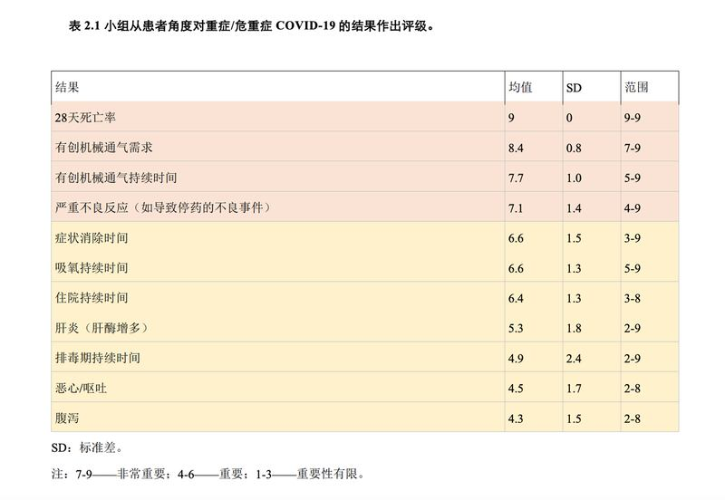
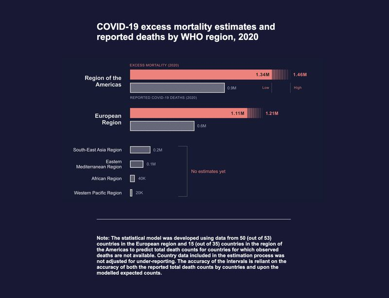

# 事實查覈 | 新冠死亡的中國標準是"全球兩大標準之一"嗎？

作者：林濤

2023.01.06 15:07 EST

## 標籤：誤導

## 一分鐘完讀：

近日中國各地疫情爆發、醫院重症病房和殯儀館不堪重負的同時，官方公佈的每日全國死亡數據持續爲零，或是個位數。中國官方在多個場合聲稱，"全球對新冠死亡的判定標準"有兩大類，中國執行的是其中一類。亞洲事實查覈實驗室發現，無論是世界衛生組織，還是美國、英國、印度，以及香港、澳門、臺灣等地區對新冠死亡的判定標準均與中國不同。"判定標準有兩大類"的說法系誤導。

## 完整版本

2022年12月以來,在中國大陸疫情管控放開的同時,大部分地區遭遇新冠疫情爆發,醫療資源緊張、民衆缺醫少藥的困境,更有媒體 [報道](https://www.bbc.com/zhongwen/simp/chinese-news-64079838)稱因爲死亡人數陡增,多家殯儀館不堪重負、排隊長龍。然而,官方疫情數據通報的新冠感染、死亡人數與居民感受出現了巨大差距,12月以來全中國的新冠死亡人數僅十餘人。 [世界衛生組織官員表示](https://news.un.org/zh/story/2023/01/1113892),中國目前公佈的數據,尤其是死亡人數,"未能充分反映這一疾病的真正影響"。

2023年1月4日, [中國疾控中心公佈的當日新冠死亡人數再次爲零](https://www.chinacdc.cn/jkzt/crb/zl/szkb_11803/jszl_11809/202301/t20230105_263213.html)。在多方批評之下,中國官方依然宣稱數據透明公開。中國駐 [澳大利亞](http://sydney.china-consulate.gov.cn/zlgdt/202301/t20230103_11000097.htm)、 [法國](http://fr.china-embassy.gov.cn/ttxw/202301/t20230101_10999627.htm)多家駐外使館近日連續發表宣傳文章,繼續讚揚中國三年多年來的抗疫成績,其中一項論據是:與美國上百萬人的死亡數據相比,中國僅有數千例新冠死亡。

## 中國官方通報的新冠死亡數量爲什麼這麼少？

亞洲事實查覈實驗室發現，中國大陸一直堅持執行的新冠死亡判定標準與世界衛生組織建議的標準不同，與美國、英國等發達國家不同，與印度等發展中國家不同，也與香港、澳門、臺灣差距甚大。

在中國大陸，只有新冠病毒引發呼吸衰竭直接導致的死亡，纔會被統計爲新冠死亡案例。近期，中國官方一再強調中國將堅持這個判斷標準，並稱之爲國際主要使用的判定標準之一。

在這個指導政策下,大量與新冠相關的死亡未被統計。 [據《中國新聞週刊》](https://www.163.com/news/article/HPDVEI8O0001899N.html)的報道,該刊記者於2022年12月16至18日之間在"北方某市一家甲醫院"的急診處統計到十幾位新冠感染後死亡患者,他們多有慢阻肺、冠心病等病史。根據該刊採訪到的北京大學第一醫院感染疾病科主任王貴強的解讀,這些病例都不會被歸入新冠死亡案例。

針對各方的詰問,2022年12月29日, [中國國務院新聞辦公室的吹風會上](https://www.chinanews.com.cn/gn/2022/12-29/9924073.shtml),衛生健康委醫政司司長焦雅輝表示,"目前全球對新冠死亡的判定標準主要分爲兩大類。一大類是感染新冠病毒後 [核酸](https://sputniknews.cn/20221230/1046777825.html)陽性,由於新冠病毒引發呼吸衰竭,直接導致死亡,判定爲新冠死亡。那麼還有一類就是感染新冠病毒以後28天以內全口徑的死亡都計入新冠病毒的死亡。中國從2020年以來,我們一直採取死亡判定標準就是第一類的死亡判定標準。"

這個標準在由 [中國駐法大使館發佈的題爲《中國抗疫成果不容抹黑篡改》的宣傳文稿](http://fr.china-embassy.gov.cn/ttxw/202301/t20230101_10999627.htm)中也有所提及,該文中稱中國防疫成果斐然,僅有數千死亡案例,而同期對比,美國新冠死亡超過百萬,法國超過16萬。

然而，在提及死亡標準的評判時，該文批判其他國家所使用的“全口徑”統計不科學，並質問： “設想，一個人出車禍死亡，恰巧在他體內檢出新冠病毒，那他是算作車禍死亡，還是新冠死亡？

亞洲事實查覈實驗室的不完全調查發現，無論是世界衛生組織，幾個主要的發達國家、發展中國家，還是香港、臺灣地區，所使用的死亡統計標準，都與中國不同。

另外，雖然其它地區採用的都是”全口徑”統計，但在多個國家的具體統計指南中，明確規定了意外、外傷等死亡原因，不計入新冠死亡的案例。

**具體來說**:

**世界衛生組織:** [定期更新的《COVID-19臨牀管理 動態指導文件》](https://apps.who.int/iris/bitstream/handle/10665/357004/WHO-2019-nCoV-Clinical-2022.1-chi.pdf)指出,"COVID-19導致的死亡被定義爲:除非有明確的與COVID-19疾病無關的其他死亡原因(例如外傷),臨牀確診或確診COVID-19的病例由於臨牀相容疾病而導致的死亡。"

雖然世衛組織並沒有規定認定染疫後死亡爲新冠死亡案例的具體時間期限，然而，在實際操作中，基本所有國家都採用了28天以上的時間限制。在世衛的病情統計指南中，也使用了28天死亡率作爲標準。

## 世界衛生組織的COVID-19結果評級，其中死亡標準採用“28天死亡率”（圖/世界衛生組織《 [COVID-19臨牀管理 動態指導文件](https：//apps.who.int/iris/bitstream/handle/10665/357004/WHO-2019-nCoV-Clinical-2022.1-chi.pdf)》截圖）

世衛組織並沒有建議用"新冠病毒直接導致呼吸衰竭"作爲死亡標準統計方法,而是呼籲在目前的標準之上進一步、 [更廣泛地統計新冠疫情引起的超額死亡數額](https://www.who.int/data/stories/the-true-death-toll-of-covid-19-estimating-global-excess-mortality),認爲目前的死亡案例統計並不能夠真實反映新冠疫情給世界帶來的健康損失,全球實際上與新冠相關的健康損失和死亡案例可能遠超目前統計。

世界衛生組織在目前的死亡標準之上，還呼籲各國重視因新冠造成的超額死亡數量。（圖/世界衛生組織網站截圖）

**美國**: [各州的認定標準略有不同](https://www.aamc.org/news-insights/how-are-covid-19-deaths-counted-it-s-complicated),大多認定新冠感染後30-60天后的死亡人數,排除外傷、暴力等明顯非新冠因素。例如: [馬薩諸塞州目前的標準爲](https://www.mass.gov/info-details/covid-19-response-reporting):新冠死亡案例爲新冠測試陽性三十天內發生的自然死亡案例(亞洲事實查覈實驗室注:即非外力意外造成的死亡),或是新冠感染被寫入死亡證明,無論新冠感染的診斷有多長時間。

[**英國**](https://coronavirus.data.gov.uk/details/deaths)  **:**死亡數量統計爲由新冠陽性檢測認定爲新冠病例後28日內死亡的人數,和死亡證明上死因中提到新冠的死亡人數。

[**印度:**](https://www.indiatoday.in/coronavirus-outbreak/story/death-within-30-days-treated-as-covid-death-centre-fresh-guidelines-1851881-2021-09-12)  在新冠檢測陽性之後30天內發生的死亡案例,無論是住院病例,還是院外案例,都將被統計爲新冠死亡案例。病程超過30日的新冠病例死於和新冠相關的疾病,也會被記錄在內。

[**香港**](https://www.covidvaccine.gov.hk/pdf/death_analysis.pdf)  **:**新型冠狀病毒測試結果呈陽性的個案,如果在首次陽性樣本收集日期的28日內死亡,則會被列爲新冠病毒病的死亡個案。

[**臺灣**](https://covid19.mohw.gov.tw/ch/cp-5188-71505-205.html)  **:**確診新冠陽性60日之內的死亡案例,死亡證明書排除意外,自殺他殺等因素的案例,均可按新冠死亡案例領取喪葬慰問金。

因此，亞洲事實查覈實驗室認爲，中國官方所稱“全球對新冠死亡的判定標準主要分爲兩大類”，中國一直採取“第一類的死亡判定標準”的說法有誤導之嫌。世界衛生組織並沒有建議兩種標準，絕大多數國家和地區也並沒有採用所謂的“第一類標準”，而是遵從世衛組織的建議，更加全面的統計新冠死亡數量。

至於中國駐法使館稱全口徑統計將“車禍死亡”案例也統計入新冠、誇大死亡人數的說法，同樣屬於誤導信息。大部分國家和地區的死亡統計標準中明確表示，新冠死亡案例必須排除意外、外傷等非自然死亡案例。

1月4日, [世界衛生組織總幹事譚德塞表示](https://news.un.org/zh/story/2023/01/1113892),世界衛生組織"繼續要求中國提供更快速、定期、可靠的住院和死亡數據,以及更全面、實時的病毒基因測序。" 中國外交部1月5日回答相關提問時,並未對中國的死亡標準做更新聲明。

*亞洲事實查覈實驗室是針對當今複雜媒體環境以及新興傳播生態而成立的新單位,我們本於新聞專業,提供正確的查覈報告及深度報導,期待讀者對公共議題獲得多元而全面的認識。讀者若對任何媒體及社交軟件傳播的信息有疑問,歡迎以電郵*   [*afcl@rfa.org*](http://afcl@rfa.org/)  *寄給亞洲事實查覈實驗室,由我們爲您查證覈實。*

[Original Source](https://www.rfa.org/mandarin/shishi-hecha/hc-01062023145457.html)