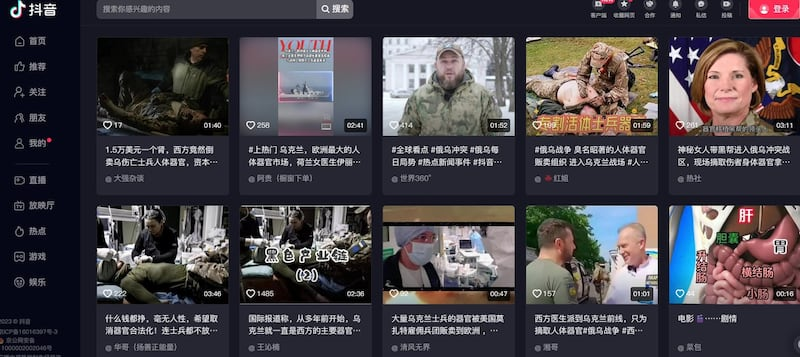
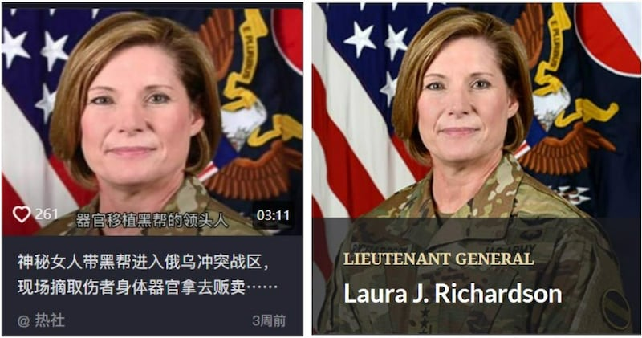
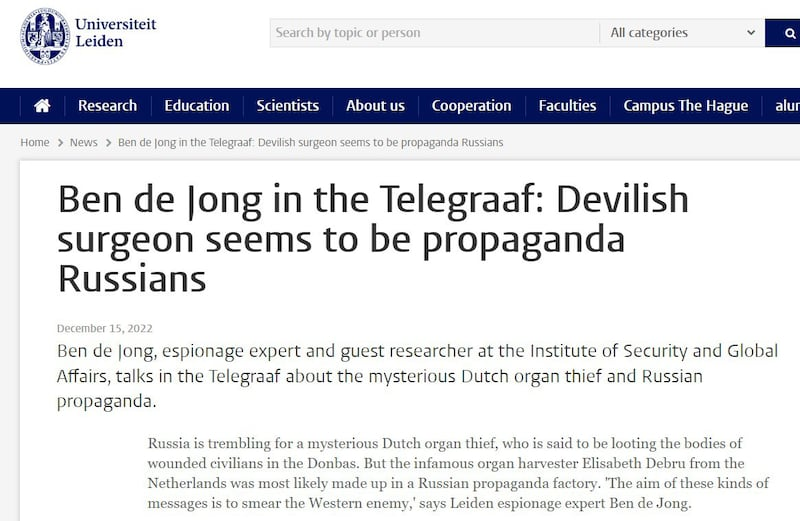
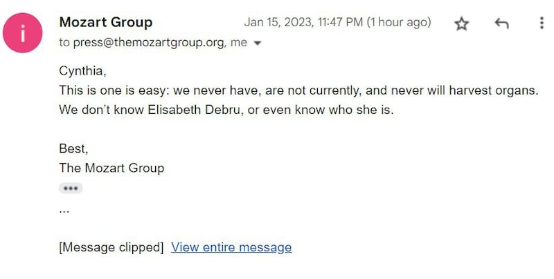

# 事實查覈 | 傷兵被割走器官，烏克蘭東部戰場成西方人體器官黑市？

作者：辛西婭

2023.01.18 08:17 EST

## 查覈結果：虛假

## 一分鐘完讀：

近日，多家中文網站發佈報道稱，有西方”無良醫生”潛入死傷慘重的烏克蘭東部巴赫穆特(Bakhmut)前線，悄悄割走烏克蘭傷兵的器官並運到歐洲販賣，由退役美軍組成的僱傭兵組織“莫扎特集團”(The Mozart Group)則負責全程護送。

經過查覈多家醫學專業網站、政府信息網站、事實覈查機構並採訪了莫扎特集團後，亞洲事實查覈實驗室判斷，西方醫生在戰場盜割烏克蘭傷兵器官的說法經不住技術、邏輯和證據的檢驗，屬於虛假信息。

器官移植作爲一項高度複雜的手術，對醫療設施、技術、醫護人員數量、手術時間都有複雜的要求，在戰場這種簡陋環境不可能成功實施。傳言中盜割器官的荷蘭醫生的現實身份無法覈實。同時發現，“盜割器官”作爲俄羅斯假信息的經典話題已流傳多年，此輪傳言不過是加了烏東元素的一個變體。

## 深度分析：

12月中旬以來，多家中文網站都在傳播一個消息：許多烏克蘭傷兵的器官在戰場上被醫生以救死扶傷的名義悄悄割走，然後運到歐洲出售，一個腎臟售價1.5萬美元。戰火中的烏克蘭已成爲歐洲最大的器官黑市，尤其是烏東頓涅茨克州的戰略重鎮巴赫穆特（俄羅斯名阿爾喬莫夫斯克）。

傳言還稱，這個器官盜竊團伙的主刀人是荷蘭女醫生伊麗莎白·德布魯(Elisabeth Debru)，而負責護送她的保鏢是來自民間組織“莫扎特集團”的三名工作人員，包括集團創始人、美國退役軍官安德魯·米爾本(Andrew Milburn)。傳言稱這個團伙早在2014年就曾在克里米亞戰場做案，近期又潛入巴赫穆特，是因爲烏克蘭軍隊在幾個月來的俄烏激戰中損失慘重，有大量重傷士兵的器官可供收割。

盜割烏克蘭傷員器官的流言，在抖音視頻上大量傳播。（圖/抖音網站截圖）

幾周來，這條驚悚的消息已傳遍網易、新浪、今日頭條等多家主流中文網站，微博、抖音等社交平臺上也有衆多自媒體賬號播報此事。

## 信息源於可信度極低的俄羅斯官媒

亞洲事實查覈實驗室查覈發現,該消息的最早來源是 [俄羅斯新聞社(RIA Novosti)於12月11日的報道](https://ria.ru/20221211/transplantologi-1837805402.html),之後被大量俄語和非主流英文網站和社媒轉發,並傳入中文網絡社區。

俄羅斯新聞社是俄羅斯政府出資支持的官方媒體。根據 [Media Bias Fact Check網站的評測,俄新社的信息來源"可疑",內容可信度"很低"](https://mediabiasfactcheck.com/ria-novosti-bias/)。作爲俄羅斯宣傳機構的一部分,俄新社經常發佈誤導性信息和虛假信息。一個代表性的例子是, [2022年2月下旬俄羅斯入侵烏克蘭不久,俄新社發佈了一篇俄羅斯大獲全勝的報道](https://www.bbc.com/news/technology-60562240)。雖然該文章不久後被俄新社迅速刪除,但網友已將它截屏翻譯並傳播到了英文世界。

## 戰場盜取器官無法安全移植

亞洲事實查覈實驗室查覈研讀 [美國美國衛生與公衆服務部(U.S. Department of Health and Human Services)官網](https://www.organdonor.gov/learn/process)得知,從技術角度來講,器官移植是一種非常複雜的醫學手術,對時間、流程、設施和操作人員都有嚴格要求。

首先, [人體器官的保質期非常短](https://www.organdonor.gov/learn/process/matching#criteria)。從離開捐贈者身體到植入受贈者身體,腎臟最多存活24~36小時,肝臟8~12小時,胰臟12~18小時,心臟和肺臟4~6小時。超過這個時限,器官就失去了移植的醫學價值。而且在這有限的存活期內,離體器官必須藉助專門的醫學裝置保存在類似健康人體的環境中,對氧氣、溫度、氣壓、存儲溶液都有特定要求,如需長途運輸就更加複雜。

其次,並非所有的器官都適合移植,患有免疫系統疾病、傳染病等疾病的人不適合捐贈器官。即使捐贈人身體健康,也 [需要和受贈人滿足多種匹配條件](https://www.organdonor.gov/learn/process/matching#criteria),血型匹配,免疫相容。故此,正常的器官捐贈流程都包括體檢、配型等步驟。

再次，器官移植手術的實施需要大型的專業醫護團隊和技術完善的醫療設施，除了主刀醫生、護士、麻醉師以外，還需要超聲、檢驗、輸血、病理、藥學、護理等多個科室人員的精密合作。因此，傳言中一個醫生加上兩三個志願者潛入戰場盜割傷兵器官，依前述專業信息推定根本不可能實現安全有效的移植。

## “荷蘭女醫生伊麗莎白·德布魯”極可能是虛構人物

在傳言中，器官盜竊團伙的主要人物是荷蘭女醫生伊麗莎白·德布魯，英文名Elizabeth Debru或Elisabeth De Brück。

亞洲事實查覈實驗室以這個名字的多種語言版本進行搜索,發現此人在有關烏克蘭器官盜竊的文章裏多次出現。比如2014年和2015年,就有"伊麗莎白·德布魯進入克里米亞戰場偷割烏克蘭戰士器官"的傳言。但是除了以上信息外,網絡上幾乎查不到與伊麗莎白·德布魯有關的其他任何內容。以盜割器官爲主題的網絡內容,都沒有可靠的圖片、視頻等信息來支撐傳言的內容。 [2015年聲稱德布魯在克里米亞作案的網絡內容中,使用的圖片是其他地方的盜圖](https://ru.krymr.com/a/27417348.html)。

近期在中文網絡社區中的報道中,許多關於傷兵的圖片和視頻,都來自一張身穿野戰服的女性圖片,比如 [抖音賬戶"熱社"的視頻](https://www.douyin.com/video/7178864704184487205)。亞洲事實查覈實驗室用谷歌圖片搜索發現,該 [照片中的女子其實是美國陸軍四星上將勞拉.J.理查森(Laura J. Richardson)](https://www.army.mil/women/profiles/)。"熱社"抖音短片中使用的圖片,是理查森將軍在美國陸軍官網上證件照的部分截取。

左：抖音視頻中聲稱的荷蘭女醫生伊麗莎白·德布魯；右：美國女軍官勞拉.J.理查森上將在美國陸軍官網的證件照。(圖片來源：抖音網站截圖及美國陸軍官網截圖)

亞洲事實查覈實驗室使用伊麗莎白·德布魯和器官盜竊、烏克蘭等關鍵詞在荷蘭語網站搜索,發現 [荷蘭新聞網站Telegraaf.nl在2022年12月15有篇文章探討相關傳言](https://www.telegraaf.nl/nieuws/290330123/duivelse-chirurg-lijkt-propaganda-russen),並 [採訪了荷蘭萊頓大學安全和全球事務學院的情報學專家Ben de Jong](https://www.universiteitleiden.nl/nieuws/2022/12/ben-de-jong-in-de-telegraaf-duivelse-chirurg-lijkt-propaganda-russen)。該專家稱,他們的研究認爲伊麗莎白·德布魯是個無中生有的虛構人物,由俄羅斯宣傳機構製造出來,對西方國家進行詆譭和抹黑。

根據Media Bias Fact Check網站的評測, [Telegraaf.nl屬於新聞可信度很高的保守派媒體](https://mediabiasfactcheck.com/de-telegraaf/)。

## 莫扎特集團回應：盜器官指控子虛烏有

在傳言中,與荷蘭女醫生伊麗莎白·德布魯一起潛入巴赫穆特戰場的人是美國僱傭軍組織莫扎特集團(Mozart Group)的三名成員,包括其創始人安德魯·米爾本(Andrew Milburn)**。**

莫扎特集團是由退伍軍人組成的一個民間安保組織，2022年3月起在烏克蘭實施人道救援、平民疏散、軍事培訓等非戰鬥型任務。

2023年1月15日，亞洲事實查覈實驗室向莫扎特集團官網發郵件詢問之後，莫扎特集團回覆郵件說：“我們以前沒有、現在沒有、將來也永遠不會盜取器官。我們不認識伊麗莎白·德布魯，我們甚至不知道這個人是誰。”

## “盜器官”、污名人道組織等話題在俄信息戰中長盛不衰

[Vox Ukraine網站分析俄羅斯對烏克蘭信息戰的一個報告](https://narratives.voxukraine.org/en.html)指出,"非法器官移植" "器官黑市"是俄羅斯信息戰中長盛不衰的話題之一。在過去的二三十年裏,許多發生武裝衝突的地方都有過類似的傳言,在烏克蘭也多次出現並隨着時事變化發展出多個變體。

2014年克里米亞戰爭爆發後,俄羅斯媒體發佈視頻稱,烏克蘭國家安全局SBU一名前僱員說烏克蘭政府聽從西方國家命令,在烏東地區盜取叛軍戰士的器官,主刀人是荷蘭女醫生伊麗莎白·德布魯。2015年12月,烏克蘭 [國家安全局在官網親自發聲明闢謠](https://ru.krymr.com/a/27417348.html),指出視頻內容不實,而且視頻中使用的多處圖片和視頻片段是從網絡盜來。

2017年,烏克蘭改進法律器官捐贈方面的法規之後,有傳言稱烏克蘭將大幅放寬器官移植法規,成爲歐洲最大器官買賣市場。烏克蘭事實查覈組織 [StopFake發視頻闢謠](https://www.stopfake.org/en/stopfake-152-with-irena-chalupa/)。

2019年11月,格魯吉亞親俄媒體宣稱,格魯吉亞前總統、擁有烏克蘭國籍的著名反俄鬥士米哈伊爾·薩卡什維利(Mikheil Saakashvili)和太太是器官移植網絡中的幕後大佬。 [格魯吉亞事實查覈組織Myth Detector發文闢謠](https://mythdetector.ge/en/repeated-lie-by-pro-kremlin-actors-about-trading-organs-of-ukrainian-soldiers/)。

2022年3月,俄烏戰爭剛開始,英文世界就有傳言稱烏克蘭士兵傷亡慘重,醫生現場收割傷兵器官,還有流動火化爐毀屍滅跡。 [加拿大情報機構CSE專門發推特闢謠](https://www.cbc.ca/news/politics/cse-russia-disinformation-1.6404933)。

2022年5月,有傳言稱國際紅十字會在馬裏烏波爾爲1000名烏克蘭兒童免費體檢,目的是建立器官配型檔案,併成爲器官移植網絡的備選資源。隨後 [紅十字會在官網發聲明闢謠](https://www.icrc.org/en/document/ukraine-online-video-mariupol-filled-false-claims),烏克蘭本地事實查覈組織 [StopFake也寫了闢謠文章](https://www.stopfake.org/en/fake-red-cross-collected-data-on-children-s-healthy-organs-in-mariupol/)。

2022年9月,有傳言稱烏克蘭軍隊強迫俄羅斯戰俘立下遺囑,同意將其器官出售到歐洲的器官黑市, [Vox Ukraine發文闢謠](https://voxukraine.org/en/ukraine-poisons-the-russian-military-and-forces-its-own-to-bequeath-their-organs-a-review-of-health-care-narratives-issue-14/)。

2022年11月，俄羅斯和烏克蘭在巴赫穆特連續鏖戰數月，該謠言又加入了莫扎特集團的元素。

這輪傳言中收割器官的幕後黑手，除了那個荷蘭女醫生外，又多了由退役美軍創建的民間組織莫扎特集團。

其實對西方人道救援機構的污名化，也是俄羅斯假信息的一個常見策略。上文所說的將國際紅十字會污衊爲器官黑市中一環，就是一個例子。

Vox Ukraine的報告發現, [有多個俄羅斯假信息宣稱慈善機構在烏克蘭貪污救助款,前來支持烏克蘭的外國志願者許多有犯罪記錄](https://narratives.voxukraine.org/en.html),等。敘利亞戰爭中的人道救援組織"白頭盔",也曾成爲俄羅斯虛假信息的受害者,被污衊進行違法犯罪甚至恐怖活動。

## 結論

綜上所述，近期中文網絡關於西方醫生和莫扎特集團在戰場盜取烏克蘭傷兵器官的說法，無論技術上還是邏輯上都立不住腳，且沒有現實證據支撐，屬於虛假信息。

*亞洲事實查覈實驗室是針對當今複雜媒體環境以及新興傳播生態而成立的新單位，我們本於新聞專業，提供正確的查覈報告及深度報導，期待讀者對公共議題獲得多元而全面的認識。讀者若對任何媒體及社交軟件傳播的信息有疑問，歡迎以電郵 [afcl@rfa.org](http://afcl@rfa.org)寄給亞洲事實查覈實驗室，由我們爲您查證覈實。*

[Original Source](https://www.rfa.org/mandarin/shishi-hecha/hc-01172023122619.html)