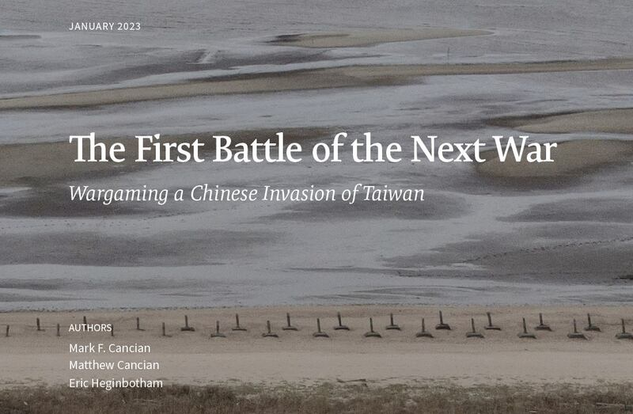
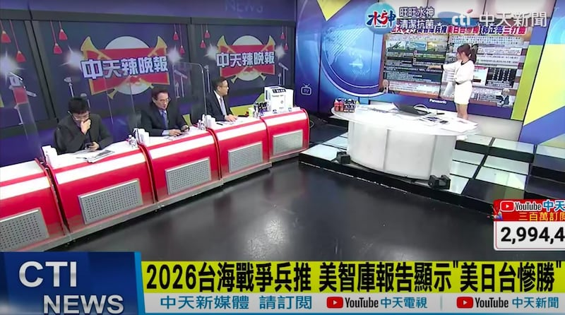
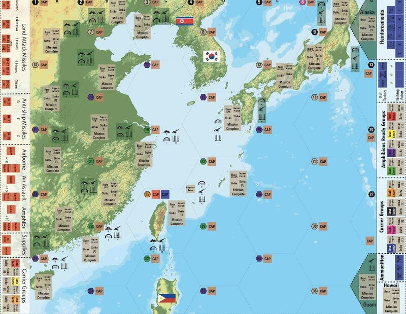
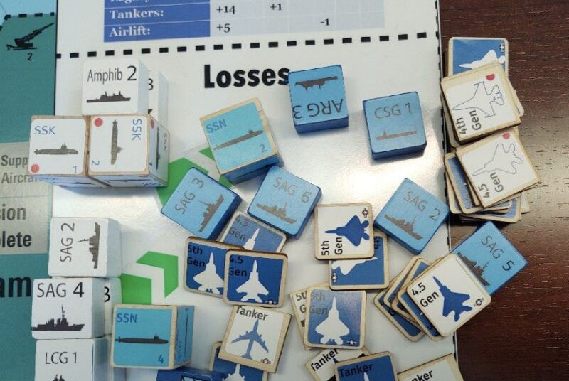

# 事實查覈 | 數字即勝敗？怎麼看美國智庫的解放軍侵臺兵推

作者：伊芙蔡

2023.01.19 11:26 EST

## 標籤：誤導

## 一分鐘完讀：

美國智庫“戰略與國際研究中心”（CSIS）一月九日發表一份中共攻臺的兵棋推演報告。在五種不同的預設情境下，以不同的限制因素及條件進行24輪推演，模擬在不同情境下，共軍發動攻臺戰役的可能結果。

這份報告在兩岸間引發討論，部分人士批評報告假設前提錯誤、低估臺美死傷人數、美日不可能真的全力與臺灣團結抗中，甚至質疑兵推報告只是在催促臺灣購買更多美製武器。

然而，亞洲事實查覈實驗室發現，部分評論內容並不精確甚或有錯誤。例如認爲報告高估臺灣陸軍，因爲面對共軍攻臺“竟然只死傷3500”人，事實則是在特定預設中，共軍部隊成功登岸的人數原本就不多。此外，包括“只設定解放軍東部戰區參戰”、“假定美日都很團結”等，都是錯誤評論。

CSIS發佈的兵棋推演報告名爲《下一場戰爭的第一戰：中國入侵臺灣的兵棋推演》(取自報告封面)

## 深度分析：

美國智庫“戰略與國際研究中心”（Center for Strategic and International Studies,CSIS）發佈的兵棋推演報告名爲《下一場戰爭的第一戰：中國入侵臺灣的兵棋推演》（The First Battle of the Next War: Wargaming a Chinese Invasion of Taiwan）。媒體報導指出，綜合24次兵推結果分析，若北京於2026年武力試圖統一臺灣，基本上將以失敗收場，但同時美國、日本、臺灣也會損失慘重，並導致美國的霸權地位將受到重創，持續多年。

報告激起臺灣政界、媒體界大量討論。前立委蔡正元在臺灣中天節目《頭條開講》中聲稱，該報告評估臺灣面對共軍攻臺，陸軍只有3500人傷亡，但中國如果要攻擊臺灣，將是飽和式的飛彈攻擊所有軍事設施、機場和油庫，怎麼可能才3500人傷亡？質疑“臺灣本事在哪裏？”諷刺CSIS的報告“純粹是在訓練該機構自己的智力，結果相當不足。”

中天節目《頭條開講》討論CSIS兵推報告。主持人引述論者聲稱兵推報告只設定解放軍東部戰區參戰，很荒謬。（當集網路影像截圖）

## 兵推報告如何評估人員死傷和軍隊耗損？

CSIS的兵推報告共成五種不同的預設情境，不同的情境進行一次或多次推演。五種預設和大致結果爲：

1. 基本預設(base)：推演3次，結果都是“趨勢不利中方的僵局”。

2. 悲觀預設(pessimistic)：推演18次，3次共軍直接失敗；在形成僵局的結果中，3次是傾向利共軍的僵局，7次是不利共軍的僵局。

在悲觀預設中，CSIS改變各種條件組合進行推演，例如“美軍較晚參戰”、“美軍不攻打中國本土”、“臺軍反應遲鈍”、“日本即使捱打也不進攻”等等。

3. 樂觀預設(optimistic)：推演1次，共軍3天內慘敗。

在樂觀預設中，CSIS改變各種條件組合進行推演，例如“日本立即參戰”“美軍可以使用日本機場”“共軍兩棲戰力較低”等等。

4. 臺灣單獨抵抗(Taiwan stands alone)：推演1次。設定美、日都袖手旁觀下，共軍自南部登陸後，第十週成功佔領臺北，但報告也指出，如果情況真的發生，臺灣可能不到十週就已經投降。

5. 諸神黃昏(Ragnarok，末日預設)：推演1次，爲設定“共軍一定勝利”的一個對照組。

報告強調除了“基本預設”之外，另四種設定了各種嚴肅的假設條件，爲的是排除可能的偏差。但第一種“基本情境”沒有什麼前提或限制，它讓各方（美、中、臺、日）都放手打，因此美國及其盟軍足以在共軍登陸前幾乎摧毀登陸船團，陸戰規模很小，登岸的共軍大半成爲戰俘。

不同情境下，各方陸、海、空軍力戰損不同。由此檢視郭、蔡兩人的評論，可以發現他們引用的只是兵推的其中一種結果，並非所有情況下國軍的傷亡都這麼“輕微”。例如在“臺灣單獨抵抗”的情境下，推估臺灣軍隊可能會有85000人傷亡，其中約28000人陣亡，傷亡人數相當於動員總兵力的半數。

CSIS兵棋推演使用的作戰地圖。（取自CSIS報告）

## 兵推假設美日臺都很團結？

《中國時報》一月10日刊出題爲“美國兵推的誤區”的社論，認爲兵推的結果是美方慘勝，但前提包括臺灣團結一致，美方投入戰爭的決心和速度，動用了全部力量，日本也全力支持美國等等，但這些前提在現實中“都不存在”。以此論證兵推的設定有很大的誤差。

但亞洲事實查覈實驗室發現，在“臺灣單獨抵抗”的情境中，爲了研究臺灣在沒有美國直接物質援助的情況下，能怎麼打這場仗，因此是假設美國仍處於觀望狀態，也沒有其他國家會干預。

“末日預設”則假設日本嚴格保持中立，也不允許美軍從它在日本的基地展開行動，希望得知美軍如何在沒有駐紮於日本的戰鬥機護航下，與臺灣軍隊對抗解放軍。報告特別強調，臺灣是否得到美、日支持，對於中國是否獲得優勢關係極大。

## 兵推假設解放軍僅使用東部戰區兵力？

中天電視節目引述郭正亮抨擊報告假設“中國只會動用東部戰區部隊”，這樣的設定太不現實，中國政府根本不可能這樣。在推特上也有許多相同或類似意見批評CSIS的兵推報告不夠務實。

報告作者之一，美國麻省理工學院國際研究中心學者何理凱（Eric Heginbotham）回覆亞洲事實查覈實驗室電郵詢問時明確表示，兵推過程已包含所有可能出動的解放軍部隊：海軍除了一小部分必須駐守在南海，其它可能參戰的艦艇全計入；兵推也計入了大部分可能參戰的解放軍空軍；在某些情境下甚至還包含火箭軍，至於地面部隊更不設限。何理凱強調，說兵推只涉及一個戰區是絕對不正確的。

CSIS兵棋推演中代表戰損而被移出的兵棋。（取自CSIS報告）

## 結論：

亞洲事實查覈實驗室發現，CSIS的兵推報告建立在一系列對“變量”的評估上，有些變量利於中國入侵，有些利於臺灣防禦。每次兵推控制不同變量，數量達到數十個。同時，這份兵推並不針對“美國是否應該保衛臺灣”表明立場，而是嚴格記錄了在各種情況下，美國保衛臺灣可能的結果，以及不同假設如何影響這些結果。

胡振東(Tony Hu)曾經服務美國國防部和美國在臺協會，他接受亞洲事實查覈實驗室訪問時認爲，CSIS兵推結果是爲了提醒各方，尤其是中國，戰爭不是解決方案。如果臺海終將一戰，侵略者只可能是北京，因爲臺灣和美國都不會主動攻擊中國，因此中南海必須正視這次的兵推結果。CSIS報告的目的也不是要建議臺灣向美方購買更多武器，這份研究第一個、也是最重要的發現是：臺灣若想生存，必須有反抗的意志，這會在很大程度上影響中國侵臺的結果。

胡振東也分析，兵推清楚表明，爲了減少美臺的損失和傷亡，使戰爭早日結束，從中國發動進攻的那一刻起，除了臺灣自身的意志，美國也必須迅速做出幫助保衛臺灣的決定；而日本能否在臺灣海峽周圍開展軍事行動的機場和港口，也將成爲影響結果的重要因素之一。包括北京的各方都應吸取教訓：戰爭的代價昂貴，根本不應啓動，也不會有真正的贏家。

*亞洲事實查覈實驗室是針對當今複雜媒體環境以及新興傳播生態而成立的新單位,我們本於新聞專業,提供正確的查覈報告及深度報導,期待讀者對公共議題獲得多元而全面的認識。讀者若對任何媒體及社交軟件傳播的信息有疑問,歡迎以電郵*  [afcl@rfa.org](http://afcl@rfa.org) *寄給亞洲事實查覈實驗室,由我們爲您查證覈實。*

[Original Source](https://www.rfa.org/mandarin/shishi-hecha/hc-01192023111307.html)