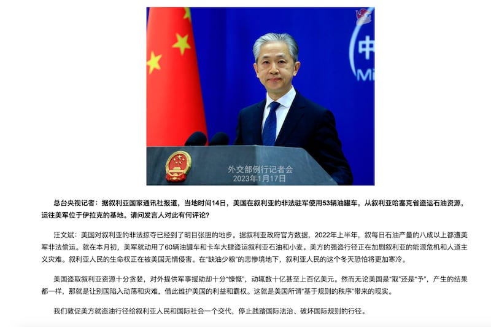
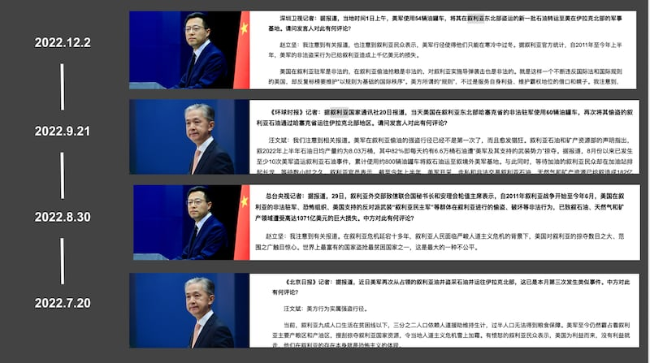
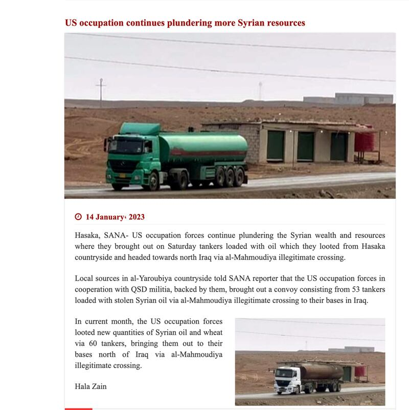
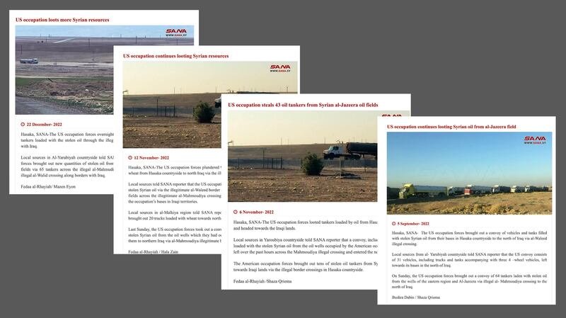

# 事實查覈 | 中國外交部稱美國從敘利亞”偷石油”？

作者：林濤

2023.01.20 12:06 EST

## 標籤：誤導

## 一分鐘完讀

1月17日，中國外交部發言人汪文斌再次指責美國在敘利亞“非法掠奪”石油是“強盜行爲”，在過去6個月中，中國外交部在例行發佈會上至少五次作出類似指控。亞洲事實查覈實驗室發現，中國外交部的指控證據源於敘利亞政府官方媒體，但原始報道中並未提供切實的“偷油”證據。

目前，敘利亞東北部爲反政府武裝組織”敘利亞民主力量”佔領區，位於大馬士革的敘利亞政府對該地區沒有控制權，美國在該地區確實有石油開採行爲，亦引起了不少爭議。然而，中國外交部的指控沒有提供足夠的背景信息，僅基於支持敘利亞政府的單方面立場發言，屬於誤導信息。

## 深度分析：

中國外交部網站顯示,在1月17日的例行記者會上,中央電視臺記者提問時引述敘利亞國家通訊社報道,稱美國的"非法駐軍"用53輛油罐車在敘利亞東北部哈塞克省"盜運石油資源",運往伊拉克北部地區。 [外交部發言人汪文斌回應,稱美軍行爲是"非法掠奪"、"強盜行爲"](https://www.fmprc.gov.cn/fyrbt_673021/202301/t20230117_11010127.shtml),並指責美國正在加劇敘利亞的人道主義災難。

1月17日記者會，發言人汪文斌稱美國在敘利亞“明目張膽”地“非法掠奪石油”。（圖/外交部網站截圖）

在過去的六個月中,中國外交部曾至少五次指控美國在敘利亞"偷油",每次均由參會的某一中國媒體引述敘利亞國家通訊社當時的報道提問,外交部發言人 [汪文斌](https://www.fmprc.gov.cn/web/fyrbt_673021/jzhsl_673025/202209/t20220921_10769226.shtml)、 [趙立堅](https://www.fmprc.gov.cn/web/fyrbt_673021/jzhsl_673025/202212/t20221202_10984381.shtml)都曾以強硬的語氣譴責美國在敘利亞"偷竊"、"掠奪"、"盜搶"石油資源。

中國外交部在例行發佈會上多次指控美國在敘利亞”偷油（圖/中國外交部網站截圖）

## “偷石油”指控來源何處？

經亞洲事實查覈實驗室溯源分析,央視記者引述、汪文斌回應的這條消息來源於 [敘利亞國家通訊社(SANA)於1月14日的短報道](https://sana.sy/en/?p=296753),該報道引述匿名當地信源,指控美軍用53輛油罐車偷盜石油,但並未提供更多詳細證據,報道的配圖爲一張油罐車行進的照片,但沒有標註照片來源和內容解釋。

敘利亞國家通訊社1月14日關於美國偷油的報道（圖/敘利亞國家通訊社報道截圖）

而此前中國外交部的幾次回應中，均引述了敘利亞國家通訊社的報道， 幾次事件非常相似，內容同爲匿名信源指控，並無更多證據信息，例如照片拍攝的具體地點，該通訊社對“美國偷油”報道中配發的新聞圖片有時會重複使用，圖中出現的油罐車的外型也不同。

敘利亞國家通訊社2022年12月、11月、9月關於美軍偷油的報道（圖/敘利亞國家通訊社報道截圖）

## 美國在敘利亞有石油開採行爲嗎？

事實上, [據媒體報道,美國企業在敘利亞東北部確實存在石油開採的活動。](https://www.cnn.com/2020/08/05/politics/syria-secretive-oil-contract-delta-force-ambassador/index.html)東北部石油問題在過去幾年中成爲敘利亞危機的焦點問題,對於美國在當地的資源開採行動,敘利亞、美國、俄羅斯、伊朗等國家持不同立場,對事實表述大相徑庭。

目前,敘利亞東北部爲反政府武裝組織敘利亞民主力量"佔領區,位於大馬士革的敘利亞政府對該地區沒有控制權。2020年,一家低調的美國油企Delta Crescent Energy與反政府力量簽訂了對當地原油的開採合同。 [據美國媒體Politco此前的報道](https://www.politico.com/news/2020/08/03/delta-crescent-energy-syrian-oil-391033),美國國務院並未披露過多細節,報道引述匿名信源表示,該開採活動受控制該區域的敘利亞民主力量和美國政府的保護。時任特朗普政府國務卿的蓬佩奧(Michael Pompeo)也曾在國會聽證中公開表示美國政府對開發敘利亞石油的支持,並提及相關石油交易已在進行中。

然而,協議受到敘利亞政府的強烈批評,"偷竊"一說自此開始。支持敘利亞政府一方的俄羅斯、伊朗和中國等國家也隨即就此事指責美國。因此,許多 [中國](https://news.cgtn.com/news/2022-08-24/BizBeat-Ep-467-Secure-or-steal-U-S-accused-of-stealing-Syrian-oil-1cLoJZoutP2/index.html)、 [伊朗](https://www.tasnimnews.com/en/news/2022/09/10/2772420/us-forces-continue-smuggling-syrian-oil-into-iraq)媒體也在報道這一事件中,採用敘利亞方面的立場,使用同樣"偷竊"、"掠奪"的詞彙描述美國的行爲。

在美國,該石油開採協議在2020年簽訂後,多家國際和美國國內媒體、 [智庫](https://www.washingtoninstitute.org/policy-analysis/delta-crescent-energy-refining-us-stabilization-strategies-northeast-syria)等對其進行了報道,亦有媒體和評論表達了對該政策的不滿。CNN等媒體的報道稱 [該協議爲祕密簽訂](https://www.al-monitor.com/originals/2020/07/us-oil-company-deal-syria-kurds-kobani-turkey-russia-sdc-sdf.html), [並指出該油企有政治和軍方背景](https://www.cnn.com/2020/08/05/politics/syria-secretive-oil-contract-delta-force-ambassador/index.html)。

有消息顯示, [該公司的開採行爲目前或已停止](https://www.al-monitor.com/originals/2021/05/biden-administration-poised-ax-us-oil-companys-waiver-kurdish-led-northeast-syria)。2021年,Delta Crescent Energy的開採許可過期,曾有報道稱拜登政府將不再繼續支持該項操作。 [2022年11月,Esquire發表的一篇報道中,](https://www.esquire.com/news-politics/a41902965/syria-oil-delta-crescent/)披露了大量Delta Crescent獲得該項合同的的經過,以及該公司與拜登政府執政後遇到的困境。目前,對於美國軍方或私營企業在敘利亞的活動公開報道不多,但2021年,曾經批准Delta Crescent的採油合同, [美國財政部外國資產控制辦公室(OFAC)進一步允許在敘利亞進行支持"非盈利"目的的投資活動,其中就包括石油工業](https://www.federalregister.gov/documents/2021/11/26/2021-25802/syrian-sanctions-regulations)。

## 【查覈結論】

美國軍隊在敘利亞東北部開採石油的行爲確有其事，報道顯示美國一油企與敘利亞反政府武裝的協議曾收到上一屆美國政府的支持，在美國國內、國際上也引發了一些爭議。然而，中國外交部對美國軍隊在敘利亞“偷竊石油”、“強盜行徑”一說，是依據單一信源，基於支持敘利亞政府的立場所做出的指控。該指控故意忽略了敘利亞石油爭端的複雜事實背景，是誤導信息。

敘利亞苦戰已久，長達十一年的內戰衝突中，美國、俄羅斯、土耳其、伊朗、阿拉伯各國等多方勢力介入，其背後的軍事、政治、和經濟錯綜複雜。戰爭衝突中的信息通常帶有單方的立場和利益傾向，要想了解事實全貌，還需多方兼聽，理性判斷。

*亞洲事實查覈實驗室是針對當今複雜媒體環境以及新興傳播生態而成立的新單位,我們本於新聞專業,提供正確的查覈報告及深度報導,期待讀者對公共議題獲得多元而全面的認識。讀者若對任何媒體及社交軟件傳播的信息有疑問,歡迎以電郵*   [*afcl@rfa.org*](mailto:afcl@rfa.org)  *寄給亞洲事實查覈實驗室,由我們爲您查證覈實。*

[Original Source](https://www.rfa.org/mandarin/shishi-hecha/hc-01202023120107.html)