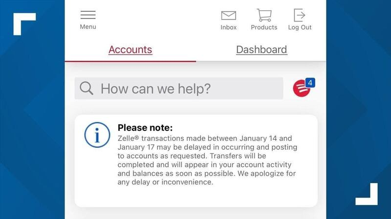
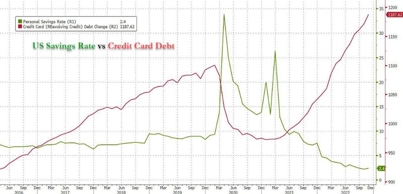
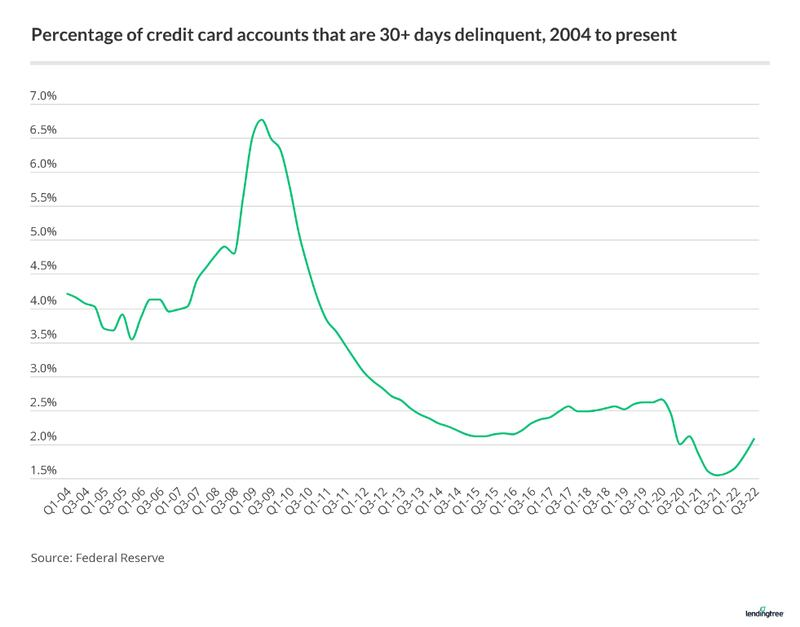

# 事實查覈 | 美國的銀行系統要出大事了嗎？

作者：何亮

2023.01.26 11:44 EST

## 標籤：謠言

## 一分鐘完讀：

近日，隨着美國居民儲蓄率的走低和信用卡債務的提高，中國媒體和社交媒體上出現了不少“美國經濟即將崩潰”的評論，網帖和媒體報道中美國銀行出現的暫時事故被誇大傳播爲所謂”美國金融系統面臨風險”。

2023年1月20日,擁有600多萬粉絲的微博賬號"孤煙暮蟬"在微博上援引美國自媒體博主的視頻,稱" [美國許多銀行無法提取現金,銀行也未告知不能提取的原因](https://m.weibo.cn/detail/4860285670654618) "引發公衆關注;同時,上海報業集團旗下的財經媒體《界面新聞》也刊發了報道《 [美國消費者扛不住了:儲蓄率新低、信用卡債務和利率新高,銀行預計壞賬激增](https://36kr.com/p/2095967825363330) 》,引發大量財經媒體轉發。報道提到美國Capital One銀行也開始大規模裁員,並引用美國財經媒體Zero Hedge的言論,稱美國消費者已筋疲力盡,美國經濟將迎來災難性的後果。

而據亞洲事實查覈實驗室查閱英文原始資料，結合美聯儲數據和銀行發佈的信息，以上媒體所報道的案例均是虛假陳述。

中國大陸網紅博主孤煙暮蟬微博截圖

## 深度分析：

2023年1月18日，TikTok用戶Smashdatopic發佈了一條短視頻，視頻是在美國銀行（BOA）的一個門店裏拍攝的，店內有十名客人正在排隊等待。該用戶說：“每個人都丟了錢，美國銀行沒有經過客戶同意就把錢拿走了，這太瘋狂了。”

他詢問在場的一名客人是否也丟了錢，得到了肯定回答，他並在視頻中表示，自己賬上的1400美金不翼而飛，但是美國銀行的客服代表卻無法給出任何解釋。

同一天，不少Twitter用戶也在發帖，質問美國銀行和Zelle公司，自己從Zelle轉到美國銀行賬戶的錢怎麼不見了。比如用戶Marisol Mendez和Weather, man都曬出了自己手機銀行的賬戶截圖，表示同樣的事情也發生在自己身上。民主黨參議員Elizabeth Warren當日也在Twitter上發起了對美國銀行公司和Zelle公司的抨擊，她說：“美國銀行和Zelle顯然又讓客戶們失望了。錢從賬戶上消失不見，這必須馬上得到解決而且客戶必須得到補償。”

美國銀行當日就作出了回應，通過其客服系統向用戶發消息解釋並道歉說：“從1月14日至17日，經Zelle進行的轉賬可能會出現延遲，轉賬會盡快完成並且有效金額會出現在您的賬戶裏。我們爲這樣的延遲和由此給您帶來的不便表示歉意。”

美國銀行羣發給客戶的解釋信息截圖

這一風波在美國很快平息，但是在中國互聯網上，該事件被愛國網紅博主改頭換面，成爲美國的金融系統出現危機的一個例證。

北京時間1月20日晚，擁有600多萬粉絲的微博大V孤煙暮蟬截取了上述那條關於美國銀行的視頻，並稱“美國’許多銀行’無法提取現金，銀行也未告知不能提取的原因。”有微博用戶在其評論區提醒她“美國銀行（BOA）不是美國的許多銀行，”但更多網民則是順勢調侃美國金融業出現了問題，即將“崩潰”。

亞洲事實查覈實驗室近日訪問美國銀行的多家門店，詢問在場顧客和客服人員，均沒有發現還有類似問題發生，銀行客流量也很正常，並沒有發生擠兌或者取不出來錢的情況。

主流中文媒體聚焦美國經濟衰退的報道近日也屢見報端。

就在孤煙暮蟬發佈那條消息的同一天，上海報業集團旗下的財經媒體《界面新聞》也刊發了報道《美國消費者扛不住了：儲蓄率新低、信用卡債務和利率新高，銀行預計壞賬激增》，引發大量財經媒體轉發。

報道主要引用了美國財經媒體Zero Hedge的數據分析，並稱隨着信用卡債務創新高和居民儲蓄率創新低，美國經濟出現危險的信號，已經瀕臨暴雷的邊緣——“就像一個充滿火藥的火藥桶，在爆炸前只等待一絲火星”。

Zero Hedge製作的2016-2022美國居民銀行儲蓄率和信用卡債務數據曲線圖，該圖亦被《界面新聞》引用

爲了證明銀行已經舉步維艱，該報道列舉了一些具體案例，包括有着5萬員工的Capital One信用卡公司最近進行了大規模裁員。報道說：“裁員可能波及到該公司的技術部門，總裁員人數將超過1100個技術崗位。”

而亞洲事實查覈實驗室查詢Capital One披露的信息發現，Capital One並非因受到壞賬影響進行“裁員”，而是調整了內部產品線的佈局，將其中一個項目的1100名員工整合到其他部門中。

關於《界面新聞》引用的信息源媒體Zero Hedge，亞洲事實查覈實驗室也發現其數據分析和評論存在明顯的傾向性。比如說關於信用卡負債額的走高，Zero Hedge將2020年之後的情形與2009年前後的金融危機做對比，預告新一輪金融危機將至，違約潮即將來臨，小型信用卡公司將崩潰。

但根據美聯儲發佈的信息，儘管2022年以來美國信用卡用戶的負債率走高情形與2009年前後相似，但關鍵的“30天拖欠率”（30-day delinquency rate）卻始終很低，只有2%左右，遠低於疫情前的水平，而2009年大衰退期間，居民超期拖欠信用卡的這一數字峯值曾超過6.5%。

美國在線借貸平臺Lendingtree日前發佈 [數據分析](https://www.lendingtree.com/credit-cards/credit-card-debt-statistics/) ,直觀顯示了近年來信用卡拖欠率的走低,即便是在疫情期間有所波動,但仍舊是低位波動。

美國信用卡30天拖欠率歷史數據 製圖：lendingtree

居民儲蓄率之所以顯示出大幅下降,也有疫情期間儲蓄率飆升的背景。清華大學金融科技研究院下屬的金融科技網站"未央網"學說平臺於2022年8月 [發表文章](https://www.weiyangx.com/411487.html) ,分析美國個人儲蓄率大起大落的原因,指出新冠肺炎疫情爆發後,人們的儲蓄激增,此前這一數據長期在10%以下,但卻在2020年4月飆升至33.7%。這時候的上升不僅是因爲疫情期間居民的預防性儲蓄,也有由於企業業務停滯而造成消費渠道減少和各類經濟刺激計劃增加了人們的個人收入的原因。疫情後的下降,更多是因爲"回落到了疫情之前的水平",與2009年的儲蓄率走低有着本質的區別。

亞洲事實查覈實驗室注意到,被《界面新聞》引用的Zero Hedge本身在主流媒體界也曾受到很多批評,比如2016年的時候,它被彭博社(Bloomberg)批評爲" [金融行業前沿新聞、謠言和八卦"的來源](https://www.wealthmanagement.com/commentary/smith-we-are-all-zero-hedge-not-just-wall-streeters) 。2022年2月,美聯社曾援引美國情報官員的話,指Zero Hedge散佈俄羅斯製造的謠言。

## 結論：

疫情之後，美國的儲蓄率、信用卡債務數字均出現了一些波動，中國的宣傳系統在這一背景下，尋找各種可以加工的信息積極唱衰。無論是面向大衆讀者的網紅，還是官方背景的專業媒體，均涉嫌歪曲原始資訊，傳播虛假信息，營造“美國金融系統即將崩潰”的輿論效果。

*亞洲事實查覈實驗室是針對當今複雜媒體環境以及新興傳播生態而成立的新單位，我們本於新聞專業，提供正確的查覈報告及深度報導，期待讀者對公共議題獲得多元而全面的認識。讀者若對任何媒體及社交軟件傳播的信息有疑問，歡迎以電郵  [afcl@rfa.org](http:// afcl@rfa.org)寄給亞洲事實查覈實驗室，由我們爲您查證覈實。*

[Original Source](https://www.rfa.org/mandarin/shishi-hecha/hc-01262023113603.html)