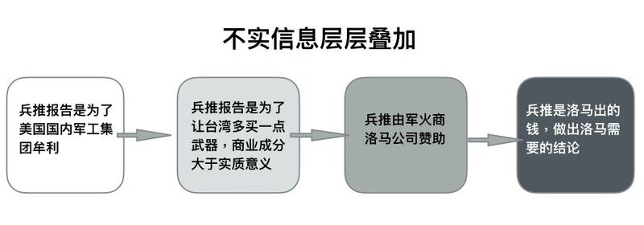

# 事實查覈 | 查覈筆記：謠言和偏見的四條演化路徑

作者：李志德

2023.01.27 10:58 EST

臺灣海峽情勢近年來一直是國際關係的熱點議題。亞洲事實查覈實驗室日前發表了兩篇查覈報告: [美國智庫"戰略與國際研究中心"(CSIS)發表的共軍攻臺兵棋推演報告](https://www.rfa.org/mandarin/ytbdzhuantixilie/shishi-hecha/hc-01192023111307.html) ,以及 [美國國防授權法案中的臺灣學人計劃](https://www.rfa.org/mandarin/ytbdzhuantixilie/shishi-hecha/hc-01052023105609.html) 。

查覈的過程中我們發現，許多錯、假信息都是由一個“核心信息”層層疊加而成，就像在篩子上打滾的元宵，愈滾愈大，並且在網頁、Twitter、微博或者YouTube等平臺上，以不同的變形版本頑強地流傳。

也有些錯假元素如同天外飛來一樣附加在主要信息上。茫茫網海，只以手動查覈，幾乎無法溯源。但不管來自“變形”或“增生”，不同類別的虛假信息有個共同特色：不會因爲被查覈了就停止傳播。因此我們除了新聞查覈，也試圖辨認虛假信息的“核心元素”如何出現，又怎麼在各種平臺上變形、傳播。我們梳理出“演化路徑”共有四種：

## 第一條：以偏蓋全

進入網路時代的媒體，比以往任何一種媒體更重視時效。而且不僅平面報導，評論、圖表、影音等產品都要儘快上線。我們發現，許多錯假信息，都來自第一時間，根據不完整的信息所做成。例如前述CSIS的兵推報告在2023年1月9日經由美國有線電視新聞網(CNN)報導，包括臺灣“中天電視”等網路或有線電視臺當天或隔天就製作成論壇節目，節目中引用的，就只有報導引用的部分內容，但許多散佈錯假訊息的節目或評論人，卻誤以爲這些被報導的內容，就是報告的全部。

我們更發現，部分媒體機構或評論人，不會隨著其它媒體的報導而逐步自我修正原本的錯誤信息，而是就著同一類，甚至同一則錯誤信息反覆引用；又或者在同一機構，或者立場相近的媒體或節目間交相引用。

## 第二條：信息的疊加和變形

CSIS兵推報告披露後第二天，國臺辦在例行記者會上做了回應，除了宣示政治立場，發言人馬曉光特別強調這份兵推報告的目的是“爲其(美國)國內軍工集團牟利”。

“兵推報告是爲軍火商牟取利益”這樣的訊息不只在國臺辦的聲明中，也在1月11日臺灣重要新聞頻道TVBS《少康戰情室》節目上成爲多位評論者的共同意見，其中包括一位民進黨籍立法委員也認爲，美軍航空母艦在兵推中被擊沉是不可能的，因此這場兵推只是爲了“臺灣多買一點武器，商業成分大於實質意義。”

“兵推爲軍火商牟利”這樣的主題，在中國社交媒體上，進一步變形爲這場兵推由軍火商“洛克希德馬丁(Lockheed Martin)公司贊助”，不管是微博或簡體中文推特，都可以發現類似說法。

在微博上可以見到不少關於“洛馬公司贊助CSIS兵推”的信息。

再進一步,一些網紅型學者、專家攝製的短影音中,也不乏直播主直接點名兵推就是軍火商出錢贊助。例如中國極其知名"學者網紅"金燦榮在"  [解放軍慘敗?金燦榮:美智庫兵推臺海衝突報告,給中國挖了一個大坑](https://www.youtube.com/watch?v=wl0wPMs_fkE) "這部影片中就直言:"(兵推報告是)洛克希德馬丁出的錢,洛馬需要的結論"。

金燦榮上述影音吸引了九萬五千人次觀看，除了批評報告是軍火商贊助，他更指這份報告是美國向中國民衆發動的認知戰，“美國爲什麼允許那麼多機構搞兵推，它是有認知戰效果的。......是信息戰、心理戰的一部組成部分，太認真你就上當。”

事實上，CSIS已經在報告中披露經費來自於史密斯·理查森基金會(Smith Richardson Foundation)。根據官網介紹，這個基金會在1935年成立，旨在研究、討論美國面臨的嚴重公共問題。兵推報告中沒有提到洛馬公司，在前文提及的批評者也沒有舉出可信的證據，證明洛馬公司贊助了這份報告。

## 第三條：去脈絡的誤解

把訊息的部分內容從原本的脈絡裏抽離後單獨呈現，並且加上報導或評論者個人的詮釋，這是另一種產生不實訊息的途徑。例如2022年底通過的美國《國防授權法案》中包含了官員以公費到臺灣留學的“臺灣學人計劃”，就被臺灣一份主要報紙在12月27日的社論中形容爲：美國派官員來臺“監軍”。同時引申批評：

“一個國家的行政及立法部門可以任意讓外國官員進駐，這是聞所未聞的事。”“臺灣在美國監軍下如何維持主權獨立？”“難道臺灣已淪爲美國的託管國？”等等。

網路媒體《風傳媒》也引述一位政治評論者的“個人判斷”認爲這些來到臺灣的“學人”，“背後一定代表著各種力量，包括軍方、商務部與中情局等”。

另一個例子在微博平臺，一位博主批評CSIS的兵推報告中爲求美軍勝利，竟然設定中共中央軍委直接“扣留”了東風26型導彈。但報告中的設定的情況是因爲東風26導彈可以選擇配備一般彈頭或核彈頭，因此中央軍委保留了一部分東風26，以便在需要時換用核彈頭。

## 第四條：不明來由的元素

在事實查覈過程中，我們也發現了一些流傳在媒體或者社羣平臺上，但難以溯源的不實信息。例如臺灣多家網路及電視新聞臺的評論員都提到，CSIS的兵推假設解放軍“只出動東部戰區兵力”，這樣的訊息沒有經過覈實查證，就在評論人之間反覆討論，形成虛構的“議題”。這一段討論，再被製成一則20秒的短影音，在網路及其它社交平臺流傳。

不只在臺灣,在YouTube平臺上,一名以爲廣東話發聲的博主,也在名爲" [CSIS兵推報告是爲軍工集團騙錢 曝光設定條件解放軍等同二戰美軍](https://www.youtube.com/watch?v=mdweAdaIY2o)  "的影片中提到兵推中"解放軍只出動東部戰區兵力",這一條影音,一週之內吸引了超過5萬次觀看。

由於難以追溯訊息的源頭，亞洲事實查覈實驗室撰稿人於是以電郵向報告作者何理凱（Eric Heginbotham）查證，他在回覆的電郵中明確表示，兵推過程已包含所有可能出動的解放軍部隊，可能參戰的海、空軍也都計入，只設定投入一個戰區的說法，絕對不正確。

臺灣一位不具名的戰略學者一語道破：“光看戰損，也就絕對不只東部戰區了吧。”

*亞洲事實查覈實驗室是針對當今複雜媒體環境以及新興傳播生態而成立的新單位，我們本於新聞專業，提供正確的查覈報告及深度報導，期待讀者對公共議題獲得多元而全面的認識。讀者若對任何媒體及社交軟件傳播的信息有疑問，歡迎以電郵  [afcl@rfa.org](http://%20afcl@rfa.org)寄給亞洲事實查覈實驗室，由我們爲您查證覈實。*

[Original Source](https://www.rfa.org/mandarin/shishi-hecha/hc-01272023104414.html)