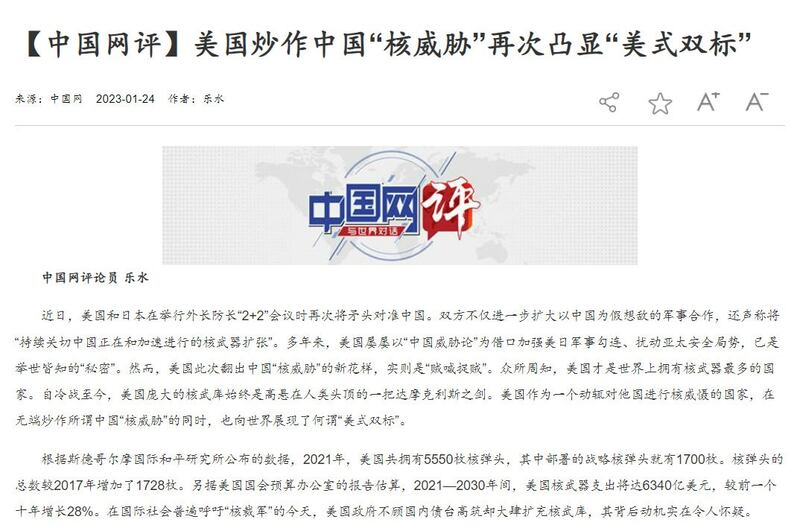
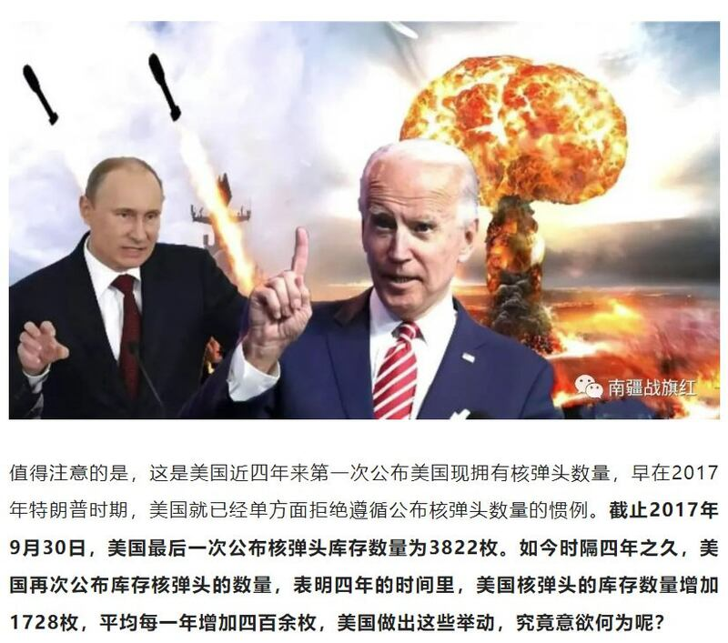
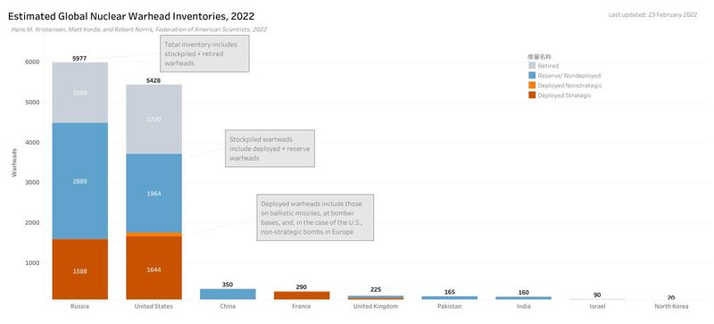
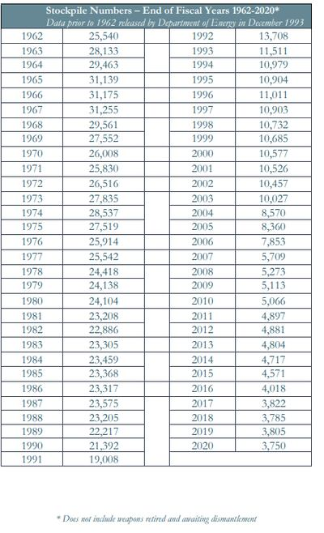

# 事實查覈│美國最近大幅增加了核彈頭裝備嗎？

作者：沈軻

2023.02.08 11:20 EST

## 標籤：錯誤

## 一分鐘完讀：

近日,中國國務院新聞辦下屬網站中國網發表文章,稱 [美國核彈頭的總數自2017年以來增加了1700多枚,譴責美國在覈武器問題上玩"雙標",大肆擴充核武庫。](http://www.china.com.cn/opinion/2023-01/24/content_85072540.html)最近一年來,這一指控屢次被中國媒體及評論員提及。

經覈查，亞洲事實查覈實驗室發現，中國網等媒體引用的“證據”原文中沒有支持這一指控的內容。而所有可靠信源都顯示，美國的核彈頭存量在過去五年中並沒有增加，反而有所削減。

中國網發表譴責美國擴充核武器軍備，大幅增加核彈頭的評論文章截圖

深度分析：

亞洲事實查覈找到找到的最早批評美國自2017年以來增加核武庫的是軍事新聞博主"南疆戰旗紅"。2021年10月12日,其微信公衆號發佈了一篇署名爲呂遊的文章: [《美國爲何願意公佈核彈數量了?看似坦誠,實則別有用心》](https://mp.weixin.qq.com/s/e5VuCwrUfKn0BXIZ1JKCzw)。這篇文章在描述美國核力量的統計數據時說:

“美國再次公佈了其儲存核彈頭的數量。在四年時間裏，美國的核彈頭增加了1728枚，平均每年超過400枚。”

軍事自媒體博主“南疆戰旗紅”描述美國擴充核武器軍備的文章截圖

截至 2022 年，全球核彈頭的估計總數。來源：美國科學家聯合會；製圖： Hans M. Kristensen、Robert Norris 和 Matt Korda

## 1,728枚“新增核彈頭”是怎麼算出來的？

從去12月以來,有一些 [報道](https://www.163.com/dy/article/HNJJ63LM0553OSEI.html)和 [評論](https://www.163.com/dy/article/HNGO3IA00553FR70.html)引用了"南疆戰旗紅"提出的美國增持核彈頭的這一數據,而最近的中國網評論文章則援引了斯德哥爾摩國際和平研究所(SIPRI)的數據來試圖支持"1727枚核彈頭"的說法。

亞洲事實查覈實驗室檢查了過去幾年SIPRI國際安全總結報告的英文和中文版本，並沒有發現這樣的數字。該機構最新的報告估算，美國在2022年1月的核彈頭爲3708枚，少於2017年公佈的數字。

此外,"南疆戰旗紅"在其微信公號中表示其數據來源爲美國國務院的報告。而亞洲事實查覈實驗室查閱了 [美國國務院的公開報告](https://www.state.gov/transparency-in-the-u-s-nuclear-weapons-stockpile/),也沒有發現承認增加了1728枚核彈頭的內容。

相反,美國國務院的報告明確顯示,美國現役核彈頭的總數從2017年的3822枚下降到2020年的3750枚。與此同時,美國解除了1065枚退役核彈頭。這些數字與SIPRI的報告相符,並被 [原子科學家](https://thebulletin.org/premium/2022-05/nuclear-notebook-how-many-nuclear-weapons-does-the-united-states-have-in-2022/')和 [美國科學家聯合會](https://fas.org/issues/nuclear-weapons/status-world-nuclear-forces/)等可信第三方組織引用。

亞洲事實查覈中心發現，2021年SIPRI的報告中有提及美國的核彈頭庫存（inventory）總數是5550枚，其中包括現役和退役的。中文媒體疑似是用這個總數減去2017年現役的核彈頭數量（3822枚），從而剛好得到了“新增”1728枚的數字。

如果是按總數計算，2017年的現役和退役核彈頭的總數應該是6,450枚，2021年的5550枚與之比較減少了900枚。

## 美國核武庫自2017年以來有過擴張嗎？

雖然美國核武器的總數在過去五年來有所減少,但拆除速度並不快,且過程中 [存在一些反覆](https://fas.org/blogs/security/2021/10/nuclear-stockpile2021/)。

自 1962 年以來，美國在役核彈頭的年度數量。來源： 2021 年國務院報告《美國核武器庫存信息公開》

上述國務院報告顯示，在2018年和2019年之間，美國現役核彈頭的儲備增加了20枚，從3785枚增加到3805枚。這是自1997年以來，美國首次，也是唯一的一次年度核彈頭增加，但是2020年又減少了55枚，整體呈削減趨勢。

## 結論：

最近五年來，國際國內的權威報告和數據均顯示美國並沒有在“大肆擴充核武軍備”，儘管在減核過程中存在一些波動，但整體來說核武器數量是在不斷削減。中國網和軍事博主關於美國增加1728枚核彈頭的指控沒有任何依據，屬於虛假信息。

*亞洲事實查覈實驗室(Asia Fact Check Lab)是針對當今複雜媒體環境以及新興傳播生態而成立的新單位,我們本於新聞專業,提供正確的查覈報告及深度報導,期待讀者對公共議題獲得多元而全面的認識。讀者若對任何媒體及社交軟件傳播的信息有疑問,歡迎以電郵*   [*afcl@rfa.org*](mailto:afcl@rfa.org)  *寄給亞洲事實查覈實驗室,由我們爲您查證覈實。*

[Original Source](https://www.rfa.org/mandarin/shishi-hecha/hc-02082023110504.html)