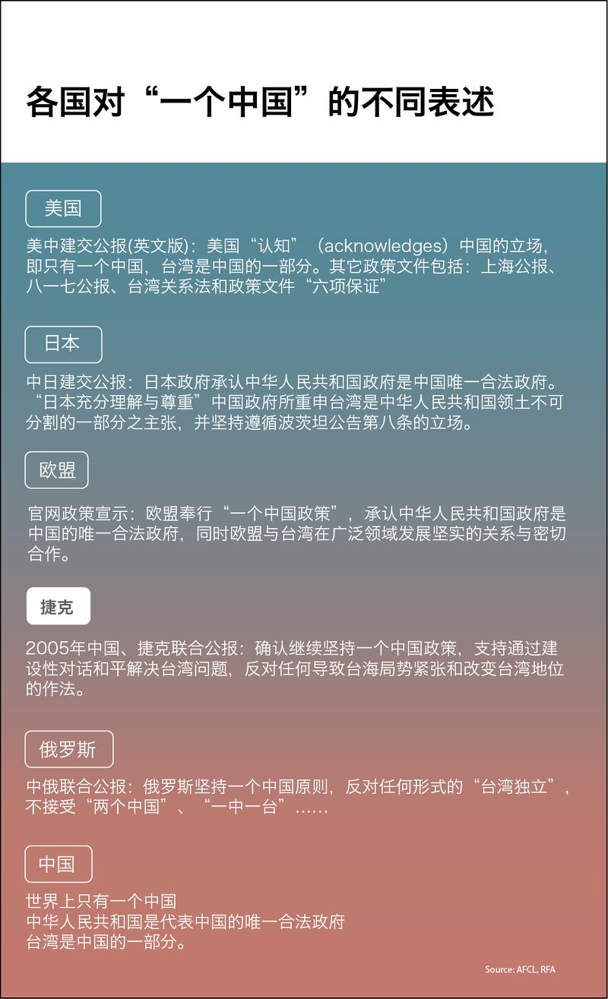

# 事實查覈│和蔡英文通電話，捷克準總統違背了“一中原則”的政治承諾？

作者：莊敬

2023.02.10 10:23 EST

## 標籤：誤導

## 一分鐘完讀：

捷克總統當選人彼得·帕維爾（Petr Pavel）1月30日與臺灣總統蔡英文通電話。中國外交部指帕維爾此舉公然違背捷方作出的“堅持一箇中國原則”的政治承諾，並敦促捷方立即糾正錯誤，以實際行動恪守“一箇中國原則”。捷克方面回應，堅持自己的“一箇中國政策”。

世界各國與中國發展外交關係時，都會應中國的要求，對於“一箇中國”做出表態。許多國家將相關政策稱爲“一中政策”(one China policy)，但不同國家的政策內涵各不相同，有時和中國定義的“一中原則”(one China principle)差異很大。中方卻經常單方面宣稱其他國家已經承諾堅持、恪守“一中原則”，實屬誤導訊息。

## 深度分析：

帕維爾1月30日在 [推特發文](https://twitter.com/general_pavel/status/1620072512532127750)表示已與蔡英文通話,感謝她致賀當選,並表達希望未來能親自見面。臺灣的總統府發言人林聿禪轉述,蔡英文與帕維爾於30日晚間6時舉行電話會議,通話近15分鐘。

捷克與臺灣不具正式外交關係，路透社報導指兩人通話“非比尋常”，是臺灣外交工作的突破。

中國外交部發言人毛寧在 [1月31日例行記者會](https://www.mfa.gov.cn/web/fyrbt_673021/202301/t20230131_11017020.shtml)被問及相關問題。她說:"帕維爾罔顧中方多次勸阻和交涉,執意與蔡英文通電話,同臺灣當局開展官方往來,嚴重干涉中國內政,公然違背捷方作出的堅持一箇中國原則的政治承諾,向'臺獨'分裂勢力發出錯誤信號。"

毛寧並說，“世界上只有一箇中國，臺灣是中國領土不可分割的一部分。臺灣問題事關中國主權和領土完整，是中方的核心利益，也是中國同建交國發展關係的政治基礎。中方敦促捷方立即採取有效措施，糾正錯誤，消除該事件的負面影響，以實際行動恪守一箇中國原則。”

值得注意的是，毛寧回答全文使用的都是“一箇中國‘原則’”，同時“世界上只有一箇中國，臺灣是中國領土不可分割的一部分。”這樣的措辭，是中國對“一中原則”的標準表述。

## 捷克與歐盟 採行“一箇中國政策”

路透1月31日報導，捷克總理費亞拉（Petr Fiala）透過聲明指出，“捷克尊重並堅持自己的一箇中國政策。作爲一個主權國家，我們自己決定與誰通電話以及與誰會面。”

捷克駐中華人民共和國大使館網站表明，捷克與歐盟採行“一箇中國政策”。 捷克與臺灣未建交，但在非官方層面合作，特別是在經濟、貿易、文化、教育、科學和旅遊等領域。

身爲歐盟一員的捷克,在"一中政策"的表述上,和歐盟立場一致。歐盟執委會發言人在 [例行記者會](https://www.cna.com.tw/news/aipl/202301310347.aspx)答覆提問時表示,歐盟及會員國長期採取"一箇中國政策",並在其架構下與臺灣交往。

歐盟奉行的" [一箇中國政策](https://www.eeas.europa.eu/taiwan/european-union-and-taiwan_en?s=242)",承認中華人民共和國政府是中國的唯一合法政府;同時歐盟與臺灣在廣泛領域發展堅實的關係與密切合作。

## 美國的“一中政策”與中國立場明顯不同

除了歐盟會員國，美國的“一中政策”已實行數十年，其歷史與實質內容較爲複雜，與中國採行的“一中原則”差異甚大。

美方長期實行“一中政策”，它由國內法、外交公報及政策文件來定義。包括：《臺灣關係法》、美中三個聯合公報 —-1972年《上海公報》、1979年《建交公報》、1982年《八一七公報》，以及被稱爲“對臺六項保證”的政策文件。

1979年1月1日，美國與中華人民共和國互相承認並建立外交關係。《建交公報》記載：美國承認中華人民共和國政府是中國的唯一合法政府。在此範圍內，美國人民將同臺灣人民保持文化、商務和其他非官方關係。

但《建交公報》對於中方的“臺灣是中國的一部分”之立場，中、英版本用字不同而有所歧異。

在英文版裏，美國認知（acknowledges）中國的立場，即只有一箇中國，臺灣是中國的一部分。但中文版的用字並非“認知”，而是美國“承認”中國的立場。

2006到2016年擔任美國在臺協會主席的薄瑞光(Raymond Burghardt) 曾 [解釋](https://web-archive-2017.ait.org.tw/zh/officialtext-ot0926.html),"美國明白表示'認知'不代表認可、不代表接受,除了'認知'以外不代表任何意義。過去37年來,有許多場合都有人對美國施壓,要求美國在臺灣主權問題上採取更明確的立場,美國從來不曾同意。"

## 美國不同意“一中原則” 中國批美行動不斷倒退

美國國務院發言人普萊斯(Ned Price)2022年5月21日 [推文](https://twitter.com/StateDeptSpox/status/1527823885600755714)表示,中華人民共和國繼續公開錯誤描述美國的政策。美國並不同意中華人民共和國的"一箇中國原則"-我們仍然致力於我們長久以來、不分黨派、在臺灣關係法、三個聯合公報和六項保證指引下的一箇中國政策。

中方也並不全然同意美國的"一箇中國政策",其外交部發言人華春瑩於2022年8月2日 [例行記者會](https://www.fmprc.gov.cn/fyrbt_673021/jzhsl_673025/202208/t20220802_10732122.shtml)上說,"近年來,美方口頭上聲稱堅持一箇中國政策,但行動上不斷倒退,甚至虛化、掏空一箇中國原則,不僅先後將其單方面炮製的、中方從未承認且堅決反對的所謂'與臺灣關係法''對臺六項保證'塞入其一箇中國政策表述,還違背僅與臺保持非官方關係的承諾,不斷提升美臺接觸水平,並持續加大對臺軍售。"

中方始終主張各國應尊重並恪守一箇中國原則，即世界上只有一箇中國，中華人民共和國是代表中國的唯一合法政府，臺灣是中國的一部分。

雖然多數西方國家堅持其自身的“一中政策”，但也有國家奉行“一中原則”，如俄羅斯、土庫曼曾與中國發表聯合聲明，承諾該國奉行“一中原則”。

臺灣的外交部曾表示，中國政府無權在國際上代表臺灣，更不應將其虛構的“一箇中國原則”，強迫其他國家、國際組織及國際企業做出違背意願與事實的不實論述。

## 結論：

各國有權制定該國政策，也有權不同意、不接受他國的外交政策；雖然“一中政策”、“一中原則”部分內容存在歧異已久，但過去數十年，各方在“一中”框架之下互相保留某種程度的模糊空間。

然而近年來，中方愈來愈強勢宣傳自己的“一中原則”定義，不僅單方面宣稱“一中原則”爲中國與建交國之間的政治基礎，還會指控他國違反“一中原則”，而這些說法並不屬實。因此，捷克等歐盟會員國多次重申奉行“一中政策”，中國仍宣稱捷方違背堅持“一箇中國原則”的政治承諾，屬誤導性的說法。

*亞洲事實查覈實驗室(Asia Fact Check Lab)是針對當今複雜媒體環境以及新興傳播生態而成立的新單位,我們本於新聞專業,提供正確的查覈報告及深度報導,期待讀者對公共議題獲得多元而全面的認識。讀者若對任何媒體及社交軟件傳播的信息有疑問,歡迎以電郵*  *afcl@rfa.org* *寄給亞洲事實查覈實驗室,由我們爲您查證覈實。*

[Original Source](https://www.rfa.org/mandarin/shishi-hecha/hc-02102023102235.html)