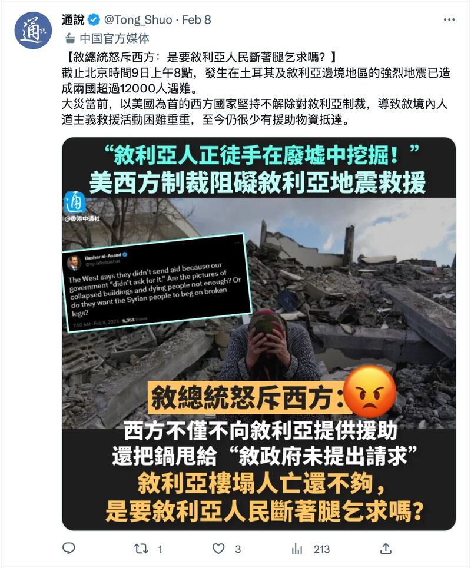
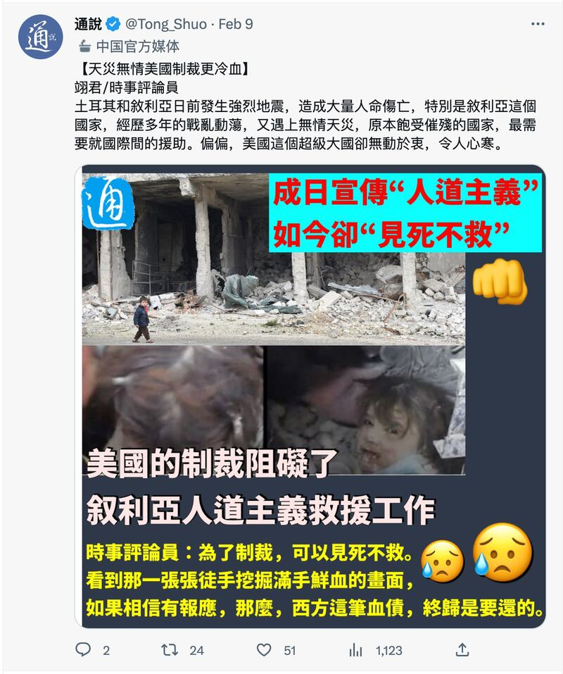
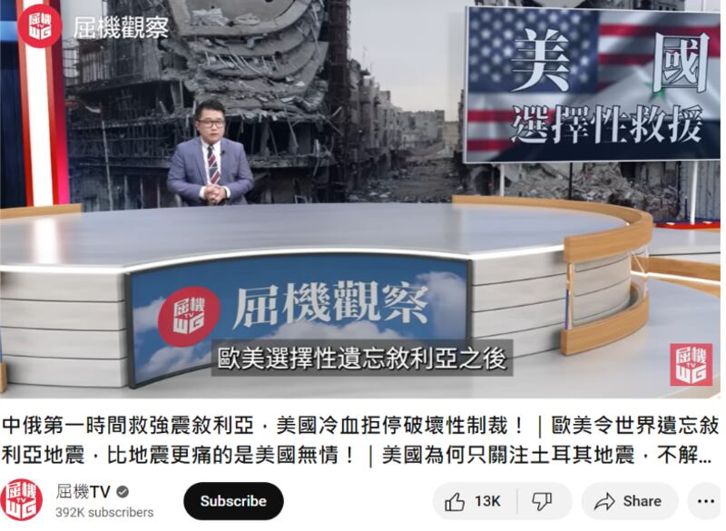

# 事實查覈│美國對敘利亞的制裁"嚴重阻礙"人道救援工作？

作者：莊敬

2023.02.14 15:49 EST

## 標籤：誤導

## 一分鐘完讀：

土耳其與敘利亞邊境地帶2月6日發生強震，死傷慘重，亟需國際援助。敘利亞阿薩德政府和中國批評美國與歐盟不取消現有的制裁，使得敘利亞災民難以獲得國際援助。多家中文媒體稱美國對敘利亞的制裁“嚴重阻礙”救援工作，“歐美令世界遺忘敘利亞地震、美國無情”，網路上還出現寫着“美國冷血”、“見死不救”等字句的圖卡。

亞洲事實查覈實驗室分析認爲，美國雖未解除對阿薩德政府的制裁，但官方同時表明提供救援並不受制裁措施的影響，並會透過國際非政府組織援助遭地震波及的民衆。

敘利亞震後救援不易，並非單一因素造成，還包括內部衝突等其它原因。亞洲事實查覈中心認爲，指控美國等西方國家的制裁舉措「嚴重阻礙」地震救援工作，非事實全貌，屬誤導訊息。

## 深度分析：

土耳其與敘利亞邊境2月6日發生強震, [聯合國官員估計](https://www.dw.com/en/turkey-syria-earthquakes-un-expects-death-toll-above-50000/a-64677847)死亡可能超過五萬人。敘利亞政府在震災後即要求美國等西方國家解除對敘利亞的制裁。外交部2月7日發佈 [聲明](https://big5.cctv.com/gate/big5/news.cctv.com/2023/02/08/ARTIH5dH5WfGjh43eHkLYCY5230208.shtml),指美國試圖誤導世界輿論以及聲稱對敘利亞的制裁不妨礙對敘利亞提供人道主義援助。 "美國官員可以撒謊,但敘利亞地震災區的照片不會說謊。儘管面臨制裁,敘利亞人民依然以充滿力量和堅定的意志來應對災難。"

中國外交部發言人毛寧於 [2月8日例行記者會](https://www.mfa.gov.cn/web/fyrbt_673021/202302/t20230208_11022138.shtml)批評美國長期介入敘利亞危機,頻繁進行軍事幹預,施加嚴酷經濟制裁,造成敘利亞大量平民傷亡,人民難以獲得基本生活保障。 "大災當前,美國應當放下地緣政治執念,立即解除對敘利亞的單邊制裁,爲人道主義救援敞開大門。"

這些言論在中文媒體中熱轉, [報道稱](http://www.takungpao.com.hk/news/232111/2023/0210/816877.html)美國對敘利亞的制裁"嚴重阻礙"救援工作,"歐美令世界遺忘敘利亞地震、美國無情",香港中通社等一些媒體還在社交媒體上發寫着"美國冷血"、"見死不救"等大標題的圖片。

（香港中通社推特視頻截圖）

## 一、敘利亞遭到西方國家哪些制裁？

美國於1979年將敘利亞政府 [列爲支持恐怖主義國家](https://www.state.gov/syria-sanctions/)。 2004年,美國對其實施額外製裁與限制。

2011年敘利亞內戰爆發,美國與西方盟友支持敘利亞民主軍,並不承認阿薩德政府的正當性,且認爲阿薩德政府爲敘利亞內戰主因,對敘利亞政府常年實施經濟制裁。相對地俄羅斯、伊朗等國支持阿薩德政府,而中國與敘利亞關係 [傳統友好](https://www.fmprc.gov.cn/zyxw/202106/t20210601_9136827.shtml)。

美國政府在2011年敘國內戰期間大力實施經過調整的制裁，使敘利亞政權喪失繼續對平民施暴所需的資源，包括凍結敘利亞官員以及其他應對侵犯人權行爲負責之人的在美資產，禁止美國公民與敘利亞方面交易或在敘投資，禁止進口敘利亞石油等。

上述資料列舉部分獲許可的活動和交易，這包括支持敘利亞的人道主義，以及美國與第三國之非政府組織在敘利亞所進行的非營利活動等。

但美國和歐盟的制裁的確對敘利亞經濟造成影響,物資缺乏,許多民衆依賴人道主義援助。具有聯合國特別報告員身份的 [阿列娜·多漢](https://news.un.org/zh/story/2022/11/1112282)(Alena Douhan)曾呼籲取消對敘利亞的長期單邊制裁。

## 二、震災後美國政府採取哪些行動？

強震發生後，美國總統拜登指示官員提供任何一切所需援助。國務院發言人普萊斯（Ned Price）6日表示，會透過國際政府組織援助當地災民，但不會與阿薩德政府聯絡。普萊斯說，“如果現在援助在內戰中殘害人民的敘利亞政府，就太諷刺了。”

據美方 [資料](https://share.america.gov/zh-hans/after-earthquake-u-s-assists-turkiye-syria/),截至2月8日,美國國際發展署支持的敘利亞急救組織「白頭盔」(White Helmets)已從廢墟中救出1000多名倖存者。美國的其他人道救援合作伙伴也在向需要幫助的敘利亞人提供食物、水、臨時住所和醫療援助。

美國財政部2月9日 [宣佈](https://home.treasury.gov/news/press-releases/jy1261)暫時放寬美國對敘利亞制裁措施,爲期180天,僅限與敘利亞地震救災、賑災需求相關的交易。但 [美國國務院](https://www.state.gov/turkiye-and-syria-earthquake-response/)表示,自從戰爭開始以來,美國就是人道援助敘利亞人民主要捐贈者,已向在敘利亞和該地區的敘利亞人民提供超過150億美元。這些經費用在敘利亞人民身上,不是落在該政權手裏。

在歐洲方面,德國之聲 [報導](https://www.dw.com/zh/%E6%95%91%E5%8A%A9%E5%8F%99%E5%88%A9%E4%BA%9A%E7%81%BE%E6%B0%91%E6%98%AF%E5%90%A6%E8%AF%A5%E5%8F%96%E6%B6%88%E5%88%B6%E8%A3%81/a-64645995)中引述德國外交部一名發言人說,歐盟實施的制裁針對的不是敘利亞人民,而是阿薩德政權及其支持者、戰爭經濟的獲利者以及對最嚴重的侵犯人權行爲負有責任的人。制裁只禁止少數商品的進口,食品、用於挖掘重型機械和其他人道主義援助都是被豁免的。

（Youtube 評論節目截圖）

三、**敘利亞震後救援困難的其它因素**

[華盛頓郵報](https://www.washingtonpost.com/world/2023/02/08/syria-earthquake-sanctions-idlib-aid/)、 [紐約時報](https://www.nytimes.com/2023/02/07/world/europe/turkey-syria-quake-un-aid.html)、 [衛報](https://www.theguardian.com/world/2023/feb/07/syria-earthquake-aftermath-aid-politics)等媒體訪問的專家、分析人士,皆點出交通不便和政局複雜,也是造成敘利亞災後救援困難的重要因素。

因內戰分裂的敘利亞,分爲阿薩德政府、反對派及其他武裝控制的地區。據 [英國廣播公司](https://www.bbc.com/zhongwen/trad/world-64564973)等媒體報導,由反對派控制的敘利亞西北部,在震前情況就很艱困,超過400萬人依賴國際援助,但此處很難到達,土耳其邊境只有一個小的過境點可以將資源運送到敘利亞反對派控制的地區。 6日強震後,路線受損,使得這個過境點無法發揮功能。 [無國界醫生](https://www.msf.org.tw/news/202302/earthquake-northwest-syria)組織曾呼籲讓這個過境點保持開放,並提供更多過境點讓人道救援得以進入敘利亞西北部。

然而阿薩德政府長期反對這種跨境機制，聲稱透過土耳其向敘利亞西北部提供援助侵犯敘利亞主權，要求國際透過他控制的領土提供援助。

路透社等媒體報導，敘利亞駐聯合國大使巴薩姆·薩巴格（Bassam Sabbagh）在震後向聯合國祕書長請求援助，但堅持援助必須與敘利亞政府協調，並且是透過敘利亞，而非經土耳其跨境運送。

不過，這種主張引來部分質疑，憂心阿薩德政府可能借災難解除制裁，卻不會將國際援助送到西北部災民手中。衛報訪問美國智庫大西洋理事會的專家Qutaiba Idlbi表示，阿薩德堅持從政府控制區向其它區域提供援助，此舉無關援助如何進入受災地區，而是關於誰能分配援助以及控制西北部的經濟援助。

美國參議院外交委員會首席共和黨參議員吉姆·裏施(Jim Risch)在 [推特](https://twitter.com/SenateForeign/status/1623693042887565313)表示,有關西方制裁導致國際援助無法進入敘利亞西北部的謠言是錯誤的,阿薩德才是造成援助無法送達需要之人手中的唯一原因。阿薩德要求解除制裁只是爲了想讓其政權卸責。

2月13日, [聯合國祕書長古特雷斯表示](https://www.reuters.com/world/middle-east/un-chief-says-syrias-assad-agrees-expand-un-aid-access-turkey-2023-02-13/),敘利亞總統阿薩德同意開放兩個額外口岸,使得從土耳其向敘利亞西北部運送救援物資成爲可能。

結論：

土耳其與敘利亞邊境發生強震後，國際援助湧入土耳其，相較之下，敘利亞所獲關注與資源相對少，有複雜國內外因素。美國等西方國家對敘利亞實施的制裁，也許直接或間接帶來某種程度的影響，但並非唯一原因。

然而，敘利亞政府將矛頭指向西方國家，指控美國的制裁“嚴重阻礙”人道主義救援，相關發言並獲中國等友好國家政府與官媒大量傳播，有誤導輿論之嫌。

*亞洲事實查覈實驗室(Asia Fact Check Lab)是針對當今複雜媒體環境以及新興傳播生態而成立的新單位,我們本於新聞專業,提供正確的查覈報告及深度報導,期待讀者對公共議題獲得多元而全面的認識。讀者若對任何媒體及社交軟件傳播的信息有疑問,歡迎以電郵*  *afcl@rfa.org* *寄給亞洲事實查覈實驗室,由我們爲您查證覈實。*

[Original Source](https://www.rfa.org/mandarin/shishi-hecha/hc-02142023153515.html)