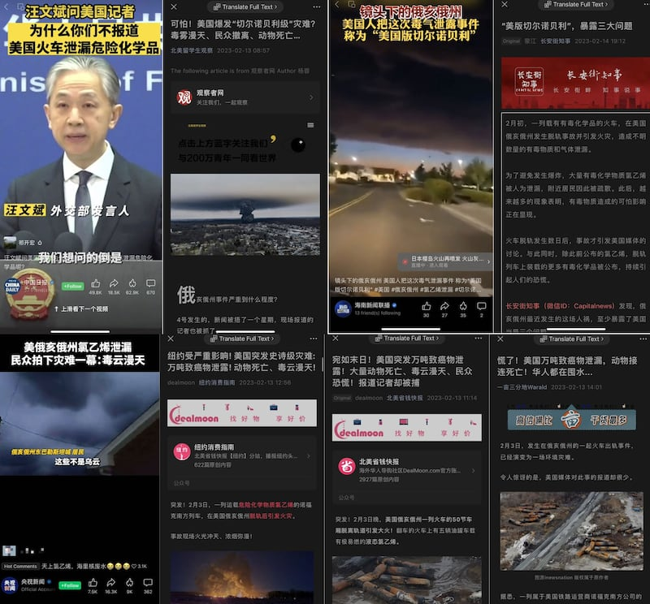
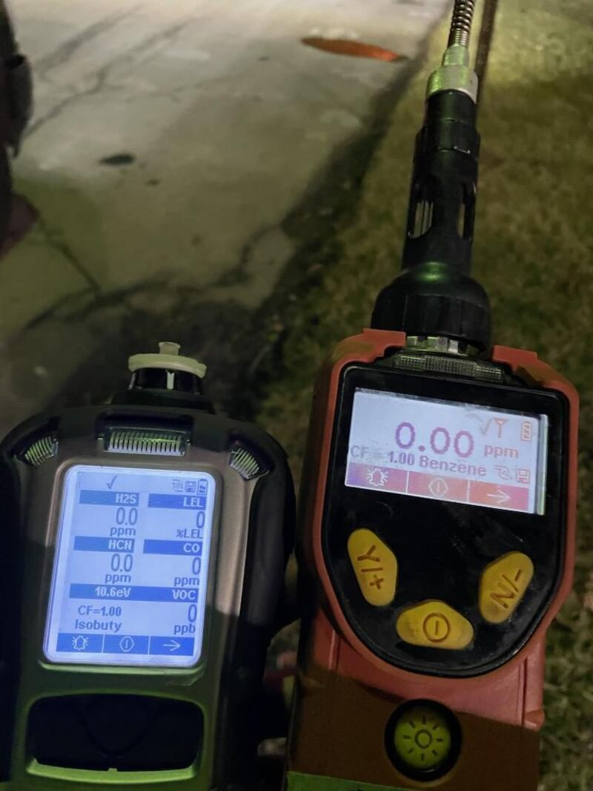
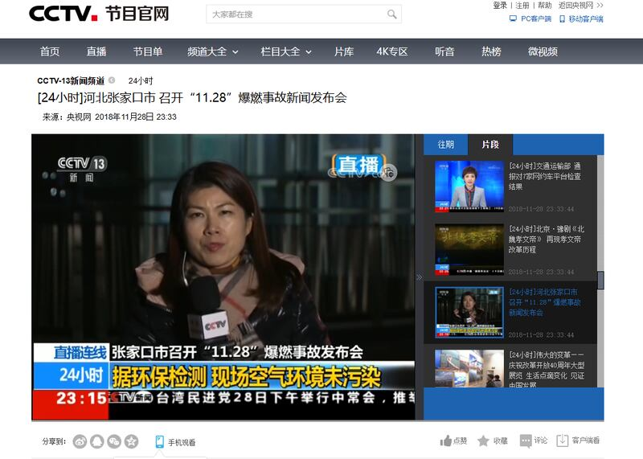
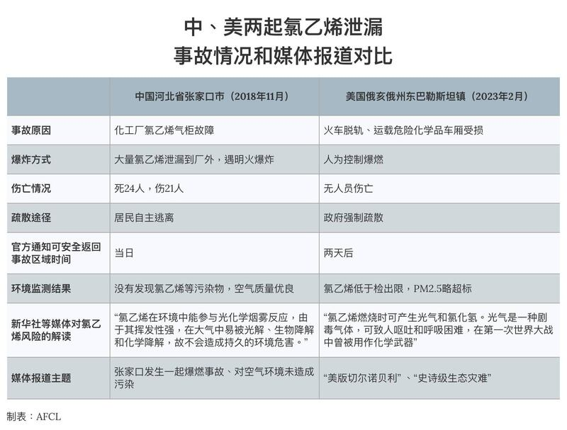

# 事實查覈│俄亥俄州氯乙烯泄漏事故是“美版切爾諾貝利”和“史詩級的災難”嗎？

作者：何亮

2023.02.16 09:14 EST

## 標籤：誤導

## 一分鐘完讀：

最近，美國俄亥俄一列脫軌的火車及其後續的危化品爆燃事件引發了中國媒體的廣泛關注。事故發生一週多後，中國的官方媒體持續聚焦這一事件，稱其爲“美版切爾諾貝利”。外交部發言人汪文斌譴責美國媒體對如此重大的新聞“鮮有報道”。多個外宣媒體極力渲染污染的嚴重性和持續性，將其描述爲一場或將持續數十年，影響範圍覆蓋俄亥俄、賓州乃至紐約州的“史詩級生態災難”。

亞洲事實查覈實驗室與美國國家環保局聯繫，瞭解事故進展，並採訪化工專家和查閱類似事故的歷史資料，發現部分中國媒體的報道和外交部評論脫離事實、誇大誤導受衆，與中國國內類似事故的對待方式採用“雙重標準”。

## 完整版：

2023年2月3日晚8點55分左右，美國俄亥俄州東部小鎮東巴勒斯坦發生一起火車脫軌事故，50節車廂不同程度受損，其中10節車廂內裝載有危險化學品，包括5節車廂內的液化氯乙烯。

2月6日，爲防止次生災害，當地強制疏散了周邊居民，並對易燃易爆的氯乙烯進行人爲的控制燃燒。爆燃的大火引發廣泛關注，社交媒體上開始出現質疑和擔憂的聲音，引來美國本土及國際媒體相繼報道。

事故發生一週多之後，諸多中國國內媒體、以及有影響力的社交媒體賬號開始聚焦此事件。

《北京日報》公號平臺“長安街知事”和《觀察者網》等媒體稱其爲“美版切爾諾貝利”，CCTV在新聞聯播、新聞頻道、財經頻道、社會與法頻道等多個欄目和頻道滾動播報了這一場“毒雲漫天”的災難。北美省錢快報等以北美留學生爲主要目標受衆的媒體將此次事件稱爲“史詩級災難”，一畝三分地等留學生論壇公號則稱“華人都在囤水”。

部分中國媒體對俄亥俄火車脫軌致化學品泄漏事件的報道截圖

2月14日,中國外交部發言人汪文斌主持例行記者會, [並在會上表示](https://www.kankanews.com/detail/m9wB63eODwn): "我們想問的倒是爲什麼一些一貫標榜自由、專業、公正的媒體,對'北溪'管線遇襲的最新調查以及美國火車事故致化學品泄漏,危及美國居民生命安全的這樣重大的事件鮮有報道。據我們瞭解,這樣的情況已經不是第一次了。"

事實上，美聯社、華盛頓郵報、美國哥倫比亞廣播公司、華盛頓郵報、紐約時報、CNN、福克斯等媒體均持續對這一事件進行了關注和報道。中國媒體在報道時候使用的圖片、視頻、居民訪談內容等基本來自於這些媒體。

## 但與美國主流媒體不同的是，中國媒體的報道在幾個方面存在不實之處或誇大事實之嫌：

關於"封鎖消息":環球網等媒體將 ["非裔記者現場報道被捕"](https://world.huanqiu.com/article/4BgpvuoCIH7)寫進新聞標題,譴責美國政府試圖隱瞞真相,封殺報道,甚至涉嫌用"氣球事件"來轉移視線。但事實上, [記者Evan Lambert被捕是因在新聞發佈會現場做直播](https://www.cbsnews.com/news/east-palestine-train-derailment-charges-dismissed-evan-lambert-reporter-arrested/)時,與工作人員發生衝突所致,並非因爲政府阻撓媒體報道該事件。由於言論自由在美國受憲法保護,美國各級政府也沒有機構能夠干預媒體報道行爲。

**關於化學品的泄漏量:**紐約消費指南、一畝三分地等媒體在標題中強調"萬噸致癌物泄漏",但據查覈,事故火車5節車廂載重量總共達數百噸,官方並未通告所涉氯乙烯準確的量,但美國媒體多采用10萬加侖(約462公噸)的估算量。事故現場還有一些其他的化學品,與氯乙烯一樣,絕大多數已經被控制燃燒掉,並非盡數泄漏至環境中。

**關於環境影響:**中國多家中央媒體、地方媒體和網絡自媒體都使用了"美版切爾諾貝利"、"毒雲漫天"、"史詩級災難"等詞來描述俄亥俄州的此次事件,然而根據亞洲事實查覈中心向環保局和專業人士的求證,這些形容詞都有明顯的誇大之嫌。

## 事件影響造成的環境影響究竟如何

2月14日，美國國家環保局（EPA）向亞洲事實查覈實驗室通報事件相關情況，稱EPA在火車脫軌後5個小時內就趕到了事發現場，參與應急處置。2月6日，5節車廂中裝載的氯乙烯被引導進溝渠中，進行了“受控燃燒”。

環保局在事發地周邊設置了12個空氣污染物連續採樣點，檢測項目包括氯乙烯和丙烯酸丁酯在內的多種揮發性有機物（VOCs）, 和燃燒可能產生的光氣、硫化氫、氰化氫和氯化氫等有害物質。截至8日，任何與事故相關的可能影響人體健康的污染物都沒有達到足以引起關注的濃度。

在這期間，EPA還檢測了空氣的可燃性和一氧化碳、顆粒物等多種物質，氯乙烯受控燃燒期間，檢測到細顆粒物Pm2.5有所超標。至2月14日，環保局也根據當地居民提出的要求，幫助396戶居民完成了室內的空氣質量檢測，沒有檢測出氯乙烯和氯化氫等物質。

環保局解釋稱，該地區和數十英里外的居民可能會聞到從現場傳來的氣味。 這是因爲受控燃燒的副產品具有低氣味閾值，人們能聞到這些污染物的濃度遠低於被認爲有害的濃度。

地表水、地下水和土壤污染方面,環保局第五區分局也在與地方環保部門配合,開展進一步的檢測,迄今爲止 [所有的環境檢測報告都可以在EPA官網查看並下載](https://response.epa.gov/site/doc_list.aspx?site_id=15933)。同時,環保局向事故責任方Norfolk Southern鐵路公司發了 [函件](https://response.epa.gov/sites/15933/files/Norfolk%20Southern%20East%20Palestine%20Train%20Derailment%20General%20Notice%20Letter%202.10.2023.pdf),通知了他們需要承擔相應的環境清理和修復成本,也向當地公衆公佈了諮詢電話和 [即時更新的信息公開頁面](https://response.epa.gov/EastPalestineTrainDerailment)。

美國國家環保局在事故現場的便攜式空氣污染物檢測儀器，多項污染物未達到檢出限，顯示爲0 圖片來源：EPA官網

就職於中國氯鹼工業協會一位匿名化工專家告訴亞洲事實查覈實驗室，氯乙烯和大多數石油化工類的VOCs一樣，既有毒有害並且易燃易爆，如果發生泄漏，一旦遇到明火就可能發生破壞力極大的爆炸。同時，它又是易揮發和降解的污染物，泄漏到大氣環境中很快就會擴散和降解，或者參與到光化學反應中生成臭氧和霧霾。所以，其事故風險主要是易燃易爆屬性帶來的破壞性風險，還有高濃度條件下的急性毒性風險。而其慢性的致癌風險主要是長期接觸這類化工品的專業人士纔可能有的職業病風險。

中國氯鹼工業污染物排放標準中，對氯乙烯等特徵污染物有嚴格的限制，但也不是不允許排放，主要是排放濃度控制，不會做排放總量的控制。近年來，行業針對包括氯乙烯在內的VOCs會有總量的控制，也是因爲控制霧霾的需要。氯乙烯本身不穩定，發生爆炸後，也會有大量氯乙烯被瞬間燃燒掉，環境空氣中很快檢測不出來也是正常現象。

## 中國媒體對發生在中國的氯乙烯爆炸事故是如何報道的

2018年11月28日凌晨,中國化工集團河北盛華化工有限公司氯乙烯氣櫃發生泄漏,大量氯乙烯擴散到廠區外公路上,遇明火導致發生爆燃,造成24人死亡,21人受傷。當時,爆炸產生的濃煙、火焰和刺鼻的氣味讓很多居民連夜逃離,而張家口市環保局當日上午的檢測結果也是相關污染物未檢出。 [當晚,中央電視臺新聞節目主持人就在電視上說:"現場的環境已經恢復到了一個比較安全的水平,大家可以回到自己家裏,不要擔心了。"](https://tv.cctv.com/2018/11/28/VIDEmGwdxJAIpCFlu0qmxvbB181128.shtml)

2018年11月28日CCTV報道張家口市氯乙烯泄漏爆炸事故的視頻截圖

不過,在 [2月15的《新聞直播間》節目中](https://tv.cctv.com/2023/02/15/VIDE3eLU3zMYxgz4jivecL1F230215.shtml),中央電視臺則質疑俄亥俄州當地政府"兩天後就宣佈事故區域居民空氣質量符合空氣質量標準,疏散居民可以安全回家。"並詳細解讀氯乙烯的危害,稱當地民衆擔憂生存環境遭到污染。

同樣"雙重標準"報道兩個國家類似事故的還有新華社,在報道張家口事件時,新華社向民衆解釋氯乙烯 ["不會造成持久的環境危害"](https://weibo.com/1699432410/H577trF31?sudaref=www.google.com),而報道俄亥俄州事件時,新華社則強調民衆對環境可能遭到嚴重污染的擔憂,並解釋稱 [氯乙烯燃燒產生的光氣曾在一戰中被用作化學武器。](https://mp.weixin.qq.com/s/oj1YFyKb1nprOqIbSbTnPQ)

中國張家口氯乙烯泄漏爆炸事件與美國俄亥俄氯乙烯爆炸事件對比 製表：AFCL

## 結論：

綜上所述，中國媒體在報道俄亥俄州化學品泄漏事件的環境風險時擴大和渲染了其影響，誤導中文媒體的受衆。同一種化學品氯乙烯的危險性，新華社、中央電視臺等媒體的報道呈現了雙重標準，在報道中國國內事件時解讀爲“容易降解”、“不會造成持久污染”，而此次事件中的則解讀爲“劇毒”、“化學武器”。

*亞洲事實查覈實驗室是針對當今複雜媒體環境以及新興傳播生態而成立的新單位，我們本於新聞專業，提供正確的查覈報告及深度報導，期待讀者對公共議題獲得多元而全面的認識。讀者若對任何媒體及社交軟件傳播的信息有疑問，歡迎以電郵 afcl@rfa.org寄給亞洲事實查覈實驗室，由我們爲您查證覈實。*

[Original Source](https://www.rfa.org/mandarin/shishi-hecha/hc-02162023090303.html)