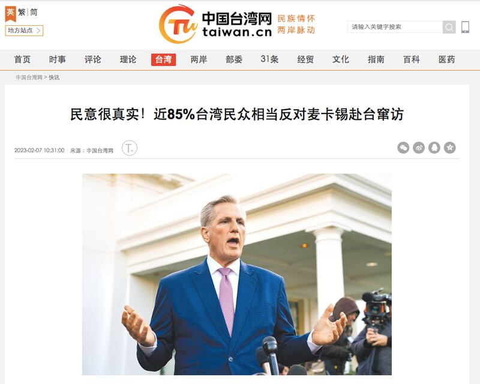
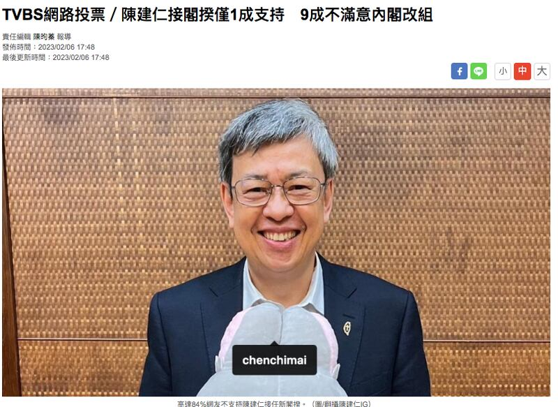

# 事實查覈│85%的臺灣人都反對麥卡錫訪臺嗎?

作者：莊敬

2023.02.21 16:10 EST

## 標籤：錯誤

## 一分鐘完讀：

美國媒體日前報道，新任衆議院議長麥卡錫將於今年訪問臺灣，引美中臺關注。香港親中媒體大公網2月14日發表《臺民衆下“拒客令” 麥卡錫還有臉竄訪？》一文，稱“臺灣最新民調顯示，近85%的臺灣民衆非常不支持麥卡錫赴臺”。

亞洲事實查覈實驗室比對數據發現：首先，大公網這篇文章引述的數據符合臺灣TVBS新聞網於2月6日發佈的網絡投票結果；但網絡投票結果並不能夠直接等同爲民調結果。

截至2月14日，與麥卡錫訪臺話題相關的“臺灣最新民調”是TVBS民調中心於2月9日發佈的“陳建仁組閣與麥卡錫訪臺民調”。這份民調顯示：56%民衆表示歡迎麥卡錫訪臺，23%不歡迎，20%沒意見。

## 深度分析：

美國政治新聞網站 [酒杯新聞(Punchbowl News)1月23日報導](https://punchbowl.news/archive/12323-punchbowl-news-am/)引述拜登政府知情官員指出,美國國防部正在爲麥卡錫(Kevin McCarthy)的外國訪問進行初期規畫,包括可能在今年春季訪問臺灣的行程。

麥卡錫可能訪臺的消息引起美中臺關注,中國外交部發言人毛寧於 [1月 30日記者會](https://www.mfa.gov.cn/web/fyrbt_673021/202301/t20230130_11016413.shtml)回應相關提問表示,"中方一貫反對建交國同中國臺灣地區開展任何形式的官方往來,美方有關議員應恪守一箇中國原則和中美三個聯合公報規定,不要做影響中美關係,破壞臺海和平穩定的事情。"

[麥卡錫2月2日受訪](https://www.c-span.org/video/?525777-1/speaker-mccarthy-house-not-pass-clean-debt-limit-spending-reform)時表示:"中國永遠不能告訴我哪裏可以去,哪裏不能去,但我目前沒有安排行程前往臺灣。"

中國媒體報道"85%臺灣民衆反對麥卡錫訪臺"，但其實這只是網路投票結果。中國臺灣網截圖

## 臺灣民衆究竟是反對還是歡迎麥卡錫訪臺？

中國臺灣網2月7日發表《 [民意很真實!近85%臺灣民衆相當反對麥卡錫赴臺竄訪](http://www.taiwan.cn/taiwan/jsxw/202302/t20230207_12508478.htm)》,指根據島內公佈的一份最新民調,絕大多數的臺灣民衆不支持麥卡錫赴臺。調查結果顯示,近85%的臺灣民衆,對於麥卡錫赴臺相當不支持;另有90%的民衆,憂慮臺灣成爲美國的棋子。

大公網2月14日發表評論文章《 [臺民衆下"拒客令" 麥卡錫還有臉竄訪?](http://www.takungpao.com.hk/news/232110/2023/0214/818132.html)》,署名"朱穗怡"的作者寫道:臺灣最新民調顯示,近85%的臺灣民衆非常不支持麥卡錫赴臺,90%的民衆憂慮臺灣成爲美國的"棋子"。民調中高比例的數字充分反映了臺灣主流民意,傳達了非常清楚的信息,就是不歡迎麥卡錫竄訪,不歡迎美國政客去臺灣搞風搞雨,不能讓臺灣成爲美國政府遏制中國大陸的棋子,不能讓兩岸中國人自相殘殺,使美國坐收漁人之利。

上述中國臺灣網、大公網的文章皆未註明數據來源,但同樣稱"近85%的臺灣民衆不支持麥卡錫赴臺"。經比對,數據符合臺灣TVBS新聞網在2月6日發佈的 [「網路投票」](https://news.tvbs.com.tw/politics/2034974)結果,這項投票結果顯示:有85%網友表示不支持麥卡錫訪臺,僅11%支持;90%網友擔心臺灣成爲美中角力棋子,僅9%不擔心。

TVBS新聞網在標題上註明爲"網路投票"，也在文末註明網路投票和民意調查不同。TVBS網站截圖

TVBS文末寫道：“網路投票與一般透過抽樣的市話或手機電訪，所進行的民調方法並不相同，投票結果並不能夠直接推論全臺灣民衆意見。”

而TVBS民意調查中心於2月9日發佈的《 [陳建仁組閣與麥卡錫訪臺民調](https://cc.tvbs.com.tw/portal/file/poll_center/2023/20230210/2ffaa866bc7aa09d9aa8d03ed08d925d.pdf)》顯示,56%民衆表示歡迎麥卡錫訪臺,23%不歡迎,20%沒有表示意見。民調指出,不論哪個年齡族羣,歡迎麥卡錫訪臺的比例都高於不歡迎,年齡越年輕歡迎的比例越高。

民調結果發現，有44%民衆表示擔心臺灣成爲美國用來和中國角力的棋子，但也有42%表示不擔心，14%未表示意見。

這次調查是TVBS民意調查中心採用市內電話及行動電話雙底冊調查方式，於112年2月6日至2月9日晚間18:30至22:00，共接觸1493位20歲以上臺灣民衆，其中拒訪爲322位，拒訪率爲21.6%，最後成功訪問有效樣本1171位，在95%的信心水準下，抽樣誤差爲±2.9個百分點以內。

[彭博](https://www.bloomberg.com/news/articles/2023-02-10/half-of-taiwanese-support-a-visit-by-mccarthy-defying-china)社、《 [海峽時報](https://www.straitstimes.com/asia/east-asia/half-of-taiwanese-support-a-visit-by-us-house-speaker-mccarthy-defying-china)》2月10日報導引用TVBS的民調結果指出,最近民調顯示,超過半數受調民衆表示支持麥卡錫訪臺。大公網2月14日發表的文章,並沒有提及2月9日這份相對新的民調結果。

臺灣的民調專家戴立安告訴亞洲事實查覈實驗室，電話訪問民意調查有一定基準和樣本代表性，而網路投票開放所有人填答，未設定參與投票的範圍、年齡，“基本上只要看得懂中文就能投”，有些也未限制同一人多次回答；因此網路投票沒有代表性，只能說是意見反應的管道，不能當成可信、嚴謹、具代表性的民調。

## 結論：

大公網文章引用的數據並非最新相關民意調查，而是一份不能推論全臺民衆意見的網路投票。大公網據此宣稱“臺灣最新民調”顯示臺灣主流民意不歡迎麥卡錫赴臺，趁早下“拒客令”，明顯爲不實資訊。

*亞洲事實查覈實驗室(Asia Fact Check Lab)是針對當今複雜媒體環境以及新興傳播生態而成立的新單位,我們本於新聞專業,提供正確的查覈報告及深度報導,期待讀者對公共議題獲得多元而全面的認識。讀者若對任何媒體及社交軟件傳播的信息有疑問,歡迎以電郵*   *[afcl@rfa.org](mailto:afcl@rfa.org)*  *寄給亞洲事實查覈實驗室,由我們爲您查證覈實。*

[Original Source](https://www.rfa.org/mandarin/shishi-hecha/hc-02212023155624.html)