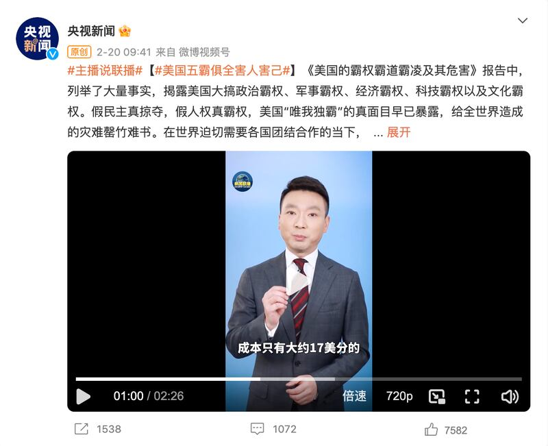

# 事實查覈│一張百元美鈔只值17美分嗎？

作者：林濤、莊敬

2023.02.23 10:36 EST

## 標籤：錯誤

## 一分鐘完讀：

2月20日，中央電視臺主持人康輝點評一份題爲《美國的霸權霸道霸凌及其危害》的報告時稱，美國用“大約17美分的百元美鈔”購買其他國家的價值100美元的商品和服務的行爲，是“赤裸裸的掠奪行爲”。

亞洲事實查覈實驗室認爲，印鈔成本不等於貨幣價值，是現代金融常識。世界各國的紙幣本身都不具有價值。美國、中國和其它主要經濟體都不例外。因此，稱美國用“成本只有17美分”的美元紙幣購買對應幣值的商品是“掠奪行爲”，是完全不符現代金融知識的錯誤信息。

## 完整版：

2月20日,新浪微博"央視新聞"賬號 [發佈的一則短視頻](https://weibo.com/2656274875/MtWawrz8z)中,央視主持人康輝介紹了一份名爲《美國的霸權霸道霸凌及其危害》報告。該報告列舉批評了了美國在多個方面的霸權。

在介紹美國的“經濟霸權”時，康輝舉例稱：“美國憑藉着一張只有大約17美分的百元美鈔，就讓其它國家向美國提供價值相當於100美元的商品和服務，這不是赤裸裸的掠奪行爲又是什麼？”

“央視新聞”微博截圖

根據貨幣原理, 紙幣本身並不具有價值,而是一種貨幣符號,其代表的貨幣價值是由國家定義的。紙幣本身印製成本很低,康輝所提及的"17美分"是 [美聯儲公佈的印鈔成本](https://www.federalreserve.gov/faqs/currency_12771.htm), [英國央行英格蘭銀行](https://www.bankofengland.co.uk/freedom-of-information/2020/questions-about-banknote-production)也披露,英鎊紙幣的製造成本在7-8便士左右。 然而,一個國家央行發行的紙幣作爲法定貨幣,具有國家賦予的貨幣價值, 紙幣取代大面值金屬貨幣,是現代金融業形成的標誌。

事實上，世界上最早發行的“成本很低”的紙幣就誕生在中國，北宋年間，四川商人第一次發明了名爲“交子”的紙幣，代替銅錢流通，大大降低了貿易成本。

[中國人民銀行公告稱,](http://www.pbc.gov.cn/chubanwu/114566/114579/4356045/4356183/2021100915275164017.pdf)中華人民共和國的法定貨幣是人民幣,包括紙幣和硬幣。雖然中國並沒有公佈人民幣的印鈔成本,問答網站知乎有用戶 [發文推測](https://zhuanlan.zhihu.com/p/448558804), 一百元人民幣批量印製的成本,應該在0.8-0.9元,大約12美分左右。

目前, [中國人民銀行在《中國數字人民幣的研發進展白皮書》中表示](http://www.pbc.gov.cn/goutongjiaoliu/113456/113469/4293590/2021071614200022055.pdf):實物、金屬鑄幣、紙幣均是相應歷史時期發展進步的產物, 而目前中國正在研究發行數字人民幣, 未來數字人民幣發行、流通管理機制與實物人民幣一致。而數字人民幣的出現,將進一步降低制幣成本。到時候的數字"百元大鈔",也許一分不值,但仍然具有貨幣價值。

臺灣中央大學經濟系教授邱俊榮告訴亞洲事實查覈實驗室，一筆交易能夠成立，貨幣只是媒介，今天不會有人以爲交易媒介有實際價值，這又不是商品貨幣的時代，我們已經脫離商品貨幣時代很久了。

邱俊榮說，外界當然可以批評美元有某種程度的霸權，但這絕對不是建立於印製成本，而是國際對美元的強勢需求，讓美國利用它在國際金融上的霸權地位牟利。

邱俊榮批評中方對美國的有關指控非常淺薄，是自曝其短，他認爲在美中關係緊張之際，這種說法應該是出自政治動機。

## 結論：

亞洲事實查覈實驗室認爲，“央視新聞”稱美國用“17美分的百元美鈔”購買其他國家的產品是對其他國家的“掠奪”，違背最基本的金融常識，是完全荒謬、錯誤的說法。這是亞洲事實查覈實驗室針對《美國的霸權霸道霸凌及其危害》內容的第一份查覈報道，我們仍持續關注、查對這份由中國官方宣佈的報告。

*亞洲事實查覈實驗室(Asia Fact Check Lab)是針對當今複雜媒體環境以及新興傳播生態而成立的新單位,我們本於新聞專業,提供正確的查覈報告及深度報導,期待讀者對公共議題獲得多元而全面的認識。讀者若對任何媒體及社交軟件傳播的信息有疑問,歡迎以電郵*  *afcl@rfa.org* *寄給亞洲事實查覈實驗室,由我們爲您查證覈實。*

[Original Source](https://www.rfa.org/mandarin/shishi-hecha/hc-02232023103240.html)