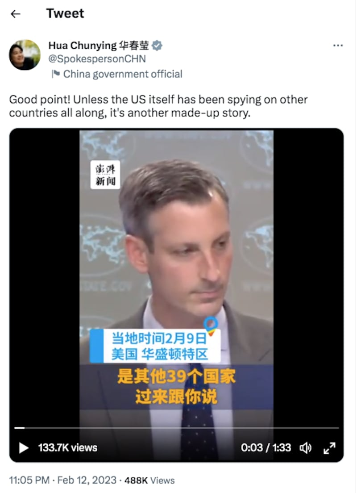

# 事實查覈│面對記者質問，美國務院發言人默認監控40國？

作者：石珊

2023.02.24 11:15 EST

## 標籤：誤導
## 一分鐘完讀
日前,中國外交部發言人華春瑩在社交平臺上發佈 [一則短片](https://twitter.com/SpokespersonCHN/status/1624786842662084609),內容爲一名記者在美國國務院記者會上質疑美國是否通過"監控"其他國家,才得知中國無人飛艇飛過40個國家領空。華春瑩同時寫下註解,對記者的推論十分讚賞。

亞洲事實查覈實驗室查閱記者會全文和完整錄影，發現美國國務院發言人對此做出了答：“資訊來自公開報導和外交管道”，只是該名記者不接受，並不斷提問相同問題。而在華春瑩所分享的影片中，發言人回答問題的部分已被刪去，讓發言人看起來像是被問得手足無措。但完整情況並非如此。華春瑩的觀點，並沒有事實支持。

## 深度分析

本月12日,中國外交部發言人華春瑩在社交平臺Twitter上發佈一則 [推文](https://twitter.com/SpokespersonCHN/status/1624786842662084609),爲一部長約一分半鐘、帶有"澎湃新聞"水印的短片,影片內容是一名美國記者在2月9日美國國務院記者會上的提問。他質疑美國是否透過"監控"其他國家,才得知中國無人飛艇侵犯(breach)40個國家的領空。

華春瑩在推文上寫下：“Good point! Unless the US itself has been spying on other countries all along, it's another made-up story.（說得好！除非美國本身一直在監視其他國家，否則這又是一個編造的故事。）”截至21日，影片已獲得48.5萬次觀看數。

這部影片內容是美國記者馬修·李（Mattew Lee）與國務院發言人普萊斯（Ned Price）的問答過程。影片後段更加上“美國國務院發言人普萊斯妄稱，中國的無人飛艇足跡遍佈全球40個國家，美聯社記者隨即質問數據何來，並表示這意味着美國在監視其他國家”的字卡。

華春瑩推薦了一部關鍵信息被剪切的影片。截取自華春瑩推特帳號

## 華春瑩推薦的影片漏了什麼？

亞洲事實查覈實驗室搜索影片來源，發現這是一部來自澎湃新聞，經過剪輯的短片。影片來自美國國務院例行記者會的一段實錄，但將發言人的回答已經被刪去。

根據完整紀錄,美國國務院發言人普萊斯在 [2月9日美國國務院例行記者會](https://www.state.gov/briefings/department-press-briefing-february-9-2023/)上表示,中國政府透過無人飛艇在全世界進行大規模的監視活動,足跡遍佈世界五大洲約40個國家,並認爲中國政府的行爲不僅侵犯了美國的主權,更對世界各國的國家安全造成威脅。

美聯社記者李就此提出疑問，詢問發言人美國政府是如何得知其他 39 個國家也受到中國無人飛艇入侵的影響，以及能否提供其餘39國家的名字。發言人回覆這些資訊可以在公開報導及圖片、影片看到，但不願公佈國家名單。 Lee認爲這樣代表美國政府正在對這些國家進行監視，就如同他們指責中國政府的所作所爲一樣，並繼續追問：“你們究竟是如何得知中國氣球飛越其他國家上空？”

普萊斯接着回答，美國政府持續與其他國家保持對話，並且透過各種外交手段及公開報告獲得這些資訊。也強調美國政府過去幾天已與世界各地的盟友就中國帶來的各種挑戰進行了非常深入的對話，其中也包括中國在世界各地進行的間諜與監視行動。 “我們認爲與世界各地的合作伙伴儘可能分享這些資訊很重要，因爲我們不是唯一受到這些活動影響的國家。”

但在華春瑩發佈的短片中，上述普萊斯的解釋與回答已經被剪輯刪去，造成發言人無法辯駁的印象。該剪輯片段也在網上以“美記者質疑美國在全球40國實施監視：不然怎麼知道它們上空有氣球？”爲標題廣爲流傳。

## 中國外交部如何跟進論述？

中國外交部發言人汪文斌在13日的記者會上，也應和了華春瑩推文中的論述，直稱“美國纔是全球最大的監控偵查國家，擁有世界上最大規模的間諜網路”，並指出美國國家安全局監聽的對象包括德國、法國、挪威、瑞典、荷蘭等歐洲多國政要的簡訊和通話內容，美國在其100個駐外使領館內暗自安裝監聽設備，對駐在國進行竊密。

## 結論：

華春瑩發佈的國務院記者會問答影片，是將發言人普賴斯完整回答剪輯過後的版本。普賴斯的說法是否能昭公信，可以有不同解讀。但華春瑩發佈的影片剪去了關鍵段落，造成的印象實屬誤導。

*亞洲事實查覈實驗室（Asia Fact Check Lab）是針對當今複雜媒體環境以及新興傳播生態而成立的新單位，我們本於新聞專業，提供正確的查覈報告及深度報導，期待讀者對公共議題獲得多元而全面的認識。讀者若對任何媒體及社交軟件傳播的信息有疑問，歡迎以電郵 [afcl@rfa.org](http://afcl@rfa.org)寄給亞洲事實查覈實驗室，由我們爲您查證覈實。*

[Original Source](https://www.rfa.org/mandarin/shishi-hecha/hc-02242023111121.html)