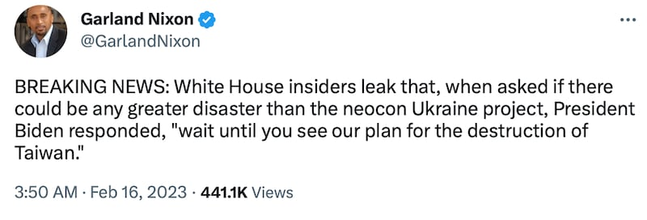
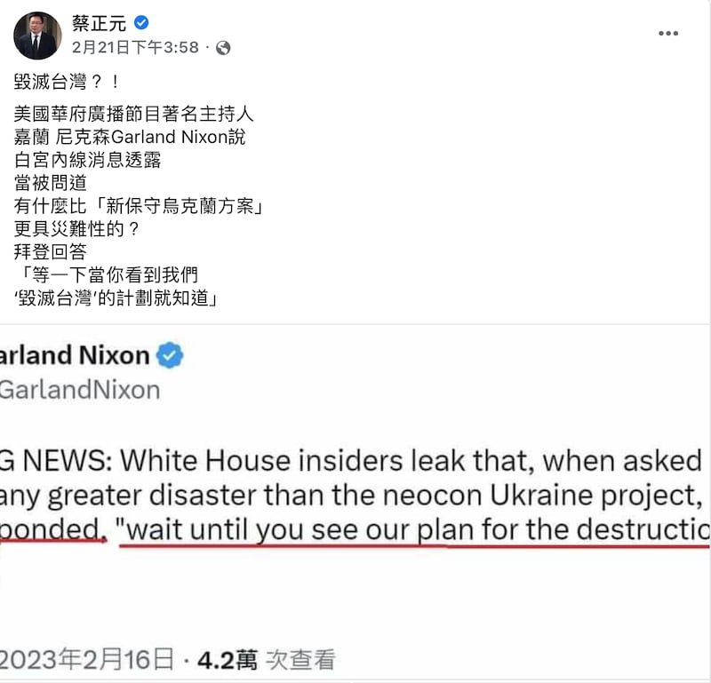
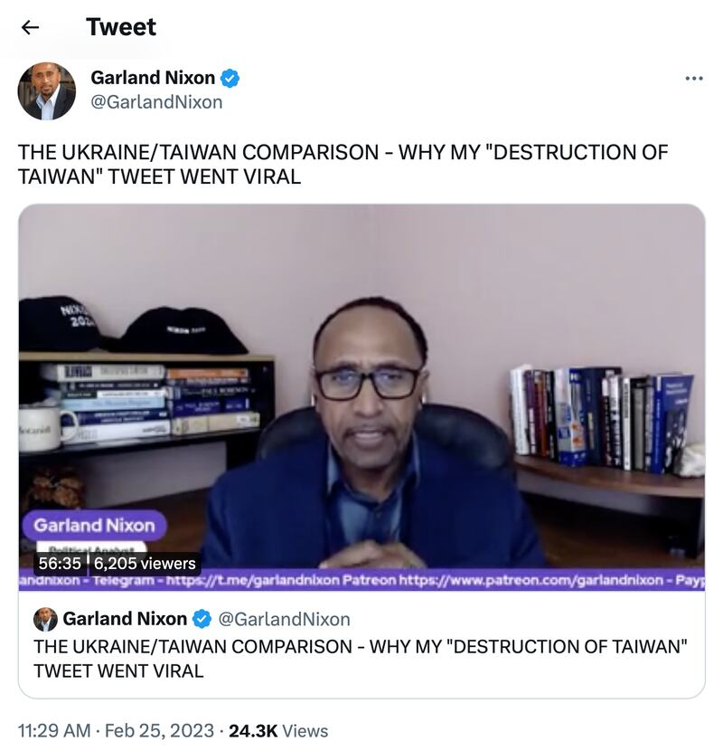

# 事實查覈│查覈筆記：當嘲諷變成新聞—— 一則推文如何"毀滅臺灣"

作者：莊敬

2023.03.01 14:23 EST

近期，中國大陸和港臺媒體相繼報導美國總統拜登曾說出“毀滅臺灣”計劃。消息源頭是美國廣播節目主持人嘉蘭・尼克森（Garland Nixon）的推文，經臺灣前立委蔡正元在臉書轉發，再經媒體引用，製成一篇篇“拜登又失言”、“驚吐真心話”的毀滅臺灣內幕報導，臺灣的外交部發聲明澄清，而中國外交部要求美方解釋。

尼克森2月25日在推特發佈影片，談論“毀滅臺灣計劃”推文被瘋傳的現象，他坦言自己常發嘲諷（satire）推文，只是爲搞笑、有趣。

“毀滅臺灣說”經蔡正元轉發後，進一步引發熱議，大批媒體跟進報導，緊接着官方也表態。然而，自尼克森25日發佈影片自承“搞笑”後，至今卻未見先前大肆報導毀滅臺灣計劃的媒體報導他的“說明”。

"毀滅臺灣說"如何從嘲諷推文演變成內幕新聞？

2月16日,尼克森在推特 [發文](https://twitter.com/GarlandNixon/status/1625945743000276995) **,大致譯文如下:**

## “突發新聞：白宮內線透露，當被問及有什麼比‘新保守主義烏克蘭計劃’更大的災難是，拜登總統回應道，‘你等着看我們的臺灣毀滅計劃吧’。”

嘉蘭尼克森推文聲稱白宮內線消息透露，拜登曾說出毀滅臺灣計劃。（尼克森推特頁面截圖）

尼克森的推特自介爲美國華府廣播節目主持人與政治分析人士,雖然他未介紹所屬媒體,但可從 [俄羅斯媒體Sputnik網站](https://sputniknews.com/author_garland_nixon/)找到尼克森的資訊,而其節目播放電臺"WZHF-AM"遭美國法院判定爲"俄羅斯政府代理人"。檢視尼克森的推文,發現他多以聳動謾罵方式評論政治。

截至3月1日爲止,這則推文已經有近47萬的閱讀量,680次轉推,以及超過兩百次引用。蔡正元就是其中一位轉發者,2月21日,他在臉書 [轉發尼克森的推文](https://www.facebook.com/tsaichengyuan/posts/pfbid0hSqBb5t8MB7o2UtDcAHJ9iGuKkKdz7TbySbUY1BqhnCTN2hz45pYoWqWJBmPfbADl?locale=zh_TW),並附上中譯:

毀滅臺灣？！美國華府廣播節目著名主持人嘉蘭尼克森說，白宮內線消息透露，當被問到有什麼比“新保守烏克蘭方案”更具災難性的？拜登回答“等一下當你看到我們‘毀滅臺灣’的計劃就知道”。

蔡正元發文後,部分臺灣媒體隨即跟進,陸續發表 ["驚吐真心話?拜登'毀滅臺灣計畫'脫口而出 白宮內線全說了"](https://www.chinatimes.com/realtimenews/20230221004481-260407?chdtv)、 ["拜登又失言?美媒體人揭'毀滅臺灣計畫'"](https://ctee.com.tw/news/global/812563.html)等報導。聳動、吸睛的標題引起注意,但內容僅以蔡正元臉書發文爲主,搭配網友留言,並無其他消息來源,也未交代是否詢問尼克森本人或相關單位回應。

蔡正元也上 [政論節目](https://www.youtube.com/watch?v=-f_qNNePVPI)談論這個話題,他認爲尼克森知名度非常高,絕對不是空穴來風、捕風捉影的主持人。蔡正元還說,即使拜登是口誤或閒聊,但這種心態"是拿我們的生命財產開玩笑嗎?"

臺灣前立委蔡正元在臉書轉發嘉蘭尼克森的推文（蔡正元臉書頁面截圖）

經過蔡正元的轉發和臺灣媒體跟進報導,"毀滅臺灣計畫"成了熱門話題,美中臺官方也陸續表態。 2月22日,臺灣的行政院長陳建仁被媒體問到此事,以"臺美關係史上最好,請大家勿輕信謠言"回應。外交部當天兩度發佈聲明, [第一則聲明](https://www.mofa.gov.tw/News_Content.aspx?n=95&s=99696)指該消息來源未經查證, [第二則聲明](https://www.mofa.gov.tw/News_Content.aspx?n=95&s=99702)說明尼克森所屬媒體背景。

美國在臺協會(AIT)同天發佈 [聲明](https://www.cna.com.tw/news/aipl/202302220289.aspx),表示拜登曾親自投票支持臺灣關係法,美國對臺灣的承諾"堅若磐石"。

亞洲事實查覈實驗室於22日分別致函白宮國安會、美國國務院、AIT詢問此事,未獲白宮與國務院回覆,AIT則提供了上述聲明。美國國務院亞太助卿康達(Daniel Kritenbrink)22日在 [線上記者會](https://www.state.gov/briefings-foreign-press-centers/us-china-relations)回答中評社記者提問時表示,這個假設的說法是他見過最令人困惑的事情之一,他並重申美國會持續努力推動並強化與臺灣的非官方關係。

民進黨質疑尼克森發文是爲俄羅斯大外宣，並指國內有心人士刻意放大、散佈疑美論。蔡正元再度發文反擊，“民進黨小狗仔有什麼證據說他造謠？美國白宮至今都沒說他造謠，再怎麼樣也輪不到民進黨小狗仔忙着幫拜登闢謠”。

即使國民黨主席 [朱立倫認爲這是謠言](https://udn.com/news/story/6656/6989986),仍未動搖蔡正元的立場,他又爲此發文,稱朱立倫是"親美派",善於發揚美國的善良與光明,不願意正視美國的邪惡與墮落。

而"毀滅臺灣說"不僅在臺灣引起熱議,不少中國、香港媒體也跟進,包括央視 ["臺媒驚爆拜登有毀滅臺灣計畫"](https://tv.cctv.com/2023/02/23/VIDErYoTtzWhpejnsERMdFrp230223.shtml)、環球網 ["美國毀滅臺灣計畫震驚島內!臺當局緊急澄清卻引發更多質疑"](https://taiwan.huanqiu.com/article/4BoRFibW5GD)、中評網發表 ["快評:華府準備毀滅臺灣?臺獨是幫兇"](http://hk.crntt.com/doc/1066/0/3/5/106603591.html?coluid=92&kindid=0&docid=106603591&mdate=0222004756)等相關報導、評論。

中國外交部發言人汪文彬24日在 [例行記者會](https://www.fmprc.gov.cn/fyrbt_673021/202302/t20230224_11031214.shtml)回應相關提問時說,"我也很想知道什麼叫'毀滅臺灣的計畫',美方應該作出明明白白的解釋。臺灣是中國的臺灣,我們將堅定不移捍衛國家主權和領土完整。"另名發言人華春瑩24日 [轉發](https://twitter.com/SpokespersonCHN/status/1629069878698311680)尼克森的推文,並稱對於華府而言,總是美國利益優先,根本不在乎毀滅誰。在白宮、拜登尚未出面闢謠,尼克森也未進一步說明時,"毀滅臺灣說"屬未經證實的消息。但尼克森2月25日在推特發佈 [影片](https://twitter.com/GarlandNixon/status/1629322594112647169)自承其推文屬嘲諷文,臺灣爭論多日的所謂"毀滅臺灣計畫"只是虛構。

嘉蘭尼克森2月25日在推特發佈影片，談論引起瘋傳的"毀滅臺灣計劃"”推文（尼克森推特頁面截圖）

時長56分鐘的影片，尼克森企圖引用參議員格雷厄姆（Lindsey Graham）去年在節目上聲稱“若入侵臺灣，他們會戰到最後一刻”的說法，以及美國智庫兵推臺海戰爭的結果等資料，舉了許多例子以合理化他的觀點，但也坦承他很多推文內容都只是開玩笑。

在影片13:05處，尼克森說，任何有在追蹤他的人，都知道他經常寫“突發新聞：白宮內線消息透露”、“突發新聞：克里姆林宮內線消息透露”這類的嘲諷文(satire)。

然而尼克森發佈影片後三天、中國外交部發言人毛寧在28日 [例行記者會](https://www.fmprc.gov.cn/fyrbt_673021/202302/t20230228_11032791.shtml)仍稱,美方鼓譟"今日烏克蘭,明日臺灣",甚至有媒體爆出美政府制定了"毀滅臺灣"計畫。 "人們不禁要問,美方究竟意欲爲何?"

也許對尼克森而言，發佈這類政治嘲諷文開個玩笑，再平常不過；但訊息傳到臺灣，透過某些具影響力的政治人物、名嘴傳播，媒體跟進報導，政論節目深入討論，中國官方與媒體持續炒作，讓玩笑話變了調，成“疑美論”題材，驚動官方出面回應。

回頭檢視嘉蘭・尼克森的推文事件，自始就存在幾項疑點。首先：據推文，他是聽“白宮內線消息”轉述，在新聞作業上屬於“單一消息來源”新聞(single source news)，一般新聞機構對這類消息都高度存疑，並且要求再查證，至少找到另一個獨立消息來源。

其二：推文稱“突發新聞”，身爲媒體人的尼克森爲何沒有在自己主持的節目，或者藉助其它的新聞平臺迅速發佈這條“獨家新聞”？

第三：若尼克森所言有可信度，爲何未見美國主流媒體如紐約時報、華盛頓郵報、福斯新聞等跟進報導？

但檢視這一連串消息在臺灣的傳播徑：蔡正元臉書發文僅轉發尼克森的推文，沒有提供更多證據，然而第一波跟進報導的媒體並不存疑，在消息未經證實之下，甚至直接以“拜登又失言”爲標題。即使尼克森25日發佈影片後真相大白，但傷害已經造成。

亞洲事實查覈實驗室認爲，雖然人們有在社羣平臺撰寫嘲諷文章、轉發訊息的自由，但具影響力的政治人物引用應更謹慎，媒體須多方查證，否則這類因嘲諷文而製造假議題的事件恐一再重演，不但有損轉發者、報導媒體的權威與信譽，更虛耗社會資源。

*亞洲事實查覈實驗室(Asia Fact Check Lab)是針對當今複雜媒體環境以及新興傳播生態而成立的新單位,我們本於新聞專業,提供正確的查覈報告及深度報導,期待讀者對公共議題獲得多元而全面的認識。讀者若對任何媒體及社交軟件傳播的信息有疑問,歡迎以電郵*   [*afcl@rfa.org*](http://afcl@rfa.org/)  *寄給亞洲事實查覈實驗室,由我們爲您查證覈實。*

[Original Source](https://www.rfa.org/mandarin/shishi-hecha/hc-03012023140350.html)