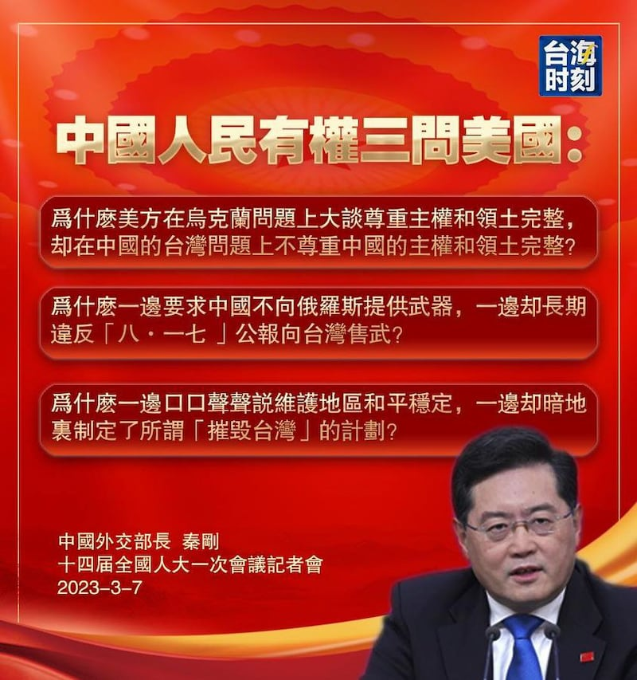
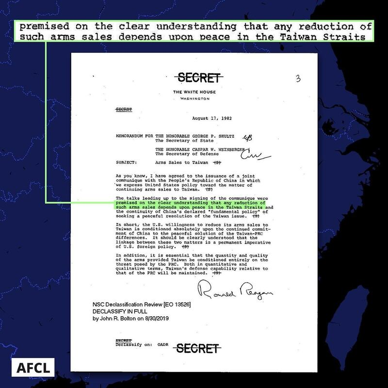

# 事實查覈 | 美國對臺軍售違反《八一七公報》規定嗎？

作者：莊敬

2023.03.07 13:20 EST

## 標籤：片面

## 一分鐘完讀：

中國外交部長秦剛3月7日在“兩會”記者會提出“中國人民有權三問美國”，不僅再度指控美方長期違反《八一七公報》向臺灣售武，也質疑美方暗地裏制定了所謂“毀滅臺灣”的計劃。

有關所謂“毀滅臺灣”計畫，亞洲事實查覈實驗室已於3月1日發表文章，說明消息源頭嘉蘭．尼克森（Garland Nixon）在2月25日透過影片自承“毀滅臺灣計劃”推文爲嘲諷文；既然推文內容爲虛構，相關報導也就無事實根據，中方官員卻一再引用錯誤資訊，製造假議題。

至於美國對臺軍售，《八一七公報》確實載明“美國不尋求執行一項長期向臺灣出售武器的政策，美售臺武器在性能和數量上將不超過中美建交（編按：1979年）後近幾年供應的水平，準備逐步減少對臺的武器出售，並經過一段時間導致最後的解決。 ”也就是說，雙方有條件地同意美國繼續售臺武器，且並未設定美國停止對臺出售武器的日期。

而且，公報與相關電報也載明，減少乃至停止軍售的前提，是中國以和平方式解決臺灣問題。如果不提“和平方式”這個前提，單單指控美國違反《八一七公報》，僅是中國片面立場。

美國宣佈向臺灣出售的AIM-120空對空飛彈。圖片取自美國空軍官網

## 深度分析：

中國外交部長秦剛3月7日在" [兩會"記者會](https://www.fmprc.gov.cn/wjbzhd/202303/t20230307_11036896.shtml)說,中國人民有權問:爲什麼美方在烏克蘭問題上大談尊重主權和領土完整,卻在臺灣問題上不尊重中國的主權和領土完整?爲什麼一邊要求中國不得向俄羅斯提供武器,一邊卻長期違反《八一七公報》向臺灣售武?爲什麼一邊口口聲聲說維護地區和平穩定,一邊卻暗地裏制定了所謂"摧毀臺灣"的計劃?

秦剛上個月才說，有關國家應停止鼓譟“今日烏克蘭，明日臺灣”，卻在“兩會”記者會上，將烏克蘭情勢與臺灣議題相比。除了自相矛盾之外，秦剛的發言還有錯誤訊息及片面主張。

所謂"毀滅臺灣"計劃,是美國廣播節目主持人嘉蘭.尼克森2月16日的推文內容,經臺灣政治人物轉傳,再經媒體引用報導,但他本人已於2月25日在影片中自承推文爲嘲諷文,亞洲事實查覈實驗室也已於3月1日發表 [文章](https://www.rfa.org/mandarin/ytbdzhuantixilie/shishi-hecha/hc-03012023140350.html)詳細說明這起因嘲諷文而製造假議題的事件。然而,在尼克森說明後,包括秦剛、中國外交部發言人毛寧等官員卻一再引用此虛構的內容,無視當事人的說法及相關事實查覈。

中國外交部長秦剛3月7日在記者會提出“三問美國”。圖片來源：今日海峽臉書帳號

## 《八一七公報》停售武器有前提

最近一次美國政府對臺軍售,是 [美國國防安全合作署(DSCA)](https://www.dsca.mil/press-media/major-arms-sales/taipei-economic-and-cultural-representative-office-united-states-f-16)3月1日宣佈,行政部門已通知國會將對臺出售包括F-16戰機配備的飛彈等軍備,總價值約6.19億美元。臺灣的國防部隨即發佈 [新聞稿](https://www.mnd.gov.tw/Publish.aspx?p=81114&title=%e5%9c%8b%e9%98%b2%e6%b6%88%e6%81%af&SelectStyle=%e6%96%b0%e8%81%9e%e7%a8%bf)表示,面對中共常態性派遣軍機與無人機襲擾防空識別區,影響臺灣空域行動自由,已對臺形成嚴峻的軍事威脅,美國基於《臺灣關係法》與"六項保證",持續提供臺灣防衛性武器,是維持區域穩定的基礎。

中國外交部發言人毛寧在3月2日的 [記者會](https://www.fmprc.gov.cn/fyrbt_673021/202303/t20230302_11034198.shtml)上表示,美國向臺灣出售武器,嚴重違反一箇中國原則和中美三個聯合公報特別是《八一七公報》規定,嚴重損害中國主權和安全利益,嚴重損害中美關係和臺海穩定;中方敦促美方停止售臺武器和美臺軍事聯繫。

[國臺辦發言人馬曉光](http://www.gwytb.gov.cn/xwdt/xwfb/wyly/202303/t20230302_12514636.htm)2日說:"堅決反對美國向中國臺灣地區出售武器。美方的售武行徑嚴重違反一箇中國原則和中美三個聯合公報,特別是《八一七公報》規定,是對'臺獨'勢力的縱容支持,是對臺海地區和平穩定的破壞。"

中國聲稱美國違反“一箇中國原則”，但美國長期以來實行的是“一中政策”，這項政策以臺灣關係法、美中三個公報（《上海公報》、《中美建交公報》和《八一七公報》）和政策文件《對臺六項保證》爲指南。

美國的“一中政策”與北京的“一中原則”不同，“一中原則”主張中華人民共和國對臺灣擁有主權，而美國政府只表示“認知”中國的主張，但本身對臺灣主權問題不採取立場。除此之外，雙方對於《八一七公報》也有不同理解。

美中在談判建交的過程中,美國向臺灣出售武器的問題沒有得到解決,雙方進一步討論這個問題,並於1982年8月17日簽署 [《八一七公報》](https://web-archive-2017.ait.org.tw/en/us-joint-communique-1982.html)。根據公報第五點,"美國政府理解並欣賞1979年1月1日中國發表的《告臺灣同胞書》和1981年9月30日中國提出的"九點方針"中,所表明的中國爭取和平解決臺灣問題的政策。"

以及公報第六點：“考慮到雙方的上述聲明，美國政府聲明，它不尋求執行一項長期向臺灣出售武器的政策，它向臺灣出售的武器在性能和數量上將不超過中美建交後近幾年供應的水平，它準備逐步減少它對臺灣的武器出售，並經過一段時間導致最後的解決。”

中國承諾和平解決臺灣問題在前，美國政府有關對臺軍售的聲明在後，第六點明示以前述聲明爲前提。但近年來中國多次以《八一七公報》第六點的文字指控美方違背承諾，卻不談“和平解決臺灣問題”的前提。

另一個重點是，《八一七公報》並未設定美國停止對臺出售武器的日期。

而美國與中華人民共和國於1982年進一步討論對臺軍售問題時,也向臺灣方面提供保證,以及美國對《八一七公報》的解釋。美國政府於2019年、2020年陸續 [解密相關文件](https://www.ait.org.tw/zhtw/six-assurances-1982-zh/):

## 歷史電報：美方對《八一七公報》的解釋

在美中籤署《八一七公報》之前，1982年7月10日，時任美國國務院副國務卿的勞倫斯．伊格爾伯格（Lawrence Sidney Eagleburger）發送給時任美國在臺協會處長李潔明（James Roderick Lilley）的一封電報，提供了美國對《八一七公報》的解釋。

電報寫道，美方已提議可以聲明，美國對臺軍售無論在性能或數量上皆不會超過近年來美中建交後所提供的水準，以及美國預期將逐步減少對臺軍售，其前提是中華人民共和國必須延續尋求和平解決臺灣議題的政策。

倘若中華人民共和國在行動上有任何重大改變，朝向對臺灣採取更爲敵對態度的方向，所有可能與北京達成的、關於美國未來對臺軍售之任何理解，都將因此失效。

“最後，我想提供您最後一項保證，那就是：美國將持續對臺軍售。”

美中籤署《八一七公報》當天，時任美國國務卿的舒茲（George Shultz）又發送電報給時任美國在臺協會處長李潔明，告知美國對臺六項保證，包括：

．未同意設定終止對臺軍售的日期

．未同意就對臺軍售議題向中華人民共和國徵詢意見

．不會在臺北與北京之間擔任斡旋角色

．未同意修訂《臺灣關係法》

．未改變關於臺灣主權的立場

．不會對臺施壓，要求臺灣與中華人民共和國進行談判

里根總統發給國務卿舒茲與國防部長溫柏格的備忘錄。圖片來源：里根圖書館網站

## 總統備忘錄中關於減少對臺軍售的說明

時任美國總統的里根發給國務卿舒茲與國防部長溫柏格(Caspar Weinberger)的 [備忘錄](https://china.usc.edu/sites/default/files/article/attachments/reagan-1982-08-17-arms-sales-to-taiwan.pdf)指出:美國減少對臺軍售的意願,完全取決於中國和平解決兩岸分歧的持續承諾;中國應該明確理解,這兩件事之間的連結,在美國外交政策是件"永久必須執行的命令"。

備忘錄寫道，美國提供給臺灣武器的性能和數量將完全取決於中華人民共和國所帶來的威脅。

## 結論：

當今兩岸情勢緊張,面對中國強化對臺軍事威脅,美國持續供臺防禦性武器,並於近年解密有關對臺軍售的重要電報作爲依據。在解密相關電報後,2020年, [時任國務院亞太助卿史達偉(David Stilwell)](https://www.ait.org.tw/zhtw/zh-remarks-by-david-r-stilwell-assistant-secretary-of-state-for-east-asian-and-pacific-affairs-at-the-heritage-foundation-virtual/)曾說:"像這樣進行歷史回顧非常重要,因爲北京有扭曲歷史的習慣。因此,我們應該儘可能經常回顧並查閱史實。"

中國對臺灣的軍事打壓日益增加，是不爭的事實，如此情勢並不符合美國政府當年簽署《八一七公報》的前提，因此美國透過提供必要的防禦物資和其他支持，以幫助臺北因應來自中國的威脅。

這次美國向臺灣出售飛彈等軍備，北京又指控美國違反《八一七公報》規定，破壞臺海和平穩定。北京企圖以片面立場誤導大衆，再度展現其扭曲歷史的“習慣”。

*亞洲事實查覈實驗室是針對當今複雜媒體環境以及新興傳播生態而成立的新單位,我們本於新聞專業,提供正確的查覈報告及深度報導,期待讀者對公共議題獲得多元而全面的認識。讀者若對任何媒體及社交軟件傳播的信息有疑問,歡迎以電郵*  *[afcl@rfa.org](http://afcl@rfa.org)*  *寄給亞洲事實查覈實驗室,由我們爲您查證覈實。*

[Original Source](https://www.rfa.org/mandarin/shishi-hecha/hc-03072023131507.html)