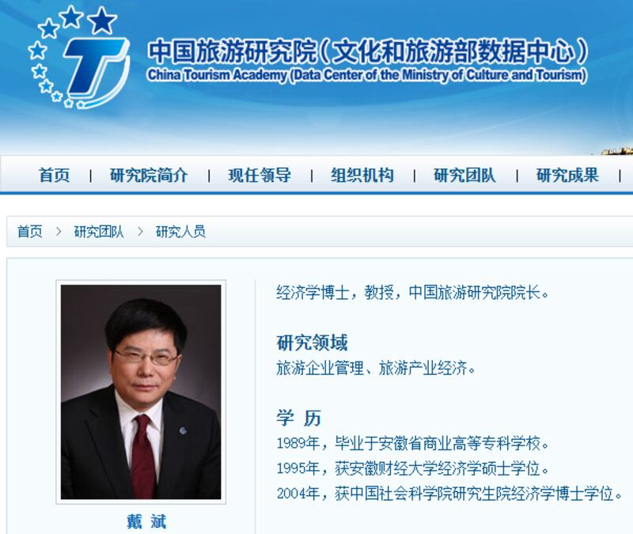

# 事實查覈 | 與150多國家免籤？　中國護照的含金量越來越高？

作者：鄭崇生

2023.03.08 13:02 EST

## 標籤：誤導

## 一分鐘完讀：

中國全國人大、政協"兩會"目前正在北京舉行,全國政協委員戴斌3月4日在政協14次會議首場委員通道接受集體採訪時說道: [目前,中國已與150個國家簽署互免簽證協議,中國護照的含金量越來越高,說走就走的目的地越來越多。](https://m.huanqiu.com/article/4BwJVg1poPA)

亞洲事實查覈實驗室認爲,戴斌的說法是誤導。事實上,包括 [中國官方自己的公開資訊](http://cs.mfa.gov.cn/zggmcg/cgqz/qzxx_660462/202110/t20211029_10403855.shtml)都明確指出,中國與150多個國家簽署互免簽證協議,適用範圍絕大多數限於中國的外交護照、公務護照及公務普通護照,多數民衆出國旅遊持用的普通護照並不在其中。戴斌身爲具官方色彩的中國旅遊研究院院長、文化和旅遊部數據中心主任,作爲一名業內人士卻有這樣的說法,明顯爲誤導。

## 深度分析：

**戴斌使用的** ["中國護照的含金量越來越高"](https://m.s.weibo.com/vtopic/detail?click_from=searchpc&q=%23%E4%B8%AD%E5%9B%BD%E6%8A%A4%E7%85%A7%E7%9A%84%E5%90%AB%E9%87%91%E9%87%8F%E8%B6%8A%E6%9D%A5%E8%B6%8A%E9%AB%98%23)一詞3月4日經過央視新聞在新浪微博上標註爲話題、引發討論後,當天單日閱讀量一度衝高至1.1億次。隨後,例如 [中國駐北愛爾蘭貝爾法斯特總領事張美芳](https://twitter.com/CGMeifangZhang/status/1632003325708189699?s=20)也在個人推特上,以中、英文雙語轉發"中國護照含金量越來越高"的相關信息。張美芳僅依據中國媒體的報道轉發這一信息,在她的推特下,同樣也出現許多網民嘲諷與批評的留言。

不管是報道戴斌談話的新聞評論區，或者張美芳的推特留言區，都出現“大翻車”的現象，中國民衆對於所持護照方便程度的感受，與兩人的良好感覺大不相同。

有微博網民質疑：“這是指外交護照與公務護照吧？”還有人問：“和我們普通人有毛關係？”、“這個委員真會逗我們玩，我們的普通護照沒那麼多免籤的，即使是外交公務護照，也不能’說走就走’去旅行吧！”

## 中國護照有幾種？

根據中國外交部領事司的官方網站"中國領事服務網", [中國護照共六種](http://cs.mfa.gov.cn/zggmzhw/hzlxz/hzlvzjj_660526/):包括外交護照、公務護照、公務普通護照、香港特區護照、澳門特區護照及多數中國公民持有的普通護照。

即使持前三種，也就是外交護照、公務護照與公務普通護照，按照中國官方自己的規定，使用相關護照公務出國都須報備，無法“說走就走”。

領事司官網今年2月22日發佈最新 [《關於中外互免簽證協定一覽表》](http://cs.mfa.gov.cn/wgrlh/bgzl/202110/t20211029_10403855.shtml)中則明確指出,在152個與中國互免簽證的國家中,中國護照適用免籤的多爲外交部照、公務及公務普通護照。

全球主要兩個專門研究各國護照方便程度的專業諮詢機構一是總部位於加拿大的阿爾頓資本（Arton Capital）旗下的 “護照指數”（Passport Index），一爲總部位於英國的“亨利護照指數”（The Henley Passport Index）。這兩家機構在統計一國護照移動便利的流動性（Mobility Score）時，都將一國普通護照獲得的“免簽證”與“落地簽證”數量納入指標。

阿爾頓資本執行長阿爾曼·阿爾頓（Armand Arton）告訴亞洲事實查覈實驗室，外交和公務護照的簽發是“非常有選擇性”的，各國都只有很小部分的人曾獲得這類護照。 而鑑於外交和公務護照持有者的工作性質，他們移動的便利性幾乎是不受限制。 考慮到這一點，“護照指數”在衡量一國護照實力與便利性時，只以傳統的普通護照爲主。

## 中國護照含金量到底有多高？

在2023年的統計裏,全球199個國家和地區中, [阿爾頓資本的護照指數](https://www.passportindex.org/byIndividualRank.php)排行顯示,中國普通護照的個體實力排名第118,給予中國普通護照免籤或是落地簽證的國家或地區共84個,在這個排名系統中,香港排名47,有156個國家或地區給予免籤或落地籤;澳門則排名64。

[亨利護照指數的全球護照實力](https://www.henleyglobal.com/passport-index/ranking)排名中,中國則排名第66,給予中國普通護照免籤或是落地簽證的國家或地區共81個。香港排名第19,有172個國家或地區給予香港特區護照免籤或落地籤;澳門排名34。

由此可見，若在中國不同種類的護照中相比較，中國普通護照的含金量遠不及香港與澳門特區護照。

阿爾曼·阿爾頓評價說，持有中國普通護照的移動便利與流動性得分是相對較低的。

若看這兩大機構的逐年統計數據,中國普通護照的實力排名確實呈現逐漸提升趨勢,但阿爾頓資本的護照指數在2019年年末、也就是新冠疫情大流行開始後,針對護照流動性有過特別研究。 [中國普通護照](https://www.passportindex.org/passport/china/)2019年底的方便程度,也就是流動性一度大幅下滑,2020-2022年才逐步回升。

阿爾曼·阿爾頓表示，考慮到新冠疫情後中國邊境才重新開放，預計隨着時間推移，中國護照的流動性得分有逐漸提高的機會，但中國普通護照要想成爲排上“前段班”的方便護照，他認爲，除非中國與像是歐洲聯盟（EU）那樣的多國集團簽署免簽證新協議，纔有可能快速提升。

阿爾頓資本的護照指數排名中最方便的護照是阿聯酋，有181個國家給予阿聯酋護照免籤或是落地籤；亨利護照指數排名中最方便的護照是日本，有193個國家給予免籤或落地籤。

## 與中國互免簽證的有哪些國家？

這裏只探討多數中國公民使用的普通護照。根據領事司官網,與 [中國簽有普通護照互免簽證優惠的國家與地區](http://cs.mfa.gov.cn/zggmcg/cgqz/qzxx_660462/202110/t20211029_10403855.shtml)共23個:阿聯酋、巴巴多斯、巴哈馬、白俄羅斯、波黑(波斯尼亞黑塞哥維那)、多米尼克、厄瓜多爾、斐濟、格林納達、卡塔爾、馬爾代夫、毛里求斯、塞爾維亞、塞舌爾、聖馬力諾、蘇里南、湯加、亞美尼亞;而阿塞拜疆、俄羅斯、格魯吉亞、摩爾多瓦、土庫曼斯坦僅限參加團體旅遊的中國普通護照持有者才適用免籤。這不包括給予中國普通護照落地籤的待遇。

另據 [環球網](https://m.huanqiu.com/article/4BkWsE3YOjR)報道,中國的鄰國朝鮮未對中國普通護照開放免籤,反倒是韓國針對從濟州島入境的中國個人與團體遊客實行的單方面免簽證措施。

## 結論：

中國護照的含金量，若是以相關機構研究的護照實力與便利程度來看，的確是有越來越多國家與地區給予不同條件的免籤或落地籤趨勢，但戴斌明確指出中國與150個國家簽署互免簽證協議，卻不提最關鍵的資訊、也就是適用的護照種類多爲中國外交與公務類護照，明顯存在誤導，也難怪中國民意在網上有如此強烈的不同看法。

*亞洲事實查覈實驗室是針對當今複雜媒體環境以及新興傳播生態而成立的新單位,我們本於新聞專業,提供正確的查覈報告及深度報導,期待讀者對公共議題獲得多元而全面的認識。讀者若對任何媒體及社交軟件傳播的信息有疑問,歡迎以電郵*  [*afcl@rfa.org*](http://afcl@rfa.org)  *寄給亞洲事實查覈實驗室,由我們爲您查證覈實。*

[Original Source](https://www.rfa.org/mandarin/shishi-hecha/hc-03082023125718.html)