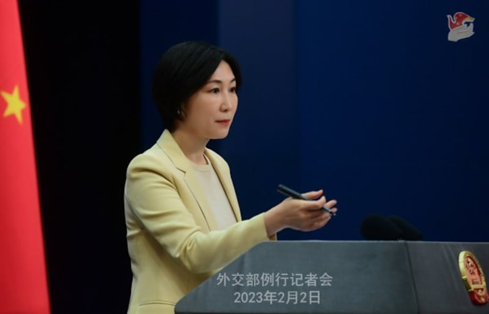
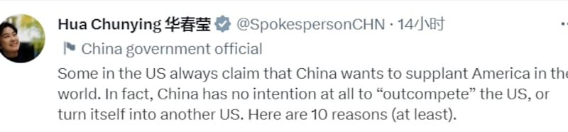
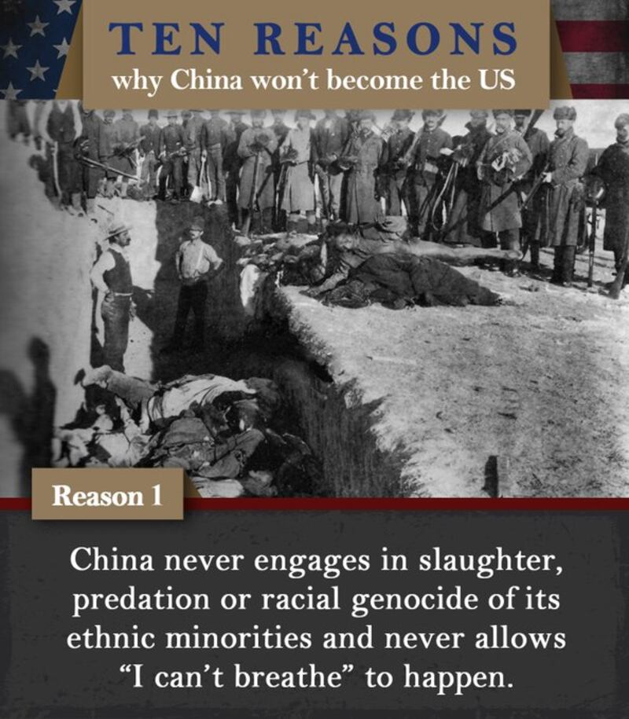
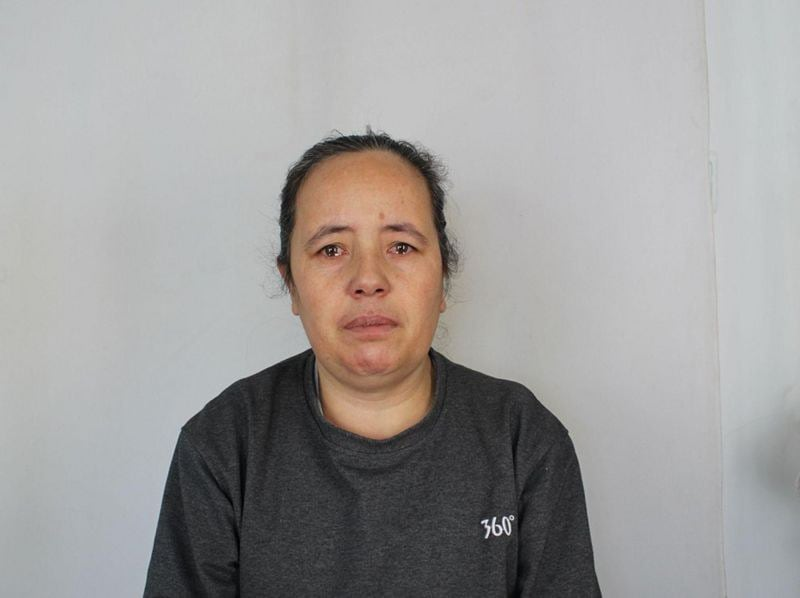

# 事實查覈 | 中國維護宗教信仰自由，從未對少數民族進行屠殺和種族滅絕嗎？

作者：何亮

2023.03.09 10:59 EST

## 標籤：虛假

## 一分鐘完讀：

2023年2月期間，中國外交部發言人多次標榜中國政府尊重人權，強烈譴責其他國家對穆斯林的歧視和迫害，並呼籲國際社會共同維護人民的宗教自由。2月2日、3日，外交部發言人毛寧先後譴責了丹麥政客焚燒古蘭經的行爲和美國社會存在對穆斯林的“嚴重歧視”，並稱中國政府“依法保護公民宗教信仰自由”；2月21日晚，外交部部長助理、新聞發言人華春瑩又在推特上發了十張圖片，列舉“中國不會成爲另一個美國”的十大原因。其第一條“原因”就是：中國從來不對少數民族進行屠殺、掠奪和種族滅絕，從來不允許發生“我無法呼吸”事件。

經亞洲事實查覈實驗室查覈，中國外交部的這些言論不僅涉嫌對內對外“雙重標準”，華春瑩稱中國從未對少數民族進行屠殺、掠奪和種族滅絕等，並非事實。

## 深度分析：

在 [2023年2月2日中國外交部的例行發佈會上](https://www.mfa.gov.cn/web/wjdt_674879/fyrbt_674889/202302/t20230202_11018699.shtml),《北京青年報》記者問及中方對丹麥政黨"強硬路線"(Stram Kurs)領導人在土耳其駐瑞典使館附近焚燒《古蘭經》一事的評論。外交部發言人毛寧回答說:"尊重宗教信仰自由是國際社會的普遍共識。穆斯林的信仰和宗教感情應當得到尊重。"她並表示: "發生這樣的事情,充分說明一些西方政客自我標榜的所謂'尊重宗教信仰自由'是何其虛僞。中方將一如既往地同伊斯蘭國家共同倡導文明對話,共同維護包括穆斯林民衆在內的各羣體宗教信仰自由。"

毛寧2月2日主持例行發佈會，回答記者提問 來源：中國外交部官網

一日後, [在2月3日的外交部例行發佈會上](https://www.fmprc.gov.cn/fyrbt_673021/jzhsl_673025/202302/t20230203_11019334.shtml),《環球時報》記者要求外交部對美國國務卿布林肯在"國際宗教自由峯會"上發表的有關新疆問題的講話進行評論。包括布林肯提到的美國於2022年11月以"嚴重侵犯宗教自由"爲由將十幾個國家列爲"特別關注國家",以及中國對以穆斯林爲主的維吾爾族人實施持續的"種族滅絕"等。

毛寧則否認了這些指控，並稱美方“罔顧基本事實，詆譭中國宗教政策，充滿意識形態偏見，嚴重干涉中國內政。中方對此堅決反對。”

毛寧表示，中國政府依法保護公民宗教信仰自由，中國各族人民依法享有充分的宗教信仰自由，中國也從來沒有搞過“種族滅絕”。

她說：“反觀美國，75%的美國穆斯林認爲美國社會對穆斯林存在嚴重歧視。美方沒有資格對中國說三道四、指手畫腳。”

2月21日晚，外交部部長助理、新聞發言人華春瑩在推特上發文稱：“美國一些聲音總是聲稱中國要在世界上取代美國。事實上，中國根本無意‘超越’美國，也無意把自己變成另一個美國。這裏有10點原因(至少)”。

華春瑩推文截圖

在隨後的推文中,華春瑩發了十張圖,第一張圖顯示的就是1890年12月發生在美國南達科他州的 [傷膝河大屠殺](https://en.wikipedia.org/wiki/Wounded_Knee_Massacre)事件。華春瑩配圖所發的文字是:

“中國從來不對少數民族進行屠殺、掠奪和種族滅絕，從來不允許發生“我無法呼吸”事件。”

華春瑩引述的"傷膝河大屠殺",根據 [史料記載](https://web.archive.org/web/20111205184809/http:/www.bgsu.edu/departments/acs/1890s/woundedknee/WKIntro.html),1890年,美國政府爲了保護淘金人的安全,驅趕當地印第安人。當時拉科塔部族被包圍在南達科他州的傷膝河(拉科塔語: Čhaŋkpé Ópi Wakpála)附近,印第安人已經照要求交出武器。但是福賽思上校認爲仍有一部分武器未交出,命令士兵搜查。據說有一名聽力障礙的印第安人"黑郊狼"(Black Coyote)不明白這些士兵的意圖,在爭執中發生了槍支走火。美軍士兵隨後開火,無差別的射殺手無寸鐵的印第安人。此次事件共有大約300個拉科塔人(包括婦女和小孩)在屠殺中死亡。華春瑩引用的圖就來源於該事件的歷史資料。

華春瑩所發十張圖片之一 來源：華春瑩推特帳號

## 中國"從來就有"對少數民族的屠殺和對宗教信仰的限制

在傷膝河等地的印第安人遭到屠殺的19世紀晚期,中國正處在晚清政府統治時期。無論是政府軍還是"太平天國"等叛軍,針對自己國人的"屠城"行爲屢見不鮮,包括針對少數民族的大規模屠殺。如1862年至1873年的 ["陝甘回亂"](https://yibaochina.com/?p=242306)期間,陝甘總督左宗棠指揮"平亂",屠殺了大量回民。在陝西,清軍在渭南、西安附近分別屠殺了數萬回民;在寧夏,清軍北路劉松山部在靈州金積堡對回民進行滅族,屠殺了全部500多座回民村的超過五十萬回民。當時,屠殺、戰爭、飢病導致了數百萬回族人口死亡,就連鎮壓回民的左宗棠也感慨說, [這是"回族千數百年未有之浩劫"](http://rdbk1.ynlib.cn:6251/Qw/Paper/405114#anchorList)。

1949年中華人民共和國成立後，土地改革、鎮壓反革命、三反、五反等運動乃至文化大革命期間，亦有大量民衆被處決或迫害致死，其中包括多次針對少數民族的屠殺。

1958年,青海省循化縣的藏族和撒拉族人因抗拒"合作化",並要求釋放被扣留在"學習班"的加乃化仁波切與當地幹部發生衝突。中國政府出動解放軍步兵第55師163、165兩個團共約四個營、55師工兵營、炮兵306團一個混合炮兵營,以及循化縣兩個民兵騎兵營,圍殲"叛匪"。軍隊在沒有遭到抵抗的情況下,攻擊民衆。直到解放軍發覺"叛匪"們並不具備反擊能力,自動停火,才發覺死傷者全是手無寸鐵的民衆。在4小時內,民衆死傷719人,其中435人被擊斃。史稱 ["循化事件"](http://biweeklyarchive.hrichina.org/article/307.html)。

文革期間,大量清真寺被關閉,紅衛兵禁止回民參加禮拜,查抄焚燬伊斯蘭教典籍,批鬥阿訇及穆斯林。"九一三"事件後,雲南省的穆斯林羣衆開始抗爭,要求信仰自由,他們到昆明上訪,並強行重開清真寺。1975年7月29日至8月4日,解放軍第十四軍在雲南省7個縣區展開了大屠殺, [共造成約1600名平民死亡](https://zh.wikipedia.org/zh-hans/%E6%B2%99%E7%94%B8%E4%BA%8B%E4%BB%B6),其中866人來自沙甸。死者中包括300名兒童,另有近千人傷殘。

## 近年來中國政府對穆斯林的迫害依然沒有停止

2001 年,中國政府開始以"9.11"爲名將維吾爾人與國際恐怖主義聯繫起來。 2017 年,他們以打擊宗教極端主義的名義將伊斯蘭教信衆關進集中營。根據聯合國人權高級專員辦事處2018年9月19日發佈的 [合併定期報告](https://documents-dds-ny.un.org/doc/UNDOC/GEN/G18/279/46/PDF/G1827946.pdf?OpenElement),中國政府擴大了"恐怖主義"的定義,並涉嫌以含糊不清的"分裂主義"和"極端主義"罪名將和平的公民表達定義爲犯罪,維吾爾族、藏族佛教徒和蒙古族民衆都可能受到影響。

此外，這份報告還專門提到，據估計大約有數萬到一百多萬維吾爾人和其他穆斯林少數民族民衆被拘留在“再教育營”中，對於沒有被拘留的維族人，政府也實施了長期的監控和旅行限制。

位於美國的非營利組織「維吾爾人權項目」(Uyghur Human rights project)於 2019 年發表了一份題爲 [《摧毀信仰:破壞、褻瀆維吾爾清真寺和聖地》](https://uhrp.org/report/demolishing-faith-the-destruction-and-desecration-of-uyghur-mosques-and-shrines/)(Demolishing Faith: The destruction and desecration of Uyghur Mosques and Shrines)的報告。報告顯示,自 2014 年以來,中國當局拆除了 10000 至 15000 座清真寺、墳墓和聖地。

該項目於2021 年發表的另一份報告 [《維吾爾知識分子和文化精英之失蹤》(](https://uhrp.org/report/the-disappearance-of-uyghur-intellectual-and-cultural-elites-a-new-form-of-eliticide/)The Disappearance of Uyghur Intellectual and Cultural Elites: A New Form of Eliticide)中顯示,中國當局自 2014 年以來在維吾爾地區進行大規模鎮壓,逮捕了至少 630 名伊瑪目和宗教學者,其中18人在拘留期間死亡。

中國當局於 2017 年 12 月逮捕了著名的維吾爾伊斯蘭學者穆罕默德·薩利德·達莫拉 (Muhammad Salid Damolla) 及其家人，他是《古蘭經》維吾爾語譯者，自由亞洲電臺當時證實，這位學者於 2018 年死於獄中。

去年曝光的 ["新疆公安文件"](https://www.bbc.com/zhongwen/simp/world-61564262)(Xinjiang Police Files)中,五千多張維吾爾人的照片及相關資料被公開,其中包括被拘禁在"再教育營"中的維吾爾人的身份信息、被逮捕原因、親屬資料和警方文件等。根據其中的文件,中國公安部部長趙克喆於2018年6月的講話內容被曝光。 在那次講話中,他說:"新疆有200萬人傾向於支持'泛突厥主義、泛伊斯蘭主義',而且這種意識形態毒害了南疆超過200萬人。"

從他的話中，可以估計中國當局在維吾爾地區的集中營中關押了至少兩百萬人。

“新疆公安文件”中，50歲的Hawagul Tewekkul，她被關押進集中營的原因不明

## 結論：

中國政府將信奉伊斯蘭教的人與極端主義和恐怖主義捆綁在一起，由此將其對信教人士的迫害解釋成“反恐”，將針對維族人的鎮壓、控制、文化消滅和種族滅絕也解釋成“挽救和轉化極端分子”。外交部聲稱中國民衆“依法”享有的宗教自由其實就是沒有自由，發言人標榜的中國從未做的事情其實正是中國政府一直在做的事情。“中國從來不對少數民族進行屠殺、掠奪和種族滅絕”是一句徹底的假話。

*亞洲事實查覈實驗室是針對當今複雜媒體環境以及新興傳播生態而成立的新單位,我們本於新聞專業,提供正確的查覈報告及深度報導,期待讀者對公共議題獲得多元而全面的認識。讀者若對任何媒體及社交軟件傳播的信息有疑問,歡迎以電郵*   [*afcl@rfa.org*](mailto:afcl@rfa.org)  *寄給亞洲事實查覈實驗室,由我們爲您查證覈實。*

[Original Source](https://www.rfa.org/mandarin/shishi-hecha/hc-03092023105119.html)