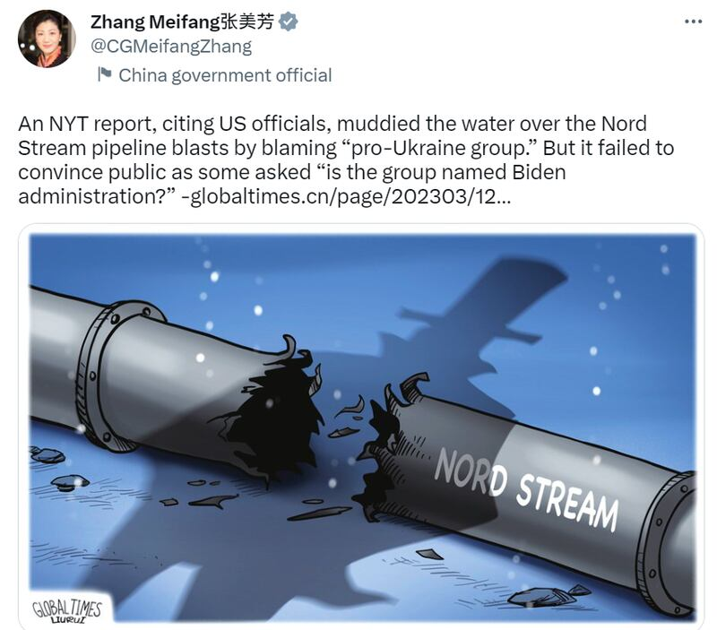
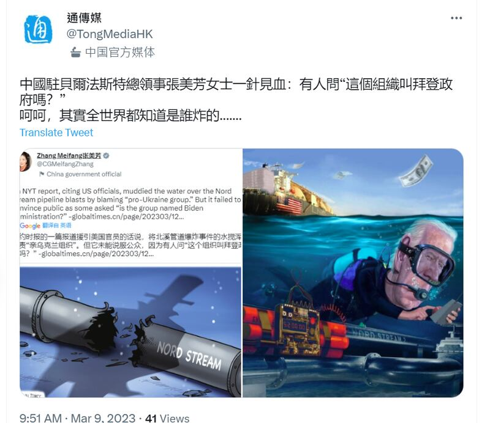

# 事實查覈 | 北溪爆炸案謎團："親烏組織"就是拜登政府嗎？

作者：莊敬

2023.03.14 12:11 EDT

## 標籤：誤導

## 一分鐘完讀：

紐約時報3月7日報導，美國官員檢視的新情報顯示，一個親烏克蘭組織去年襲擊了天然氣管線北溪二號(北溪)，但沒有證據顯示烏克蘭當局涉入；對此報導內容，烏克蘭、俄羅斯官方表態不接受，美國、德國表示持續等待調查結果。

中國外交部對北溪二號爆炸案的立場是 “對此事開展客觀、公正、專業的調查十分必要 ”。然而，在調查未完成前，有中國官員、官方媒體借紐時的報導，在社交媒體發佈文字、圖片影射美國拜登政府爲幕後主使。亞洲事實查覈實驗室認爲，在缺乏證據的情況下，這些說法有失客觀、公正。

## 深度分析：

北溪一號與北溪二號是從俄羅斯穿越波羅的海到德國的天然氣管線。北溪一號於2011年開始供氣，在2022年2月俄烏戰爭爆發後，俄羅斯爲報復歐盟經濟制裁，於9月初宣佈北溪一號無限期斷氣。北溪二號總長約1200公里，路線繞過烏克蘭、波蘭等東歐國家，已於2021年建成，但德國爲回應俄羅斯對烏克蘭的行動，暫停批准這條備受爭議的天然氣管道啓用運行。

美國等部分西方國家強烈反對北溪二號，主因憂心它會使歐洲更依賴俄羅斯天然氣，強化俄國影響力，提高俄國侵略烏克蘭的風險，成爲 “危險的地緣政治武器 ”。

2022年9月26日，未在運行的北溪一號、二號先後傳出遭到破壞，各界指向人爲蓄意破壞，俄羅斯、烏克蘭、美國等國都曾遭懷疑，但至今未有足夠證據表明確切起因與肇事者。

然而,針對北溪爆炸案的爆料、陰謀論不斷。美國資深記者、普立茲獎得主西摩・赫什(Seymour Myron Hersh)今年2月在個人網站 [撰文](https://seymourhersh.substack.com/p/how-america-took-out-the-nord-stream),揭露拜登政府密謀這項破壞行動的許多細節,直指美國是破壞北溪天然氣管道的幕後黑手,但白宮、國防部等單位隨即反駁,指赫什文章內容純屬捏造。

[紐約時報](https://www.nytimes.com/2023/03/07/us/politics/nord-stream-pipeline-sabotage-ukraine.html)3月7日引述美方最新情報指出, [一個 "親烏組織 "襲擊北溪天然氣管道](https://www.nytimes.com/2023/03/07/us/politics/nord-stream-pipeline-sabotage-ukraine.html),相信實施破壞者最有可能是烏克蘭或俄羅斯國籍人士,或兩者的某種結合,但沒有證據顯示烏克蘭當局涉入。針對紐時的報導,烏克蘭政府表示沒有參與破壞行動,也沒有所謂親烏組織的相關資訊,俄羅斯政府則稱西方媒體報導是爲轉移注意;美國與德國官方皆表示須等待調查結果。

## 北溪調查未完 中國官員卻指向拜登政府？

中國媒體也隨即跟進北溪爆炸案, [環球時報英文版](https://www.globaltimes.cn/page/202303/1286927.shtml)3月8日刊出一篇未有記者具名的報導,稱紐時報導在社交媒體上掀起熱議,但多數讀者不相信所謂 "親烏組織 "涉案的說法。該報導並稱:常見的兩個評論是, "據現有資訊,親烏的就是美國 "、 "這個組織叫拜登政府嗎? "

環球的報導藉由網民評論質疑拜登政府涉入北溪爆炸案，其搭配的圖片敘述更直接寫着 “美國是罪魁禍首 ”。

中國駐愛爾蘭貝爾法斯特總領事張美芳 [3月8日在推特轉發環球的文章與圖片](https://twitter.com/CGMeifangZhang/status/1633466702892797960),其推文稱紐時的報導無法說服人們北溪爆炸案是由 "親烏組織 "所爲,因爲有人問 "這個組織叫拜登政府嗎? "

中國外交官張美芳轉發環球時報的報導與配圖

接着,通傳媒的推特帳號 [再轉發張美芳的推文](https://twitter.com/TongMediaHK/status/1633646552446128129),寫道 "中國駐貝爾法斯特總領事張美芳女士一針見血:有人問'這個組織叫拜登政府嗎?'呵呵,其實全世界都知道是誰炸的...... "。通傳媒還進一步附上漫畫圖片,圖中一名貌似美國總統拜登的人物潛水到北溪管道,按下紅色按鍵。

通傳媒轉發張美芳的推文，並附上配圖影射拜登政府涉入北溪爆炸案

根據香港中通社網頁 [介紹](http://www.hkcna.hk/aboutDetail.jsp?id=100005681&channel=4781), "通傳媒 "是香港中通社在推特及其它社交平臺的帳號。而中通社隸屬於中國國務院僑務辦公室,是中國官方媒體。

中國外交部發言人汪文斌2月20日在 [例行記者會](https://www.mfa.gov.cn/web/fyrbt_673021/202302/t20230220_11027645.shtml)呼籲,對北溪爆炸事件開展客觀、公正、專業的調查十分必要,然而國際調查持續期間,中國外交官員、官媒卻仍在傳播沒有證據的文字與圖片。

## 結論：

北溪爆炸案原因尚未有確切證據，德國、丹麥、瑞典正在進行聯合調查，到目前爲止，調查結果並未指向任何一個國家。雖然許多媒體有不同猜測，但目前未有確切證據和結論。亞洲事實查覈實驗室認爲，調查結果未明之前，具影響力的中國官員、官媒藉由網民說法、製作漫畫等方式影射美國爲“禍首”，有誤導讀者之嫌。

*亞洲事實查覈實驗室是針對當今複雜媒體環境以及新興傳播生態而成立的新單位,我們本於新聞專業,提供正確的查覈報告及深度報導,期待讀者對公共議題獲得多元而全面的認識。讀者若對任何媒體及社交軟件傳播的信息有疑問,歡迎以電郵*   [*afcl@rfa.org*](mailto:afcl@rfa.org)  *寄給亞洲事實查覈實驗室,由我們爲您查證覈實。*

[Original Source](https://www.rfa.org/mandarin/shishi-hecha/hc-03142023120234.html)