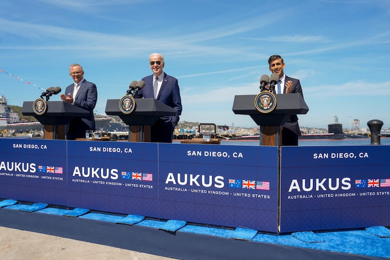

# 事實查覈 | 澳大利亞發展核動力潛艇違反了國際條約嗎？

作者：鄭崇生

2023.03.15 14:46 EDT

## 標籤：誤導

## 一分鐘完讀：

澳大利亞、英國與美國3月13日宣佈，在三方安全協議（AUKUS）架構下，將協助澳大利亞取得核動力潛艇。儘管美國總統拜登(Joe Biden)已經做出解釋，AUKUS計劃下打造的是核動力潛艇（nuclear-powered）、而非核武裝（nuclear-armed）潛艇，這些潛艇不攜帶任何類型的核武器（nuclear weapons），中國從常駐聯合國代表團到外交部仍口徑一致地批評AUKUS核潛艇計劃"構成嚴重核武擴散風險，違反《不擴散核武器條約》（下稱《條約》）的目的和宗旨"。

但國際原子能機構（IAEA）指出，澳大利亞、英國及美國都已按照《條約》與協定，即時通報。國際法學者告訴亞洲事實查覈實驗室，中國方面指責AUKUS核動力潛艇計劃違反《不擴散核武器條約》的說法，是沒有根據的假設。

## 深度解析：

## 《不擴散核武器條約》及相關國際法規範

《不擴散核武器條約》是1968年7月1日在華盛頓、莫斯科與倫敦開放締結的一項國際條約，中華民國是初始協定締約成員國。中華人民共和國於1984年加入國際原子能機構，全國人民代表大會於1991年12月29日批准《條約》，自1992年3月9日生效。

[《不擴散核武器條約》](https://www.un.org/disarmament/wmd/nuclear/npt/text)確立了在1967年1月1日前、已製造並進行過核武爆炸或其它核爆炸裝置的國家,允許保留核武器,也就是美國、蘇聯(後由俄羅斯繼承)、英國、法國和中國成爲僅有5個《不擴散核武器條約》承認的擁核武國家,包含5個有核武國在內,共有191個締約國。

條約確立的原則是：所有締約國，不論有核武器國家或無核武器國家，都能爲和平目的而獲得和平應用核技術的利益，這些利益包含有核武器國家由於發展核爆炸裝置而可能得到的任何技術副產品。

根據《條約》，核武器締約國承諾，不以任何方式協助、鼓勵或誘導任何無核武器締約國製造、或以其他方式獲取核武器或其他核爆炸裝置；無核武器締約國則承諾，不製造或以其他方式獲取核武器或其他核爆炸裝置。另外，《條約》還載明，所有締約國停止核軍備競賽，推動核裁軍。

## 核動力潛艇=核武器？

“我想一開始就跟大家講清楚，在這個關鍵點上別有任何誤解或混淆，這些潛艇，是核動力潛艇，不是核武裝或攜帶核武器的潛艇，澳大利亞是一個自豪的非核武器國家，並致力於維持非核武器國家的地位。”拜登3月13日在加州表示，他與英國首相蘇納克（Rishi Sunak）及澳大利亞總理阿爾巴尼斯（Anthony Albanese）一同宣告：AUKUS計劃下打造的核動力潛艇不會裝載核武器（The SSN-AUKUS will not have nuclear weapons.），而三方同盟仍致力於維持印太區域的和平與穩定、開放與繁榮。

美國總統拜登（中）、英國首相蘇納克（右）與澳大利亞總理阿爾巴尼斯3月13日在加州聖迭戈（San Diego）宣佈AUKUS核動力潛艇的計劃。（白宮官方推特截圖）

但中國則認定核動力潛艇就是受條約規範的核武器。從澳、英、美三方宣佈AUKUS計劃以來，到三方宣告核潛艇建造細節與時程表前後，北京一再指責三國刺激軍備競賽，破壞國際核不擴散體系，損害地區和平穩定。

中國外交部發言人汪文斌14日在例行記者會上指控，美、英、澳推進核潛艇及其他尖端軍事技術合作是“典型冷戰思維”，在錯誤和危險道路上越走越遠，且“違反《不擴散核武器條約》目的和宗旨”，構成嚴重核擴散風險。他還批評，三國聲稱將遵守最高核不擴散標準純屬“欺世盜名”，實質上是脅迫國際原子能機構祕書處作出保障監督豁免安排，嚴重損害機構權威。

對於中方的指責，國際法學者、丹佛大學（University of Denver）法學院特聘教授南達（Ved Nanda）在接受亞洲事實查覈實驗室訪問時指出，中方擔心這三個國家“在錯誤和危險的道路上越走越遠”，實際上是一種“政治表態”；中國談到核武器國家向非核武器國家轉移核材料“公然”違反《條約》的指控則是“沒有根據的假設”。

英美這兩個有核武器的締約國家，要協助澳大利亞取得核動力潛艇也要遵循國際法規範，還要按照《不擴散核武器條約》通知國際原子能機構。國際原子能機構則依據《條約》履行覈查責任。

## AUKUS高標準且公開透明？

國際原子能機構對此回覆了亞洲事實查覈實驗室的詢問,並給出 [十點聲明](https://www.iaea.org/newscenter/pressreleases/director-general-statement-in-relation-to-aukus-announcement),第一點就指出,其機構總幹事格羅西(Rafael Grossi)已經分別收到澳大利亞、英國與美國關於AUKUS計劃下、澳大利亞將採購"常規武裝核動力潛艇"(conventionally armed, nuclear-powered submarines)的通知。根據AUKUS三國給國際原子能機構的通報,這一夥伴機制的目標仍致力於禁止核擴散體系,並維持澳大利亞作爲阻止核擴散這一成就的典範國家地位。

國際原子能機構總幹事格羅西（Rafael Grossi）（美聯社）

格羅西在聲明中說，三國在發展早期階段已定期、即時通報，接下來，國際原子能機構還將持續與三國洽談，“最終必須確保這項計劃不會導致核擴散風險，而三方的法律義務及不擴散等層面的維護，是最重要的。”

《條約》第四條中載明，所有締約國承諾，促進並有權參加在最大可能範圍內爲和平利用核能而交換設備、材料和科學技術情報。

白宮顧問沙利文（Jake Sullivan）13日在一場電話簡報會上說，過去18個月以來，美國已經就AUKUS協定與中國方面有所溝通。

## 澳大利亞開先例

作爲《不擴散核武器條約》的非核武締約國家，澳大利亞確實開了先例。這是世界上首次出現兩個擁核武器國家向一個無核武器國家轉移核裂變材料和核技術。

同樣專研國際法的美國霍夫斯特拉(Hofstra University)大學法律教授古舉倫(Julian Ku)則告訴亞洲事實查覈實驗室,《不擴散核武器條約》要求像澳大利亞這樣的非核武器締約國遵守與國際原子能機構簽訂的 [《全面保障協定》](https://www.iaea.org/sites/default/files/publications/documents/infcircs/1972/infcirc153.pdf)(Comprehensive Safeguards Agreement),也就是要允許國際原子能機構能檢查和核實使用的相關核技術與核材料,不是爲了發展核武器或核爆炸裝置。

古舉倫認爲，澳大利亞會行使《全面保障協定》中第14項的例外適用豁免原則，也就是對將核技術與核材料用於“非違禁的軍事活動”，而澳大利亞完全有權這麼做，也會是第一個援引這項例外適用條款的國家。

國際原子能機構總幹事格羅希強調，會以公正的態度完全透明地履行他的查覈職責，並表示“這一過程涵蓋嚴肅的法律和複雜的技術問題”，而澳大利亞要能與國際原子能機構達成共識，才能適用這項豁免，也就是將核材料用於“諸如潛艇的核動力推進系統”。

國際法學者南達介紹，AUKUS一年半前宣佈這項核潛艦計劃後，他一開始也有過擔憂，懷疑他們是否鑽了《條約》的漏洞——也就是《全面保障協定》中開的這一個例外的口子，讓核材料可以用於海軍的潛艇反應堆。對此，白宮已指出，三國明確承諾會履行自身在《不擴散核武器條約》中的義務，並繼續與國際原子能機構磋商，以制定出一項不擴散方針，爲獲取核動力潛艇能力設立最強有力的先例。

中國“有罪推定”的指控並非事實，但擔憂先例一開的影響也有合理性。南達指出：儘管這三個國家已經採取足夠的保障措施，但先例一開，未來可能會如何被利用和濫用，仍是批評者關注的問題。

澳大利亞外長黃英賢（Penny Wong）14日接受澳大利亞版的英國《衛報》（The Guardian）專訪時說，澳大利亞已非常明確表態“不會尋求擁有核武”。她還表示，“有一些其他國家擁有核動力潛艇”，而這是《條約》允許的。中國也是擁有核動力潛艇的國家。

## 結論：

在AUKUS公告核動力潛艇項目以來，澳、英、美三國公開每一步驟的透明作法，符合條約的規範，這也是爲什麼南達會認爲中方指控三國“公然”違反《條約》是“沒有根據的假設”。至於未來會不會存在和擴散的風險，關鍵還是在澳大利亞、美國與英國接下來的作法，要接受包括國際原子能機構在內的國際社會放大鏡審視與檢驗。

*亞洲事實查覈實驗室是針對當今複雜媒體環境以及新興傳播生態而成立的新單位,我們本於新聞專業,提供正確的查覈報告及深度報導,期待讀者對公共議題獲得多元而全面的認識。讀者若對任何媒體及社交軟件傳播的信息有疑問,歡迎以電郵*   [*afcl@rfa.org*](mailto:afcl@rfa.org)  *寄給亞洲事實查覈實驗室,由我們爲您查證覈實。*

[Original Source](https://www.rfa.org/mandarin/shishi-hecha/hc-03152023143704.html)