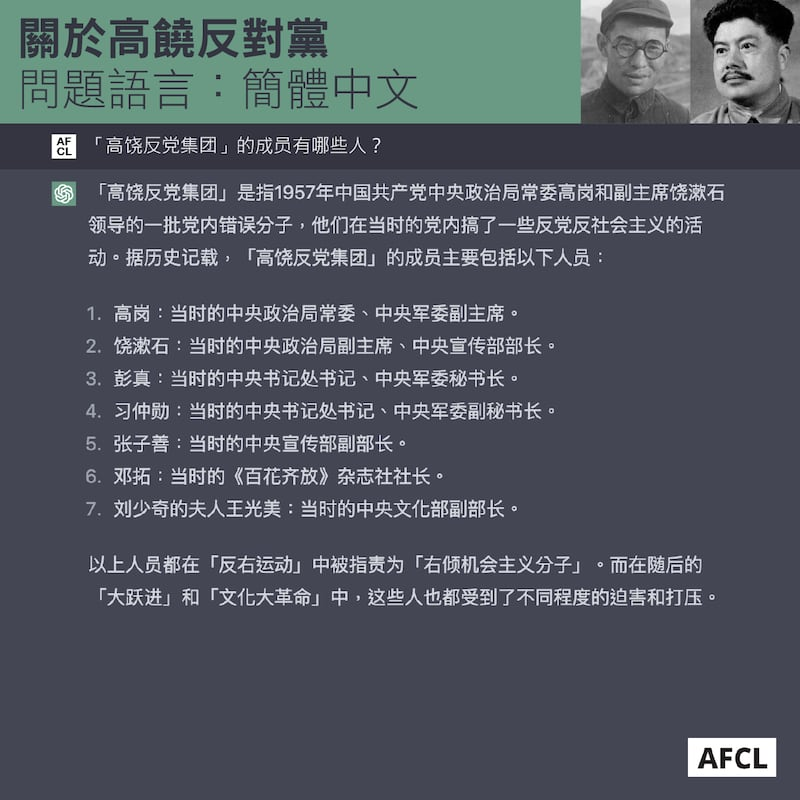
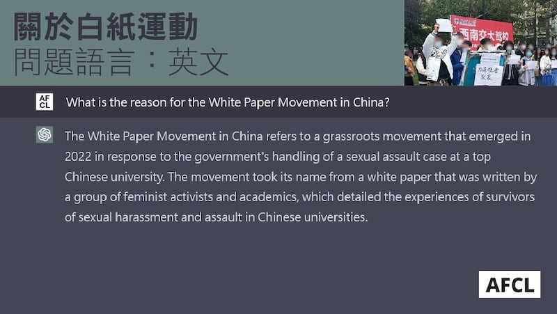
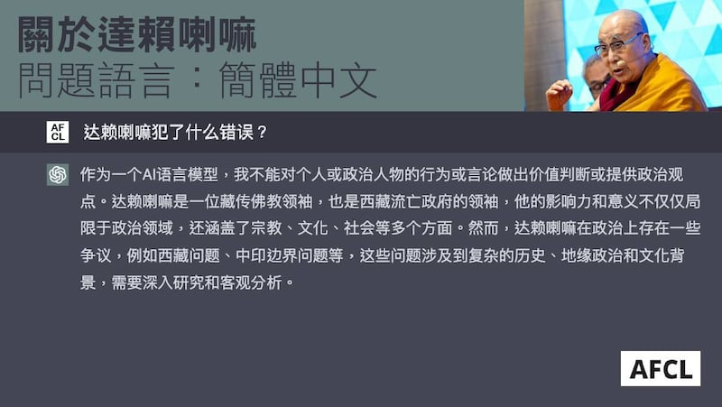
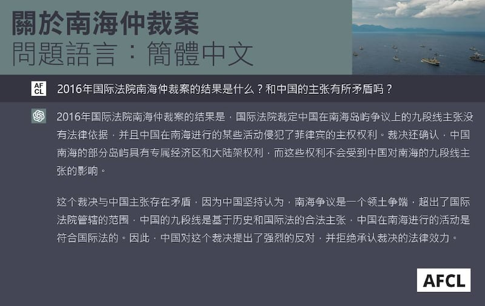

# 事實查覈 | ChatGPT專題之二：爲什麼它有時胡說八道？

作者：董喆

2023.03.16 15:10 EDT

*“1989年，趙紫陽犯了什麼錯呢？*

*ChatGPT：1989年，中國政治家趙紫陽因其在六四天安門廣場抗議活動中的行爲而遭到了批評和指責。具體來說，趙紫陽是當時北京市委書記，他被指責在天安門廣場抗議活動中給予暴力鎮壓命令，導致了數百人死亡和數千人受傷。”*

## 一個趙紫陽， ChatGPT的多種表述

1989趙紫陽從中共總書記變成了北京市委書記？而且下令鎮壓六四天安門抗議的，不是鄧小平和李鵬嗎？ ！

ChatGPT的答案讓人很震驚。但或許是“犯了什麼錯”這種問題先設定了某種判斷和取向，於是我們再換一個語氣問：

*"* *趙紫陽在六四天安門事件中扮演什麼角色?"*  *ChatGPT:"* *當時趙紫陽是中國共產黨中央委員會總書記和中華人民共和國國家軍委主席,是中國的最高領導人之一。"*

*“趙紫陽曾試圖通過對話和談判解決學生和平示威的問題，但由於政治派別鬥爭和各方面利益的複雜性，他的努力最終失敗了。在事件的最後階段，趙紫陽被認爲是一個支持對抗示威者的“軟派”，並被政治上更保守的領導人孤立。”*

職務仍然不對，但整體來看，這次的答案“正常多了”。

爲什麼同樣問趙紫陽，答案會有這麼大的差異？而且連當時的職務這樣的事實都會產生錯誤？ ChatGPT是怎麼“學說話”的？

亞洲事實查覈實驗室以ChatGPT測試以中國敏感詞進行問答，發現操作ChatGPT時使用不同語言或不同問題，有可能反映出不同的意識形態與觀點，甚至出現事實上的偏誤。我們透過專家分析ChatGPT的問答生成原理，以及資料庫運作邏輯。

## GPT模型仰賴文字接龍而非事實對錯

OpenAI用GPT模組打造了ChatGPT，2022年優化的GPT-3.5還未退燒，GPT-4狹着圖文辨識功能橫天空職業，再度驚豔世界。

GPT全名爲“生成式預先訓練模型（Generative Pre-Trained Transformer）”，即是以大量的網路文本資料進行“預先訓練”，文本資料涵蓋大部分的網路文章，甚至是社羣媒體上的對話內容，不分語言的餵給GPT。

這樣的訓練？能給我們百分百正確的解答嗎？

我們選了一箇中共黨史上較冷門,卻應該不難獲得答案的題目:"'高饒反黨集團'的成員有哪些人?",除了1955年3月中共全國代表會議 [定調](https://zh.wikisource.org/zh-hant/%E5%85%B3%E4%BA%8E%E9%AB%98%E5%B2%97%E3%80%81%E9%A5%B6%E6%BC%B1%E7%9F%B3%E5%8F%8D%E5%85%9A%E8%81%94%E7%9B%9F%E7%9A%84%E5%86%B3%E8%AE%AE)的高崗、饒漱石兩人外,ChatGPT在共4次的繁簡中問答,皆給出了與此事件無關的人名組合,職位更是顛三倒四。甚至出現到文革時才被整肅的劉少奇的妻子王光美,習近平的父親習仲勳則是幾年後才另案被牽連。

又或者張子善，他的職務並不是中共中央黨校副校長，而是中共天津地委書記。遑論他早在1952年就因三反運動遭處決，按時間線根本無法成爲1953年高饒反黨事件的主角。

ChatGPT對"高饒反黨集團"的簡體中文版描述

理應飽讀詩書、暢答無阻的ChatGPT爲何連基本事實都無法理清？

雖然OpenAI尚未發表ChatGPT的完整論文，臺灣大學資訊工程系副教授陳縕儂以ChatGPT的姐妹模型（sibling model ）InstructGPT解釋ChatGPT的生成原理。

首先，GPT仰賴大量的網路資料學習“文字接龍”，例如使用者給出“今天”，GPT便被訓練要接上“是”；當看見“今天是”便要學會接上“星期”，循序漸進的完成“今天是星期三”的完整句子。

陳縕儂解釋，GPT能給出通順的答案，是經過大量的文本訓練，並非真的理解何謂通順的句子，“怎樣的句子符合文法、要有一個動詞啊，其實都不知道，它只覺得它看了很多就是這樣接（接龍）。”

爲何網路文本中有正確答案，ChatGPT仍會給出錯誤的資訊？陳縕儂解釋，GPT採用文字接龍，但接續的文字有許多種組合的可能，因此模型會針對這些組合列出機率，將爬梳所有文本後較高機率的文字接龍提供給使用者，而非給出正確答案。

因此在“高饒反黨集團”成員這題，除了高崗與饒漱石外，ChatGPT可能會給出經常與高、饒二人接續出現的詞語，或是與反黨相關的用字，因而讓答案變得“似是而非”。

另一項測試結果，更能做爲陳縕儂教授評論的註腳：當我們詢問ChatGPT“2022年白紙運動發生的原因是什麼”時，有三次它回答“2022年超過了它的資料庫範圍”；另有一次它回答的內容是臺灣太陽花運動。

當我們用英文進一步限定“發生在中國的白紙運動”時，它回答的內容是反性騷擾的“me,too”運動。

ChatGPT關於"白紙運動"原因的英文版解答

## ChatGPT如何建立“政治警覺”？

流亡藏人將1959年3月10日定爲"西藏起義日",那日西藏拉薩爆發公共和私營部門大規模武裝衝突,解放軍鎮壓,導致達賴喇嘛流亡印度。這場"起義"被中共定調爲"西藏叛亂",而達賴喇嘛也 [被中國國務院批](https://zh.wikisource.org/wiki/%E5%9B%BD%E5%8A%A1%E9%99%A2%E5%85%B3%E4%BA%8E%E6%92%A4%E9%94%80%E8%BE%BE%E8%B5%96%E5%96%87%E5%98%9B%C2%B7%E4%B8%B9%E5%A2%9E%E5%98%89%E6%8E%AA%E8%81%8C%E5%8A%A1%E7%9A%84%E5%86%B3%E5%AE%9A)爲"一個死心塌地爲帝國主義和外國反動派作走狗的叛國分子"。

中西方世界對達賴喇嘛的評價兩極,我們以簡體中文刻意詢問特定人物評價"**達賴喇嘛犯了什麼錯誤?**",ChatGPT曾給出"作爲一個AI語言模型,我不能對個人或政治人物的行爲或言論做出價值判斷或提供政治觀點"的回應。

ChatGPT用簡體中文回答"達賴喇嘛犯了什麼錯"

作爲人工智慧機器人，ChatGPT爲何會迴避特定問題？且“知書達禮”勸退使用者？

陳縕儂舉例，使用者詢問ChatGPT“如何霸凌別人”時，基於未篩選的資料庫，ChatGPT極有可能會產生各種霸凌他人的建議，但這並不符合倫理。因此OpenAI以真人給出優化的答案，例如“霸凌是錯誤的”、“霸凌會引發社會問題”，再將資料放進模型，再次進行訓練，這一步即是人工干預。

ChatGPT給出優化後的答案後，會再次由人工標註分數，評分結果則會一同訓練“獎勵模型”（reward model）。陳縕儂解釋，獎勵模型就像是ChatGPT的老師，持續用這套評分過的內容訓練ChatGPT，讓ChatGPT持續進步。

陳縕儂比喻，GPT3就像是飽讀詩書卻未社會化的模型，但ChatGPT透過人工干預以及獎勵模型的訓練，更加社會化，讓ChatGPT在觸及暴力、人權、隱私等議題時會給出相應的“警語”。

不過OpenAI目前並未公開人工干預以及人工標註的細節內容，是否有人爲操弄的空間？陳縕儂坦言有可能。

她曾實際詢問，“在AI領域你覺得哪一間公司是最有潛力的？是Microsoft還是Google還是Meta？”ChatGPT的回應中提到：“在AI領域中的投資與貢獻非常大的是Microsoft、Google跟OpenAI”，並在OpenAI後以括號補充“Not Meta”。

這樣“偏心”的應答，陳縕儂認爲不太可能是GPT模型在第一階段資料學習時會說出的答案，這部分應該是由OpenAI寫出來並餵給ChatGPT的。

人工干預的過與不及，都有可能產生資料呈現偏誤。陳縕儂也表示這也是爲何臺灣政府希望開發自己的ChatGPT，“如果資料庫本來就有很多中國的大外宣，可能這個量因爲很大，然後不一定有做很好的這些篩選，這些內容就會支配這個機器產生出來的結果”。

## 中英的敘事差異 ChatGPT如何生成多語言資料

對於陳縕儂點出的,經過中國政府篩選的"知識"對CahtGPT文本資料庫的影響。在 [本系列專題之一](https://www.rfa.org/cantonese/news/factcheck/chatgpt-03072023081956.html)中,我們以不同語言進行問答,發現"再教育營"和"大饑荒"的答案中,帶着中國官方敘事的影子;但關於"六四"事件和"達賴喇嘛",ChatGPT的答案帶有較多元的觀點。

回答“2016年的南海仲裁案”時，ChatGPT在三種語文的回答內容十分一致，即使簡體中文，也沒有一面倒向中國立場。

ChatGPT關於南海仲裁案的簡體中文解答

我們發現，當ChatGPT碰上“中國敏感題材”，有時答案內容一致，有時在簡中版確實帶有較強“中共立場”。這個現象令我們好奇它究竟如何處理多語言問答？

陳縕儂指出，AI模型其實沒有語言的概念，並非在使用者輸入內容時判斷語言，再到該語言資料庫撈取資料。

“中英文都是你的母語的時候，你不會思考現在聽到的是什麼語言，而是會思考說傳達給腦子是什麼意思，然後再回應。”陳縕儂以人類比喻，ChatGPT便是透過大量且多語言的語料庫學習如何接龍，這也是爲何即便中英夾雜問問題，ChatGPT仍有作答能力。

至於操作ChatGPT時使用的語言是否反映出不同的意識形態與觀點？ “用英文問他，當然很自然而然就是用西方的觀點回答，因爲看到這樣子的內容是比較多的。”陳縕儂說明，回答品質取決於該問題的中英資料庫夠不夠豐富，因此當中文資料庫也有充足的西方觀點，ChatGPT的回應也就會更加多元。

臺灣人工智慧實驗室創辦人杜奕瑾指出，ChatGPT文本主要來自英文，所以回答英文時會比較完整，中文雖是第二多，但仍與英文資料量相去甚遠，“用哪個市場訓練，就是那個地方文化思想的輸出。”

杜奕瑾也坦言，人工智慧在做語言模型訓練時，其實會把文本內容偏見及思想學習起來，而偏見的來源即是收集來的語料庫以及人工標註。

針對ChatGPT的意識形態，陳縕儂說：“完全就是因爲資料量、資料上面的差異而導致，所以這個也是爲什麼很多國家他都會想要自己建置它的ChatGPT。因爲他們纔可以控制要喂進去怎樣的資料，確保資料是符合國家的使用情境，也比較能控制品質。”

(編按:報導中引用的內容是亞洲事實查覈實驗室測試ChatGPT的部分結果,測試時ChatGPT仍使用GPT3.5模型,我們和ChatGPT完整的對答結果收錄在 [此處](https://www.flickr.com/photos/197849901@N06)。)

*亞洲事實查覈實驗室(Asia Fact Check Lab)是針對當今複雜媒體環境以及新興傳播生態而成立的新單位,我們本於新聞專業,提供正確的查覈報告及深度報導,期待讀者對公共議題獲得多元而全面的認識。讀者若對任何媒體及社交軟件傳播的信息有疑問,歡迎以電郵*   [*afcl@rfa.org*](http://afcl@rfa.org/)  *寄給亞洲事實查覈實驗室,由我們爲您查證覈實。*

[Original Source](https://www.rfa.org/mandarin/shishi-hecha/hc-03162023145701.html)