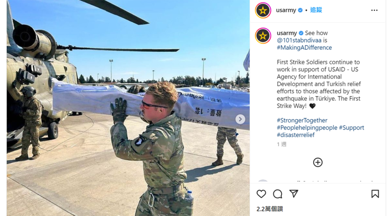
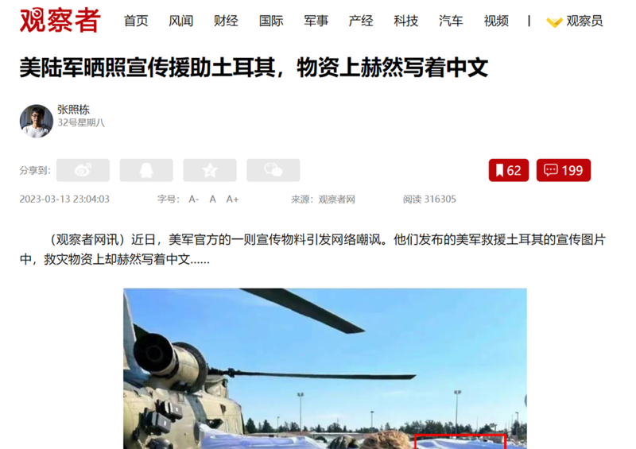
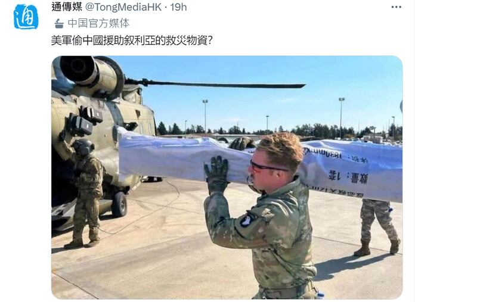
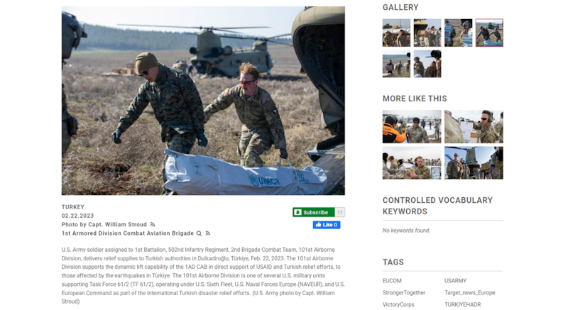
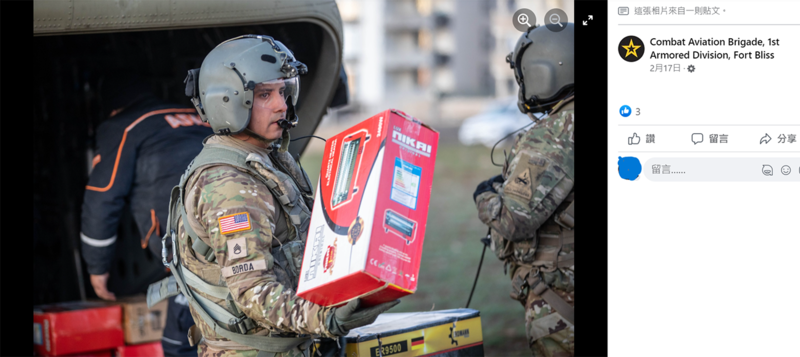
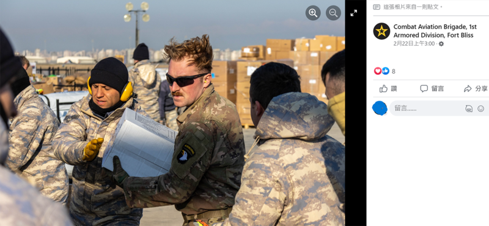

# 事實查覈 | 照片裏的美軍正在“偷竊”中國援助的救災物資嗎？

作者：莊敬

2023.03.18 09:58 EDT

## 標籤：錯誤

## 一分鐘完讀：

近日，一些中國官方媒體的社交媒體賬號以及新浪、網易等中國門戶網站有影響力的自媒體賬號、熱轉一張圖片，並將其稱爲是“美軍偷中國援助敘利亞的救災物資”的證據。

經查證，該照片來源於美國陸軍官方社交媒體賬號，爲美國士兵在土耳其支持美國國際開發署的工作場面。美國國防部、美國國際開發署回應亞洲事實查覈實驗室表示：所謂“美軍偷物資”的說法是絕對錯誤的，該名士兵當時是在土耳其官方的統籌下裝載一批來自多個國家救災帳篷，因此帳篷包裝上會有各種語言的標識。

## 完整分析：

最近網路上流傳“美軍偷中國援助敘利亞的救災物資”，主要依據是這張照片：

美國陸軍官方Instagram帳號3月7日發佈照片，一名士兵扛着印有“應急救災”、“數量：1套”等簡體中文字的白色袋子。

美國陸軍官方Instagram帳號3月7日 [發佈這張照片](https://www.instagram.com/p/CpdyEjcNeIJ/?igshid=YmMyMTA2M2Y%3D),一名美國陸軍士兵扛著白色袋子,袋上印有"應急救災"、"數量:1套"等簡體中文字。配文寫道:看看第101空降師是如何發揮作用的,士兵們持續工作,以支持美國國際開發署(USAID)對土耳其地震災民的救援工作。

這篇IG文底下有不少人以中文留言嘲諷，像是“震驚，美軍通中證據找到”、“偷中國的救災物資？”、“搞笑，扛著中國的物資來宣揚他的人道主義”等。

另有網民將照片轉發至推特,直接指控美國竊取了中國提供給敘利亞的援助物資,然後以人道救援爲藉口將其運往土耳其。還有 [網民在自媒體平臺"網易號"發文](https://m.163.com/dy/article/HVNEE0I30553FHX5.html),稱"習慣偷盜敘利亞石油和糧食的美軍,即便在百年一遇天災的背景下,也未停止自己的罪惡行徑,公然掠奪中國援敘物資,並將其轉頭送給土耳其,自己則收穫美名。"

觀察者網發文稱美軍原駐土耳其的物資寫着中文

甚至隸屬於中國國務院僑務辦公室的通傳媒也在推特發文質疑，“美軍偷中國援助敘利亞的救災物資？”

通傳媒在推特發文，質問美軍是否有偷中國援助敘利亞的救災物資

針對“偷中國物資”的指控，美國國防部發言人賈恩（Garron J. Garn）回覆亞洲事實查覈實驗室表示，這種說法是絕對錯誤的。賈恩表示，照片中是美國陸軍第101空降師、第2旅級戰鬥隊的一名士兵在土耳其支持人道主義援助的場面。經與該名士兵覈實，當時他正從一批印着各種語言標識的帳篷中搬出其中一件。那批帳篷是土耳其接受的來自各國的救災物資，在因吉爾利克空軍基地由土耳其官方管理，分發到亟需救助的地方。照片中拍到的該名美國士兵當時正在土耳其官方的指引下，裝載救援物資。

賈恩說，美國軍方人員參與了美國政府、聯合國難民署和其他國家共同的人道救災行動，而所有的行動都與土耳其官方密切協作。

經查證,美國"國防影片與影像發佈系統"(DVIDS)其它照片、 [影片也可見到同位士兵](https://www.dvidshub.net/unit/1ADCAB)。其中一張照片,他與另名士兵搬運貌似裝有帳篷的白色袋子,上面寫著UNHCR(聯合國難民署),配文介紹了士兵所屬的美國軍事單位,其工作支持土耳其地震國際救援行動。

照片中的美軍與另名士兵搬運寫著UNHCR的白色袋子，支持土耳其地震國際救援行動。

亞洲事實查覈實驗室再根據美國軍媒 ["星條旗報"(Stars and Stripes)的報導](https://www.stripes.com/branches/air_force/2023-02-23/turkey-earthquake-incirlik%C2%A0-9227594.html),以及 [美國陸軍的新聞稿](https://www.army.mil/article/264020/us_army_helicopters_support_usaid_in_turkiye):在2月6日土耳其、敘利亞強震後,土耳其南部的因吉利克空軍基地(Incirlik Air Base)成爲全球向土耳其援助物資的樞紐,這些物資包括來自德州的醫療設備、來自中國的毯子、來自哈薩克的睡袋等。美軍直升機協助將援助物資從因吉利克空軍基地運送至受影響的埃爾比斯坦(Elbistan)、帕扎西克(Pazarcik)等地。

美軍協助搬運從國際湧入土耳其的援助物資，許多物品外包裝出現不同國家的語言、國旗

經比對相關照片、影片與新聞報導，已可知包括該名士兵在內的多位美軍執行的任務，是協同土耳其內政部災害與應變管理署（AFAD）等合作單位，搬運從國際湧入土耳其的援助物資，許多物品的外包裝都出現了不同國家的語言、國旗。

美軍協助搬運從國際湧入土耳其的救援物資

美軍IG發文中提及的美國國際開發署（USAID）發言人也向亞洲事實查覈實驗室提供背景說明表示，沒有理由相信“美軍偷物資”這種明顯錯誤的說法（ we have no reason to believe that these claims are anything but patently false）。

## 結論：

在社交媒體和中國媒體上流傳的“美軍偷中國援助敘利亞的救災物資”一說並無根據，爲錯誤訊息。

*亞洲事實查覈實驗室(Asia Fact Check Lab)是針對當今複雜媒體環境以及新興傳播生態而成立的新單位,我們本於新聞專業,提供正確的查覈報告及深度報導,期待讀者對公共議題獲得多元而全面的認識。讀者若對任何媒體及社交軟件傳播的信息有疑問,歡迎以電郵*   [*afcl@rfa.org*](http://afcl@rfa.org/)  *寄給亞洲事實查覈實驗室,由我們爲您查證覈實。*

[Original Source](https://www.rfa.org/mandarin/shishi-hecha/hc-03182023094036.html)